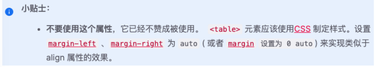

# HTML及元素

## 1. 前后端


## 2. 网页(web page)

- 网站由多个网页组成

### 2.1 网页的显示过程

#### 用户角度

1. 用户在浏览器输入一个网站(DNS服务器解析- >IP地址)

2. 浏览器找到对应的**服务器地址**,请求静态资源(可以存放在世界上任何一个地方)

3. 服务器**返回静态资源**给浏览器

4. 浏览器**对静态资源进行解析和展示**

   [(超详细）从输入url到页面展示发生了什么？ - 掘金 (juejin.cn)](https://juejin.cn/post/6869279683230629896)

#### 前端工程师

1. 开发项目(HTML/CSS/JavaScript/Vue/React)
2. **打包,部署项目**到服务器里面


### 2.2 网页的组成部分

- HTML:网页的结构
- CSS:网页的样式(美化)
- JavaScript:网页的交互(灵魂)

### 2.3 浏览器以及内核

浏览器最核心的部分：**渲染引擎**，也称为**浏览器内核**

- 作用:负责解析网页语法，并渲染（显示）网页


## 3. HTML超文本标记语言

- 由无数个标记（标签，tag）组成
- 是对某些内容进行特殊的标记，以供其他解释器识别处理
- 由标签和内容组成的部分称为**元素**
  - `<div> 这就是一个元素</div>`


## 4. HTML文档的结构

- `<!DOCTYPE html>`**文档声明**
- `<html>`根元素 `lang="zh-CN"`
- `<head>`元数据(配置信息)
  * `meta` -> `charset` -> `utf-8` 字符编码 
  * `title` -> 标题
  * `style`->内部样式表
- `<body>`

**常见的元素**

### `<HTML>`根元素

### `<h1>`元素

h元素 标题 1~6 自带css属性 独占一行

> h元素通常和**SEO优化**有关系

### `<p>`元素 

 paragraph 段落,块元素

> p元素多个段落之间会有一定的间距(**自带CSS样式**)
>
> p元素是个块元素，但是p元素里最好不要放其他块元素如div元素

### ``元素

- ``是一个**可替换元素**

   

  

- 本地图片的路径

  - 绝对路径:**根盘符**开始查找

  - **相对路径**:
    - `.`代表当前文件夹(一般省略)
    - `..`代表上级文件夹

### `<a>`元素 也称锚元素

- 定义**超链接**:打开新的`url`

- `href`

  - 指定要打开的`URL`地址
  - 也可以是本地地址

- `target`该属性**指定在何处显示链接的资源***

  - `_self`默认值,在**当前窗口**打开url
  - `_blank`**新窗口**打开

- **锚点链接**:实现**跳转**到网页中的具体位置

  步骤:

  - 在要跳到的元素上定义一个`id`属性
  - 定义`<a>`元素,并且`<a>`元素的`href`指向对应`id`

- **图片链接**

  - `img`元素和`a`元素**嵌套**使用,可以实现图片链接

  - 实现思路

    - `a`元素中不存放文字而是存放一个`img`元素
    - 也就是`img`元素是`a`元素的**内容**

- `<a>`不一定只用来做跳转链接,还可以用来跳转**下载链接**以及打开发邮箱的app`mailto:xxxxxx@qq.com`

### `iframe`元素

> 网页里的网页

- 利用`iframe`元素可以实现:在一个HTML文档中嵌入其他HTML文档

```html
<iframe src="https://www.example.com" width="600" height="400" frameborder="0">
</iframe>

```

- `frameborder`属性

  - 用于规定是否显示边框
    -   1:显示
    -   0:不显示

- `a`元素`target`的其他值:
  `_parent`:在父窗口中打开URL (`iframe`)
  `_top`:在顶层窗口中打开URL(`iframe`)

  

### `div`元素和`span`元素

- 在HTML中有两个特殊的元素div元素、span元素:

  - **div**元素:division,分开、分配的意思;
  - **span**元素:跨域、涵盖的意思;
- 这两个元素有什么作用呢?**无所用、无所不用**。
- 产生的历史:
  - 网页的发展早期是没有css,这个时候我们必须通过**语义化元素**来告知浏览器一段文字如何显示;
  - 后来出现了css,**结构和样式需要分离**,这个时候html只需要负责结构即可;
  - 比如`<h1>`元素**可以是一段普通的文本+CSS修饰样式**;
  - 这个时候就出现了`div`、`span`来编写HTML结构**所有的结构**,样式都交给css来处理;(从一种极端走向另一种极端)
  - 所以,理论上来说:
  	- 我们的页面可以没有div、span;
    - 我们的页面也可以全部**都是**div、span;

### `div`元素和`span`元素的区别

> `div`元素和`span`元素都是“纯粹的” **容器**,也可以把他们理解成“**盒子**”,它们都是用来包裹内容的;

- `div`元素:**块元素**(**矩形块**),独占一行,多个`div`元素包裹的内容会在不同的行显示;
  
  - 一般作为其他元素的**父容器**,把其他元素包住,代表一个整体
  - 用于把网页**分割**为**多个独立的块***
  
- `span`元素:**行元素**,多个`span`元素包裹的内容会在同一行显示;
  
  - 默认情况下,跟普通文本几乎没差别
  - 用来对**文本**或其他**行内元素**进行**样式化、标记或包裹**
  
- `div`元素和`span`元素的主要区别是它们的`display`属性的值不同。`div`元素的`display`属性默认为`block`，表示它是一个块级元素。`span`元素的`display`属性默认为`inline`，表示它是一个行内元素。这个属性决定了它们的布局方式和样式设置的能力。

- 即使设置了一个**块元素**的宽度`width`,它也依旧**独占整行**(`width`设置的是`content`的宽)

  

  |    特征    | 块元素                                                   | 行元素                                                       |
  | :--------: | -------------------------------------------------------- | ------------------------------------------------------------ |
  |  显示方式  | 独占整行，从新行开始，宽度默认是**父元素**的100%         | 仅占据内容的宽度，不会起新行                                 |
  | 宽度和高度 | **可以设置宽度和高度**                                   | **宽度和高度由内容决定，不能设置宽度和高度**                 |
  |  元素排列  | 与其他块级元素**垂直排列**                               | 与相邻元素在同一行水平排列                                   |
  |  默认样式  | 默认情况下，块级元素独占一行，例如`<div>`、`<p>`、`<h1>` | 默认情况下，行内元素只占据内容的宽度，例如`<span>`、`<a>`、`<strong>` |
  |  允许包含  | 可以包含块级元素和行内元素                               | **只能包含行内元素**                                         |


## 不常用元素

- `strong元素`:内容加粗、强调;
  - 通常加粗会使用css样式来完成;**(font-weight:700;)**
  
  - 开发中很偶尔会使用一下;
  
- `i`元素:内容倾斜;
    - 通常斜体会使用css样式来完成;`(font-style:italic)`
    - 开发中偶尔会用它来做**字体图标**(因为看起来像是icon的缩写);
- `code`元素:用于显示代码
    - 偶尔会使用用来显示等宽字体;
- `br`元素:换行元素
    - 开发中已经不使用;

更多元素详解,查看MDN文档:https://developer.mozilla.org/zh-CN/docs/Web/HTML/Element

## 写HTML时的注意事项

- **块级元素**、`inline-block`元素
  - 一般情况下,可以包含其他**任何元素**(比如块元素、行元素、`inline-block`元素)
  - **特殊**情况:**`<p>`元素不能包含其他块级元素**(如`<p>`元素里不能放`<div>`元素,会出现bug)*
- **行元素**(比如`<a>`、`<span>`、`<strong>`等)
  - 只能包含行元素
  - 不能放块元素
- HTML里会把所有的**空格**或者**换行**都**渲染为一个空格**

## HTML的全局属性

常见的**全局属性**如下:id,class,style,title

1. `id`：定义**唯一标识符**(ID),该标识符在**整个文档中必须是唯一的**.其目的是在链接(使用片段标识符),脚本或样式(使用 CSS)时标识元素

2. `class`：一个以**空格分隔**的元素的**类名**(classes )列表,它允许 CSS 和 Javascript 通过**类选择器或者DOM方法**来选择和访问特定的元素

3. `style`：给元素添加**行内样式(内嵌样式)**

4. `title`：包含表示与其所属元素相关信息的文本。 这些信息通常可以作为**提示**呈现给用户,但不是必须的（鼠标悬停时显示的信息)

## 列表

###    列表的实现方式

- 事实上现在很多的列表功能采用了不同的方案来实现:

  - 方案一: **使用div元素来实现**(比如汽车之家, 知乎上的很多列表)

  - 方案二: 使用**列表元素**, 使用**元素语义化**的方式实现;（列表元素有默认的样式）
- 列表：
  - 有序列表:ol、li
  - 无序列表:ul、li
  - 定义列表:dl、dt、dd

- `ul>li*5`

### 有序列表 – ol – li


### 无序列表 – ul - li


###  定义列表 – dl – dt - dd

- `dl`(definition list)
	- 定义列表,**直接子元素只能是dt、dd**
- `dt`(definition term)
	- 列表中每一项的项目名
- `dd`(definition description)
	- 列表中每一项的具体描述,是对 dt 的描述、解释、补充
	- 一个dt后面一般紧跟着1个或者多个dd


## 表格

### 表格常见的元素

- `table` 表格
- `tr(table row)` 表格中的**行**
- `td(table data)` 行中的**单元格**



- `border-collapse` CSS 属性是用来决定表格的边框是分开的还是合并的。

- `table { border-collapse: collapse; }`

- 合并单元格的边框

### 其他元素

- `thead` 表格的表头
- `tbody` 表格的主体
- `tfoot` 表格的页脚
- `caption` 表格的标题
- `th`  表格的表头单元格

### 单元格合并

单元格合并分成两种情况:
- 跨列合并: 使用`colspan`
  - 在最左边的单元格写上`colspan`属性, 并且省略掉合并的`td`;
- 跨行合并: 使用`rowspan`
  - 在最上面的单元格协商`rowspan`属性, 并且省略掉后面`tr`中的`td`;


## 补充知识

### 1. 字符实体

字符实体以**分号**结尾

- `&nbsp;`空格
- `&lt;`表示`<`
- `&gt;`表示`>`


- 常见的字符集

  

### 2. URL地址*

俗称**网络地址**,它是互联网上用于**定位和访问资源**的标准方式。URL的标准格式是：

```
<协议>://<域名或IP地址>[:<端口号>]/<文件路径><文件名>[?<查询参数>][#<锚点(片段ID)>]
```

其中，方括号[]内的部分是可选的，其他部分是必须的。下面是对各个部分的解释：

- `<协议>` 表示访问资源所使用的**网络协议**，如HTTP、HTTPS、FTP等。
- `<域名或IP地址>` 表示资源所在的服务器的名称或地址，如www.bing.com或172.217.160.78。
- `<端口号> `表示**服务器上提供资源的服务的端口**，如80或443。如果使用的是协议的默认端口，如**HTTP的80**或**HTTPS的443**，则可以省略。
- `<路径>` 表示资源**在服务器上**的位置，如/index.html或/images/logo.png。
- `<查询参数>` 表示向服务器**传递**的**额外信息**，如key1=value1&key2=value2。查询参数可以用于改变资源的内容或格式，或者进行搜索、过滤等操作。
- `<锚点>` 表示资源内的一个特定位置，如#section1或#top。锚点可以用于跳转到资源的某个部分，或者显示资源的目录、索引等。


- 和URI的区别:

  - URI = Uniform Resource **Identifier** 统一资源**标志符**,用于标识 Web 技术使用的逻辑或物理资源。

  - URL = Uniform Resource **Locator** 统一资源**定位符**,俗称**网络地址**,相当于网络中的**门牌号**;
- URI在某一个规则下能把一个资源独一无二的识别出来。
  - URL作为一个网络Web资源的地址,可以唯一将一个资源识别出来,所以URL是一个URI;
  - 所以**URL是URI的一个子集**;
  - 但是URI并不一定是URL

[什么是URL? - MDN](https://developer.mozilla.org/zh-CN/docs/Learn/Common_questions/Web_mechanics/What_is_a_URL)


### 3. 元素语义化

- 有利于SEO优化


### 4. SEO优化

SEO就是**搜索引擎优化**(Search Engine Optimization)，SEO通过了解搜索引擎的运行规则来调整网站，以提高网站的曝光度,以及网站的排名。


Google 搜索引擎的工作流程主要分为三个阶段：

**抓取**：Google 会使用名为“抓取工具”的自动程序搜索网络，以查找新网页或更新后的网页。Google 会将这些网页的地址（即网址）存储在一个大型列表中，以便日后查看。我们会通过许多不同的方法查找网页，但主要方法是跟踪我们已知的网页中的链接。

**编入索引**：Google 会访问它通过抓取得知的网页，并会尝试分析每个网页的主题。Google 会分析网页中的内容、图片和视频文件，尝试了解网页的主题。这些信息存储在 Google 索引中，而 Google 索引是一个存储在海量计算机中的巨大数据库。

**呈现搜索结果**：当用户在 Google 上进行搜索时，Google 会尝试确定最优质的搜索结果。“最佳”结果取决于许多因素，包括用户的位置、语言、设备（桌面设备或手机）以及先前用过的搜索查询。例如，在用户搜索“自行车维修店”后，Google 向巴黎用户显示的答案与向香港用户显示的答案有所不同。支付费用不能提高网页在 Google 搜索结果中的排名，网页排名是完全依靠算法完成的。


### 5. 字符编码


