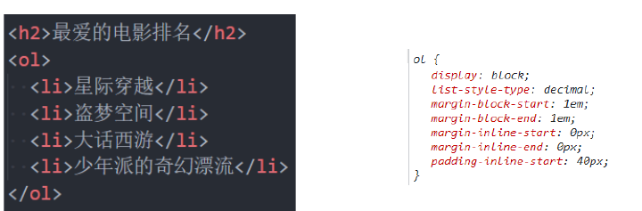
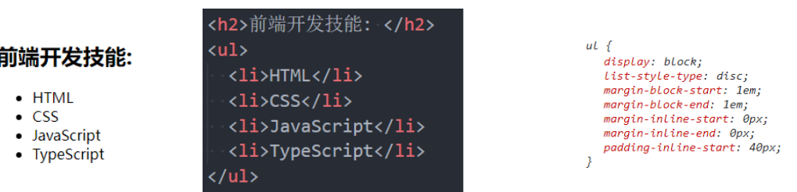
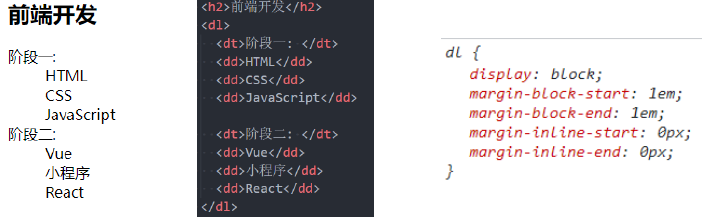
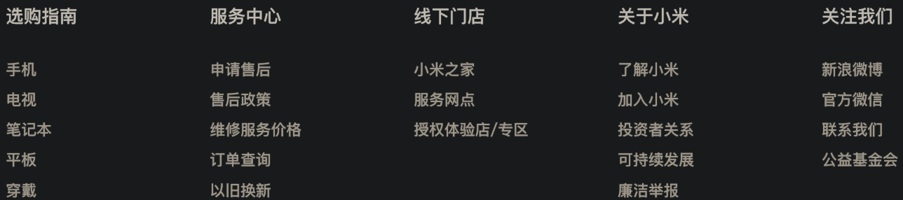
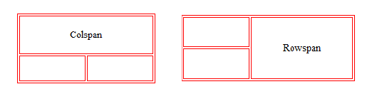
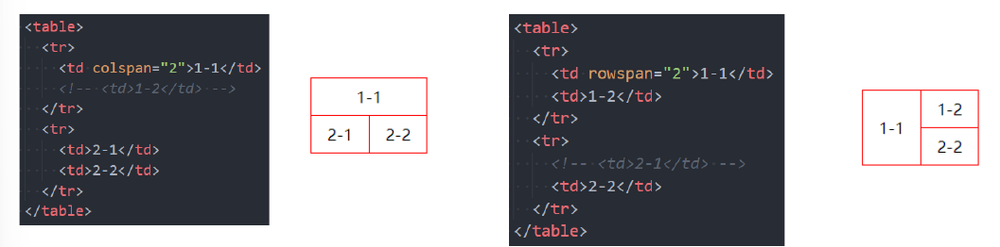

# HTML 及元素

## 一、前后端

- **前端开发** ：负责用户界面（UI）和用户体验（UX），实现用户直接交互的部分，包括页面布局、动态效果和数据展示。
- 技术栈 
  - **核心语言** ：HTML、CSS、JavaScript。
  - **框架与库** ：React、Vue.js、Angular 等。
  - **工具链** ：Webpack、Vite（打包工具）、Babel（转译工具）。
  - **其他工具** ：SASS/LESS（CSS预处理器）、TypeScript（JavaScript超集）。
  - **代码质量工具** ：ESLint、Prettier。
- **后端开发** ：负责服务器端逻辑、数据处理、业务逻辑实现以及与数据库的交互，确保前端请求的数据能够被正确处理和返回。

**前端工程师的职责** ：

1. 开发项目：使用 HTML、CSS、JavaScript、Vue、React 等技术进行开发。

2. 打包和部署项目：将项目打包并通过工具（如 Webpack、Vite）部署到服务器。


## 二、网页(Web page)

### 2.1 网页的显示过程

#### 用户角度 

1. DNS 解析 （递归查询）：
   - 查询顺序：本地 `hosts` 文件 → 本地 DNS 缓存 → ISP DNS 服务器 → 根域名服务器。
2. **TCP 三次握手** ：建立连接（SYN-SYN/ACK-ACK）。
3. 发送 HTTP 请求 ：
   - 请求方法：GET（获取资源）、POST（提交数据）、PUT（更新资源）、DELETE（删除资源）。
   - 常见状态码：200（成功）、304（未修改）、404（未找到）、500（服务器错误）。
4. **服务器响应** ：服务器处理请求并返回资源。
5. 浏览器渲染：
   - 解析 HTML 构建 DOM 树，解析 CSS 构建 CSSOM 树，合并生成 Render Tree。
   - 进行 Layout 和 Paint，最终呈现页面。

[从输入 url 到页面展示发生了什么？ - 掘金](https://juejin.cn/post/6869279683230629896)

### 2.2 网页的组成部分

- **HTML** ：网页的结构
- **CSS** ：网页的样式（美化）
- **JavaScript** ：网页的交互（灵魂）

### 2.3 浏览器以及内核

浏览器的核心部分是**渲染引擎** （也称浏览器内核），其主要作用包括： 

1. 解析 HTML 和 CSS。
2. 执行 JavaScript。
3. 构建 DOM 树和 CSSOM 树。
4. 渲染页面。
5. 处理用户事件（如点击、滚动等）。

## 三、HTML 超文本标记语言

HTML 是由多个**标记（tag）**组成的语言，用于定义网页内容和结构。HTML 文档由一个或多个**元素** 组成，元素由**标签** 和**内容** 构成。

- `<div> 这是一个元素</div>`


## 四、HTML 文档的结构

```html
<!DOCTYPE html> <!-- 文档声明 -->
<html lang="zh-CN"> <!-- 根元素 -->
<head> <!-- 元数据 -->
    <meta charset="utf-8"> <!-- 字符编码 -->
    <title>网页标题</title> <!-- 标题 -->
    <style> /* 内部样式表 */
        body {
            background-color: #f0f0f0;
        }
    </style>
</head>
<body> <!-- 网页主体内容 -->
    <h1>欢迎来到我的网站</h1>
</body>
</html>
```

## 五、常见的元素

### `<h1>` - `<h6>` 元素

h 元素 标题 1~6 自带 css 属性 独占一行

> 与 SEO 优化密切相关，搜索引擎会优先抓取 `<h1>` 标签内容。

### `<p>` 元素 

 paragraph 段落, 块元素

> - 段落之间有默认间距（CSS 样式）
>
> - p 元素是个块元素，但是 p 元素里最好不要嵌套其他块元素如 div 元素

### `` 元素

- **图像元素** ：行内可替换元素。
- 常见属性 :
  - `src`：指定图像路径。
  - `alt`：当图片加载失败时显示的替代文本。
- 图片路径：
  - **绝对路径** ：从根盘符开始查找。
  - **相对路径** ：使用 `.`（当前目录）和 `..`（上级目录）表示。

### `<a>` 元素 也称锚元素

- **超链接** ：用于跳转到其他页面或下载文件。

- `href`

  - 指定要打开的 `URL` 地址
  - 也可以是本地地址

- `target` 该属性 **指定在何处显示链接的资源**

  - `_self` 默认值, 在 **当前窗口** 打开 url
  - `_blank` **新窗口** 打开

- **锚点链接**: 通过 `id` 属性实现页面内的跳转
- 在要跳到的元素上定义一个 `id` 属性
  - 定义 `<a>` 元素, 并且 `<a>` 元素的 `href` 指向对应 `id`

- **图片链接**：将 `` 元素嵌套在 `<a>` 元素中，实现点击图片跳转。

- `<a>` 不一定只用来做跳转链接, 还可以用来跳转 **下载链接** 以及打开发邮箱的 app `mailto:xxxxxx@qq.com`

### `iframe` 元素

用于在网页中嵌入另一个网页。

- 利用 `iframe` 元素可以实现: 在一个 HTML 文档中嵌入其他 HTML 文档

```html
<iframe src="https://www.example.com" width="600" height="400" frameborder="0">
</iframe>
```

- `frameborder` ：控制边框的显示（0 为无边框，1 为显示边框）。

- `target` 的其他值:
  `_parent`: 在父窗口中打开 URL (`iframe`)
  `_top`: 在顶层窗口中打开 URL(`iframe`)

  

## 六、div 元素和 span 元素

### 区别

> `div` 元素和 `span` 元素都是“纯粹的” **容器**, 也可以把他们理解成“**盒子**”, 它们都是用来包裹内容的;

- `div` 元素: **块元素**(**矩形块**), 独占一行, 多个 `div` 元素包裹的内容会在不同的行显示;
  
  - 一般作为其他元素的 **父容器**, 把其他元素包住, 代表一个整体
  - 用于把网页 **分割** 为 **多个独立的块***
  
- `span` 元素: **行元素**, 多个 `span` 元素包裹的内容会在同一行显示;
  
  - 默认情况下, 跟普通文本几乎没差别
  - 用来对 **文本** 或其他 **行内元素** 进行 **样式化、标记或包裹**
  
- `div` 元素和 `span` 元素的主要区别是它们的 `display` 属性的值不同。`div` 元素的 `display` 属性默认为 `block`，表示它是一个块级元素。`span` 元素的 `display` 属性默认为 `inline`，表示它是一个行内元素。这个属性决定了它们的布局方式和样式设置的能力。

- 即使设置了一个 **块元素** 的宽度 `width`, 它也依旧 **独占整行**(`width` 设置的是 `content` 的宽)

  |    特征    | 块元素                                                   | 行元素                                                       |
  | :--------: | -------------------------------------------------------- | ------------------------------------------------------------ |
  |  显示方式  | 独占整行，从新行开始，宽度默认是 **父元素** 的 100%         | 仅占据内容的宽度，不会起新行                                 |
  | 宽度和高度 | **可以设置宽度和高度**                                   | **宽度和高度由内容决定，不能设置宽度和高度**                 |
  |  元素排列  | 与其他块级元素 **垂直排列**                               | 与相邻元素在同一行水平排列                                   |
  |  默认样式  | 默认情况下，块级元素独占一行，例如 `<div>`、`<p>`、`<h1>` | 默认情况下，行内元素只占据内容的宽度，例如 `<span>`、`<a>`、`<strong>` |
  |  允许包含  | 可以包含块级元素和行内元素                               | **只能包含行内元素**                                         |

## 七、写 HTML 时的注意事项

- **块级元素**、`inline-block` 元素
  - 一般情况下, 可以包含其他 **任何元素**(比如块元素、行元素、`inline-block` 元素)
  - **特殊情况: **`<p>` 元素不能包含其他块级元素**(如 `<p>` 元素里不能放 `<div>` 元素, 会出现 bug)
- **行元素**(比如 `<a>`、`<span>`、`<strong>` 等)
  - 只能包含行元素
  - 不能包含块元素
- 在 HTML 中，多个空格或换行符会被渲染为一个空格。

## 八、HTML 的全局属性

1. `id`：定义 **唯一标识符**(ID), 该标识符在 **整个文档中必须是唯一的**.其目的是在链接(使用片段标识符), 脚本或样式(使用 CSS)时标识元素

2. `class`：一个以 **空格分隔** 的元素的 **类名**(classes)列表, 它允许 CSS 和 Javascript 通过 **类选择器或者 DOM 方法** 来选择和访问特定的元素

3. `style`：内联样式，直接为元素添加 CSS 样式。

4. `title`：定义提示信息，通常在鼠标悬停时显示。

## 九、列表

### 列表的实现方式

- 方案一:  使用 `<div>` 元素实现，适用于布局需求灵活的场景。

- 方案二:  使用 **列表元素**, 使用 **元素语义化** 的方式实现;（列表元素有浏览器默认添加的 css 样式，开发中通常通过 **重置** 解决）

  ```css
  ol, li, dd {
    padding: 0;
    margin: 0;
    list-style: none;
  }
  ```

列表类型 

- **有序列表** ：`<ol>`、`<li>`
- **无序列表** ：`<ul>`、`<li>`
- **定义列表** ：`<dl>`、`<dt>`、`<dd>`

- `ul>li*5`

### 有序列表 – ol – li

`<ol>` 直接子元素只能是 `<li>`



### 无序列表 – ul - li



### 定义列表 – dl – dt - dd

- `dl`(definition list)
 	- 定义列表, **直接子元素只能是 dt、dd**
- `dt`(definition term)
 	- 列表中每一项的项目名
- `dd`(definition description)
 	- 列表中每一项的具体描述, 是对 dt 的描述、解释、补充
 	- 一个 dt 后面一般紧跟着 1 个或者多个 dd



定义列表的应用：



## 十、表格

### 表格常见的元素

- `<table>` **表格**

- `<tr>`(table row) 表格中的 **行**

- `<td>`(table data) 行中的 **单元格**

- `<thead>` 表格的 **表头**

  - `<th>`  表格的 **表头单元格**

- `<tbody>` 表格的 **主体**

- `<tfoot>` 表格的 **页脚**

- `<caption>` 表格的 **标题**

  - css 有很多属性，已经不再使用，`<table>` 元素应该使用 **CSS** 制定样式，设置 margin-left、margin-right 为 auto （或者 margin 设置为 0 auto）来实现类似于 align 的效果

    

### 设置边框

```css
table, th, td {
  border: 1px solid black;
}
```


- `border-collapse` CSS 属性是用来决定表格的边框是分开的还是合并的。


  - 请注意上面的表格有双边框。这是因为表格和 th、td 元素都有单独的边框

  - `table { border-collapse: collapse; }`

  - **合并单元格的边框**

- 表格内边距

  如需控制边框和表格内容之间的间距，请在 `<td>` 和 `<th>` 元素上使用 `padding` 属性

- 斑马纹表格效果，请使用 `nth-child()` 选择器，并为所有偶数（或奇数）表行添加 `background-color`


  - ```css
    tr: nth-child(even) {background-color: #f2f2f2;}
    ```


### 单元格合并

单元格合并分成两种情况:

- **跨列** 合并: 使用 `colspan`
  
  - 在最左边的单元格写上 `colspan` 属性, 并且省略掉合并的 `td`;
- **跨行** 合并: 使用 `rowspan`
  - 在最上面的单元格写上 `rowspan` 属性, 并且省略掉后面 `tr` 中的 `td`;
  
  > 1. 确定 ”谁“ 需要跨行或者跨列
  > 2. 确定是跨 ”行“ 还是跨 ”列“
  > 3. 跨几行还是几列





> 对表格的某些单元格的样式进行设置可以利用 **结构伪类**
>
> - table tr: nth-child(n) {	}
>
> - 
>
> - 1）thead 和 tfoot 在一张表中都只能有一个，而 tbody 可以有多个。
>
>   2）tfoot 必须出现在 tbody 前面，这样浏览器在接收主体数据之前，就能渲染表尾，有利于加快表格的显示速度。这一点对大型表格尤其重要。
>
>   3）thead、tbody 和 tfoot 里面都必须使用 tr 标签。 
>
## 常用的语义化标签

```html
<header> - 页头
<nav> - 导航
<main> - 主要内容
<article> - 文章
<section> - 区块
<aside> - 侧边栏
<footer> - 页脚
```

## 不常用元素

- `strong` 元素: 内容加粗、强调;
  - 通常加粗会使用 css 样式来完成; **(font-weight: 700;)**

  - 开发中很偶尔会使用一下;

- `i` 元素: 内容倾斜;
  - 通常斜体会使用 css 样式来完成; `(font-style:italic)`
  - 开发中偶尔会用它来做 **字体图标**(因为看起来像是 icon 的缩写);
- `code` 元素: 用于显示代码
  - 偶尔会使用用来显示等宽字体;
- `br` 元素: 换行元素

更多元素详解, 查看 MDN 文档: <https://developer.mozilla.org/zh-CN/docs/Web/HTML/Element>
