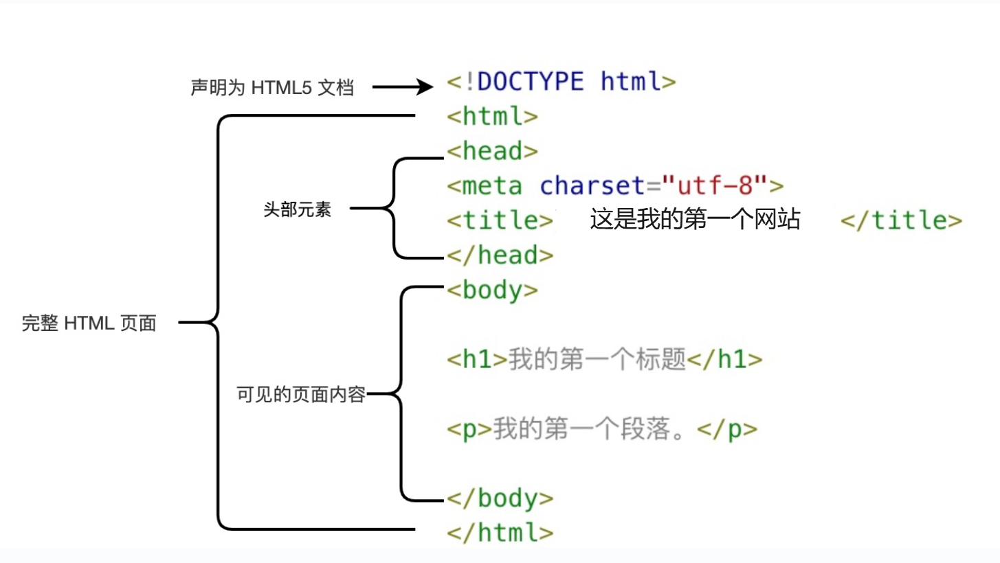
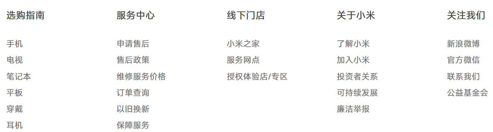
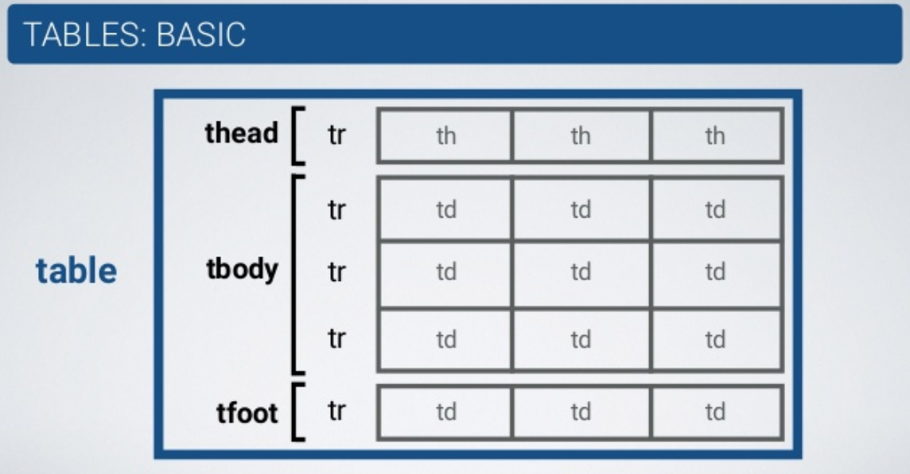
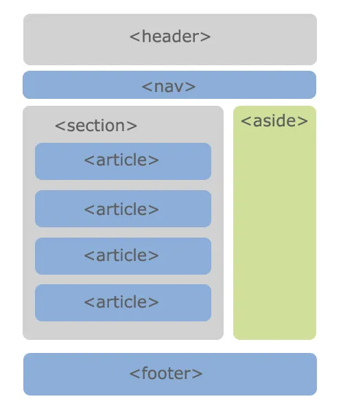

# HTML 及元素

## 前后端

**前端开发** ：负责用户界面（UI）和用户体验（UX），实现用户直接交互的部分，包括页面布局、动态效果和数据展示。

技术栈 ：

- **核心技术**：HTML（结构）、CSS（样式）、JavaScript（交互）。  
- **框架与库**：React、Vue.js、Angular。  
- **构建工具**：Webpack、Vite（打包）、Babel（转译）。  
- **增强工具**：SASS/LESS（CSS预处理器）、TypeScript（JavaScript超集）。  
- **代码规范**：ESLint（语法检查）、Prettier（格式化）。  

**后端开发** ：负责服务器端逻辑、业务处理、数据库交互，确保前端请求的数据被正确处理和返回。

**前端工程师的职责** ：

1. **项目开发**：基于HTML、CSS、JavaScript及框架（如Vue、React）进行开发。

2. **打包部署**：使用Webpack、Vite等工具打包项目并部署至服务器。


## 网页(Web page)

### 网页的显示过程

**用户角度** :

1. **DNS解析**：  
   查询顺序：浏览器缓存 → 系统（hosts文件） → 路由器缓存 → ISP DNS服务器 → 根域名服务器（若未命中缓存）。  
2. **TCP三次握手**：  
   建立连接：SYN → SYN/ACK → ACK。  
3. **HTTP请求**：  
   - **方法**：GET（获取）、POST（提交）、PUT（更新）、DELETE（删除）。  
   - **状态码**：200（成功）、304（未修改）、404（未找到）、500（服务器错误）。  
4. **服务器响应**：  
   返回HTML、CSS、JavaScript等资源。  
5. **浏览器渲染**：  
   - 解析HTML生成DOM树，解析CSS生成CSSOM树，合并为Render Tree。  
   - 执行布局（Layout）和绘制（Paint），最终呈现页面。  

[从输入 url 到页面展示发生了什么？ - 掘金](https://juejin.cn/post/6869279683230629896)

### 网页的组成部分

- **HTML**：定义结构。  
- **CSS**：控制样式。  
- **JavaScript**：实现交互。  

### 浏览器以及内核

**渲染引擎（浏览器内核）**负责：  

- 解析HTML和CSS，构建DOM和CSSOM。  
- 执行JavaScript，完成布局与绘制。  
- 处理用户交互（如点击、滚动）。  

**主流内核**：  

- **Blink**：Chrome、Edge。  
- **Gecko**：Firefox。  
- **Webkit**：Safari、早期Chrome。  

## HTML 超文本标记语言

**定义**：通过标记（Tag）定义网页内容与结构的语言。  

**元素**：由开始标签、内容和结束标签构成

如`<div>这是一个元素</div>`

## HTML 文档的结构



## `<head>` 元素

`<head>`元素包含文档元信息，用于定义脚本、样式及元数据等。

| 标签       | 功能                       | 示例                                       |
| ---------- | -------------------------- | ------------------------------------------ |
| `<title>`  | 定义页面标题               | `<title>我的网站</title>`                  |
| `<meta>`   | 提供元数据（如编码、描述） | `<meta charset="UTF-8">`                   |
| `<link>`   | 关联外部资源（如CSS）      | `<link rel="stylesheet" href="style.css">` |
| `<script>` | 嵌入或引用脚本             | `<script src="app.js"></script>`           |
| `<style>`  | 定义内部CSS                | `<style>body { margin: 0; }</style>`       |
| `<base>`   | 设置链接默认地址或目标     | `<base href="https://example.com/">`       |

## 常用元素

### `<h1>` - `<h6>`（标题）  

- **特性**：块级元素，默认独占一行，字体由大到小递减。  
- **SEO相关**：搜索引擎优先抓取`<h1>`内容。

### `<p>`（段落）

 **特性**：块级元素，默认带上下间距。

> p 元素是个块元素，但是 p 元素里最好不要嵌套其他块元素如 div 元素

### `` 图像元素

- **特性**：行内可替换元素
- 常见属性 :
  - `src`：指定图像路径。
  - `alt`：加载失败时显示的替代文本，利于SEO和无障碍访问。
- 图片路径：
  - **绝对路径**：从根目录开始（如`http://example.com/img.jpg`）  
  - **相对路径**：基于当前文件位置（如`./img.jpg`或`../img.jpg`）
- 在文件路径中建议使用正斜杠 `/`（如 `./assets/image.jpg`），而非反斜杠 `\`，以确保跨操作系统（Windows/Linux/macOS）兼容。

### `<a>`（锚元素）  

- **功能**：实现超链接（跳转页面、下载文件、页面内导航）。  
- **属性**：  
  - `href`：目标URL或本地地址  
  - `target`：链接打开方式  
    - `_self`：当前窗口（默认）  
    - `_blank`：新窗口  
    - `_parent`：父框架（适用于框架页面）  
    - `_top`：顶层窗口（突破框架限制）  
- **锚点链接**: 通过 `id` 属性实现页面内的跳转


```html
<a href="#section">跳转</a>
<h2 id="section">目标内容</h2>
```

- **图片链接**：将 `` 元素嵌套在 `<a>` 元素中，实现点击图片跳转。
- **邮箱链接**：`<a href="mailto:example@qq.com">发送邮件</a>`。  

**注意**：URL末尾建议加斜杠（如`https://www.example.com/html/`），避免服务器多次请求。

**空链接方式**：  

| 方法                        | 作用                 | 是否跳转 | 适用场景             |
| --------------------------- | -------------------- | -------- | -------------------- |
| `href="#"`                  | 返回顶部             | 是       | 占位符，捕获点击事件 |
| `href="javascript:void(0)"` | 阻止默认行为         | 否       | 配合JS，无跳转       |
| `href=""`                   | 刷新当前页           | 是       | 需要刷新页面         |
| `href="about:blank"`        | 打开空白页           | 是       | 新窗口显示空白页     |
| `role="button"`             | 模拟按钮，无默认行为 | 否       | 配合JS实现按钮功能   |

### `iframe` 内嵌框架

**功能**：嵌入外部网页或内容。

```html
<iframe src="https://www.example.com" width="600" height="400" frameborder="0"></iframe>
```

- **属性**：`frameborder`（0无边框，1有边框），`target`（`_parent`父窗口，`_top`顶层）。

### `<video>` 元素

HTML5 提供 `<video>` 标签用于在网页中嵌入视频。它支持多种格式（如 MP4、WebM、OGG），但具体支持情况取决于浏览器。

**基本用法**：

```html
<video src="video.mp4" controls></video>
```

- **src**：指定视频文件路径。
- **controls**：显示播放控件（播放/暂停、音量调节、进度条等）。

**常用属性**：

- **width** / **height**：设置视频显示尺寸（单位：像素）。
- **autoplay**：自动播放（部分浏览器要求视频静音才能生效）。
- **muted**：静音播放。
- **loop**：循环播放。
- **poster**：指定视频加载时显示的封面图。

示例：

```html
<video src="video.mp4" width="640" height="360" controls autoplay muted loop poster="thumbnail.jpg"></video>
```

**兼容性与备用方案**：

不同浏览器对视频格式支持不同，建议使用 `<source>` 提供多个格式，以加载首个兼容的文件。对于不支持 `<video>` 的浏览器，可提供备用文本：

```html
<video controls>
  <source src="video.mp4" type="video/mp4">
  <source src="video.webm" type="video/webm">
  您的浏览器不支持 video 标签，请升级浏览器。
</video>
```

### `<audio>` 标签

`<audio>` 标签用于嵌入音频，支持格式包括 MP3、WAV、OGG，具体兼容性依赖浏览器。

**基本用法**：

```html
<audio src="audio.mp3" controls></audio>
```

- **src**：指定音频文件路径。
- **controls**：显示播放控件。

**常用属性**：

- **autoplay**：自动播放。
- **muted**：静音播放。
- **loop**：循环播放。
- **preload**：控制预加载行为，可选值：
  - `auto`：尽可能预加载整个音频。
  - `metadata`：仅加载元数据（如时长）。
  - `none`：不预加载。

示例：

```html
<audio src="audio.mp3" controls autoplay loop></audio>
```

**兼容性与备用方案**：

与 `<video>` 类似，可使用 `<source>` 兼容不同格式

## div 元素和 span 元素

> `div` 元素和 `span` 元素都是“纯粹的” **容器**, 也可以把他们理解成“**盒子**”, 它们都是用来包裹内容的;

- **`div`（块级元素）**  
  
  - 独占一行，呈矩形块状，多个 `div` 内容分行显示。  
  - 常作为**父容器**，包裹其他元素以形成整体，或将网页**分割**为独立区块。  
  
- **`span`（行内元素）**  
  
  - 不换行，多个 `span` 内容同行显示。  
  - 默认与普通文本类似，常用于**文本**或**行内元素**的样式化、标记或包裹。  
  
- **核心区别**：`div` 的 `display` 默认为 `block`（块级），`span` 默认为 `inline`（行内），决定了布局与样式能力。  

  - **块级元素**：即使设置 `width`，仍独占整行（`width` 仅限内容宽）。  

  |    特征    | 块元素                                                   | 行元素                                                       |
  | :--------: | -------------------------------------------------------- | ------------------------------------------------------------ |
  |  显示方式  | 独占整行，从新行开始，宽度默认是 **父元素** 的 100%         | 仅占据内容的宽度，不会起新行                                 |
  | 宽度和高度 | **可以设置宽度和高度**                                   | **宽度和高度由内容决定，不能设置宽度和高度**                 |
  |  元素排列  | 与其他块级元素 **垂直排列**                               | 与相邻元素在同一行水平排列                                   |
  |  默认样式  | 默认情况下，块级元素独占一行，例如 `<div>`、`<p>`、`<h1>` | 默认情况下，行内元素只占据内容的宽度，例如 `<span>`、`<a>`、`<strong>` |
  |  允许包含  | 可以包含块级元素和行内元素                               | **只能包含行内元素**                                         |

## HTML 编写注意事项

- 块级元素、`inline-block` 元素
  - 一般情况下, 可以包含其他 **任何元素**(比如块元素、行元素、`inline-block` 元素)
  - **特殊情况**：`<p>` 元素不能包含其他块级元素 (如 `<p>` 元素里不能放 `<div>` 元素, 会出现 bug)
- 行元素 (比如 `<a>`、`<span>`、`<strong>` 等)
  - 只能包含行元素, 不能包含块元素
- 在 HTML 中，多个空格或换行符会被渲染为一个空格。

## HTML 全局属性

1. `id`：定义元素的唯一标识符，在整个文档中必须唯一。用于链接（片段标识符）、脚本或CSS选择。

2. `class`：指定元素的类名（以空格分隔），便于CSS和JavaScript通过类选择器或DOM方法操作。

3. `style`：直接为元素添加内联CSS样式。

4. `title`：鼠标悬停时的提示文本。

5. `data-*`：用于存储自定义数据，通常通过 JavaScript 访问。

   - 通过 JavaScript 的 dataset 属性访问，例如 element.dataset.info。

   - 常用于在 HTML 和 JavaScript 之间传递数据，便于动态交互。


## 事件处理属性

HTML 元素可以通过事件处理属性来响应特定的事件，如点击、鼠标悬停等。

`onclick`：当用户点击元素时触发。

```html
<button onclick="alert('Button clicked!')">Click Me</button>
```

`onmouseover`：当用户将鼠标悬停在元素上时触发。

```html
<div onmouseover="this.style.backgroundColor='yellow'">Hover over me</div>
```

`onchange`：当元素的值发生变化时触发。

```html
<input type="text" onchange="alert('Value changed!')">
```

## 列表

### 列表的实现方式

- **使用 `<div>`**：适合灵活布局场景。  

- **使用列表元素**：语义化实现，浏览器默认样式可通过 CSS 重置：  

  ```css
  ol, ul, li, dl, dt, dd {
    padding: 0;
    margin: 0;
    list-style: none;
  }
  ```

### 列表类型

- **有序列表**：`<ol>`（包裹 `<li>`）。  
- **无序列表**：`<ul>`（包裹 `<li>`）。  
- **定义列表**：`<dl>`（包裹 `<dt>` 和 `<dd>`）

### 有序列表 – ol – li

`<ol>` 直接子元素只能是 `<li>`


### 无序列表 – ul - li


### 定义列表 – dl – dt - dd

- **`dl` (definition list)**  
  定义列表，其直接子元素仅限于 `dt` 和 `dd`。

- **`dt` (definition term)**  
  列表中每个项目的名称。

- **`dd` (definition description)**  
  列表中每个项目的具体描述，用于对 `dt` 进行阐述、解释或补充。  
  通常一个 `dt` 后紧跟一个或多个 `dd`。


定义列表的应用：



## 表格

- `<table>`：表格容器。
- `<tr>`：行。
- `<td>`：单元格。
- `<th>`：表头单元格。
- `<thead>/<tbody>/<tfoot>`：表头/主体/页脚。
- `<caption>`：表格标题。



### 设置边框

```css
table, th, td { 
  border: 1px solid black; 
  border-collapse: collapse; 
}
```

- **`border-collapse`**  
  
  - `collapse`：合并边框，避免双边框。  
  - 默认分离时，`table`、`<th>`、`<td>`各自独立边框导致双线效果。  

- **表格内边距**  
  若需调整边框与表格内容之间的间距，可在 `<td>` 和 `<th>` 元素上应用 `padding` 属性。

- **斑马纹表格效果**  
  使用 `nth-child()` 选择器为偶数（或奇数）行添加背景色，例如：  
  
  ```css
  tr:nth-child(even) { background-color: #f2f2f2; }
  ```

### 单元格合并

- **跨列**：`colspan="n"`（合并n列）。
- **跨行**：`rowspan="n"`（合并n行）。
- **规则**：在起始单元格设置属性，删除被合并的`<td>`

> **操作步骤** ：
>
> 1. 确定需要跨行或跨列的单元格。
> 2. 确定是跨“行”还是跨“列”。
> 3. 确定跨几行或几列。


## 元素语义化



```html
<header> - 页头
<nav> - 导航
<main> - 主要内容
<article> - 内容
<section> - 区块
<aside> - 侧边栏
<footer> - 页脚
```

## 不常用元素

- `<strong>`：加粗强调（可用`font-weight: 700`替代）
- `<i>`：斜体（可用`font-style: italic`替代，常用于图标）
- `<code>`：代码展示（等宽字体）
- `<br>`：强制换行
- `<sub>` ：定义下标字
- `<sup>`：定义上标字
