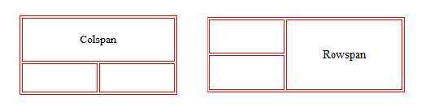

# HTML 及元素

## 网页的显示过程

### 从 URL 到页面呈现的步骤

**用户角度** :

1. **DNS解析**：
   查询顺序：浏览器缓存 → 系统（hosts文件） → 路由器缓存 → ISP DNS 服务器（若未命中则递归查询根域名服务器等）

2. **TCP三次握手**：

- 客户端向服务器发送 `SYN`（同步序列编号）。
- 服务器回复 `SYN-ACK`（同步确认）。
- 客户端发送 `ACK`（确认），建立稳定连接。

3. **HTTP请求**：  
   - **方法**：GET（获取）、POST（提交）、PUT（更新）、DELETE（删除）。  
   - **状态码**：200（成功）、304（未修改）、404（未找到）、500（服务器错误）。  

4. **服务器响应**：
   返回HTML、CSS、JavaScript等资源。  

5. **浏览器渲染**：  

   解析HTML生成DOM树，解析CSS生成CSSOM树，合并为渲染树（Render Tree），计算布局（Layout），分层绘制（Paint），最终合成（Composite）呈现页面。  

[从输入 url 到页面展示发生了什么？ - 掘金](https://juejin.cn/post/6869279683230629896)

### 网页的组成部分

HTML（结构）、CSS（样式）、JavaScript（交互）

### 浏览器与渲染引擎

**渲染引擎（浏览器内核）**负责：  

- 解析HTML和CSS，构建DOM和CSSOM。  
- 执行JavaScript，完成布局与绘制。  
- 处理用户交互（如点击、滚动）。  

**主流内核**：  

- **Blink**：Chrome、Edge。  
- **Gecko**：Firefox。  
- **Webkit**：Safari、早期Chrome。  

## HTML 超文本标记语言

HTML 是一种**标记语言**，使用**标签 (Tag)** 来定义网页文档的结构和语义。

**元素**：由开始标签、内容和结束标签构成，有些元素是**空元素**（自闭合元素），如 ``、`<br>`。

## HTML 文档的结构


## `<head>` 元素

`<head>`元素包含文档元信息，用于定义脚本、样式及元数据等，不直接显示在页面上。

| 标签       | 功能                       | 示例                                       |
| ---------- | -------------------------- | ------------------------------------------ |
| `<title>`  | 定义页面标题               | `<title>我的网站</title>`                  |
| `<meta>`   | 提供元数据（如编码、描述） | `<meta charset="UTF-8">`                   |
| `<link>`   | 关联外部资源（如CSS）      | `<link rel="stylesheet" href="style.css">` |
| `<script>` | 嵌入或引用脚本             | `<script src="app.js"></script>`           |
| `<style>`  | 定义内部CSS                | `<style>body { margin: 0; }</style>`       |

## 常用 HTML 元素

### 标题 `<h1>` - `<h6>`

- **特性**：块级元素，自带外边距，字体大小递减 (`h1` 最大)。
- **SEO相关**：搜索引擎优先抓取`<h1>`内容。

### 段落 `<p>`

- 块级元素，默认带有上下间距。
- 注意：`<p>` 内不应嵌入其他块级元素（如 `<div>`），否则可能引起意外的显示问题。

### 图像 ``

- **特性**：行内可替换元素
- 常见属性 :
  - `src`：图像路径（推荐使用正斜杠 `/`，确保跨平台兼容）。
  - `alt`：替代文本，便于 SEO 与无障碍访问。
- 路径：
  - **绝对路径**：从根目录开始（如`http://example.com/img.jpg`）  
  - **相对路径**：基于当前文件位置（如`./img.jpg`或`../img.jpg`）

### 链接 `<a>` (Anchor)

- **功能**：创建超链接，用于页面跳转、文件下载、协议调用（如 `mailto:`）。
- **属性**：  
  - `href`：目标 URL 或锚点标识。
  - `target`：链接打开方式  
    - `_self`：当前窗口（默认）  
    - `_blank`：新窗口  
    - `_parent`：父框架用于 `<iframe>` 嵌套）
    - `_top`：顶层窗口（突破框架限制）  
- **锚点链接**: 通过 `id` 属性实现页面内的跳转


```html
<a href="#section">跳转</a>
<h2 id="section">目标内容</h2>
```

- **图片链接**：将 `` 元素嵌套在 `<a>` 元素中，实现点击图片跳转。
- **邮箱链接**：`<a href="mailto:example@qq.com">发送邮件</a>`。  

**占位/无动作链接** (常用于配合 JS)：

- `href="#"`：跳转到页面顶部，URL 会添加 `#`。
- `href="javascript:void(0);"`：不执行任何操作，不跳转。**（现代实践中推荐使用 JS 的 `event.preventDefault()` 代替）**
- 不设置 `href` 或使用 `<button>` 元素：如果链接仅用于触发 JS 动作，语义上更推荐使用 `<button>` 或为 `<a>` 添加 `role="button"` 并通过 JS 处理点击事件。

### 内联框架 `<iframe>`

**功能**：嵌入外部网页或内容。

```html
<iframe src="https://www.example.com" width="600" height="400" frameborder="0"></iframe>
```

### 视频 `<video>`

HTML5 提供 `<video>` 标签用于在网页中嵌入视频。它支持多种格式（如 MP4、WebM、OGG），但具体支持情况取决于浏览器。

**常用属性**：

- `src`：视频文件路径。
- `controls`：显示浏览器默认的播放控件。
- `autoplay`：自动播放（常需要配合 `muted` 属性才能生效）。
- `muted`：静音播放。
- `loop`：循环播放。
- `poster`：视频加载前显示的封面图像 URL。
- `width`, `height`：视频播放器尺寸。

示例：

```html
<video src="video.mp4" width="640" height="360" controls autoplay muted loop poster="thumbnail.jpg"></video>
```

**兼容性与备用方案**：

不同浏览器对视频格式支持不同，建议使用 `<source>` 提供多个格式，以加载首个兼容的文件。对于不支持 `<video>` 的浏览器，可提供备用文本：

```html
<video controls width="640" height="360" poster="poster.jpg">
  <source src="movie.mp4" type="video/mp4">
  <source src="movie.webm" type="video/webm">
  抱歉，您的浏览器不支持嵌入式视频。
</video>
```

### 音频 `<audio>`

`<audio>` 标签用于嵌入音频

**基本用法**：

```html
<audio src="audio.mp3" controls></audio>
```

- **src**：指定音频文件路径。
- **controls**：显示播放控件。

- **autoplay**：自动播放。
- **muted**：静音播放。
- **loop**：循环播放。
- **preload**：控制预加载行为，可选值：
  - `auto`：尽可能预加载整个音频。
  - `metadata`：仅加载元数据（如时长）。
  - `none`：不预加载。

示例：

```html
<audio src="audio.mp3" controls autoplay loop></audio>
```

**兼容性与备用方案**：

与 `<video>` 类似，可使用 `<source>` 兼容不同格式

## 容器元素：`<div>` 与 `<span>`

> `div` 元素和 `span` 元素都是“纯粹的” **容器**, 也可以把他们理解成“**盒子**”, 它们都是用来包裹内容的;

- **`div`（块级元素）**  
  
  - 独占一行，呈矩形块状，多个 `div` 内容分行显示。  
  - 常作为**父容器**，包裹其他元素以形成整体，或将网页**分割**为独立区块。  
  
- **`span`（行内元素）**  
  
  - 不换行，多个 `span` 内容同行显示。  
  - 默认与普通文本类似，常用于**文本**或**行内元素**的样式化、标记或包裹。  
  
- **核心区别**：`div` 的 `display` 默认为 `block`（块级），`span` 默认为 `inline`（行内），决定了布局与样式能力。  

  - **块级元素**：即使设置 `width`，仍独占整行（`width` 仅限内容宽）。  

  |    特征    | 块元素                                                   | 行元素                                                       |
  | :--------: | -------------------------------------------------------- | ------------------------------------------------------------ |
  |  显示方式  | 独占整行，从新行开始，宽度默认是 **父元素** 的 100%         | 仅占据内容的宽度，不会起新行                                 |
  | 宽度和高度 | **可以设置宽度和高度**                                   | **宽度和高度由内容决定，不能设置宽度和高度**                 |
  |  元素排列  | 与其他块级元素 **垂直排列**                               | 与相邻元素在同一行水平排列                                   |
  |  默认样式  | 默认情况下，块级元素独占一行，例如 `<div>`、`<p>`、`<h1>` | 默认情况下，行内元素只占据内容的宽度，例如 `<span>`、`<a>`、`<strong>` |
  |  允许包含  | 可以包含块级元素和行内元素                               | **只能包含行内元素**                                         |

## HTML 编写注意事项

- 块级元素、`inline-block` 元素
  - 一般情况下, 可以包含其他 **任何元素**(比如块元素、行元素、`inline-block` 元素)
  - **特殊情况**：`<p>` 元素不能包含其他块级元素 (如 `<p>` 元素里不能放 `<div>` 元素, 会出现 bug)
- 行元素 (比如 `<a>`、`<span>`、`<strong>` 等)
  - 只能包含行元素, 不能包含块元素
- **空白符处理**：HTML 会将多个连续的空格、换行符、制表符视作**一个空格**进行渲染。使用 `&nbsp;` 可强制插入一个不会被合并的空格。
- **注释**：对复杂或重要的部分添加注释 `<!-- 这是注释 -->`。

## HTML 全局属性

1. `id`：定义元素的唯一标识符，在整个文档中必须唯一。用于链接（片段标识符）、脚本或CSS选择。

2. `class`：指定元素的类名（以空格分隔），便于CSS和JavaScript通过类选择器或DOM方法操作。

3. `style`：直接为元素添加内联CSS样式。

4. `title`：鼠标悬停时的提示文本。

5. `data-*`：用于存储自定义数据，通常通过 JavaScript 访问。

   - 通过 JavaScript 的 dataset 属性访问，例如 element.dataset.info。

   - 常用于在 HTML 和 JavaScript 之间传递数据，便于动态交互。

## 事件处理属性

- 如 `onclick`, `onmouseover`, `onchange` 等属性可以直接在 HTML 中指定 JavaScript 代码来响应用户交互。
- **现代 Web 开发实践强烈建议**：使用 JavaScript 的 `addEventListener()` 方法来绑定事件监听器，以实现关注点分离（HTML 负责结构，CSS 负责样式，JS 负责行为）。内联事件处理器（`onclick="..."`）难以维护和扩展。

## 列表 (Lists)

### 实现方式

- **使用 `<div>` 模拟**：虽然可以，但不推荐，因为它缺乏语义，不利于可访问性和 SEO。

- **使用列表元素**：语义化实现，浏览器默认样式可通过 CSS 重置：  

  ```css
  ol, ul, li, dl, dt, dd {
    padding: 0;
    margin: 0;
    list-style: none;
  }
  ```

### 列表类型

- **有序列表**：`<ol>`（包裹 `<li>`）。  
- **无序列表**：`<ul>`（包裹 `<li>`）。  
- **定义列表**：`<dl>`（包裹 `<dt>` 和 `<dd>`）

  - **`dl` (definition list)**  
    定义列表，其直接子元素仅限于 `dt` 和 `dd`。


  - **`dt` (definition term)**  
    列表中每个项目的名称。


  - **`dd` (definition description)**  
    列表中每个项目的具体描述，用于对 `dt` 进行阐述、解释或补充。  
    通常一个 `dt` 后紧跟一个或多个 `dd`。


定义列表的应用：


## 表格 (Tables)

- `<table>`：表格容器。
- `<tr>`：行。
- `<td>`：单元格。
- `<th>`：表头单元格。
- `<thead>/<tbody>/<tfoot>`：表头/主体/页脚。
- `<caption>`：表格标题。


### 设置边框

```css
table, th, td { 
  border: 1px solid black; 
  border-collapse: collapse; 
}
```

- **`border-collapse`**  
  
  - `collapse`：合并边框，避免双边框。  
  - 默认分离时，`table`、`<th>`、`<td>`各自独立边框导致双线效果。  

- **表格内边距**  
  若需调整边框与表格内容之间的间距，可在 `<td>` 和 `<th>` 元素上应用 `padding` 属性。

- **斑马纹表格效果**  
  使用 `nth-child()` 选择器为偶数（或奇数）行添加背景色，例如：  
  
  ```css
  tr:nth-child(even) { background-color: #f2f2f2; }
  ```

**单元格合并**：

- `colspan="n"`：让单元格横向跨越 `n` 列。
- `rowspan="n"`：让单元格纵向跨越 `n` 行。
- **注意**：在设置了 `colspan` 或 `rowspan` 的单元格所在的行（或后续行），需要**移除**被该单元格覆盖掉的 `<td>` 或 `<th>` 元素。





## 元素语义化


```html
<header> - 页头
<nav> - 导航
<main> - 主要内容
<article> - 内容
<section> - 区块
<aside> - 侧边栏
<footer> - 页脚
<time> - 日期或时间。
```

## 不常用元素

- `<strong>`：加粗强调（可用`font-weight: 700`替代）
- `<i>`：斜体（可用`font-style: italic`替代，常用于图标）
- `<code>`：表示计算机代码片段，通常使用等宽字体。
- `<pre>`：预格式化文本，保留其中的空格和换行符，常与 `<code>` 结合使用显示代码块。
- `<br>`：强制换行
- `<sub>` ：下标
- `<sup>`：上标
