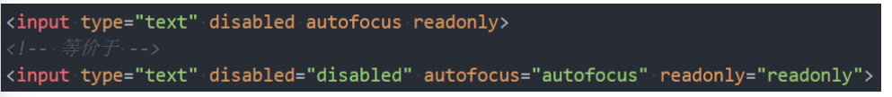
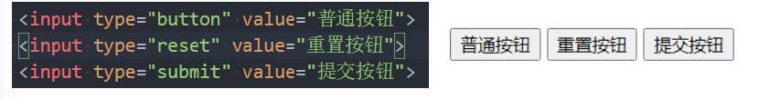
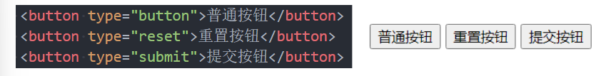
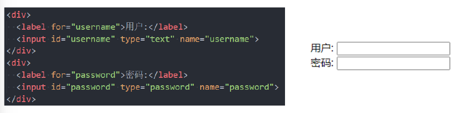
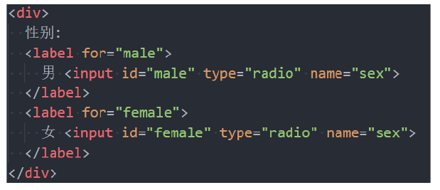
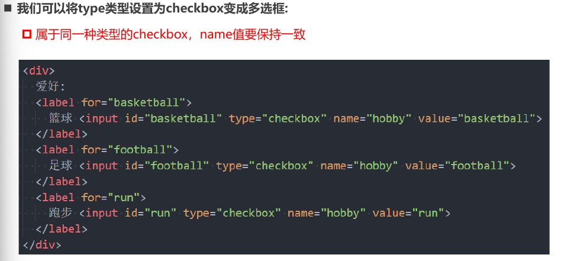
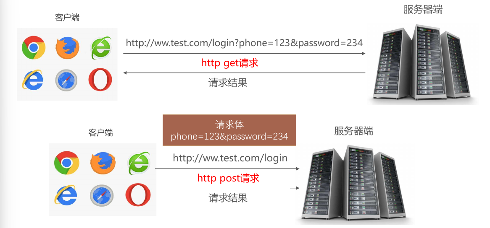

# 表单

HTML 表单是用来收集用户输入的网页元素，包含各种控件，如文本框、单选按钮、复选框、下拉框等。它的作用是将用户数据发送到服务器进行处理。

## 常见元素

- `form`：表单, 一般情况下, **其他表单相关元素** 都是它的 **后代** 元素
- `input`： **单行文本输入框、单选框、复选框、按钮** 等元素
- `textarea`：**多行文本框**
- `select、option`：**下拉选择框**
- `button`：**按钮**
- `label`：表单元素的 **标题**

## Input 元素详解

### 常见属性

- `type`：input 的类型
  - `text`：文本输入框（明文输入）
  - `password`：文本输入框（密文输入）
  - `radio`：单选框
  - `checkbox`：复选框
  - `button`：按钮
  - `reset`: 重置，可以对 form 中的 **其他表单元素** 进行重置
  - `submit`: 提交表单数据给服务器
  - `file`：文件上传
  - `time`：时间
  - `date`：日期
- `readonly`：只读，能选中不能输入
- `disabled`：禁用，不能被选中
- `checked`：默认被选中
  - 只有当 `type` 为 `radio` 或 `checkbox` 时可用
- `autofocus`：页面加载时 **自动聚焦**
- `name`：名字
  - 在 **提交数据给服务器** 时, 可用于 **区分数据类型**
- `value`：**取值**
- `required`: 输入框必须填写，表单提交前会进行验证。

> HTML 表单是用于收集用户输入的一种网页元素，它可以包含文本框、单选按钮、复选框、下拉列表等不同类型的控件。HTML 表单的基本结构如下：
>
> ```html
> <form action="action_page.php" method="post">
> <!-- 表单控件 -->
> </form>
> ```
>
> - `<form>` 元素定义了一个表单，它的 `action` 属性指定了 **表单数据提交的目标地址**，`method` 属性指定了 **提交数据的 HTTP 方法**（`get` 或 `post`）。
> - `<input>` 元素是最常用的表单控件之一，它可以创建不同类型的输入框，如文本框、密码框、单选按钮、复选框等。`type` 属性定义了输入框的类型，`name` 属性定义了输入框的名称，`value` 属性定义了输入框的默认值。
> - `<label>` 元素用于为表单控件添加标签，它的 `for` 属性指定了要关联的控件的 `id` 属性。
> - `<select>` 元素用于创建下拉列表，它包含了多个 `<option>` 元素，每个 `<option>` 元素定义了一个可选项。
> - `<textarea>` 元素用于创建多行文本输入框，它的 `rows` 和 `cols` 属性定义了文本框的大小。
> - `<button>` 元素用于创建按钮，它的 `type` 属性定义了按钮的功能，如提交表单、重置表单等。
>
> 下面是一个简单的 HTML 表单的例子，它包含了文本框、密码框、单选按钮、复选框、下拉列表和按钮：
>
> ```html
> <form action="/" method="post">
>   <!-- 文本输入框 -->
>   <label for="name">用户名:</label>
>   <input type="text" id="name" name="name" required>
>   <br>
>   <!-- 密码输入框 -->
>   <label for="password">密码:</label>
>   <input type="password" id="password" name="password" required>
>   <br>
>   <!-- 单选按钮 -->
>   <label>性别:</label>
>   <input type="radio" id="male" name="gender" value="male" checked>
>   <label for="male">男</label>
>   <input type="radio" id="female" name="gender" value="female">
>   <label for="female">女</label>
>   <br>
>   <!-- 复选框 -->
>   <input type="checkbox" id="subscribe" name="subscribe" checked>
>   <label for="subscribe">订阅推送信息</label>
>   <br>
>   <!-- 下拉列表 -->
>   <label for="country">国家:</label>
>   <select id="country" name="country">
>     <option value="cn">CN</option>
>     <option value="usa">USA</option>
>     <option value="uk">UK</option>
>   </select>
>   <br>
>   <!-- 提交按钮 -->
>   <button type="submit">提交</button>
> </form>
> ```
>
> [如果你想了解更多关于 HTML 表单的知识，你可以参考以下的网页](https://www.w3school.com.cn/html/html_forms.asp) [1](https://www.w3school.com.cn/html/html_forms.asp) [，](https://www.w3school.com.cn/html/html_forms.asp) [2](https://www.runoob.com/html/html-forms.html) [，](https://www.w3school.com.cn/html/html_forms.asp) [3](https://bing.com/search?q=html+表单教程) [，](https://www.w3school.com.cn/html/html_forms.asp) [4](https://developer.mozilla.org/zh-CN/docs/Learn/Forms/How_to_structure_a_web_form) [，](https://www.w3school.com.cn/html/html_forms.asp) [5](https://developer.mozilla.org/zh-CN/docs/Learn/Forms/Your_first_form)。

## 布尔类型

- 常见的布尔属性有 `disabled`、`checked`、`readonly`、`multiple`、`autofocus`、`selected`
- **布尔属性** 可以 **没有属性值**, 写上属性名就代表使用这个属性
  - 如果要给布尔属性设值, 值就是属性名本身



## 表单按钮

表单可以实现按钮效果：

- **普通** 按钮(`type=button`)：使用 `value` 属性设置 **按钮文字**
- **重置** 按钮(`type=reset`)：重置它所属 `form` 的所有表单元素(包括 input、textarea、select)
- **提交** 按钮(`type=submit`)：提交它所属 `form` 的表单数据给服务器(包括 input、textarea、select)



也可以通过按钮来实现：



`type="button"` 是没有默认行为的按钮，通常脚本指定 `click` 事件的监听函数来使用。

```
<input type="button" value="点击">
```

建议尽量不使用这个类型，而使用 `<button>` 标签代替，一则语义更清晰，二则 `<button>` 标签内部可以插入图片或其他 HTML 代码

## input 和 label 的关系

- `<label>` 元素一般跟 `<input>` 配合使用, 用来表示 input 的标题
- `<label>` 可以跟某个 `<input>` 绑定, 点击 `<label>` 就可以激活对应的 input 变成选中



## radio 的使用

- 我们可以将 type 类型设置为 radio 变成单选框:
  - name 值相同的 radio 才具备单选功能



## checkbox 的使用



## textarea 的使用

- `textarea` 的常用属性:
  - `cols`: 列数
  - `rows`: 行数
- - ### CSS 控制文本框缩放： 
  
    - `resize: none;` 禁止缩放。
    - `resize: horizontal;` 仅允许水平缩放。
    - `resize: vertical;` 仅允许垂直缩放。
    - `resize: both;` 允许水平和垂直缩放。

## select 和 option 的使用

- `<option>` 是 `<select>` 的子元素, 一个 option 代表一个选项
- `<select>` 常用属性：
  - `multiple`: 可以多选
  - `size`: 显示多少项
- `<option>` 常用属性：
  - `selected`: 默认被选中

## form 常见的属性

`<form>` 通常作为表单元素的 **父** 元素:

- form 可以将整个表单作为一个整体来进行操作
- 比如对整个表单进行重置
- 比如对整个表单的数据进行提交

form 常见的属性如下:

- `action`：用于 **提交表单数据的请求 URL**
- `method`：请求方法(`get` 和 `post`), 默认是 `get`
  - 提交数据的 HTTP 方法，可能的值有 `post`（表单数据作为 HTTP 数据体发送），`get`（表单数据作为 URL 的查询字符串发送），`dialog`（表单位于 `<dialog>` 内部使用）。
- `target`：`target`：指定提交表单数据时打开的目标位置（如 `_blank`、`_self`）。

## 请求方式的对比



