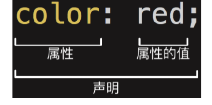
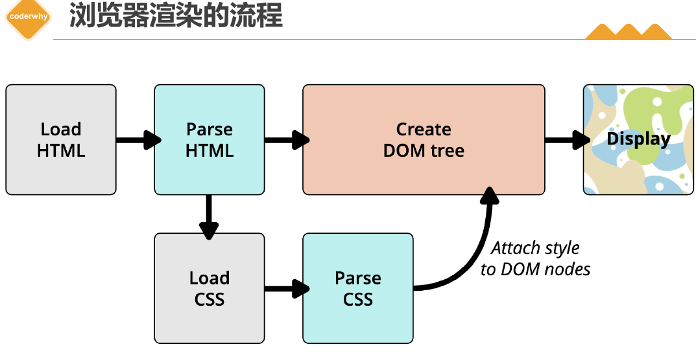
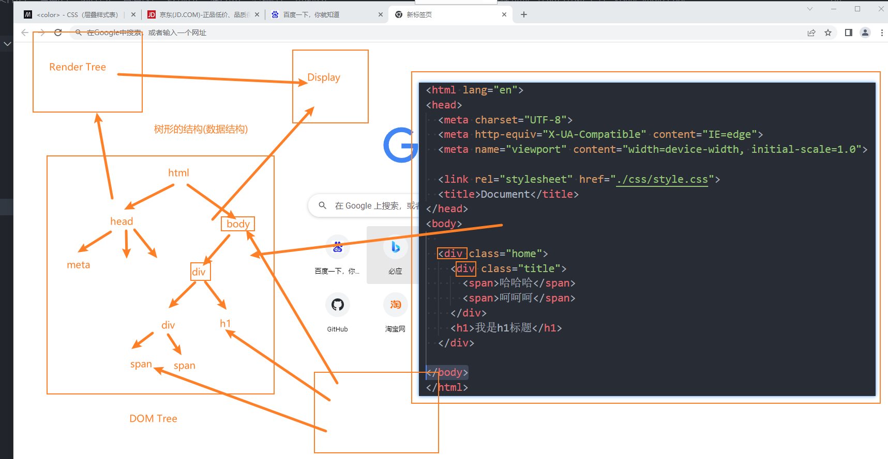

## 什么是 CSS?

1. **CSS** （Cascading Style Sheets，层叠样式表）是一种用于为结构化文档（如 HTML 或 XML 文档）添加样式的计算机语言。它的主要功能是控制网页的外观和布局，包括字体、颜色、间距、对齐方式等视觉效果。CSS 文件的扩展名为 `.css`。

2. CSS 的出现不仅是为了美化 HTML 页面，更重要的是实现了 **结构（HTML）与样式（CSS）的分离** ，从而提高了代码的可维护性和复用性。其核心作用可以概括为以下两点： 

   - **样式定义** ：为 HTML 元素添加各种视觉效果，例如颜色、字体、大小、下划线、阴影等。
   - **页面布局** ：通过 CSS 提供的布局工具（如浮动、Flexbox 和 Grid 布局），实现复杂的页面结构和响应式设计。

3. 语法:
   ```css
   选择器 {
     属性: 值;
   }
   ```
   
   
   
   

## 插入样式表

在 HTML 中，可以通过三种方式插入 CSS 样式表：外部样式表、内部样式表和行内样式。

### 外部样式表 (External Style Sheet)

- 将 css 样式编写一个单独的 css 文件,通过`<link>`元素引入

  ```css
  <head>
  <link rel="stylesheet" type="text/css" href="mystyle.css">
  </head>
  ```

- 使用 `@import` 导入其他 CSS 文件 

  除了 `<link>`，还可以在 `<style>` 标签或外部 CSS 文件中使用 `@import` 导入其他 CSS 文件： 


```css
<style>
  @import url('reset.css');
  @import url('layout.css');
</style>
```

#### `<link>`元素

- **作用** ：`<link>` 是 HTML 中用于链接外部资源的元素，常用于加载样式表或站点图标。
- **常见属性** ：
  
  - `href`：指定被链接资源的 URL，可以是绝对路径或相对路径。
  
  - `rel`：定义链接类型，常见的值包括：
    - `stylesheet`：表示外部样式表。
    - `icon`：表示站点图标（favicon）。
    
  - `type`：指定资源的 MIME 类型（可选，默认为 `text/css`）。

### 内部样式表

- 将 CSS 放在`<head>`元素里的`<style>`元素里

  ```css
  <head>
  <style>
  hr {color:sienna;}
  p {margin:20px;}
  </style>
  </head>
  ```

### 行内样式 (Inline Style)

行内样式是直接在 HTML 标签中使用 `style` 属性定义样式。这种方式优先级最高，但不推荐大量使用，因为它会破坏结构与样式的分离原则。

```CSS
<p style="color:sienna;margin-left:20px">这是一个段落。</p>
```

### 多重样式优先级:

浏览器根据样式的来源和选择器的权重来决定最终应用的样式。优先级从高到低依次为： 

1. **行内样式** （Inline Style）
2. **内部样式表** （Internal Style Sheet）
3. **外部样式表** （External Style Sheet）
4. **浏览器默认样式** 

**详细规则：** 

- **按来源** ：行内样式 > 内部样式 > 外部样式 > 浏览器默认样式。
- **按选择器权重** ：`id 选择器 > class 选择器 > 元素选择器`。
- **同权重时** ：后定义的样式覆盖先定义的样式。

> **注意** ：浏览器默认字体大小为 `16px`。 

## RGB 的表示方法

//TO DO

## 浏览器的渲染流程

> 浏览器渲染的流程是指浏览器将通过网络接收的 HTML、CSS、JS 等资源转换为用户可见的页面的过程





1. **解析 HTML，构建 DOM 树**  
   浏览器解析 HTML 文档，生成 DOM 树，同时加载外部资源（如 CSS、JS 文件）。

2. **解析 CSS，构建 CSSOM 树**  
   解析 CSS 样式规则，生成 CSSOM 树，确定每个元素的样式信息。

3. **合并 DOM 和 CSSOM，生成渲染树**  
   将 DOM 树与 CSSOM 树结合，生成渲染树，只包含需要显示的可见节点。

4. **布局（Layout/Reflow），计算几何信息**  
   计算渲染树中每个节点的位置和大小，确定其在页面中的布局。

5. **绘制（Paint），生成像素信息**  
   将渲染树中的节点转换为屏幕上的像素，按顺序绘制背景、边框、文本等内容。

6. **合成（Composite），显示最终页面**  
   将多个绘制层合并，利用 GPU 加速生成最终图像并显示到屏幕上。

了解更多的浏览器渲染的细节和原理，可以参考以下的资源：

- [渲染页面：浏览器的工作原理 - Web 性能 | MDN](https://developer.mozilla.org/zh-CN/docs/Web/Performance/How_browsers_work)
- [现代浏览器的渲染流程 - 知乎](https://bing.com/search?q=浏览器渲染的流程)
- [浏览器知识点整理（七）渲染流程 - 掘金](https://juejin.cn/post/6975838644402094111)
