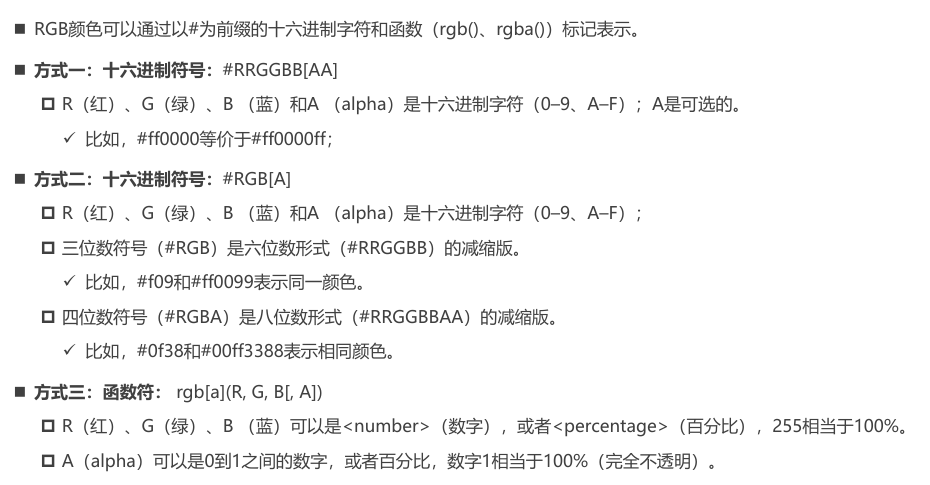
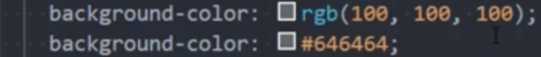
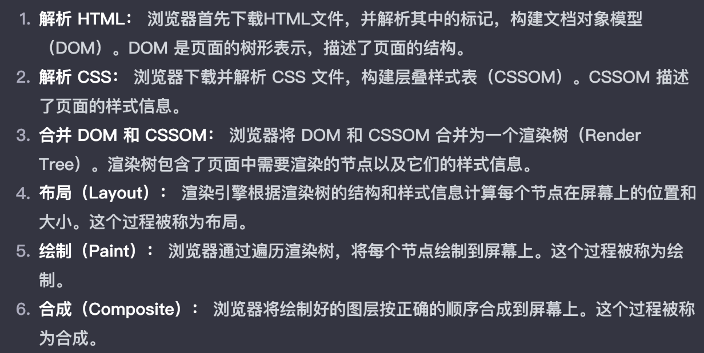

## 1. 什么是CSS?

1. **CSS** (Cascading Style Sheets，**层叠样式表**），是一种用来为结构化文档（如 HTML 文档或 XML 应用）添加样式（字体、间距和颜色等）的**计算机语言**，CSS 文件扩展名为 `.css`。

2. CSS的出现是为了美化HTML的,并且让**结构(HTML)与样式(CSS)分离**;

   - 美化方式一:为HTML添加各种各样的**样式**,比如颜色、字体、大小、下划线等等;
   - 美化方式二:对HTML进行**布局**,按照某种结构显示(CSS进行布局 – **浮动、flex、grid**);

3. 语法:

   
##  2. 插入样式表

插入样式表的方法有三种:

### - 外部样式表

(External style sheet)

- 将css样式编写一个单独的css文件,通过`<link>`元素引入

  ```css
  <head>
  <link rel="stylesheet" type="text/css" href="mystyle.css">
  </head>
  ```
- 可以在`style`元素或者`.CSS`文件中使用`@import`**导入其他的CSS文件**
```css
<style>
@import url(./other.css);
</style>
```
### - 内部样式表

(Internal style sheet)

- 将CSS放在`<head>`元素里的`<style>`元素里

   ```css
   <head>
   <style>
   hr {color:sienna;}
   p {margin:20px;}
   </style>
   </head>
   ```

### - 行内样式

(Inline style)

在标签内使用**样式（style）属性**

```CSS
<p style="color:sienna;margin-left:20px">这是一个段落。</p>
```


多重样式优先级:

**（内联样式）Inline style > （内部样式）Internal style sheet >（外部样式）External style sheet  > 浏览器默认样式**

> 浏览器会按照不同的方式来确定样式的优先级，其原则如下。
>
> - 按照样式来源不同，其优先级:`行内样式>内部样式>外部样式>浏览器默认样式`
>
> - 按照选择器不同，其优先级:`id选择器>class类选择器>元素选择器`
> - 当样式定义的优先级相同时，**取后面定义的样式。**

- 浏览器**默认**字体大小是`16px`


改变元素的特性和垂直布局

```css
display:inline-block;
vertical-align:top;
```

## link元素

- `link`元素是**外部资源链接**元素,规范了**文档与外部资源**的关系
  - `link`元素在`head`元素中
- 最常用的链接是样式表(css)
  - 此外也可以被用来**创建站点图标**(icon)

link元素常见的属性

- href:指定**被链接资源的URL**.URL可以是绝对的也可以是相对的
- **rel:指定链接类型**,常见的链接类型:https://developer.mozilla.org/zh-CN/docs/Web/HTML/Link_types
  - `icon`:站点图标
  - `stylesheet`:css样式

## RGB的表示方法





rgba a表示透明度

rgb(255,255,255)->转换为十六进制 #FFF

## 浏览器的渲染流程




**浏览器渲染的流程是指浏览器将通过网络接收的 HTML、CSS、JS 等资源转换为用户可见的页面的过程**。这个过程大致可以分为以下几个步骤：

- **导航**：浏览器根据用户的输入或操作，向服务器发送请求，获取页面的 URL 和 IP 地址，建立 TCP 和 TLS 连接。
- 响应：服务器收到请求后，**返回响应头和 HTML** 内容，浏览器开始接收并解析 HTML 文档。
- **构建 DOM 树**：浏览器将 HTML 文档**解析为 DOM 节点，并构建 DOM 树，表示页面的结构。**
- 样式计算：浏览器解析 CSS 文件，计算出每个 DOM 节点的样式属性，生成 CSSOM 树，表示页面的样式。
- 布局：浏览器根据 DOM 树和 CSSOM 树，计算出每个 DOM 节点的位置和大小，生成布局树，表示页面的布局。
- 分层：浏览器根据布局树，将一些需要独立绘制或合成的 DOM 节点分离出来，生成图层树，表示页面的分层结构。
- 绘制：浏览器根据图层树，将每个图层的 DOM 节点绘制为位图，生成绘制列表，表示页面的绘制顺序。
- 光栅化：浏览器根据绘制列表，将每个图层的位图切分为多个图块，交给光栅化线程进行光栅化，将图块转换为像素，生成光栅化列表，表示页面的像素数据。
- 合成：浏览器根据光栅化列表，将每个图块的像素数据合成为一张完整的页面图片，交给合成线程进行合成，将图片发送给 GPU，进行显示，完成页面的渲染。


如果你想了解更多的浏览器渲染的细节和原理，你可以参考以下的资源：

- [渲染页面：浏览器的工作原理 - Web 性能 | MDN](https://developer.mozilla.org/zh-CN/docs/Web/Performance/How_browsers_work)
- [现代浏览器的渲染流程 - 知乎](https://bing.com/search?q=浏览器渲染的流程)
- [浏览器知识点整理（七）渲染流程 - 掘金](https://juejin.cn/post/6975838644402094111)