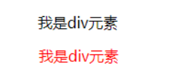

# 选择器、伪类和伪元素

## 选择器

按照一定的规则选出符合条件的元素,为之添加CSS样式

> 选择器的种类繁多,大概可以这么归类
>
> - 通用选择器(universal selector)
> - 元素选择器(type selectors)
> -  类选择器(class selectors)
> -  id选择器(id selectors)
> -  属性选择器(attribute selectors)
> -  选择器组(combinators)
> -  伪类(pseudo-classes)
> -  伪元素(pseudo-elements)

### 通用选择器  (`*`)

```css
* {
    margin: 0;
    padding: 0;
}
```

- 所有的元素都会被选中
- 一般用来给所有元素作一些通用性的设置
  - 比如内边距、外边距;
  - 比如重置一些内容(因为浏览器会默认给很多元素**添加默认样式**比如`<body>`默认有`margin:8px`)
  
  

### 元素选择器

使用**元素的名称**

```css
div {
  font-size:16px
}
```

### 类选择器

使用`.类名`

```css
.box {
  margin: 0 auto; 
}
```

### ID选择器

使用`#id`

```css
#header {
  margin: 0 auto;
}
```

 - 一个 HTML文档里面的id值是唯一的,不能重复
 - id值如果由多个单词组成,单词之间可以用中划线`-`连接,也可以使用驼峰标识
 - 最好不要用标签名作为id值

### 属性选择器

(attribute selectors)

[属性名]

```css
[title=box] { 
color: blue;
}
```


### 后代选择器

**所有的**后代(包括直接或**间接的**后代)

选择器之间以**空格**分割


### 子代选择器

  - 必须是**直接子代**
  
  - 选择器之间以`>`分割


### 兄弟选择器

#### **相邻兄弟选择器`+`**

- 使用符号`+`连接


#### 全部兄弟选择器`~`

- 使用`~`链接


选择器组

- **交集选择器:需要同时符合两个选择器条件**

  - 两个选择器**紧密连接**

  - 在开发中通常为了精确的选择某一元素


- **并集选择器:符合一个选择器条件即可**

  - 两个选择器以`,`分割

  - 在开发中通常为了给多个元素设置相同的样式


### 伪类选择器

```css
:link	:visited :hover	:focus :active	/*动态伪类*/
target	/*目标伪类*/
lang()	/*语言伪类*/
/*元素状态伪类*/
:enabled、:disabled、:checked

/*结构伪类*/
- :nth-child( )、:nth-last-child( )、:nth-of-type( )、:nth-last-of-type( )
- :first-child、:last-child、:first-of-type、:last-of-type
- :root、:only-child、:only-of-type、:empty

/*否定伪类*/
:not()
```


### 伪元素选择器

- ::after
- ::before
- ::first-letter
- ::first-word


---

# 伪类

## 什么是伪类

**伪类**是**选择器的一种**,**用于选择处于特定状态**或位置的元素

> 伪类的语法:在选择器后面加上**一个冒号和伪类的名称**，有些伪类还可以带有参数。

当手指放在一个元素上时,显示另一个颜色



> `hover`: 悬浮, 悬停, 徘徊

## 常见的伪类

1. **动态伪类**

   `:link`、`:visited`、`:hover`、`:active`、`:focus`

2. 目标伪类 `target`

3. 语言伪类 `lang()`

4. 元素状态伪类 `enabled`、`:disabled`、`:checked`

5. 结构伪类

- `:nth-child( )`、`:nth-last-child( )`、`:nth-of-type( )`、`:nth-last-
  of-type( )`
- `:first-child`、`:last-child`、`:first-of-type`、`:last-of-type`
- `:root`、`:only-child`、`:only-of-type`、`:empty`

6. 否定伪类

`:not()`

### 1. 动态伪类

#### 使用举例:

- `a:link` **未访问**的链接
- `a:visited` **已访问**的链接

- `a:hover` 鼠标挪动**悬停**到链接上
- `a:active` 激活的链接(**鼠标在链接上长按住未松开**)

#### 使用注意:

- `:hover`必须放在`:link`和`:visited`后面才能完全生效
- `:active`必须放在`:hover`后面才能完全生效
- 所以建议的编写顺序是`:link`,`:visited`,`:hover`,`:active`

除了a元素,`:hover`,`:active`也能用在其他元素上

#### :focus

`:focus`**指当前拥有输入焦点的元素**(能接受键盘输入)

- 文本输入框一聚焦后,背景就会变红色

- 因为链接a元素可以被键盘的Tab键选中聚焦,所以`:focus`也适用于a元素

动态伪类**编写顺序**建议为:

```css
:link,:visited,:focus,:hover,:active
```

记忆方法:`LVHA`

**直接给a元素设置样式,相当于给a元素的所有动态伪类都设置了**

- 相当于`a:link`、`a:visited`、`a:hover`、`a:active`、`a:focus`的color都是red

### 2. 结构伪类

####  2.1 :nth-child

- `:nth-child(1)` 是父元素中的第一个**子元素**
- `:nth-child(2n)`
  - n代表任意**正整数**和**0**
  - 是父元素中的第偶数个子元素（第2，4，6，8…个）
  - 跟`nth-child(even)`同义
- `:nth-child(2n+1)`
  - n代表任意正整数和0
  - 是父元素中的第奇数个子元素（第1，3，5，7）
  - 和`:nth-child(odd)`同义

- `nth-child(-n+2)`
  - 代表前2个子元素
  

####  2.2 :nth-last-child( )

- `:nth-last-child()`的语法跟`:nth-child()`类似，不同点是`:nth-last-child()`从最后一个子元素开始往前计数

  - :nth-last-child(1),代表倒数第一个子元素

  - :nth-last-child(-n + 2),代表最后2个子元素

#### 2.3 nth-of-type() :nth-last-of-type()

- `:nth-of-type()`用法跟`:nth-child()`类似
  - 不同点是:nth-of-type()计数时只计算同种类型的元素

- `:nth-last-of-type()`用法跟`:nth-of-type()`类似
  - 不同点是`:nth-last-of-type()`从最后一个这种类型的子元素开始往前计数


下面的伪类偶尔会使用：

- `:root` 根元素，就是HTML元素
- `:empty` 代表里面完全空白的元素

### 3. 否定伪类（negation pseudo-class）

- `:not()`的格式是`:not(x)`
  
  - `x`是一个简单选择器
  - 元素选择器、通用选择器、属性选择器、类选择器、伪类（除否定伪类）
- `:not(x)`表示除`x`以外的元素


## 伪元素

**伪元素**（pseudo-elements）是 CSS 中一种用于**选择元素**的特殊语法，允许你**选择元素的特定部分，而不是整个元素**。它们以双冒号(::)开始，例如 `::before` 或 `::after`。

常见的伪元素有：

1. **::before：** 在选中的元素**之前插入内容**。通常用于添加一些额外的装饰或内容。

   ```css
   p::before {  /*交集选择器*/
     content: "前缀: ";
   }
   ```

2. **::after：** 在选中的元素**之后插入内容**。也通常用于添加额外的内容或装饰。

   ```css
   p::after { /*交集选择器*/
     content: " 后缀";
   }
   ```

3. **::first-line：** 选择元素的**第一行**。可以用于设置首行的样式。

   ```css
   p::first-line {
     font-weight: bold;
   }
   ```

4. **::first-letter：** 选择元素的**第一个字母**。可以用于设置首字母的样式。

   ```css
   .box::first-letter { /*交集选择器*/
     font-size: 150%;
   }
   ```

这些伪元素使得开发者能够通过 CSS 选择器选择文档中的特定部分，而不是整个元素。**伪元素不会在 DOM 中创建新的元素**，而是允许你通过 CSS 规则样式化选中的部分。这在设计中常用于创建一些特殊效果，而无需在 HTML 结构中添加额外的标记。

### 伪元素的应用

- 可以应用在给一段文字前后添加东西,尤其是添加的东西相同重复

- 位置微调可以用相对定位


### 伪元素的补充

> 题目:在一串文字的后面添加个8*8的方格

```css
.box::after{		/*交集选择器*/
    content:"";		/*切记在伪元素里content这一行不要省略*/
    background-color:#f00;
    witdh:8px;
    height:8px;
    display:inline-block;		/*行元素无法设置宽和高*/
}
```

```html
<div class="box">这是一串可爱的文字</div>
    
```

