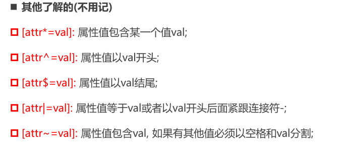
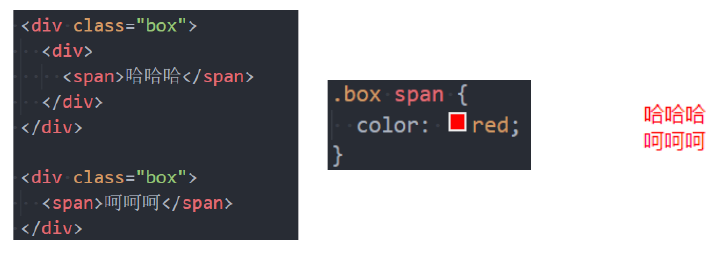
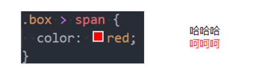
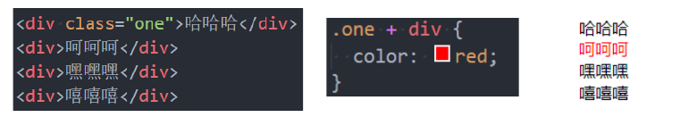
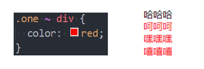
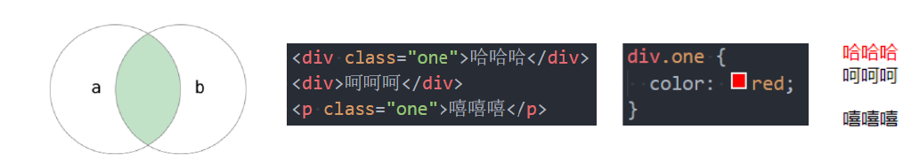
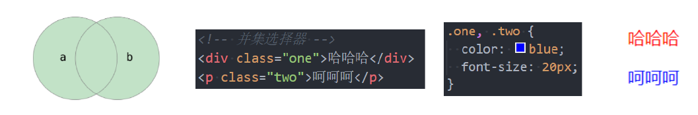
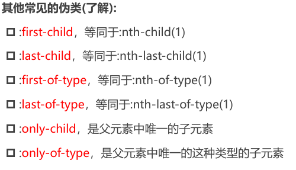
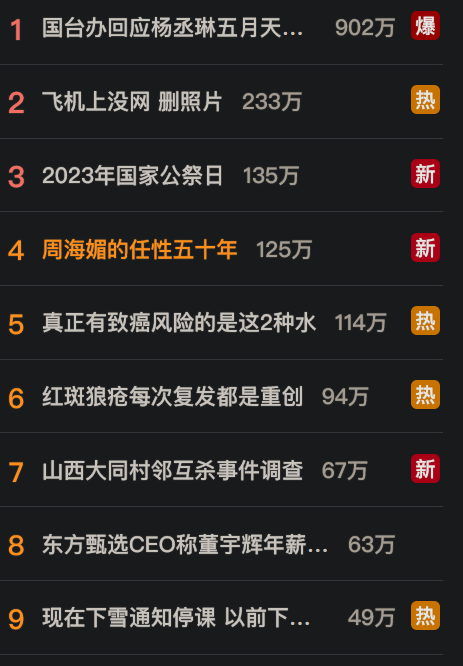

# 选择器、伪类和伪元素

## 选择器

CSS 选择器用于根据一定规则选择 HTML 元素，并为其应用样式。常见的选择器种类包括： 

- 通用选择器（Universal Selector）
- 元素选择器（Type Selector）
- 类选择器（Class Selector）
- ID 选择器（ID Selector）
- 属性选择器（Attribute Selector）
- 组合选择器（Combinator）
- 伪类（Pseudo-classes）
- 伪元素（Pseudo-elements）

### 通用选择器  (`*`)

```css
* {
    margin: 0;
    padding: 0;
}
```

- 选中所有元素。
- 一般用来给所有元素作一些通用性的设置
  - 比如内边距、外边距;
  - 比如重置一些内容(因为浏览器会默认给很多元素 **添加默认样式** 比如 `<body>` 默认有 `margin:8px`)
  

### 元素选择器

- 通过标签名（如 `div`）选中对应元素。

```css
div { font-size: 16px; }
```

### 类选择器 `.class`

使用 `.类名`

```css
.box {
  margin: 0 auto; 
}
```

### ID选择器 `#id`

通过唯一id选中单个元素（id在文档中不可重复，推荐用-或驼峰命名）。

```css
#header { margin: 0 auto; }
```

### 属性选择器

```css
[title="box"] {
  color: blue;
}
```

根据元素的属性和值选择元素。例如，选中所有`title="box"`的元素。




### 后代选择器

- 选择某个元素的所有后代（包括直接和间接后代）

- 选择器之间以 **空格** 分割



### 子代选择器

- 必须是 **直接子代**
  
- 选择器之间以 `>` 分割



### 兄弟选择器

- **相邻兄弟选择器**  `+`：选择紧接在某元素后面的元素。



- **所有兄弟选择器**  `~`：选择某元素之后的所有兄弟元素。



### 选择器组

- **交集选择器: 需要同时符合两个选择器条件**

  - 两个选择器 **紧密连接**

  - 在开发中通常为了精确的选择某一元素




- **并集选择器: 符合一个选择器条件即可**

  - 两个选择器以 `,` 分割

  - 在开发中通常为了给多个元素设置相同的样式




### 伪类选择器

```css
:link	:visited :hover	:focus :active	/*动态伪类*/
target	/*目标伪类*/
lang()	/*语言伪类*/
/*元素状态伪类*/
:enabled、:disabled、:checked

/*结构伪类*/
- :nth-child( )、:nth-last-child( )、:nth-of-type( )、:nth-last-of-type( )
- :first-child、:last-child、:first-of-type、:last-of-type
- :root、:only-child、:only-of-type、:empty

/*否定伪类*/
:not()
```


### 伪元素选择器

- :: after
- :: before
- :: first-letter
- :: first-word


---

# 伪类

## 什么是伪类

伪类是选择器的一种，以单冒号（:）开头，用于选中处于特定状态或位置的元素。部分伪类支持参数。

## 常见的伪类

- 动态伪类：`:link`, `:visited`, `:hover`, `:active`, `:focus`

- 目标伪类：`:target`

- 语言伪类：`:lang()`

- 元素状态伪类：`:enabled`, `:disabled`, `:checked`

- 结构伪类

  - `:nth-child( )`、`:nth-last-child( )`、`:nth-of-type( )`、`: nth-last-
    of-type( )`

  - `:first-child`、`:last-child`、`:first-of-type`、`:last-of-type`

  - `:root`、`:only-child`、`:only-of-type`、`:empty`


- 否定伪类：`:not()`

### 1. 动态伪类

#### 使用举例

- `a:link` **未访问** 的链接
- `a:visited` **已访问** 的链接

- `a:hover` 鼠标挪动 **悬停** 到链接上
- `a:active` 激活的链接(**鼠标在链接上长按住未松开**)

#### 使用注意

- `:hover` 必须放在 `:link` 和 `:visited` 后面才能完全生效
- `:active` 必须放在 `:hover` 后面才能完全生效
- 所以建议的编写顺序是 `:link`, `:visited`, `:hover`, `:active`

除了 a 元素, `:hover`, `:active` 也能用在其他元素上

#### : focus

`:focus` **指当前拥有输入焦点的元素**(能接受键盘输入)

- 文本输入框一聚焦后, 背景就会变红色

- 因为链接 a 元素可以被键盘的 Tab 键选中聚焦, 所以 `:focus` 也适用于 a 元素

动态伪类 **编写顺序** 建议为:

```css
:link,:visited,:focus,:hover,:active
```

记忆方法: `LVHA`

**直接给 a 元素设置样式, 相当于给 a 元素的所有动态伪类都设置了**

- 相当于 `a:link`、`a:visited`、`a:hover`、`a:active`、`a:focus` 的 color 都是 red

### 2. 结构伪类

#### 2.1 : nth-child

- `:nth-child(1)` 是父元素中的第一个 **子元素**
- `:nth-child(2n)`
  - n 代表任意 **正整数** 和 **0**
  - 是父元素中的第偶数个子元素（第 2，4，6，8…个）
  - 跟 `nth-child(even)` 同义
- `:nth-child(2n+1)`
  - n 代表任意正整数和 0
  - 是父元素中的第奇数个子元素（第 1，3，5，7）
  - 和 `:nth-child(odd)` 同义

- `nth-child(-n+2)`
  - 代表前 2 个子元素
  

#### 2.2 : nth-last-child( )

- `:nth-last-child()` 的语法跟 `:nth-child()` 类似，不同点是 `:nth-last-child()` 从最后一个子元素开始往前计数

  - : nth-last-child(1), 代表倒数第一个子元素

  - : nth-last-child(-n + 2), 代表最后 2 个子元素

#### 2.3 nth-of-type() : nth-last-of-type()

- `:nth-of-type()` 用法跟 `:nth-child()` 类似
  - 不同点是: nth-of-type()计数时只计算同种类型的元素

- `:nth-last-of-type()` 用法跟 `:nth-of-type()` 类似
  - 不同点是 `:nth-last-of-type()` 从最后一个这种类型的子元素开始往前计数



下面的伪类偶尔会使用：

- `:root` 根元素，就是 HTML 元素
- `:empty` 代表里面完全空白的元素

### 3. 否定伪类（negation pseudo-class）

- `:not()` 的格式是 `:not(x)`
  
  - `x` 是一个简单选择器
  - 元素选择器、通用选择器、属性选择器、类选择器、伪类（除否定伪类）
- `:not(x)` 表示除 `x` 以外的元素


## 伪元素

伪元素以双冒号（::）开头，用于选择元素的特定部分或生成虚拟内容，不影响DOM结构。

常见的伪元素有：

1. **:: before：** 在选中的元素 **之前插入内容**。通常用于添加一些额外的装饰或内容。

   ```css
   p::before {  /*交集选择器*/
     content: "前缀: ";
   }
   ```

2. **:: after：** 在选中的元素 **之后插入内容**。也通常用于添加额外的内容或装饰。

   ```css
   p::after { /*交集选择器*/
     content: " 后缀";
   }
   ```

3. **:: first-line：** 选择元素的 **第一行**。可以用于设置首行的样式。

   ```css
   p::first-line {
     font-weight: bold;
   }
   ```

4. **:: first-letter：** 选择元素的 **第一个字母**。可以用于设置首字母的样式。

   ```css
   .box::first-letter { /*交集选择器*/
     font-size: 150%;
   }
   ```


- **content属性**：::before和::after必须定义，否则无效。

- **显示模式**：默认inline，需设置display（如block）以调整宽高。

- **应用场景**：装饰性内容（如图标）、清除浮动等。

### 伪元素的应用

- 可以应用在给一段文字前后添加东西, 尤其是添加的东西相同重复

- 位置微调可以用相对定位



**总结：**  

- 伪元素用于选择元素的特定部分（如插入内容、装饰第一个字母等），而伪类用于选择处于特定状态的元素（如悬停、获得焦点等）。
- 伪类和伪元素在开发中非常常见，能有效增强页面的交互性和视觉效果。

  

示例：在一串文字的后面添加个 8*8 的方格

```css
.box::after {
  content: ""; /* 不可省略 */
  width: 8px;
  height: 8px;
  background-color: #f00;
  display: inline-block; /* 行内元素需转为inline-block以设置宽高 */
}
```

```html
<div class="box">这是一串可爱的文字</div>
    
```

