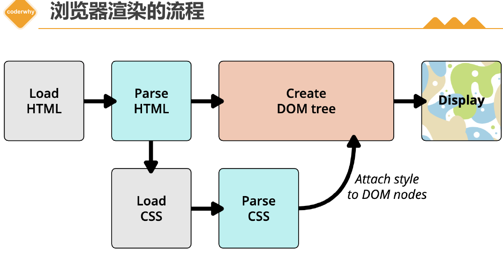
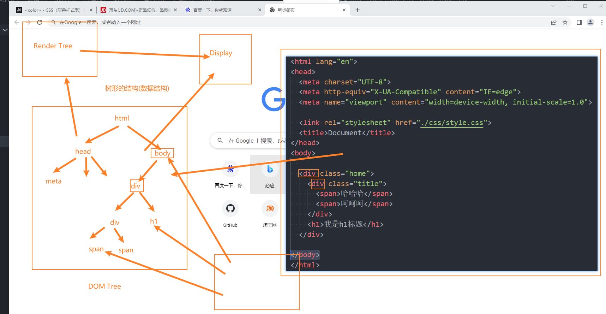
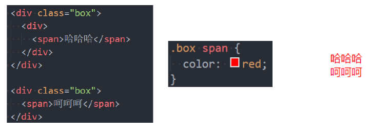

# CSS 基础入门

## 什么是 CSS?

1. **定义**: CSS (Cascading Style Sheets, 层叠样式表) 是一种为 HTML 或 XML 等结构化文档添加**样式**(如字体、颜色、布局)的语言。文件扩展名为 `.css`。

2. **核心功能**：

   - **样式控制**：设置字体、颜色、间距等视觉效果。
   - **布局管理**：通过 Flexbox、Grid 等实现响应式布局。
   - **意义**：实现结构与样式分离，提升代码可维护性。

3. **语法:**

```css
选择器 (Selector) {
  属性 (Property): 值 (Value); /* 这是一条声明 (Declaration) */
```

- **选择器**: 定位需要应用样式的 HTML 元素。
- **声明块**: 由 `{}` 包裹，包含一条或多条声明。
- **声明**: 由 `属性: 值;` 构成，指定样式属性及其值。

## CSS引入方式

在 HTML 中，可以通过三种方式插入 CSS 样式表：外部样式表、内部样式表和行内样式。

### 外部样式表

- 将 CSS 代码写在独立的 `.css` 文件中，然后通过 HTML `<link>` 元素引入。

  ```css
  <head>
    <link rel="stylesheet" href="mystyle.css">
  </head>
  ```

- 使用 `@import` 在 CSS 文件或 `<style>` 标签内导入其他 CSS 文件 （不推荐）

```css
<style>
  @import url('reset.css');
  @import url('layout.css');
</style>
```

> 推荐在 CSS 文件顶部使用 `@charset "UTF-8";` 指定文件编码。

#### `<link>`元素

- **作用** ：`<link>` 是 HTML 中用于链接外部资源的元素，最常见于加载外部样式表（CSS 文件）或站点图标（favicon）
- **常见属性** ：

  - `href`：指定被链接资源的 URL，支持绝对/相对路径。
  - `rel`：定义当前文档与 `href` 所链接资源之间的关系。常见取值包括：
    - `stylesheet`：表示外部样式表。
    - `icon`：表示站点图标（如网站的 favicon）。

#### `<link>`元素的其他用法

`<link>`元素不仅限于加载样式表，还可以通过不同的`rel`值实现性能优化功能：

- 资源预加载（`rel="preload"`）

  - **作用**：告知浏览器提前加载关键资源（如字体、图片、样式表），减少渲染阻塞。

  - `as`：声明资源类型（如 `style`、`script`、`font`、`image`）。


  ```html
  <link rel="preload" href="fonts/custom-font.css" as="style">
  ```

- 资源预取（`rel="prefetch"`）

  - **作用**：预取未来可能需要的资源（如下一页内容），优先级低于当前页面资源。


  ```html
  <link rel="prefetch" href="next-page.html">
  ```

- DNS 预解析（`rel="dns-prefetch"`）
  **作用**：提前解析域名的 IP 地址，缩短后续请求的 DNS 查询时间。适用于跨域资源。

- **示例**：优化 CDN 资源加载。

  ```html
  <link rel="dns-prefetch" href="https://cdn.example.com">
  ```

### 内部样式表

将 CSS 写在 HTML `<head>` 内的 `<style>` 标签中。适用于单个 HTML 页面的特定样式。


### 行内样式

直接在 HTML 元素的 `style` 属性中定义样式。

```CSS
<p style="color: red; margin-left: 10px;">...</p>
```

**优先级最高**，但破坏了结构与样式分离，**应避免滥用**。

### 多重样式优先级

- 当多个规则应用到同一元素时：

  1. **来源**: 行内样式 > 内部/外部样式 > 浏览器默认样式。
  2. **选择器权重**: ID (`#id`) > 类 (`.class`)/属性 (`[attr]`)/伪类 (`:hover`) > 元素 (`div`)/伪元素 (`::before`)。 `*` 通用选择器权重最低。
  3. **重要性**: `!important` 声明 > 普通声明。 (谨慎使用 `!important`)
  4. **顺序**: 同等优先级下，**后面定义的规则覆盖前面的**。

## CSS 颜色表示法

1. **关键字 (Keywords)**: `red`, `blue`, `transparent`, `lightgray` 等预定义名称。
2. **RGB / RGBA**:
   - `rgb(red, green, blue)`: 使用 0-255 的十进制整数表示红、绿、蓝分量。例: `rgb(255, 0, 0)` (红色)。
   - `rgba(R, G, B, A)`: 增加 Alpha 透明度 (0=透明, 1=不透明)。例: `rgba(255, 0, 0, 0.5)` (半透明红)。

3. **十六进制 (HEX / HEXA)**:
   - `#RRGGBB`: 使用两位十六进制数 (00-FF) 表示红、绿、蓝。例: `#FF0000` (红色)。
   - `#RGB`: 缩写形式，`#F00` 等同于 `#FF0000`。
   - `#RRGGBBAA`: 增加两位十六进制表示 Alpha 透明度。例: `#FF000080` (半透明红)。
   - `#RGBA`: 缩写形式，`#F008` 等同于 `#FF000088`。
4. **HSL 表示法**（色相、饱和度、亮度）：

- `hsl(H, S, L)`: H (0-360), S (0%-100%), L (0%-100%)。例: `hsl(0, 100%, 50%)` (红)。
- `hsla(H, S, L, A)`: 增加 Alpha 透明度。

## 浏览器的渲染流程

> 浏览器渲染的流程是指浏览器将通过网络接收的 HTML、CSS、JS 等资源转换为用户可见的页面的过程





1. **解析 HTML，构建 DOM 树**
   浏览器解析 HTML 文档，生成 **DOM** 树，同时加载外部资源（如 CSS、JS 文件）。

2. **解析 CSS，构建 CSSOM 树**
   解析 CSS 样式规则，生成 CSSOM 树，确定每个元素的样式信息。
3. **合并 DOM 和 CSSOM，生成渲染树**
   将 DOM 树与 CSSOM 树结合，生成渲染树，只包含需要显示的可见节点。
4. **布局（Layout/Reflow），计算几何信息**
   计算渲染树中每个节点的位置和大小，确定其在页面中的布局。
5. **绘制（Paint），生成像素信息**
   将渲染树中的节点转换为屏幕上的像素，按顺序绘制背景、边框、文本等内容。
6. **合成（Composite），显示最终页面**
   将多个绘制层合并，利用 GPU 加速生成最终图像并显示到屏幕上。

了解更多的浏览器渲染的细节和原理，可以参考以下的资源：

- [渲染页面：浏览器的工作原理 - Web 性能 | MDN](https://developer.mozilla.org/zh-CN/docs/Web/Performance/How_browsers_work)
- [现代浏览器的渲染流程 - 知乎](https://bing.com/search?q=浏览器渲染的流程)
- [浏览器知识点整理（七）渲染流程 - 掘金](https://juejin.cn/post/6975838644402094111)

**关键点**:

- HTML 和 CSS 解析通常是并行的。
- JavaScript 的执行可能会**阻塞** DOM 构建和 CSSOM 构建 (取决于 JS 的位置和 `async`/`defer` 属性)。
- Layout 和 Paint 是**开销较大**的操作。频繁触发 (如通过 JS 修改大量元素样式或尺寸) 会导致性能问题。应尽量避免不必要的**重排 (Reflow)** 和**重绘 (Repaint)**。

## CSS 选择器 (Selectors)

CSS 选择器用于根据一定规则选择 HTML 元素，并为其应用样式。常见的选择器种类包括：

- 通用选择器（Universal Selector）
- 元素选择器（Type Selector）
- 类选择器（Class Selector）
- ID 选择器（ID Selector）
- 属性选择器（Attribute Selector）
- 组合选择器（Combinator）
- 伪类（Pseudo-classes）
- 伪元素（Pseudo-elements）

### 通用选择器  (`*`)

```css
* { margin: 0; padding: 0;}
```

- 选中所有元素。
- 一般用来给所有元素作一些通用性的设置
  - 比如内边距、外边距;
  - 比如重置一些内容(因为浏览器会默认给很多元素 **添加默认样式** 比如 `<body>` 默认有 `margin:8px`)
  
- 谨慎用于全局重置，推荐使用 Normalize.CSS。

### 元素选择器

- 通过标签名（如 `div`）选中对应元素。

```css
div { font-size: 16px; }
```

### 类选择器 `.class`

使用 `.类名`

```css
.box { margin: 0 auto; }
```

### ID选择器 `#id`

通过唯一id选中单个元素（id在文档中不可重复，推荐用-或驼峰命名）

尽量少用

```css
#header { margin: 0 auto; }
```

### 属性选择器

```css
[title="box"] { color: blue; }
```

根据元素的属性和值选择元素。例如，选中所有`title="box"`的元素


### 后代选择器

- 选择某个元素的所有后代（包括直接和间接后代）

- 选择器之间以 **空格** 分割



### 子代选择器

- 必须是 **直接子代**
  
- 选择器之间以 `>` 分割


### 兄弟选择器

- **相邻兄弟选择器**  `+`：选择紧接在某元素后面的元素。


- **所有兄弟选择器**  `~`：选择某元素之后的所有兄弟元素。


### 选择器组

- **交集选择器: 需要同时符合两个选择器条件**

  - 两个选择器 **紧密连接**

  - 在开发中通常为了精确的选择某一元素


- **并集选择器: 符合一个选择器条件即可**

  - 两个选择器以 `,` 分割

  - 在开发中通常为了给多个元素设置相同的样式


### 伪类选择器

- 动态伪类：`:link`, `:visited`, `:hover`, `:active`, `:focus`

- 目标伪类：`:target`

- 语言伪类：`:lang()`

- 元素状态伪类：`:enabled`, `:disabled`, `:checked`

- 结构伪类

  - `:nth-child( )`、`:nth-last-child( )`、`:nth-of-type( )`、`: nth-last-
    of-type( )`

  - `:first-child`、`:last-child`、`:first-of-type`、`:last-of-type`

  - `:root`、`:only-child`、`:only-of-type`、`:empty`


- 否定伪类：`:not()`

### 伪元素选择器

- `:: after`  需设置 `content`
- `:: before`需设置 `content`
- `:: first-letter`
- `:: first-word`

---

## 伪类

伪类是添加到选择器上的关键字，以单冒号 (`:`) 开头，根据元素的**状态**或**在 DOM 中的位置**选择元素。

### 1. 动态伪类

- `:link`: 未访问的链接。
- `:visited`: 已访问的链接。
- `:hover`: 鼠标悬停。
- `:active`: 元素被激活 (如点击时)。
- `:focus`: 元素获得焦点 (常见于表单元素、链接)。

> 动态伪类 **编写顺序** 建议为:
>
> ```css
> :link,:visited,:focus,:hover,:active
> ```
>
> 记忆方法: `LVHA`
> 直接为元素（如 `a`）设置样式，会作为基础样式应用于所有状态

### 2. 结构伪类

这些伪类根据元素在 DOM 树中的位置和关系来选中元素。

- `:root`: 根元素 (`<html>`)。
- `:empty`: 内容为空的元素 (无子元素或文本)。

**基于位置**：

- `:first-child`: 选择其父元素下的**第一个**子元素。
- `:last-child`: 选择其父元素下的**最后一个**子元素。
- `:nth-child(n)`: 选择其父元素下的第 `n` 个子元素（不区分元素类型）。
- `:nth-last-child(n)`: 选择其父元素下的倒数第 `n` 个子元素（不区分元素类型）。
- `:only-child`: 选择是其父元素下**唯一**子元素的元素。

**基于类型和位置**：

- `:first-of-type`: 选择其父元素下**同类型中**的第一个子元素。
- `:last-of-type`: 选择其父元素下**同类型中**的最后一个子元素。
- `:nth-of-type(n)`: 选择其父元素下**同类型中**的第 `n` 个子元素。
- `:nth-last-of-type(n)`: 选择其父元素下**同类型中**的倒数第 `n` 个子元素。
- `:only-of-type`: 选择是其父元素下**同类型中唯一**的子元素。

> **`nth-child(n)` / `nth-of-type(n)` 中的 `n`**:
>
> - **整数**: `1`, `2`, `3`... (索引从 1 开始)。
> - **关键字**: `odd` (奇数位置), `even` (偶数位置)。
> - 可以是公式 `an+b` (a, b 为整数, n 从 0 开始递增)。例如:
>   - `2n`: 偶数位置 (选中第 2, 4, 6... 个)。
>   - `2n+1`: 奇数位置 (选中第 1, 3, 5... 个)。
>   - `n+3`: 选中第 3 个及之后的所有元素 (3, 4, 5...)。
>   - `-n+3`: 选中前 3 个元素 (3, 2, 1)。

### 3. **目标伪类**

- `:target`: 选择当前 URL 片段标识符（URL 中 `#` 后的部分，如 `example.com#section2`）所指向的具有对应 `id` 的元素。

### 4. UI 状态伪类

- `:enabled`: 可用**（未设置 `disabled` 属性）的表单元素。
- `:disabled`: 被禁用的表单元素。
- `:checked`: 被选中的复选框/单选按钮。
- `:required`: 选择设置了 `required` 属性的表单控件。
- `:optional`: 选择**未**设置 `required` 属性的表单控件。
- `:read-only`: 选择 `readonly` 属性被设置的元素。
- `:read-write`: 选择非 `readonly` 的元素。

### 5. 否定伪类

- `:not(selector)`: 选择**不**匹配括号内简单选择器 (`selector`) 的所有元素。`selector` 不能是伪元素或另一个否定伪类。
  - 例如：`input:not([type="submit"])` 选择所有非提交按钮的 `<input>` 元素。
  - 示例：`:not(p)` 选择所有非 `<p>` 元素。


## 伪元素

以双冒号 (`::`) 开头，选择元素的**特定部分**或在元素**内容前后插入生成内容**，它们在表现上如同真实元素，但**不在 DOM 树中**。

### 常见的伪元素有

- `::before`: 在选中元素的**内容之前**插入一个虚拟子元素。必须配合 `content` 属性使用。

- `::after`: 在选中元素的**内容之后**插入一个虚拟子元素。必须配合 `content` 属性使用。

```css
.item::before {
  content: "• "; /* 插入项目符号 */
  color: gray;
}
/* 清除浮动常用技巧 */
.clearfix::after {
  content: "";
  display: block;
  clear: both;
  height: 0; /* 可选，兼容旧浏览器 */
  visibility: hidden; /* 可选 */
}
```

- `::first-line`: 选择元素内容的第一行文本。

- `::first-letter`: 选择元素内容的第一个字母。

```css
p::first-letter {
  font-size: 2em;
  float: left; /* 常见首字下沉效果 */
  margin-right: 4px;
}
```

- **`::selection`**: 用户选中的文本部分。
- **`::placeholder`**: 表单输入框的占位符文本。

**注意**：

- `::before` 和 `::after` 创建的是**行内 (inline)** 元素，常需设置 `display` (如 `block`, `inline-block`) 才能调整尺寸、边距等。

- `content` 属性是必须的，即使值是空字符串 `""`。
