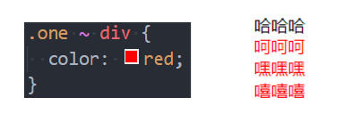
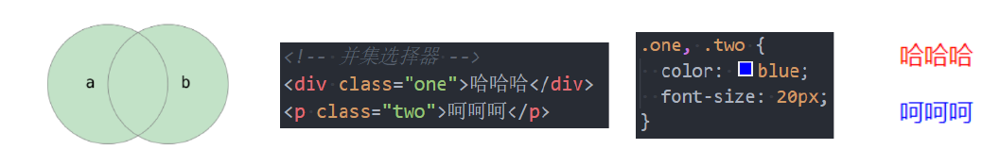

## 什么是 CSS?

1. **定义**：CSS（Cascading Style Sheets，层叠样式表）是一种用于为结构化文档（如HTML或XML）添加样式的语言，文件扩展名为.css。

2. **核心功能**：

   - **样式控制**：为HTML元素设置字体、颜色、间距、阴影等视觉效果。

   - **布局管理**：通过浮动、Flexbox、Grid等工具实现页面结构和响应式设计。

​	**意义**：实现HTML结构与样式的分离，提升代码可维护性与复用性。

3. 语法:

```css
选择器 {
  属性: 值;
}
```


## CSS引入方式

在 HTML 中，可以通过三种方式插入 CSS 样式表：外部样式表、内部样式表和行内样式。

### 外部样式表

- 将 css 样式编写一个单独的 css 文件,通过`<link>`元素引入

  ```css
  <head>
    <link rel="stylesheet" href="mystyle.css">
  </head>
  ```

- 使用 `@import` 导入其他 CSS 文件 

  除了 `<link>`，还可以在 `<style>` 标签或外部 CSS 文件中使用 `@import` 导入其他 CSS 文件： 


```css
<style>
  @import url('reset.css');
  @import url('layout.css');
</style>
```

#### `<link>`元素

- **作用** ：`<link>` 是 HTML 中用于链接外部资源的元素，常用于加载样式表或站点图标。
- **常见属性** ：

  - `href`：指定被链接资源的 URL，可以是绝对路径或相对路径。

  - `rel`：定义链接类型，常见的值包括：
    - `stylesheet`：表示外部样式表。
    - `icon`：表示站点图标（favicon）。

  - `type`：指定资源的 MIME 类型（可选，默认为 `text/css`）。

### 内部样式表

- 将 CSS 放在`<head>`元素里的`<style>`元素里

  ```css
  <head>
    <style>
      hr { color: sienna; }
      p { margin: 20px; }
    </style>
  </head>
  ```

### 行内样式

行内样式是直接在 HTML 标签中使用 `style` 属性定义样式。这种方式优先级最高，但不推荐大量使用，因为它会破坏结构与样式的分离原则。

```CSS
<p style="color:sienna;margin-left:20px">这是一个段落。</p>
```

### 多重样式优先级

**详细规则：** 

- **按来源** ：行内样式 > 内部样式 > 外部样式 > 浏览器默认样式。
- **按选择器权重** ：`id 选择器 > class 选择器 > 元素选择器`。
- **同权重时** ：后定义的样式覆盖先定义的样式。

> **注意** ：浏览器默认字体大小为 `16px`。 

## RGB 的表示方法

RGB 是一种颜色模型，通过红（Red）、绿（Green）、蓝（Blue）三种颜色的不同组合来表示颜色。每种颜色的取值范围为 `0-255` 或 `0%-100%`。

1. **十进制表示法**：

   ```css
   color: rgb(255, 0, 0); /* 红色 */
   color: rgb(0, 255, 0); /* 绿色 */
   color: rgb(0, 0, 255); /* 蓝色 */
   ```

2. **十六进制表示法**：

   ```css
   color: #FF0000; /* 红色 */
   color: #00FF00; /* 绿色 */
   color: #0000FF; /* 蓝色 */
   ```

3. **RGBA 表示法**（带透明度）：

   ```css
   color: rgba(255, 0, 0, 0.5); /* 半透明红色 */
   ```

4. **HSL 表示法**（色相、饱和度、亮度）：

   ```css
   color: hsl(0, 100%, 50%); /* 红色 */
   ```

## 浏览器的渲染流程

> 浏览器渲染的流程是指浏览器将通过网络接收的 HTML、CSS、JS 等资源转换为用户可见的页面的过程


1. **解析 HTML，构建 DOM 树** 
   浏览器解析 HTML 文档，生成 **DOM** 树，同时加载外部资源（如 CSS、JS 文件）。 

2. **解析 CSS，构建 CSSOM 树** 
   解析 CSS 样式规则，生成 CSSOM 树，确定每个元素的样式信息。 
3. **合并 DOM 和 CSSOM，生成渲染树** 
   将 DOM 树与 CSSOM 树结合，生成渲染树，只包含需要显示的可见节点。 
4. **布局（Layout/Reflow），计算几何信息** 
   计算渲染树中每个节点的位置和大小，确定其在页面中的布局。 
5. **绘制（Paint），生成像素信息** 
   将渲染树中的节点转换为屏幕上的像素，按顺序绘制背景、边框、文本等内容。 
6. **合成（Composite），显示最终页面** 
   将多个绘制层合并，利用 GPU 加速生成最终图像并显示到屏幕上。 

了解更多的浏览器渲染的细节和原理，可以参考以下的资源：

- [渲染页面：浏览器的工作原理 - Web 性能 | MDN](https://developer.mozilla.org/zh-CN/docs/Web/Performance/How_browsers_work)
- [现代浏览器的渲染流程 - 知乎](https://bing.com/search?q=浏览器渲染的流程)
- [浏览器知识点整理（七）渲染流程 - 掘金](https://juejin.cn/post/6975838644402094111)

## 选择器

CSS 选择器用于根据一定规则选择 HTML 元素，并为其应用样式。常见的选择器种类包括： 

- 通用选择器（Universal Selector）
- 元素选择器（Type Selector）
- 类选择器（Class Selector）
- ID 选择器（ID Selector）
- 属性选择器（Attribute Selector）
- 组合选择器（Combinator）
- 伪类（Pseudo-classes）
- 伪元素（Pseudo-elements）

### 通用选择器  (`*`)

```css
* {
    margin: 0;
    padding: 0;
}
```

- 选中所有元素。
- 一般用来给所有元素作一些通用性的设置
  - 比如内边距、外边距;
  - 比如重置一些内容(因为浏览器会默认给很多元素 **添加默认样式** 比如 `<body>` 默认有 `margin:8px`)
  

### 元素选择器

- 通过标签名（如 `div`）选中对应元素。

```css
div { font-size: 16px; }
```

### 类选择器 `.class`

使用 `.类名`

```css
.box {
  margin: 0 auto; 
}
```

### ID选择器 `#id`

通过唯一id选中单个元素（id在文档中不可重复，推荐用-或驼峰命名）

```css
#header { margin: 0 auto; }
```

### 属性选择器

```css
[title="box"] {
  color: blue;
}
```

根据元素的属性和值选择元素。例如，选中所有`title="box"`的元素


### 后代选择器

- 选择某个元素的所有后代（包括直接和间接后代）

- 选择器之间以 **空格** 分割


### 子代选择器

- 必须是 **直接子代**
  
- 选择器之间以 `>` 分割


### 兄弟选择器

- **相邻兄弟选择器**  `+`：选择紧接在某元素后面的元素。


- **所有兄弟选择器**  `~`：选择某元素之后的所有兄弟元素。



### 选择器组

- **交集选择器: 需要同时符合两个选择器条件**

  - 两个选择器 **紧密连接**

  - 在开发中通常为了精确的选择某一元素


- **并集选择器: 符合一个选择器条件即可**

  - 两个选择器以 `,` 分割

  - 在开发中通常为了给多个元素设置相同的样式




### 伪类选择器

```css
:link	:visited :hover	:focus :active	/*动态伪类*/
target	/*目标伪类*/
lang()	/*语言伪类*/
/*元素状态伪类*/
:enabled、:disabled、:checked

/*结构伪类*/
- :nth-child( )、:nth-last-child( )、:nth-of-type( )、:nth-last-of-type( )
- :first-child、:last-child、:first-of-type、:last-of-type
- :root、:only-child、:only-of-type、:empty

/*否定伪类*/
:not()
```


### 伪元素选择器

- :: after
- :: before
- :: first-letter
- :: first-word


---

# 伪类

## 什么是伪类

伪类是选择器的一种，以单冒号（:）开头，用于选中处于特定状态或位置的元素。部分伪类支持参数。

## 常见的伪类

- 动态伪类：`:link`, `:visited`, `:hover`, `:active`, `:focus`

- 目标伪类：`:target`

- 语言伪类：`:lang()`

- 元素状态伪类：`:enabled`, `:disabled`, `:checked`

- 结构伪类

  - `:nth-child( )`、`:nth-last-child( )`、`:nth-of-type( )`、`: nth-last-
    of-type( )`

  - `:first-child`、`:last-child`、`:first-of-type`、`:last-of-type`

  - `:root`、`:only-child`、`:only-of-type`、`:empty`


- 否定伪类：`:not()`

### 1. 动态伪类

#### 使用举例

- `a:link` **未访问** 的链接
- `a:visited` **已访问** 的链接

- `a:hover` 鼠标挪动 **悬停** 到链接上
- `a:active` 激活的链接(**鼠标在链接上长按住未松开**)

#### 使用注意

- `:hover` 必须放在 `:link` 和 `:visited` 后面才能完全生效
- `:active` 必须放在 `:hover` 后面才能完全生效
- 所以建议的编写顺序是 `:link`, `:visited`, `:hover`, `:active`

除了 a 元素, `:hover`, `:active` 也能用在其他元素上

#### :focus

`:focus` **指当前拥有输入焦点的元素**(能接受键盘输入)

- 文本输入框一聚焦后, 背景就会变红色

- 因为链接 a 元素可以被键盘的 Tab 键选中聚焦, 所以 `:focus` 也适用于 a 元素

动态伪类 **编写顺序** 建议为:

```css
:link,:visited,:focus,:hover,:active
```

记忆方法: `LVHA`

**直接给 a 元素设置样式, 相当于给 a 元素的所有动态伪类都设置了**

- 相当于 `a:link`、`a:visited`、`a:hover`、`a:active`、`a:focus` 的 color 都是 red

### 2. 结构伪类

#### 2.1 : nth-child

- `:nth-child(1)` 是父元素中的第一个 **子元素**
- `:nth-child(2n)`
  - n 代表任意 **正整数** 和 **0**
  - 是父元素中的第偶数个子元素（第 2，4，6，8…个）
  - 跟 `nth-child(even)` 同义
- `:nth-child(2n+1)`
  - n 代表任意正整数和 0
  - 是父元素中的第奇数个子元素（第 1，3，5，7）
  - 和 `:nth-child(odd)` 同义

- `nth-child(-n+2)`
  - 代表前 2 个子元素
  

#### 2.2 : nth-last-child( )

- `:nth-last-child()` 的语法跟 `:nth-child()` 类似，不同点是 `:nth-last-child()` 从最后一个子元素开始往前计数

  - : nth-last-child(1), 代表倒数第一个子元素

  - : nth-last-child(-n + 2), 代表最后 2 个子元素

#### 2.3 nth-of-type() : nth-last-of-type()

- `:nth-of-type()` 用法跟 `:nth-child()` 类似
  - 不同点是: nth-of-type()计数时只计算同种类型的元素

- `:nth-last-of-type()` 用法跟 `:nth-of-type()` 类似
  - 不同点是 `:nth-last-of-type()` 从最后一个这种类型的子元素开始往前计数


下面的伪类偶尔会使用：

- `:root` 根元素，就是 HTML 元素
- `:empty` 代表里面完全空白的元素

### 3. 否定伪类（negation pseudo-class）

- `:not()` 的格式是 `:not(x)`
  
  - `x` 是一个简单选择器
  - 元素选择器、通用选择器、属性选择器、类选择器、伪类（除否定伪类）
- `:not(x)` 表示除 `x` 以外的元素


## 伪元素

伪元素以双冒号（::）开头，用于选择元素的特定部分或生成虚拟内容，不影响DOM结构。

常见的伪元素有：

1. **:: before：** 在选中的元素 **之前插入内容**。通常用于添加一些额外的装饰或内容。

   ```css
   p::before {  /*交集选择器*/
     content: "前缀: ";
   }
   ```

2. **:: after：** 在选中的元素 **之后插入内容**。也通常用于添加额外的内容或装饰。

   ```css
   p::after { /*交集选择器*/
     content: " 后缀";
   }
   ```

3. **:: first-line：** 选择元素的 **第一行**。可以用于设置首行的样式。

   ```css
   p::first-line {
     font-weight: bold;
   }
   ```

4. **:: first-letter：** 选择元素的 **第一个字母**。可以用于设置首字母的样式。

   ```css
   .box::first-letter { /*交集选择器*/
     font-size: 150%;
   }
   ```


- **content属性**：::before和::after必须定义，否则无效。

- **显示模式**：默认inline，需设置display（如block）以调整宽高。

- **应用场景**：装饰性内容（如图标）、清除浮动等。

### 伪元素的应用

- 可以应用在给一段文字前后添加东西, 尤其是添加的东西相同重复

- 位置微调可以用相对定位


**总结：**  

- 伪元素用于选择元素的特定部分（如插入内容、装饰第一个字母等），而伪类用于选择处于特定状态的元素（如悬停、获得焦点等）。
- 伪类和伪元素在开发中非常常见，能有效增强页面的交互性和视觉效果。

  

示例：在一串文字的后面添加个 8*8 的方格

```css
.box::after {
  content: ""; /* 不可省略 */
  width: 8px;
  height: 8px;
  background-color: #f00;
  display: inline-block; /* 行内元素需转为inline-block以设置宽高 */
}
```

```html
<div class="box">这是一串可爱的文字</div>
    
```

