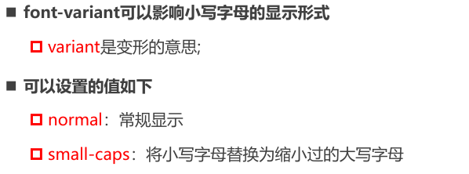
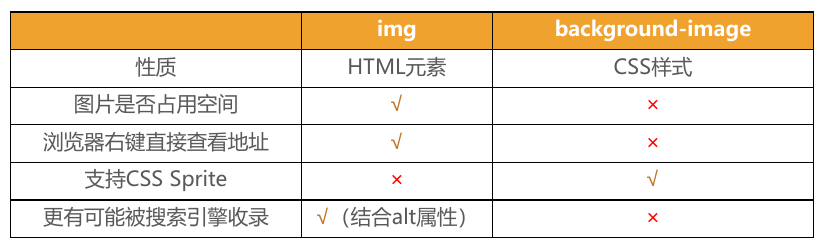

# 文本 - 字体 - 背景



## CSS文本的属性

### text-decoration

- `text-decoration`用于设置文字的**装饰线**
  
  - `decoration`是装饰/装饰品的意思;
  
- `text-decoration`有如下常见取值:

  - `none`:无任何装饰线

      - **可以去除a元素默认的下划线**

  - `underline`:下划线
  
  - `overline`:上划线

  - `line-through:`中划线(删除线)
  
      
    

> `<a>`元素有下划线的**本质**是**被默认添加**了`text-decoration: underline`属性


### text-transform

`text-transform`用于设置文字的**大小写转换**

Transform:使变形/变换(形变)


` text-transform`有几个常见的值:

- `capitalize`：(使...**首字母大写**, **资本化**的意思)将每个单词的**首字符变为大写**

- `uppercase`:(**大写**字母)将每个单词的所有字符变为大写
- `lowercase`:(**小写**字母)将每个单词的所有字符变为小写
- `none`:没有任何影响

### text-indent

- `text-indent`用于设置第一行内容的缩进(**首行缩进**)
- `text-indent: 2em;` 刚好是缩进2个文字
- `em`:相对于字体的大小
- `rem`

### text-align*

- 定义**行内内容**(例如文字)如何相对它的**块父元素**对齐*

- 常用的值
  - `left`:左对齐
  - `right`:右对齐
  - `center`:正中间显示
  - `justify`:两端对齐

  

- 也可以让**图片以及其他东西**居中(**仅针对行元素,不针对块元素**)*

```css
/*让div在.block盒子里居中*/
<style>
    .block{
      background-color:#f00;
      height:300px;
      text-align:center;
        /*在这里需要注意如果仅有align的话,是居中不了的,因为text-align只针对于行元素,所以需要把块元素转换为行内块元素*/
    }
    .block>div{
      background-color: rgb(0,255,0);
      height:200px;
      width:200px;
      display:inline-block;/*转换为行内块元素*/
    }
  </style>
</head>
<body>
  <div class="block">
    <div></div>
  </div>
</body>
```

### text-shadow

- `text-shadow`用法类似于box-shadow,用于给文字添加阴影效果
  - `<shadow>`的常见格式如下
  - 相当于`box-shadow`, 它没有`spread-radius`的值;

[通过该网站测试文字阴影](https://html-css-js.com/css/generator/box-shadow/)

### letter-spacing、word-spacing

- 分别用于设置字母、单词之间的间距
  - 默认是`0`,可以设置为负数

## CSS字体的属性

### font-size*

- 字体大小

- 默认的文本大小是**16px**

- 字体设置的方式
  - 具体**数值+单位**
  
  - **方式一**:比如100px
  
  - **方式二**:使用`em`单位(不推荐),**倍数**,1em代表100%,2em代表200%,基于**父元素**的`font-size`计算
  
  - **方式三**:百分比
  
    ​	基于**父元素**的`font-size`计算,比如50%表示等于font-size的一半

### font-family

- `font-family`用于设置文字的**字体名称**
	- 可以设置1个或者**多个字体**名称;
	- 浏览器会选择**列表中第一个**该计算机上有安装的字体;
	- 或者是通过 `@font-face`指定的可以直接下载的字体。

### font-weight*

- `font-weight`用于设置文字的**粗细**

- 常见的取值:
	- 100 | 200 | 300 | **400** | 500 | 600 | **700** | 800 | 900 :每一个数字表示一个重量
	- `normal`:等于**400**
	- `bold`:等于**700**
	- `strong`、`b`、`h1~h6`等标签的font-weight默认就是bold

### line-height*

- line-height用于设置文本的**行高**
  - **行高**可以先简单理解为**一行文字所占据的高度**


- **行高**的严格定义:两行文字**基线(baseline)之间的间距**
- 基线(`baseline`):与小写字母**x最底部对齐**的线
- 行距:第一行的**底线**到第二行的**顶线**之间的距离叫行距
- **行高 = 基线之间的距离**
- 行高 - 字体的高度 = 行距

`line-height`-字体的高度 = 行距

**行距是上下等分**的,可以利用这个特性,使**文本**在容器内**垂直居中**


> 注意区分`height`和`line-height`的区别:
>
> - `height`:元素的整体高度
> - `line-height`:元素中每一行文字所占据的高度
>
> 

应用实例：假设div中只有一行文字，如何让这行文字在div内部垂直居中

- 让`line-height`等同于`height`就能垂直居中了


### font-style

- `font-style`用于设置文字的**常规、斜体显示**
  - `normal`:常规显示
  - `italic`(**斜体**):用**字体的斜体**显示(文字本身支持斜体时现实的斜体)
  - `oblique`(倾斜):文本**倾斜**显示(仅仅是让文字倾斜)
- em、i、cite、address、var、dfn等元素的font-style默认就是`italic`

### font-variant




### font缩写属性*

- **font**是一个**缩写**属性
	
	- **font** 属性可以用来作为 `font-style`, `font-variant`, `font-weight`,` font-size,` `line-height`和 `font-family`属性的简写;
	- **顺序**:`font-style` `font-variant` `font-weight` `font-size/line-height` `font-family`
- 规则:
	- `font-style`、`font-variant`、`font-weight`可以随意**调换顺序**,也可以**省略**
	- `/line-height`可以省略,如果不省略,必须跟在`font-size`**后面**
	- `font-size`、`font-family`不可以调换顺序,不可以省略
	
	```css
	font :italic 700 30px/1.5 Microsoft YaHei SC,arial,...
	```
	
	> 在网页设置字体颜色可以设置#333而不是#000，网页里字体一般没有那么黑
	
	

让文本单行显示超出的部分用省略号显示：

```css
white-space: nowrap;	/*不换行*/
overflow: hidden; 
text-overflow: ellipsis;
```

- `overflow: hidden;` 用于隐藏超出元素的文本
- `text-overflow: ellipsis;` 用于在文本溢出时显示省略号
- `white-space: nowrap;` 用于让文本不换行

让文本多行显示，超出的部分用省略号显示：

```css
overflow: hidden; 
text-overflow: ellipsis;
display: -webkit-box;
-webkit-line-clamp: 2; /*数值可改变*/
-webkit-box-orient: vertical;
```

## CSS背景的属性

> 设置background-color属性的是盒模型的内容和内边距部分。也就是说，背景色会填充content区域和padding区域，背景色也会设置到`border`下面

### background-image

- `background-image`用于设置元素的**背景图片**
  	- 会盖在(**不是覆盖**)`background-color`的上面
  
- 如果设置了多张图片
     - 设置的第一张图片将显示在最上面,其他图片按顺序层叠在下面
     
> 注意:如果设置了背景图片后, 元素**没有**具体的**宽高**, 背景图片是不会显示出来的

###  background-repeat

- `background-repeat`用于设置背景图片是否要**平铺**
- 常见的设值有
	- `repeat`:平铺, 默认值
	- `no-repeat`:不平铺
	- `repeat-x`:只在水平方向平铺
	- `repeat-y`:只在垂直平方向平铺


### background-size

- background-size用于设置背景图片的大小
  - `auto`:默认值, 以背景图本身大小显示
  - `cover`:缩放背景图,以完全覆盖铺满元素,可能背景图片部分看不见
  - `contain`:缩放背景图,宽度或者高度铺满元素,但是图片保持宽高比
  - `<percentage>`:百分比,相对于背景区(background positioning area)
  - `length`:具体的大小,比如100px

###  background-position

- `background-position`用于设置背景图片在**水平、垂直方向**上的具体位置/起始位置
  - 可以设置具体的数值 比如 20px 30px;
  - 水平方向还可以设值:left、center、right
  - 垂直方向还可以设值:top、center、bottom
  - 如果只设置了1个方向,另一个方向默认是center


### background-attachment

`background-attachment`决定背景图像的位置是在视口内固定,或者随着包含它的区块滚动。

可以设置以下3个值

- `scroll`:此关键属性值表示背景相对于元素本身固定, 而不是随着它的内容滚动（默认值）
- `local`:此关键属性值表示背景相对于元素的内容固定。如果一个元素拥有滚动机制,背景将会随着元素的内容滚动.
- `fixed`:此关键属性值表示背景**相对于视口**固定。即使一个元素拥有滚动机制,背景也不会随着元素的内容滚动。

### background缩写属性

background是一系列背景相关属性的简写属性

background简写方式:

```
background: [background-color] [background-image] [background-repeat] [background-attachment] [background-position] / [background-size] [background-origin] [background-clip]
```

> 注意：
background-size可以省略,如果不省略, `/background-size`必须紧跟着background-position出现，以 / 分割
其他属性顺序任意,不设置取默认值

> 大部分网站都是灰色背景`#f5f5f5`

### background-image和img对比

- 利用background-image和img都能够实现显示图片的需求,在开发中该如何选择?



总结

- `img`, 作为网页内容的重要组成部分,比如广告图片、LOGO图片、文章配图、产品图片
- `background-image`, 可有可无。有, 能让网页更加美观。无, 也不影响用户获取完整的网页内容信息

## cursor

可以设置鼠标指针（光标）在元素上面的显示样式

- `auto`：浏览器根据上下文自己决定指针的样式，比如根据文本和非文本切换指针样式
- `default`：由操作系统决定，一般就是一个小箭头
- `pointer`：一只小手，鼠标指针挪动到链接上的默认样式
- `text`：竖线。在文本上的默认样式
- `none`：没有任何指针显示在元素上面

