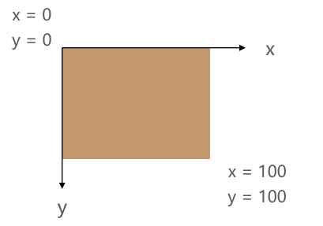

# 文本 - 字体 - 背景

## CSS 文本的属性

### text-decoration

- `text-decoration` 用于设置文字的 **装饰线**
  
  - `decoration` 是装饰/装饰品的意思;
  
- 常见取值：

  - `none`: 无装饰线（可去除 `<a>` 元素的默认下划线）。
  - `underline`: 下划线。
  - `overline`: 上划线。
  - `line-through`: 中划线（删除线）。
  
    

> `<a> ` 元素的下划线是由于默认添加了 text-decoration: underline 属性。

### text-transform

- `text-transform` 用于设置文字的 **大小写转换**
  - Transform: 使变形/变换(形变)

- 常见取值：
  - `capitalize`: 每个单词的首字母大写。
  - `uppercase`: 所有字符转换为大写。
  - `lowercase`: 所有字符转换为小写。
  - `none`: 无影响。

### text-indent

- `text-indent` 用于设置第一行内容的缩进(**首行缩进**)
- `text-indent: 2em;` 刚好是缩进 2 个文字
- `em` 单位相对于当前字体大小。可以使用 `rem` 单位，基于根元素字体大小。

### text-align*

- 定义 **行内内容**(例如文字)如何相对它的 **块父元素** 对齐*

- 常用的值
  - `left`: 左对齐
  - `right`: 右对齐
  - `center`: 正中间显示
  - `justify`: 两端对齐

  > 注意：`text-align` 主要应用于行内元素。如果需要将块元素居中，通常需要将块元素的 `display` 设置为 `inline-block`。

- 也可以让 **图片以及其他东西** 居中(**仅针对行元素, 不针对块元素**)*

```css
/*让div在.block盒子里居中*/
<style>
    .block{
      background-color:#f00;
      height:300px;
      text-align:center;
        /*在这里需要注意如果仅有align的话,是居中不了的,因为text-align只针对于行元素,所以需要把块元素转换为行内块元素*/
    }
    .block>div{
      background-color: rgb(0,255,0);
      height:200px;
      width:200px;
      display:inline-block;/*转换为行内块元素*/
    }
  </style>
</head>
<body>
  <div class="block">
    <div></div>
  </div>
</body>
```

### text-shadow

`text-shadow` 用于为文本添加阴影效果，类似于 `box-shadow`。

- `<shadow>` 的常见格式如下

```css
text-shadow: horizontal-offset vertical-offset blur-radius color;
```


- 相当于 `box-shadow`, 它没有 `spread-radius` 的值;

```css
text-shadow: 2px 2px 5px rgba(0, 0, 0, 0.3);
```


[通过该网站测试文字阴影](https://html-css-js.com/css/generator/box-shadow/)

### letter-spacing、word-spacing

- 分别用于设置字母、单词之间的间距
  - 默认是 `0`, 可以设置为负数

## CSS 字体的属性

### font-size

- `font-size` 用于设置字体大小，默认值为 **16px** 。

- 设置方式
  
  - **具体数值 + 单位**（如 `px`、`em`）。
  
  - **`em` 单位**：相对于父元素的字体大小。
  
  - **`rem` 单位**：相对于根元素的字体大小。
  
  - **百分比**：基于父元素的 `font-size`，如 `50%` 为父元素字体大小的一半。
  

### font-family

- `font-family` 用于设置文字的 **字体名称**
	- 可以设置 1 个或者 **多个字体** 名称;
	- 浏览器会选择 **列表中第一个** 该计算机上有安装的字体;
	- 或者是通过 `@font-face` 指定的可以直接下载的字体。

### font-weight*

- `font-weight` 用于设置文字的 **粗细**

- 常见取值：
	
	- 数值：100 | 200 | 300 | **400**  | 500 | 600 | **700**  | 800 | 900。
	- `normal`: 等于 **400** 。
	- `bold`: 等于 **700** 。
	
	- `strong`、`b`、`h1~h6` 等标签的 font-weight 默认就是 bold

### line-height

- `line-height` 用于设置行高（即行间距）。
  - **行高** 可以先简单理解为 **一行文字所占据的高度**


- **行高** 的严格定义: 两行文字 **基线(baseline)之间的间距**
- 基线(`baseline`): 与小写字母 **x 最底部对齐** 的线
- 行距: 第一行的 **底线** 到第二行的 **顶线** 之间的距离叫行距
- **行高 = 基线之间的距离**
- 行高 - 字体的高度 = 行距

`line-height`-字体的高度 = 行距

**行距是上下等分** 的, 可以利用这个特性, 使 **文本** 在容器内 **垂直居中**


> 注意区分 `height` 和 `line-height` 的区别:
>
> - `height`: 元素的整体高度
> - `line-height`: 元素中每一行文字所占据的高度
>
> 

应用实例：假设 div 中只有一行文字，如何让这行文字在 div 内部垂直居中

- 让 `line-height` 等同于 `height` 就能垂直居中了


### font-style

- `font-style` 用于设置文字的 **常规、斜体显示**
  - `normal`: 常规显示
  - `italic`(**斜体**): 用 **字体的斜体** 显示(文字本身支持斜体时现实的斜体)
  - `oblique`(倾斜): 文本 **倾斜** 显示(仅仅是让文字倾斜)
- em、i、cite、address、var、dfn 等元素的 font-style 默认就是 `italic`

### font-variant

- `font-variant` 可以影响小写字母的显示形式
  - `variant` 是变形的意思；
- 可以设置的值如下
  - `normal`: 常规显示
  - `small-caps`: 将小写字母替换为缩小过的大写字母

### font 缩写属性*

- **font** 是一个 **缩写** 属性
	
	- **font** 属性可以用来作为 `font-style`, `font-variant`, `font-weight`, ` font-size,` `line-height` 和 `font-family` 属性的简写;
	- **顺序**: `font-style` `font-variant` `font-weight` `font-size/line-height` `font-family`
- 规则:
	- `font-style`、`font-variant`、`font-weight` 可以随意 **调换顺序**, 也可以 **省略**
	- `/line-height` 可以省略, 如果不省略, 必须跟在 `font-size` **后面**
	- `font-size`、`font-family` 不可以调换顺序, 不可以省略
	
	```css
	font :italic 700 30px/1.5 Microsoft YaHei SC,arial,...
	```
	
	> 在网页设置字体颜色可以设置#333 而不是#000，网页里字体一般没有那么黑
	
	

让文本单行显示超出的部分用省略号显示：

```css
white-space: nowrap;	/*不换行*/
overflow: hidden; 
text-overflow: ellipsis;
```

- `overflow: hidden;` 用于隐藏超出元素的文本
- `text-overflow: ellipsis;` 用于在文本溢出时显示省略号
- `white-space: nowrap;` 用于让文本不换行

让文本多行显示，超出的部分用省略号显示：

```css
overflow: hidden; 
text-overflow: ellipsis;
display: -webkit-box;
-webkit-line-clamp: 2; /*数值可改变*/
-webkit-box-orient: vertical;
```

## CSS 背景的属性

> 设置 background-color 属性的是盒模型的内容和内边距部分。也就是说，背景色会填充 content 区域和 padding 区域，背景色也会设置到 `border` 下面

### background-image

- `background-image` 用于设置元素的 **背景图片**
  	- 会盖在(**不是覆盖**)`background-color` 的上面
  
- 如果设置了多张图片
     - 设置的第一张图片将显示在最上面, 其他图片按顺序层叠在下面
     
> 注意: 如果设置了背景图片后, 元素 **没有** 具体的 **宽高**, 背景图片是不会显示出来的

###  background-repeat

- `background-repeat` 用于设置背景图片是否要 **平铺**
- 常见的设值有
	- `repeat`: 平铺, 默认值
	- `no-repeat`: 不平铺
	- `repeat-x`: 只在水平方向平铺
	- `repeat-y`: 只在垂直平方向平铺



### background-size

- background-size 用于设置背景图片的大小
  - `auto`: 默认值, 以背景图本身大小显示
  - `cover`: 缩放背景图, 以完全覆盖铺满元素, 可能背景图片部分看不见
  - `contain`: 缩放背景图, 宽度或者高度铺满元素, 但是图片保持宽高比
  - `<percentage>`: 百分比, 相对于背景区(background positioning area)
  - `length`: 具体的大小, 比如 100px

###  background-position

- `background-position` 用于设置背景图片在 **水平、垂直方向** 上的具体位置/起始位置
  - 可以设置具体的数值 比如 20px 30px;
  - 水平方向还可以设值: left、center、right
  - 垂直方向还可以设值: top、center、bottom
  - 如果只设置了 1 个方向, 另一个方向默认是 center


### background-attachment

`background-attachment` 决定背景图像的位置是在视口内固定, 或者随着包含它的区块滚动。

可以设置以下 3 个值

- `scroll`: 此关键属性值表示背景相对于元素本身固定, 而不是随着它的内容滚动（默认值）
- `local`: 此关键属性值表示背景相对于元素的内容固定。如果一个元素拥有滚动机制, 背景将会随着元素的内容滚动.
- `fixed`: 此关键属性值表示背景 **相对于视口** 固定。即使一个元素拥有滚动机制, 背景也不会随着元素的内容滚动。

### background 缩写属性

`background` 是多个背景属性的简写。

background 简写方式:

```
background: [background-color] [background-image] [background-repeat] [background-attachment] [background-position] / [background-size] [background-origin] [background-clip]
```

> 注意：
background-size 可以省略, 如果不省略, `/background-size` 必须紧跟着 background-position 出现，以 / 分割
其他属性顺序任意, 不设置取默认值

> 大部分网站都是灰色背景 `#f5f5f5`

### background-image 和 img 对比

- 利用 background-image 和 img 都能够实现显示图片的需求, 在开发中该如何选择?

| 性质                   | img              | background-image |
| ---------------------- | ---------------- | ---------------- |
| 图片是否占用空间       | √                | ×                |
| 浏览器右键直接查看地址 | √                | ×                |
| 支持CSS Sprite         | ×                | √                |
| 更有可能被搜索引擎收录 | √（结合alt属性） | ×                |

总结

- `img`, 作为网页内容的重要组成部分, 比如广告图片、LOGO 图片、文章配图、产品图片
- `background-image`, 可有可无。有, 能让网页更加美观。无, 也不影响用户获取完整的网页内容信息

## cursor

可以设置鼠标指针（光标）在元素上面的显示样式

- `auto`：浏览器根据上下文自己决定指针的样式，比如根据文本和非文本切换指针样式
- `default`：由操作系统决定，一般就是一个小箭头
- `pointer`：一只小手，鼠标指针挪动到链接上的默认样式
- `text`：竖线。在文本上的默认样式
- `none`：没有任何指针显示在元素上面

