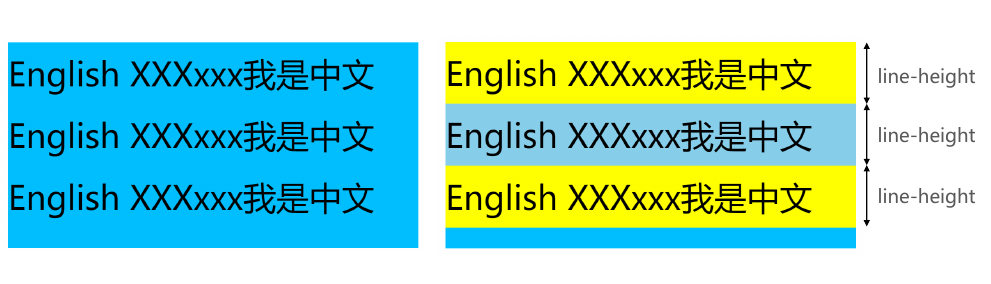
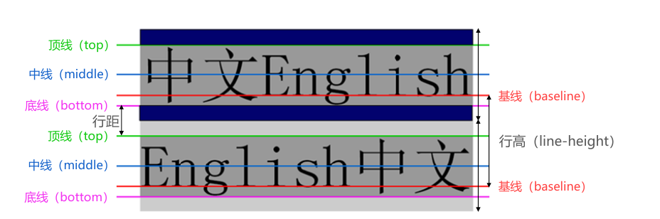
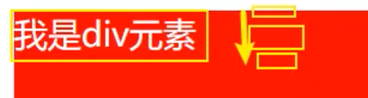
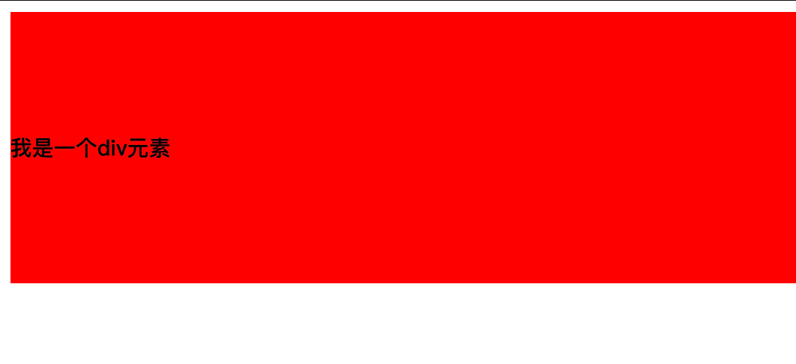
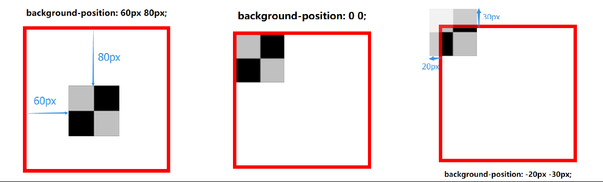

# CSS 属性详解

## CSS 文本的属性

### text-decoration

- `text-decoration` 用于为文本添加**装饰线**。
  
  - `decoration` 是装饰/装饰品的意思;
  
- 常见取值：

  - `none`: 无装饰线（可去除 `<a>` 元素的默认下划线）。
  - `underline`: 下划线。
  - `overline`: 上划线。
  - `line-through`: 中划线（删除线）。
  


> **注意**：<a> 标签默认带有 text-decoration: underline，可以通过 text-decoration: none 取消。

### text-transform

`text-transform` 用于设置文字的 **大小写转换**

- Transform: 使变形/变换(形变)

常见取值：

- `capitalize`：每个单词的首字母大写（如 "hello world" → "Hello World"）。
- `uppercase`：所有字符转换为大写（如 "hello" → "HELLO"）。
- `lowercase`：所有字符转换为小写（如 "HELLO" → "hello"）。
- `none`：不进行任何转换，保持原始状态。

### text-indent

- `text-indent` 用于设置第一行内容的缩进(**首行缩进**)
- `text-indent: 2em;` 刚好是缩进 2 个文字
- `em` 单位相对于当前字体大小。可以使用 `rem` 单位，基于根元素字体大小。
- `text-indent` 支持负值，可实现悬挂缩进（如 `text-indent: -2em;`），但需注意父容器的溢出处理。

### text-align*

- 定义**行内内容**（如文本、图片等）相对于其**块级父元素**的对齐方式。

- 常用的值
  - `left`: 左对齐
  - `right`: 右对齐
  - `center`: 正中间显示
  - `justify`: 两端对齐（常用于报纸排版，浏览器会调整单词间距）

  > **注意事项**：
  >
  > - 仅对行内元素或 inline-block 元素生效
  > - 若需将块级元素（如 div）居中，需结合 display: inline-block 和父元素的 text-align: center
  > - 直接对 div 设置 text-align: center 不会让 div 本身居中，只会影响其内容。
  
- 也可以让 **图片以及其他东西** 居中(**仅针对行元素, 不针对块元素**)*

```css
/*让div在.block盒子里居中*/
<style>
    .block{
      background-color:#f00;
      height:300px;
      text-align:center;
        /*在这里需要注意如果仅有align的话,是居中不了的,因为text-align只针对于行元素,所以需要把块元素转换为行内块元素*/
    }
    .block>div{
      background-color: rgb(0,255,0);
      height:200px;
      width:200px;
      display:inline-block;/*转换为行内块元素*/
    }
  </style>
</head>
<body>
  <div class="block">
    <div></div>
  </div>
</body>
```

### text-shadow

`text-shadow` 用于为文本添加阴影效果，类似于 `box-shadow`。

- 语法格式

```css
text-shadow: horizontal-offset vertical-offset blur-radius color;
```

- `horizontal-offset`：水平偏移量（正值向右，负值向左）。
- `vertical-offset`：垂直偏移量（正值向下，负值向上）。
- `blur-radius`：模糊半径（可选，值越大越模糊）。
- `color`：阴影颜色（如 rgba(0, 0, 0, 0.3) 表示带透明度的黑色）。

相比于 `box-shadow`, 它没有 `spread-radius` 的值;
**特点**：相比 box-shadow，无 spread-radius（扩展半径）参数。

```css
p {
  text-shadow: 2px 2px 5px rgba(0, 0, 0, 0.3); /* 水平2px，垂直2px，模糊5px */
}
```


[通过该网站测试文字阴影](https://html-css-js.com/css/generator/box-shadow/)

### letter-spacing、word-spacing

- 分别用于设置字母、单词之间的间距
  - 默认是 `0`, 可以设置为负数

###  white-space

`white-space` 属性用于定义文本中空白的处理方式及换行规则：

- `normal`：合并所有连续空白字符，允许文本超出容器宽度时自动换行。
- `nowrap`：合并所有连续空白字符，禁止文本超出容器宽度时自动换行。
- `pre`：保留所有连续空白字符，禁止文本超出容器宽度时自动换行。
- `pre-wrap`：保留所有连续空白字符，允许文本超出容器宽度时自动换行。
- `pre-line`：合并所有连续空白字符（但保留换行符），允许文本超出容器宽度时自动换行。

### text-overflow

`text-overflow` 属性用于指定文本溢出容器时的显示行为：

- **clip**：直接裁剪溢出内容（可能导致字符显示不完整）。
- **ellipsis**：在溢出行的末尾显示省略号（...）。

**使用条件与搭配**：

- `text-overflow` 生效的前提是 `overflow` 属性值不为 `visible`。

- 通常与 `white-space` 和 `overflow` 属性配合使用，例如：

  ```css
  white-space: nowrap;
  overflow: hidden;
  text-overflow: ellipsis;
  ```

  实现单行文本溢出时显示省略号的常见效果。

## CSS 字体的属性

### font-size

- `font-size` 用于设置字体大小，默认值为 **16px** 。

- 设置方式
  
  - **具体数值 + 单位**（如 `px`、`em`）。
  
  - **`em` 单位**：相对于父元素的字体大小。
  
  - **`rem` 单位**：相对于根元素的字体大小。
  
  - **百分比**：基于父元素的 `font-size`，如 `50%` 为父元素字体大小的一半。
  

### font-family

- `font-family` 用于设置文字的 **字体名称**
  - 支持设置多个字体，按顺序依次尝试（如`"Arial", "Helvetica", sans-serif`）。
  - 浏览器优先使用列表中第一个用户设备已安装的字体。
  - 可结合 @font-face 引入在线字体。
  - 应在字体列表末尾指定通用字体族（如 `sans-serif`），确保回退机制生效。

### font-weight*

- `font-weight` 用于设置文字的 **粗细**

- 常见取值：
	
 	- 数值：100 | 200 | 300 | **400**  | 500 | 600 | **700**  | 800 | 900。
 	- `normal`: 等于 **400** 。
 	- `bold`: 等于 **700** 。
	
 	- `strong`、`b`、`h1~h6` 等标签的 font-weight 默认就是 bold

### line-height

- `line-height` 用于设置行高（即行间距）。
  - **行高** 可以先简单理解为 **一行文字所占据的高度**



- **行高** 的严格定义: 两行文字 **基线(baseline)之间的间距**
- 基线(`baseline`): 与小写字母 **x 最底部对齐** 的线
- 行距: 第一行的 **底线** 到第二行的 **顶线** 之间的距离叫行距
- **行高 = 基线之间的距离**
- 行高 - 字体的高度 = 行距

`line-height`-字体的高度 = 行距

`line-height` 可使用无单位值（如 `1.5`），表示相对于当前字体大小的倍数。例如，`font-size: 16px; line-height: 1.5;` 实际行高为 `24px`。

**行距是上下等分** 的, 可以利用这个特性, 使 **文本** 在容器内 **垂直居中**



> 注意区分 `height` 和 `line-height` 的区别:
>
> - `height`: 元素的整体高度
> - `line-height`: 元素中每一行文字所占据的高度
>
> 

应用实例：假设 div 中只有一行文字，如何让这行文字在 div 内部垂直居中

- 让 `line-height` 等同于 `height` 就能垂直居中了



### font-style

`font-style` 用于设置文字的 **常规、斜体显示**

- `normal`：常规显示。
- `italic`：斜体，使用字体的内置斜体样式（需字体支持）。
- `oblique`：倾斜，通过 CSS 强制倾斜文本（即使字体无斜体样式）。

注意：em、i、cite、address、var、dfn 等元素的 font-style 默认就是 `italic`

### font-variant

- `font-variant` 可以影响小写字母的显示形式
  - `variant` 是变形的意思；
- 可以设置的值如下
  - `normal`: 常规显示
  - `small-caps`: 将小写字母替换为缩小的大写字母

### font 缩写属性

- **font** 是一个 **缩写** 属性
	
 	- **font** 属性可以用来作为 `font-style`, `font-variant`, `font-weight`, `font-size,` `line-height` 和 `font-family` 属性的简写;
 	- **顺序**: `font-style` `font-variant` `font-weight` `font-size/line-height` `font-family`
- 规则:
 	- `font-style`、`font-variant`、`font-weight` 可以随意 **调换顺序**, 也可以 **省略**
 	- `/line-height` 可以省略, 如果不省略, 必须跟在 `font-size` **后面**
 	- `font-size`、`font-family` 不可以调换顺序, 不可以省略
	
	```css
	p {
	  font: italic 700 16px/1.5 "Arial", sans-serif; /* 斜体、粗体、16px字号、1.5倍行高 */
	}
	```
	
	> 技巧：在网页设置字体颜色可以设置#333 而不是#000，网页里字体一般没有那么黑
	

## CSS 背景的属性

> 设置 background-color 属性的是盒模型的内容和内边距部分。也就是说，背景色会填充 content 区域和 padding 区域，背景色也会设置到 `border` 下面

### background-image

- `background-image` 用于设置元素的 **背景图片**
 	- 会盖在(**不是覆盖**)`background-color` 的上面
  
- 支持多张图片，语法为 `background-image: url('img1.jpg'), url('img2.jpg');`，第一张图片显示在最上层。

> 注意: 如果设置了背景图片后, 元素 **没有** 具体的 **宽高**, 背景图片是不会显示出来的

```css
div {
  background-image: url('background.jpg');
  width: 200px;
  height: 200px;
}
```

### background-repeat

`background-repeat` 用于设置背景图片是否要**平铺**

取值

- `repeat`：水平和垂直方向平铺（默认）。
- `no-repeat`：不平铺。
- `repeat-x`：仅水平平铺。
- `repeat-y`：仅垂直平铺。


### background-size

background-size 用于设置背景图片的大小

- auto：默认值，保持图片原始大小
- cover：缩放图片以覆盖整个元素，可能部分被裁剪
- contain：缩放图片以完全显示，保持宽高比，可能留有空白
- 具体值：如 100px(宽) 200px(高)
- 百分比：如 50% 50%，相对于元素尺寸

### background-position

`background-position` 用于设置背景图片在 **水平、垂直方向** 上的具体位置/起始位置

- 具体值：如 20px 30px（水平偏移 20px，垂直偏移 30px）。
- 关键字：水平（left、center、right），垂直（top、center、bottom）。
- 若只指定一个值，另一轴默认为 center。



### background-attachment

`background-attachment` 控制背景图像的位置是固定在视口内，还是随包含它的元素滚动。可选值如下：

- `scroll（默认）`: 背景相对于元素本身固定，不随内容滚动。
- `local`: 背景相对于元素内容固定，若元素可滚动，背景会随内容移动。
- `fixed`: 背景相对于视口固定，即使元素可滚动，背景位置保持不变。

### background 缩写属性

`background` 是多个背景属性的简写。

background 简写方式:

```
background: [background-color] [background-image] [background-repeat] [background-attachment] [background-position] / [background-size] [background-origin] [background-clip]
```

> 注意：
background-size 可以省略, 如果不省略, `/background-size` 必须紧跟着 background-position 出现，以 / 分割
其他属性顺序任意, 不设置取默认值

> 大部分网站都是灰色背景 `#f5f5f5`

### background-image 和 img 对比

- 利用 background-image 和 img 都能够实现显示图片的需求, 在开发中该如何选择?

| 性质                   | img              | background-image |
| ---------------------- | ---------------- | ---------------- |
| 图片是否占用空间       | √                | ×                |
| 浏览器右键直接查看地址 | √                | ×                |
| 支持CSS Sprite         | ×                | √                |
| 更有可能被搜索引擎收录 | √（结合alt属性） | ×                |

总结

- **img**：适用于内容核心图片（如 LOGO、产品图）。
- **background-image**：适用于装饰性图片（如背景图、图标）。

## cursor

**cursor** 设置鼠标指针在元素上的**光标样式**。

- `auto`：浏览器根据上下文自动选择（如文本上为 text，链接上为 pointer）。
- `default`：默认箭头样式。
- `pointer`：小手形状，常用于可点击元素。
- `text`：文本输入光标（竖线）。
- `none`：隐藏光标。
