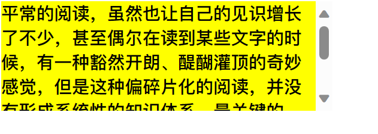

# 继承、层叠与元素类型

**定义**：
继承是指 HTML 元素的某些 CSS 属性值可以传递给其后代元素。如果后代元素没有明确设置该属性，则会使用从父元素继承来的值。

**特点**:

* **默认继承**: 只有部分和文本字体相关的属性默认具有继承性。
* **优先级**: 元素自身设置的样式 > 从父元素继承的样式（无论父元素选择器权重多高）。

* **常见可继承属性** ：通常与字体、文本相关的属性（如 `font-family`, `color`, `text-align` 等）都具有继承性。
* **控制继承**：

  * `inherit`：强制元素继承其父元素的该属性值（即使该属性默认不继承）。
  * `initial`：将属性重置为 CSS 规范定义的该属性的初始（默认）值。
  * `unset`：如果属性默认可继承，则等同于 `inherit`；否则等同于 `initial`。

  * **判断方法**：查阅 MDN 等 CSS 文档或使用浏览器开发者工具（通常在“Computed”或“Styles”面板中会标明 "Inherited from..."）。

## CSS 层叠 (Cascading)与优先级

当多个CSS规则应用到同一个元素时，“层叠”机制决定哪个规则生效。

生效规则：

同一属性被多个选择器设置时，仅一个样式生效：

1. **选择器权重**：权重高的选择器优先。
2. **书写顺序**：权重相同时，后定义的选择器覆盖先定义的。
3. **样式来源**：优先级顺序为：
   * 内联样式（`style` 属性） > `<style>` 标签 > 外部样式表（`<link>`）。

### 选择器的权重

| 选择器类型                                      | 权重（示例） |
| ----------------------------------------------- | ------------ |
| `!important`                                    | ∞ (最高)     |
| 内联样式 (`style="..."`)                        | 1000         |
| ID 选择器 (`#id`)                               | 100          |
| 类 (`.class`), 属性 (`[type]`), 伪类 (`:hover`) | 10           |
| 元素 (`div`), 伪元素 (`::before`)               | 1            |
| 通配符 (`*`), 继承的值                          | 0            |

* **权重计算**：累加各类选择器的权重。例如：

  * `#id .class div`：`100 (ID) + 10 (类) + 1 (元素) = 111`
  * `.class1 .class2 p`：`10 + 10 + 1 = 21`
* **示例**：

  ```html
  <p class="content" style="color: green;">文本</p>
  ```

  ```css
  p { color: red; }                /* 权重 1 */
  .content p { color: blue; }      /* 权重 10 + 1 = 11 */
  /* 最终颜色为 green，因为内联样式权重 1000 最高 */
  ```

> **注意** ：`!important` 的优先级最高，但应尽量避免滥用，因为它会破坏正常的层叠规则，增加调试难度。

## HTML 元素类型

HTML 元素本身没有固有的“块级”或“行内”之分。其在页面上的布局行为（如是否独占一行、能否设置宽高）主要由 CSS 的 `display` 属性决定。浏览器会为大部分 HTML 元素提供默认的 `display` 值（例如 `<div>` 默认为 `block`，`<span>` 默认为 `inline`）。

* **块级元素（Block-level）** ：
  * **特征** ：独占一行，可以设置宽高，默认宽度为父容器的 100%。
  * **常见标签** ：`<div>`、`<p>`、`<h1>-<h6>`、`<ul>`、`<ol>`。
* **行内元素（Inline-level）** ：
  * **特征** ：多个元素可以在同一行显示，不能直接设置宽高，宽高由内容决定。
  * **常见标签** ：`<span>`、`<a>`、`<strong>`。
* **行内替换元素（Inline-replaced）** ：
  * **特征** ：行内显示但可设置宽高，尺寸常由外部资源决定。
  * **常见标签** ：``, `<input>`, `<textarea>`, `<select>`, `<button>`, `<video>`, `<canvas>`, `<iframe>`, `<object>`, `<embed>`。

## CSS 属性 - display

`display` 属性用于定义元素的显示方式，通过它可以改变元素在页面中的布局行为。常见的值及其作用如下：

* `block`：显示为块级元素，独占一行，可设置宽高，默认宽度 100%。
* `inline`：显示为行内元素，宽高由内容决定，无法直接设置。
* `inline-block`：结合了行内和块级元素的特性：对外表现为行内，但内部结构遵循块级规则，允许设置宽高。
* `flex`：启用**弹性布局 (Flexbox)**，用于一维布局（行或列）。容器变为 Flex 容器，子元素变为 Flex 项目。
* `grid`：启用**网格布局 (Grid)**，用于二维布局（行和列）。容器变为 Grid 容器，子元素变为 Grid 项目。
* `none`：隐藏元素，从文档流移除，不占空间，其后代元素也会被隐藏。

> **块级 vs. 行内 核心区别总结**：
>
>* **布局**：块级独占一行，行内共享一行。
>* **尺寸**：块级可设宽高，行内通常不可设（宽高由内容定）。
>* **内外边距**：块级上下左右 `margin`/`padding` 均有效；行内仅左右 `margin`/`padding` 影响水平布局，上下 `padding` 可能视觉上有效但通常不影响行高和周围元素，上下 `margin` 无效。

`width` 和 `height` 改变的是 `content` 的宽高, 所以即使改变 **块元素** 的 `width` 和 `height`, **块元素也独占一行**

### display值的特性

* **block 元素** ：
  * 独占父元素的一行。
  * 可以随意设置宽高，默认高度由内容决定。
  * 默认宽度为父容器的 100%。
* **inline-block 元素** ：
  * 跟其他行内级元素在同一行显示。
  * 可以随意设置宽高。
  * 对外表现为行内元素，对内表现为块级元素。
* **inline 元素** ：
  * 跟其他行内级元素在同一行显示。
  * 不可以随意设置宽高，宽高由内容决定。

> ### 行内替换元素
>
> 某些特殊的 HTML 元素既是行内元素，又是**行内替换元素** ，如 ``、`<input>`、`<video>` 等。它们具有以下特性：
>
> 1. **行内显示** ：与其他行内元素在同一行显示。
> 2. **可设置宽高** ：可以通过 `width` 和 `height` 属性调整尺寸。
> 3. **内在尺寸** ：这些元素通常有默认的固有尺寸（如图片的原始宽高）。如果不指定宽高，它们会按照其内在尺寸显示。
>
> > **什么是行内替换元素？**  
> >
> > 行内替换元素的内容不受当前文档样式的影响，而是由外部资源决定（如图片、视频等）。CSS 只能影响这些元素的位置或外观（如 `object-fit` 和 `object-position`），但无法改变其内容本身。
> >
> > **典型行内替换元素** ：
> >
> > * ``：图片
> > * `<input>`：表单输入框
> > * `<iframe>`：嵌入式框架
> > * `<video>`、`<audio>`：多媒体元素
> > * `<canvas>`、`<embed>`、`<object>`：其他嵌入式内容

## 隐藏元素的方法

1. **`display: none`** ：
   * 元素完全从文档流中移除，不占据任何空间，相当于不存在。
2. **`visibility: hidden`** ：
   * 元素不可见，但仍保留原本的空间。
   * 默认值 `visible` 表示可见。
3. **透明度设置** ：
   * `background-color: rgba(0, 0, 0, 0);` 或 `color: transparent;`: 使背景或文字颜色透明，**不影响** 子元素或其他属性，元素本身结构仍在。
   * **`opacity`** ：设置整个元素的透明度，会影响所有子元素。

> `opacity` 影响子元素透明度，`rgba` 仅作用于指定颜色属性，子元素不受影响。

## 设置透明度

1. `rgba` 设置透明度, 将 `a` 的值设置为 0
     * 可选值: 0~1, 0 透明, 1 是不透明
     * 十六进制写法: `#ff000000` 透明 `,#ff0000ff` 不透明
     * rgba 的 a 设置的是 alpha 值, 可以设置 **透明度**,
     * **不影响子元素**
2. **`opacity`**：
     * 设置整个元素的透明度，如 `opacity: 0.5;`（半透明）。
     * 影响所有子元素。

**区别**：

* `rgba`：仅影响指定颜色属性（如背景色），子元素不受影响。
* `opacity`：影响整个元素及其后代。

## 内容溢出处理 (`overflow`)

`overflow` 属性用于控制当元素内容超出其指定的尺寸（容器的"内容盒子"）时应如何处理。

| 值        | 行为描述                                                     |
| --------- | ------------------------------------------------------------ |
| `visible` | 默认值，内容不裁剪，可超出容器显示。                         |
| `hidden`  | 裁剪溢出内容，超出部分不可见，不显示滚动条。                 |
| `scroll`  | 裁剪溢出内容，总是显示滚动条（即使内容未超出，也会占用空间）。 |
| `auto`    | **仅在内容溢出时** 自动显示滚动条。                          |

> **注意**：`scroll` 滚动条区域占用 `width` 和 `height` 空间。



## CSS 样式为什么不生效

1. **选择器问题**:
    * 选择器权重（Specificity）不够高，被其他规则覆盖。
    * 选择器本身错误（拼写、层级关系等），未选中目标元素。
2. **属性或值错误**:
    * 属性对当前元素类型无效（如给 `display: inline` 的元素设置 `width`）。
    * 属性名或值拼写错误，或使用了浏览器不支持的属性/值。
    * 被简写属性覆盖（如 `font` 会覆盖 `font-size`）。
3. **语法错误**: 缺少分号 `;`、花括号 `{}` 未闭合等。
4. **文件问题**: CSS 文件未正确链接或加载失败（检查路径、网络）。

**调试技巧**: **优先使用浏览器开发者工具 (F12)**：

* **Elements/元素面板**: 检查元素、查看应用的样式、识别覆盖规则。
* **Computed/计算样式面板**: 查看最终生效的样式值及其来源。
* **Console/控制台**: 查看可能的加载错误或 CSS 解析错误。
