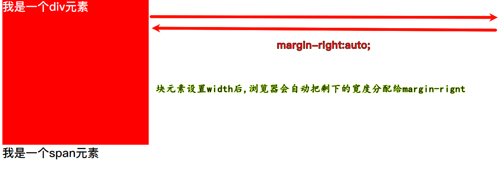
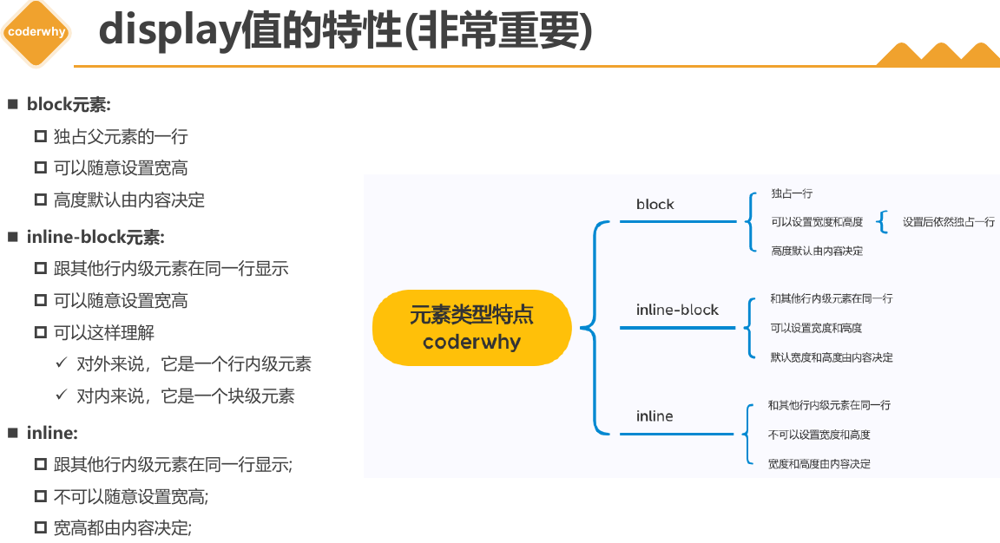

# 继承-层叠-类型

## CSS 属性的继承

- CSS 的 **某些** 属性具有 **继承性**(`Inherited`)：
  - 如果一个属性具备 **继承性**, 那么在该元素上设置后, 它的 **后代元素** 都可以 **继承** 这个属性
  - 当然, 如果后代元素自己有设置该属性, 那么优先使用后代元素自己的属性(不管继承过来的属性权重多高)
  - ==一般和字体, 文本相关的属性都可以继承==
  
  

- 强制继承：`inherit` 表示 **强制继承** 父元素的属性值，即使该属性本身 **不是可继承的**。（很少用）

## CSS 属性的层叠

- 层叠: 对于一个元素来说, 相同一个属性我们可以通过不同的选择器给它进行多次设置;

- 那么属性会被一层层 **覆盖上去**;

- 但是 **最终只有一个会生效**;

- 那么多个样式属性覆盖上去, 哪一个会生效呢?
  - 判断一: 选择器的权重（优先级）, 权重大的生效, 根据权重可以判断出 **优先级**
  - 判断二: 先后顺序, 权重相同时, **后面设置** 的生效;

### 选择器的权重

- CSS 权重由选择器类型决定。以下是常见选择器的权重等级： 

  | 选择器类型                                                   | 权重  |
  | ------------------------------------------------------------ | ----- |
  | `!important`                                                 | 10000 |
  | 内联样式（`style` 属性）                                     | 1000  |
  | ID 选择器（`#id`）                                           | 100   |
  | 类选择器、属性选择器、伪类（`.class`、`[type="text"]`、`:hover`） | 10    |
  | 元素选择器、伪元素（`div`、`h1`、`::before`）                | 1     |
  | 通配符（`*`）                                                | 0     |

  - 权重值的计算方式是：从左到右逐级累加。例如，一个规则 `#id .class div` 的权重是 `100 + 10 + 1 = 111`。 

| 选择器                                    | 千位 | 百位 | 十位 | 个位 | 优先级 |
| ----------------------------------------- | ---- | ---- | ---- | ---- | ------ |
| `h1`                                      | 0    | 0    | 0    | 1    | 0001   |
| `h1 + p::first-letter`                    | 0    | 0    | 0    | 3    | 0003   |
| `li > a[href*="en-US"] > .inline-warning` | 0    | 0    | 2    | 2    | 0022   |
| `#identifier`                             | 0    | 1    | 0    | 0    | 0100   |
| 内联样式                                  | 1    | 0    | 0    | 0    | 1000   |

## HTML 元素的类型

为了区分哪些元素需要独占一行, 哪些元素不需要独占一行, HTML 将元素区分(本质是通过 CSS 样式的)成

- **块级元素** （Block-level） 
  - 特征：独占一行，可设置宽高
  - 常见：`
`、`
`、`<h1>-<h6>`、`<ul>`、`<ol>`
- **行内元素** （Inline-level） 
  - 特征：多个元素在同一行显示，不可直接设置宽高
  - 常见：``、`<a>`、`<strong>`
- **行内替换元素**  
  - 特征：可设置宽高，行内显示
  - 常见：``、`<input>`、`<video>`

## 通过 CSS 修改元素类型

- 事实上元素没有本质的区别:

  - div 是块级元素, span 是行内级元素;

  - div 之所以是块级元素仅仅是因为浏览器默认设置了 display 属性而已;

可以通过 display 来改变元素的特性

## CSS 属性 - display*

◼ CSS 中有个 display 属性, 能修改元素的显示类型, 有 4 个常用值

- `block`: 让元素显示为块级元素
- `inline`: 让元素显示为行内级元素
- `inline-block`: 让元素同时具备行内级、块级元素的特征
- `none`: **隐藏元素**

> 行元素和块元素的区别:
>
> - **块元素**: 独占一行, 可以设置宽高, 高由内容决定
>
> - **行元素**: 和其它行元素排列在一行, 不可以设置宽高, 宽高都由内容决定

`width` 和 `height` 改变的是 `content` 的宽高, 所以即使改变 **块元素** 的 `width` 和 `height`, **块元素也独占一行**

> `` 元素既是个行元素, 也是个 **行内替换元素**, 所以可以设置宽高
>
> 行内替换元素:
>
> 1. 和其他的行元素在同一行显示
> 2. 可以设置高度和宽度
>
> > **行内替换元素是一种在 CSS 中，其展现效果不是由 CSS 来控制的元素。** 这些元素是一种外部对象，它们的内容不受当前文档的样式的影响。 CSS 可以影响行内替换元素的位置，但不会影响到它们自身的内容。 典型的行内替换元素有：``、`<input>`、`<iframe>`、`<video>`、`<embed>`、`<canvas>`、`<audio>`、`<object>` 等。 行内替换元素一般有内在尺寸，所以具有 width 和 height 属性，可以设定。 例如你不指定 `` 的 width 和 height 时，就按其内在尺寸显示，也就是图片被保存的时候的宽度和高度 2。 行内替换元素可以使用一些 CSS 属性来控制它们的内容在其框中的位置或定位方式，例如 object-fit 和 object-position。

## 编写 HTML 时的注意事项

- **块级元素**、`inline-block` 元素
 	- 一般情况下, 可以包含其他 **任何元素**(比如块元素、行元素、`inline-block` 元素)
 	- **特殊** 情况: **`
` 元素不能包含其他块级元素**(如 `
` 元素里不能放 `
` 元素, 会出现 bug)*
- **行元素**(比如 `<a>`、``、`<strong>` 等)
 	- 只能包含行内级元素
 	- 不能放块元素

## 隐藏元素的方法

1. `display` 设置为 `none`
     - 元素不显示出来, 从文档流中移除，并且也 **不占据位置, 不占据任何空间(和不存在一样)**
2. `visibility` 设置为 `hidden`
     - 翻译为: **可见度**
     - 设置为 `hidden`, 虽然元素 `不可见`, 但是会 **占据** 元素应该占据的 **空间**;
     - 默认为 visible, 元素是可见的

通过设置背景颜色透明(opacity)来隐藏:

## 设置透明度

1. `rgba` 设置透明度, 将 `a` 的值设置为 0
     - 可选值: 0~1, 0 透明, 1 是不透明
     - 十六进制写法: `#ff000000` 透明 `,#ff0000ff` 不透明
     - rgba 的 a 设置的是 alpha 值, 可以设置 **透明度**,
     - **不影响子元素**
2. `opacity` 设置透明度, 设置为 0
     - 设置整个元素的透明度, 会 **影响所有的子元素**;

> `rgba` 和 `opacity` 设置透明度时候的区别
>
> - `opacity` 设置后会对他子级的 **所有内容** 设置透明度 `rgba` 只会对颜色或背景色造成影响，并且子级 **不会继承透明效果**
> - rgba 可以设置在 `background-color`，`color`，`border-color`，`text-shadow`，`box-shadow`
> - 例如给一个盒子设置 `opacity` 为 0.3，如果那个盒子下面有输入字的话，那么 **字也会变透明**，rgba 则不会

## 元素溢出控制 

`overflow` 属性 

`overflow` 用于 **控制内容溢出时的行为**

- `visible`: 溢出的内容照样可见
- `hidden`: 溢出的内容 **直接裁剪**
- `scroll`: 溢出的内容被裁剪, 但可以通过滚动机制查看
  - 会 **一直显示滚动条区域(横向和纵向）,** 滚动条区域占用的空间属于 `width`、`height`

- `auto`: **根据内容是否溢出自动决定是否显示滚动条。**

## CSS 样式为什么不生效

当编写的 CSS 样式 **不管用** 的时候, 可能是下面几种问题:

- 选择器的 **优先级太低**

- 选择器 **没选中对应的元素**
  - 比如输错类名

- CSS 属性的使用形式不对
  - **元素不支持** 此 CSS 属性, 比如 span 默认是不支持 width 和 height 的

  - **浏览器不支持** 此 CSS 属性, 比如旧版本的浏览器不支持一些 css module3 的某些属性

  - 被同类型的 CSS 属性 **覆盖**, 比如 font 覆盖 font-size

充分利用浏览器的开发者工具进行调试(增加、修改样式)、查错
