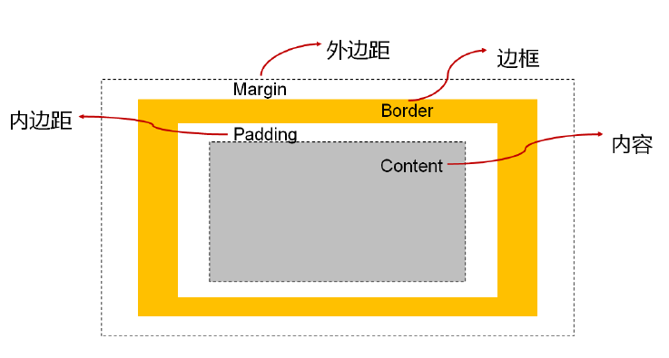

# 盒模型

## 盒子模型

CSS 将每个 HTML 元素视为一个矩形“盒子”，由四部分构成：

1. **内容（Content）** ：元素的实际内容区域，由 `width` 和 `height` 控制。
2. **内边距（Padding）** ：内容与边框之间的空白区域，用于调整内容与边框的间距。
3. **边框（Border）** ：包围内边距和内容的边界线，用于分隔或装饰。
4. **外边距（Margin）** ：元素与其他元素之间的间距，用于布局控制。


由于盒子具有四个方向，`padding`、`border` 和 `margin` 都可以分别设置 `top`（上）、`right`（右）、`bottom`（下）、`left`（左)四个属性：


## 内容（Content） – 宽度与高度

内容区域的大小由 `width` 和 `height` 属性控制：

- **注意**：行内非替换元素（如 `<span>`、`<a>`）无法通过 `width` 和 `height` 设置尺寸，其大小由内容自适应决定。
- **范围约束**：
  - `min-width` / `min-height`：设置最小宽度/高度，防止元素过小。
  - `max-width` / `max-height`：限制最大宽度/高度，常用于响应式设计，防止内容溢出或元素过大。
- 块级元素默认 `width: auto`，会自动填满父容器宽度。

**示例**：在响应式设计中，限制图片宽度以适配移动端：

```css
img {
  max-width: 100%; /* 不超过容器宽度 */
  height: auto;   /* 保持宽高比 */
  display: block; /* 可选，避免下方多余空隙 */
}
```

这确保图片宽度不超过容器，同时保持最小尺寸以避免过小。

## 内边距（Padding）

内边距是内容与边框之间的空白区域，用于增加内部空间，提升视觉舒适度。

- **单方向设置**：`padding-top`、`padding-right`、`padding-bottom`、`padding-left`。

- **缩写 (顺时针: 上 右 下 左)**:
  
  - `padding: 10px;` (四边)
  - `padding: 10px 20px;` (上下, 左右)
  - `padding: 10px 20px 15px;` (上, 左右, 下)
  - `padding: 10px 20px 15px 5px;` (上, 右, 下, 左)
  
  - `padding: 10px 20px 15px 5px;` (上 10px, 右 20px, 下 15px, 左 5px)
  
- **特性**：
  
  - 背景颜色或背景图片会**延伸**到内边距区域。
  - **不支持负值**：内边距只能为正值或零。
  - **溢出处理**：若内容超出内边距范围，受 `overflow` 属性控制（如 `overflow: hidden`）。

## 边框（Border）

包围内容和内边距的线条。

- **组成**: 宽度 (`border-width`)、样式 (`border-style`)、颜色 (`border-color`)。
- **样式**: `solid` (实线), `dashed` (虚线), `dotted` (点线), `double` (双线), `none` (无边框) 等。
- **颜色**: 默认继承元素的 `color` 属性值。`transparent` 可创建透明边框。
- **缩写**: `border: <width> <style> <color>;` (如 `border: 1px solid black;`)。顺序可变，但 `style` 是必需的。
- **单边设置**: `border-top`, `border-right`, `border-bottom`, `border-left` (也可单独设置宽度、样式、颜色，如 `border-top-style: dashed;`)。
- 边框会增加元素的视觉尺寸（在 `content-box` 模型下）。


- **边框的默认颜色** ：如果没有指定颜色，边框颜色会继承元素的 `color` 属性。

> 利用边框可以创建各种 CSS 图形，例如三角形。
>
> <https://css-tricks.com/the-shapes-of-css/#top-of-site>
>
> 

## 外边距（Margin）

元素边框外的空间，用于控制元素间距。

- **语法:** (与 `padding` 缩写规则相同)
  - 单边: `margin-top`, `margin-right`, `margin-bottom`, `margin-left`
  - 缩写: `margin: top right bottom left;`
    - `margin: 10px 20px;` (上下 10px, 左右 20px)
- **特性:**
  - 可以为负值，用于创建元素重叠效果。
  - **水平方向 (`margin-left`/`right`) 不会折叠。**
  - **垂直方向 (`margin-top`/`bottom`) 可能发生传递 (Passing) 或 折叠 (Collapsing)。**
  - `margin: auto;` 在块级元素上（需设置 `width`）可以实现**水平居中**。浏览器会自动计算并均分左右外边距。
- **使用场景**: 通常用于设置**兄弟元素**之间的间距。

## 上下 Margin 的传递

在特定条件下，块级元素的垂直外边距会“传递”给父元素，影响布局：

- **`margin-top` 传递**：  
  当块级元素顶部与父元素顶部重合时，其 `margin-top` 值会转移至父元素。
- **`margin-bottom` 传递**（较少见）：  
  当块级元素底部与父元素底部重合，且父元素高度为 `auto` 时，其 `margin-bottom` 值会传递给父元素。


<span style="font-size:1.2em; font-weight:bold;">如何防止 Margin 传递</span>

1. **添加父元素内边距**：  
   设置 `padding-top` 或 `padding-bottom`，打破边界重合。例如：`padding-top: 1px;`。

2. **设置父元素边框**：  
   为父元素添加 `border`（如 `border: 1px solid transparent;`），隔离子元素的边距。

3. **触发 BFC（块级格式化上下文）**：  
   通过设置父元素的 `overflow: auto`（或其他非 `visible` 值），创建一个独立的布局上下文，阻断外边距传递。  
   - **优点**：这是最优雅的解决方案，相当于为父元素建立一个“防护结界”，隔离内外边距影响。  
   - **触发 BFC 的方式**：  
     - 设置浮动：`float`（值非 `none`）。  
     - 设置溢出：`overflow: hidden/auto/scroll`（非 `visible`）。  
     - 设置定位：`position: absolute/fixed`（非 `static/relative`）。  
     - 设置显示：`display: inline-block/table-cell/flex/inline-flex/table-caption`。

建议：

- `margin` 一般是用来设置 **兄弟元素** 之间的 **间距** （如列表项之间的距离）。  
- `padding` 一般是用来设置 **父子元素** 之间的间距 （如容器与内容的间隔）。
- **左右 margin 不传递**
- 外边距传递的目的是为了保持元素之间的一致间距，避免出现双倍的外边距

## 上下 margin 的折叠

垂直方向上相邻的 2 个 `margin`(`margin-top`、`margin-bottom`)会合并为一个外边距，这种现象称为 **折叠（Collapsing）**

水平方向上的 `margin`(`margin-left`、`margin-right`)永远不会 **折叠 collapse**

- **兄弟元素**：两个相邻块级元素的 `margin-bottom` 和 `margin-top` 折叠，取较大值。  
- **父子元素**：若父元素无 `border`、`padding` 或内容分隔，子元素的 `margin-top` 会与父元素的 `margin-top` 折叠。

- 折叠后最终计算规则：两个值进行比较，取较大值；
- 如果想防止上下边距折叠，只设置其中一个即可；

 **防止外边距折叠的方法**：

1. **隔离父子元素**：为父元素添加 `border` 或 `padding`。  
2. **触发 BFC**：设置父元素 `overflow: auto` 或 `display: flow-root`（推荐，无副作用）。  

**发生场景**：

- **两个兄弟块级元素之间上下 margin 的折叠**


- **父子块级元素之间 margin 的折叠**（不常见）
  子元素的外边距传递至父元素后，与父元素的外边距折叠。  


## 相关概念

### 圆角 (`border-radius`)

为元素的边框添加圆角。

- **语法**: 类似 `padding`/`margin` 的缩写规则，可设置1到4个值。
  - `border-radius: 10px;` (所有角)
  - `border-radius: 10px 20px;` (左上/右下, 右上/左下)
  - `border-radius: 10px 20px 30px 40px;` (左上, 右上, 右下, 左下)
- **值**: 可以是像素 (`px`) 或百分比 (`%`)。`50%` 可将正方形变为圆形。
- **椭圆角**: `border-radius: 50px / 25px;` (水平半径 / 垂直半径)。
- **单角设置**: `border-top-left-radius`, `border-top-right-radius` 等（较少单独使用）。


### 外轮廓 (`outline`)

绘制于边框**之外**的轮廓线，**不占用布局空间**，即不影响元素的大小或周围元素的布局。

- **属性**: `outline-width`, `outline-style`, `outline-color`。
- **缩写**: `outline: <width> <style> <color>;` (类似 `border`)。
- **常见用途**:
  - 提供焦点状态指示（如链接、输入框获取焦点时）。
  - 调试布局（因为它不影响尺寸）。
- **移除默认焦点轮廓**: `*:focus { outline: none; }` 或更具体 `a:focus, input:focus { outline: none; }`（注意可访问性，最好提供替代的焦点样式）。

### 盒子阴影 (`box-shadow`)

为元素添加阴影效果。

```css
/* 语法：x偏移量 | y偏移量 | 模糊半径 | 扩散半径 | 颜色 */
box-shadow: 2px 2px 2px 1px rgba(0, 0, 0, 0.2);
```

- **语法**：`box-shadow: [inset] <offset-x> <offset-y> [blur-radius] [spread-radius] <color>;`
  - `inset` (可选)：将外阴影变为内阴影。
  - `offset-x` (必需)：水平偏移量（正值向右）。
  - `offset-y` (必需)：垂直偏移量（正值向下）。
  - `blur-radius` (可选)：模糊半径，值越大阴影越模糊（默认为 0，硬边缘）。
  - `spread-radius` (可选)：扩展半径，正值扩大阴影，负值缩小阴影（默认为 0）。
  - `color` (可选)：阴影颜色（默认通常是黑色或继承 `color`，视浏览器而定）。
- **多重阴影**：可以使用逗号 `,` 分隔来应用多个阴影，先写的阴影在顶层。

- **不占用空间**：`box-shadow` 不影响元素的布局尺寸。

- **在线工具**：  
  可通过 [Box Shadow Generator](https://html-css-js.com/css/generator/box-shadow/) 实时预览和调试阴影效果。

### `box-sizing` (盒子尺寸计算方式)

默认情况下，CSS 中元素的 `width` 和 `height` 仅定义**内容区**尺寸，`padding`（内边距）和 `border`（边框）会叠加其上，导致实际渲染尺寸超出预期。`box-sizing` 属性通过改变尺寸计算方式，解决了这一问题。

- **`content-box`**（默认值）：  
  `width` 和 `height` 仅代表内容区尺寸，`padding` 和 `border` 会额外增加到总宽高上。  
  示例：若 `width: 100px`，加上 `padding: 20px` 和 `border: 5px`（两侧），总宽度变为 `150px`。
- **`border-box`**：  
  - `width` 和 `height` 包含 `padding` 和 `border`，内容区自动缩减。  
  - 总尺寸固定为设定值，内容区 = `width - (2×padding + 2×border)`。  
  - 示例：`width: 100px; padding: 10px; border: 5px;` → 总宽度仍为 100px。


**注意：** `border-box` 不包含 `margin`（外边距），它仍会独立影响元素的外部空间。

**总结**：

- **`content-box`**：`padding` 和 `border` 在 `width`/`height` 之外，总尺寸随附加值外扩。  
- **`border-box`**：`padding` 和 `border` 在 `width`/`height` 之内，总尺寸固定。  
- `box-sizing` 决定了浏览器如何计算元素宽高，`border-box` 在现代布局中更实用。  
- **推荐实践**：全局设置 `*{ box-sizing: border-box; }`，减少意外尺寸误差，提升开发效率。

| **特性**     | `content-box`                                 | `border-box`                                  |
| ------------ | --------------------------------------------- | --------------------------------------------- |
| **尺寸定义** | 仅内容                                        | 内容+padding+border                           |
| **宽度计算** | width = 内容                                  | width = 内容+2×padding+2×border               |
| **高度计算** | height = 内容                                 | height = 内容+2×padding+2×border              |
| **默认值**   | 默认                                          | 非默认，需设`box-sizing: border-box`          |
| **实际占用** | width + 2×padding + 2×border                  | width（固定）                                 |
| **优点**     | 内容尺寸精确                                  | 总尺寸直观，布局预测性强                      |
| **缺点**     | 外扩占用空间                                  | 内容尺寸需计算                                |
| **示例**     | width:100px, padding:10px, border:5px → 130px | width:100px, padding:10px, border:5px → 100px |

### 行内非替换元素的注意事项

行内元素的水平方向 `padding` 和 `margin` 均有效，但其他属性的表现有特殊性：

- **无效属性**：  
  对于行内非替换元素，以下属性不起作用：  

  - `width`、`height`、`margin-top`、`margin-bottom`  

- **特殊效果属性**：  

  - `padding-top`、`padding-bottom` 以及上下方向的 `border`：  
    - 设置后，行内元素会在垂直方向被撑开，但不会占用额外的布局空间。  
    - 上下 `border` 同样不会影响周围元素的布局。  

  **思考：为何表现如此？**  
  行内元素（如文本或行内标签）通常与同一行的其他内容共存，垂直方向的 `margin` 或 `padding` 调整仅影响自身显示，而不改变整体布局。这是行内元素的设计初衷：保持文本流的连续性。

### 元素水平居中方法

- **行内级元素（含 `inline-block`）**：  
  
  - 父元素设置：`text-align: center;`  
  - 示例：`<div style="text-align: center;"><span>居中</span></div>`  
  
- **块级元素**：  
  - 设置 `margin: 0 auto;`（需指定 `width`）：  
    - `auto`  让浏览器均分左右外边距实现居中。  
    - 示例：`<div style="width: 200px; margin: 0 auto;">居中</div>`  
  - **原理**：块级元素默认独占一行，浏览器可通过均分外边距实现居中。  
  - **限制**：`margin` 无法用于垂直居中，因垂直方向无类似自动分配机制。

- **现代方案**：  
  
  - **Flexbox**：  
  
    ```css
    .parent {
      display: flex;
      justify-content: center; /* 水平居中 */
      align-items: center;    /* 垂直居中 (需父元素有高度) */
    }
    ```
  
  - **Grid**：  
  
    ```css
    .parent {
      display: grid;
      place-items: center; /* 水平+垂直居中 (需父元素有高度) */
    }
    /* 或者 */
    .parent {
      display: grid;
      justify-content: center; /* 水平居中网格项（如果只有一个）*/
      align-items: center;    /* 垂直居中网格项 */
    }
    ```
