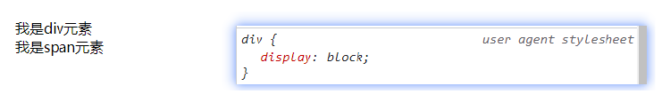
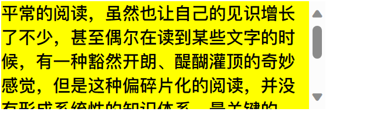

# 继承、层叠与元素类型

## CSS 属性的继承

**CSS 的某些属性具有继承性 (`Inherited`)** ： 

- **定义**：若某属性具备继承性，在父元素上设置后，其所有后代元素自动继承该值，除非后代元素显式指定自己的值。
- **优先级**：后代元素自身定义的值始终覆盖继承值，无论父元素权重多高。
- **常见可继承属性** ：通常与字体、文本相关的属性（如 `font-family`, `color`, `text-align` 等）都具有继承性。
- **强制继承**：
  - 使用 `inherit` 关键字，可以强制后代元素继承父元素的属性值，即使该属性默认不具备继承性。
  - 如 `div { background: inherit; }`
  - **判断方法**：查 CSS 规范或浏览器开发者工具“Inherited”面板。

## CSS 属性的层叠

**层叠（Cascading）**：同一个元素的同一属性可能被多个选择器重复设置，但最终只有一种样式生效。

生效规则：

同一属性被多个选择器设置时，仅一个样式生效：

1. **选择器权重**：权重高者优先。
2. **书写顺序**：权重相同时，后定义覆盖先定义。
3. **样式来源**：内联样式（`style` 属性） > `<style>` 标签 > 外部样式表（`<link>`）。

### 选择器的权重

| 选择器类型                                                   | 权重  |
| ------------------------------------------------------------ | ----- |
| `!important`                                                 | 10000 |
| 内联样式（`style` 属性）                                     | 1000  |
| ID 选择器（`#id`）                                           | 100   |
| 类选择器、属性选择器、伪类（`.class`、`[type="text"]`、`:hover`） | 10    |
| 元素选择器、伪元素（`div`、`h1`、`::before`）                | 1     |
| 通配符（`*`）                                                | 0     |

- **权重计算**：从左到右逐级累加。例如，`#id .class div` 的权重为 `100 + 10 + 1 = 111`。
- **示例**：
  - `style.css`: `p { color: red; }`（权重 1）
  - `<style>`: `.content p { color: blue; }`（权重 11）
  - `<p style="color: green;">`（权重 1000，覆盖前两者）


| 选择器                                    | 千位 | 百位 | 十位 | 个位 | 优先级 |
| ----------------------------------------- | ---- | ---- | ---- | ---- | ------ |
| `h1`                                      | 0    | 0    | 0    | 1    | 0001   |
| `h1 + p::first-letter`                    | 0    | 0    | 0    | 3    | 0003   |
| `li > a[href*="en-US"] > .inline-warning` | 0    | 0    | 2    | 2    | 0022   |
| `#identifier`                             | 0    | 1    | 0    | 0    | 0100   |
| 内联样式                                  | 1    | 0    | 0    | 0    | 1000   |

> **注意** ：`!important` 的优先级最高，但应尽量避免滥用，因为它会破坏正常的层叠规则，增加调试难度。 
>
> **伪代码**：
>
> ```
> if (权重更高) { 应用高权重样式 }
> else if (权重相等) { 应用后定义样式 }
> else { 应用默认/继承样式 }
> ```

## HTML 元素类型

为了区分哪些元素需要独占一行，哪些元素不需要独占一行，HTML 将元素分为以下几种类型（本质是由 CSS `display` 控制）： 

- **块级元素（Block-level）** ： 
  - **特征** ：独占一行，可以设置宽高，默认宽度为父容器的 100%。
  - **常见标签** ：`<div>`、`<p>`、`<h1>-<h6>`、`<ul>`、`<ol>`。
- **行内元素（Inline-level）** ： 
  - **特征** ：多个元素可以在同一行显示，不能直接设置宽高，宽高由内容决定。
  - **常见标签** ：`<span>`、`<a>`、`<strong>`。
- **行内替换元素（Inline-replaced）** ： 
  - **特征** ：行内显示但可设置宽高，尺寸常由外部资源决定。
  - **常见标签** ：``、`<input>`、`<video>`。

> **行内替换元素**：内容由外部资源（如图片文件）控制，CSS 仅调整外观（如边框、大小），有内在尺寸（如图片原始宽高）。

## 通过 CSS 修改元素类型

- 事实上元素没有本质的区别:

  - div 是块级元素, span 是行内级元素;


  - div 之所以是块级元素仅仅是因为浏览器默认设置了 display 属性而已;




可以通过 display 来改变元素的特性

## CSS 属性 - display

`display` 属性用于定义元素的显示方式，通过它可以改变元素在页面中的布局行为。常见的值及其作用如下：

- `block`：将元素显示为块级元素。
- `inline`：将元素显示为行内元素。
- `inline-block`：将元素同时具备行内和块级元素的特性（对外表现为行内元素，对内表现为块级元素）。
- `none`：隐藏元素，从文档流移除，不占空间。

> 行元素和块元素的区别:
>
> - **块元素**: 独占一行, 可以设置宽高, 高由内容决定
>
> - **行元素**: 和其它行元素排列在一行, 不可以设置宽高, 宽高都由内容决定

`width` 和 `height` 改变的是 `content` 的宽高, 所以即使改变 **块元素** 的 `width` 和 `height`, **块元素也独占一行**

### `display` 属性详解

| 值             | 行为描述                                   |
| -------------- | ------------------------------------------ |
| `block`        | 独占一行，可设置宽高，默认宽 100%。        |
| `inline`       | 同行显示，宽高由内容决定，无法直接设置。   |
| `inline-block` | 同行显示，可设置宽高，对内如块对外如行内。 |
| `flex`         | 弹性布局，适合子元素排列。                 |
| `grid`         | 网格布局，适合复杂二维布局。               |
| `none`         | 隐藏元素，从文档流移除，不占空间。         |

### display值的特性 

- **block 元素** ： 
  - 独占父元素的一行。
  - 可以随意设置宽高，默认高度由内容决定。
  - 默认宽度为父容器的 100%。
- **inline-block 元素** ： 
  - 跟其他行内级元素在同一行显示。
  - 可以随意设置宽高。
  - 对外表现为行内元素，对内表现为块级元素。
- **inline 元素** ： 
  - 跟其他行内级元素在同一行显示。
  - 不可以随意设置宽高，宽高由内容决定。

> ### 行内替换元素 
>
> 某些特殊的 HTML 元素既是行内元素，又是**行内替换元素** ，如 ``、`<input>`、`<video>` 等。它们具有以下特性： 
>
> 1. **行内显示** ：与其他行内元素在同一行显示。
> 2. **可设置宽高** ：可以通过 `width` 和 `height` 属性调整尺寸。
> 3. **内在尺寸** ：这些元素通常有默认的固有尺寸（如图片的原始宽高）。如果不指定宽高，它们会按照其内在尺寸显示。
>
> > **什么是行内替换元素？**  
> >
> > 行内替换元素的内容不受当前文档样式的影响，而是由外部资源决定（如图片、视频等）。CSS 只能影响这些元素的位置或外观（如 `object-fit` 和 `object-position`），但无法改变其内容本身。
> >
> > **典型行内替换元素** ： 
> >
> > - ``：图片
> > - `<input>`：表单输入框
> > - `<iframe>`：嵌入式框架
> > - `<video>`、`<audio>`：多媒体元素
> > - `<canvas>`、`<embed>`、`<object>`：其他嵌入式内容

## 隐藏元素的方法 

1. **`display: none`** ： 
   - 元素完全从文档流中移除，不占据任何空间，相当于不存在。
2. **`visibility: hidden`** ： 
   - 元素不可见，但仍占据其应有的空间。
   - 默认值为 `visible`，表示元素可见。
3. **透明度设置** ： 
   - **`rgba`** ：通过设置颜色的透明度（`a` 值为 0~1），只影响颜色或背景色，不影响子元素。
   - **`opacity`** ：设置整个元素的透明度，会影响所有子元素。

> **区别**：
>
> - `opacity` 影响子元素透明度，`rgba` 仅作用于指定颜色属性，子元素不受影响。
> - **示例**：
>   - `<div style="opacity: 0.5;">`：整体半透明，包括子元素。
>   - `<div style="background: rgba(0,0,0,0.5);">`：仅背景半透明。

## 设置透明度

1. `rgba` 设置透明度, 将 `a` 的值设置为 0
     - 可选值: 0~1, 0 透明, 1 是不透明
     - 十六进制写法: `#ff000000` 透明 `,#ff0000ff` 不透明
     - rgba 的 a 设置的是 alpha 值, 可以设置 **透明度**,
     - **不影响子元素**
2. `opacity` 设置透明度, 设置为 0
     - 设置整个元素的透明度, 会 **影响所有的子元素**;

> `rgba` 和 `opacity` 设置透明度时候的区别
>
> - `opacity` 设置后会对他子级的 **所有内容** 设置透明度 `rgba` 只会对颜色或背景色造成影响，并且子级 **不会继承透明效果**
> - rgba 可以设置在 `background-color`，`color`，`border-color`，`text-shadow`，`box-shadow`
> - 例如给一个盒子设置 `opacity` 为 0.3，如果那个盒子下面有输入字的话，那么 **字也会变透明**，rgba 则不会

## 元素溢出控制 

**`overflow`**：控制内容超出容器时的行为。

| 值        | 行为描述                                 |
| --------- | ---------------------------------------- |
| `visible` | 溢出内容可见（默认）。                   |
| `hidden`  | 溢出内容直接裁剪，不可见。               |
| `scroll`  | 溢出内容裁剪，始终显示滚动条（占空间）。 |
| `auto`    | 根据溢出情况自动显示滚动条。             |

> **注意**：`scroll` 滚动条区域占用 `width` 和 `height` 空间。



## CSS 样式为什么不生效 

当编写的 CSS 样式不生效时，可能是以下几种原因： 

1. **选择器优先级太低** ：检查是否有更高优先级的选择器覆盖了当前样式。
2. **选择器未选中目标元素** ：确保选择器正确无误（如类名、ID 是否拼写错误）。
3. CSS 属性使用不当 ：
   - 某些元素不支持特定属性（如 `span` 默认不支持 `width` 和 `height`）。
   - 浏览器不支持
   - 被同类型的 CSS 属性覆盖（如 `font` 属性会覆盖 `font-size`）。
4. **语法错误**：如漏写 `;` 或 `{}` 未闭合。

> **调试建议** ：使用浏览器开发者工具（F12），检查“Computed”选项卡，查看最终应用的样式及覆盖情况。
