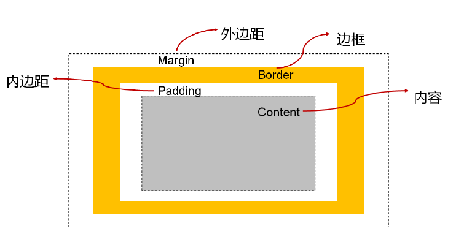
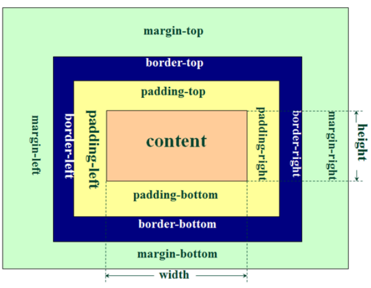
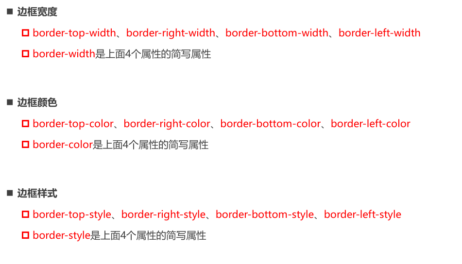
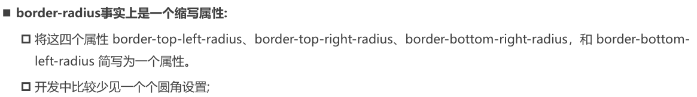
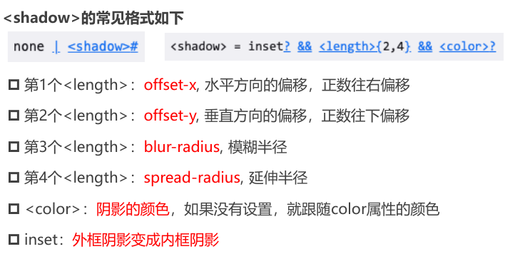
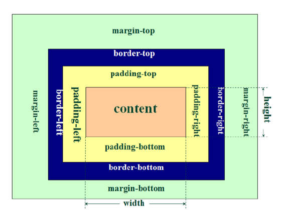

# 盒模型

## 盒子模型

HTML中的每一个元素都可以看做是一个盒子

盒模型包括四个部分：

- 内容(content)
    - 元素的内容`width/height`
- 内边距(padding)
	- 是内容和边框之间的空白区域
- 边框(border)
    - 元素自己的边框
- 外边距(margin)
    - 元素和其他元素之间的**间距**

 因为盒子有四边, 所以margin/padding/border都包括`top/right/bottom/left`四个边:

## 内容 – 宽度和高度

- 设置内容是通过**宽度和高度**设置的:
  - 宽度设置: `width`
  
  - 高度设置: `height`
  
    注意: 对于行内级非替换元素来说, 设置宽高是无效的!
  
-  另外我们还可以设置最小宽度和最大宽度:
  - `min-width`:最小宽度,无论内容多少,宽度都大于或等于  `min-width`
  - `max-width`:最大宽度,无论内容多少,宽度都小于或等于  `max-width`
  -  **移动端适配时, 可以设置最大宽度和最小宽度**
  -  通常在开发响应式网页时使用，以适应不同尺寸的屏幕和设备。min-width 和 max-width 可以与 width 属性结合使用，或者单独使用。它们的作用是**限制元素的宽度在一个范围内，防止元素过小或过大**影响布局和用户体验。
  
- 下面两个属性不常用:
  - `min-height` `max-height`
  
- 块元素独占一行 `width`默认值是`auto`

## 内边距 - padding

-  `padding`属性用于设置盒子的内边距, 通常用于设置**边框和内容之间的间距**
-  padding包括四个方向, 所以有如下的取值:
  - `padding-top`:上内边距
  - `padding-right`:右内边距
  - `padding-bottom`:下内边距
  - `padding-left`:左内边距
-  `padding`单独编写是一个**缩写属性**:
  - `padding-top`、`padding-right`、`padding-bottom`、`padding-left`的简写属性
  - `padding`缩写属性是从零点钟方向开始, 沿着**顺时针**转动的, 也就是**上右下左**;
-  行高（line-height）中的**行距**不是**内边距**，是内容的一部分

> 设置`background-color`属性的是盒模型的**内容和内边距**部分。也就是说，背景色会填充内容区域和内边距区域，但不会覆盖边框区域。如果你想让背景色延伸到边框区域，你可以使用background-clip属性，并将其值设置为border-box。

## 边框 - border

<big>**边框的设置样式值**</big>

同时设置的方式：

- 如果我们相对某一边同时设置 宽度 样式 颜色, 可以进行如下设置:

  - border-top

  - border-right

  - border-bottom

  - border-left

  - border:统一设置4个方向的边框

**边框颜色、宽度、样式的编写顺序任意**

## 圆角 - border-radius

- `border-radius`常见的值:
  - **数值**: 通常用来设置小的圆角, 比如6px
  -  **百分比**: 通常用来设置一定的**弧度或者圆形**

**设置圆形**：如果一个元素是正方形, 设置`border-radius`**大于或等于50%**时,就会变成一个圆

## 外边距 - margin

- `margin`属性用于设置盒子的外边距, 通常用于**元素和元素之间的间距**

- margin包括四个方向, 所以有如下的取值:

	- `margin-top`:上外边距
	- `margin-right`:右外边距
	- `margin-bottom`:下外边距
  - `margin-left`:左外边距

- margin单独编写是一个缩写属性:
	- margin-top、margin-right、margin-bottom、margin-left的简写属性
	- margin缩写属性是从零点钟方向开始, 沿着顺时针转动的, 也就是上右下左;

##  上下margin的传递

- `margin-top`传递
	- 如果块级元素的顶部线和父元素的顶部线重叠,那么这个块级元素的margin-top值会传递给父元素
- `margin-bottom`传递
	- 如果块级元素的底部线和父元素的底部线重写,并且父元素的高度是auto,那么这个块级元素的`margin-bottom`值会传递给父元素
- 如何防止出现传递问题?
	- 给父元素设置`padding-top\padding-bottom`
	- 给父元素设置`border`
	- 触发BFC: 设置overflow为auto
- 建议
	- `margin`一般是用来设置兄弟元素之间的间距
	- `padding`一般是用来设置父子元素之间的间距

## 上下margin的折叠

- 垂直方向上相邻的2个`margin`(`margin-top`、`margin-bottom`)有可能会合并为1个`margin`,这种现象叫做collapse(折叠)

-  水平方向上的`margin`(`margin-left`、`margin-right`)永远不会**折叠collapse**

- 折叠后最终值的计算规则
  - 两个值进行比较,取较大的值

- 如何防止 margin collapse ?
  - 只设置其中一个元素的 margin

## 上下margin折叠的情况

- **两个兄弟块级元素之间上下 margin 的折叠**

- **父子块级元素之间 margin 的折叠**

## 外轮廓 - outline

- outline 表示元素的外轮廓
  - 不占用空间
  - 默认显示在 border 的外面
  - outline相关属性有
    - outline-width: 外轮廓的宽度
    - outline-style:取值跟border的样式一样,比如solid、dotted等
    - outline-color: 外轮廓的颜色
    - outline:outline-width、outline-style、outline-color的简写属性,跟border用法类似
  - 应用实例
    - 去除a元素、input元素的 focus 轮廓效果
  
  

## 盒子阴影 – box-shadow

- `box-shadow`属性可以设置一个或者多个阴影
  - 每个阴影用`<shadow>`表示
  -  多个阴影之间用逗号,隔开,从前到后叠加

[通过该链接测试盒子的阴影](https://html-css-js.com/css/generator/box-shadow/)

## 文字阴影 - text-shadow

- text-shadow用法类似于box-shadow,用于给文字添加阴影效果
  - `<shadow>`的常见格式如下
  - 相当于box-shadow, 它没有spread-radius的值;

[通过该网站测试文字阴影](https://html-css-js.com/css/generator/box-shadow/)

> 行内非替换元素的注意事项
>
> - 以下属性对行内级非替换元素不起作用
> 	- width、height、margin-top、margin-bottom
> - 以下属性对行内级非替换元素的效果比较特殊
> 	-  padding-top、padding-bottom、上下方向的border

## CSS属性 - box-sizing

- box-sizing用来设置盒子模型中宽高的行为
- content-box
  - padding、border都布置在width、height外边
- border-box
  - padding、border都布置在width、height里边

### box-sizing:content-box

- 元素的实际占用宽度 = border + padding + width
- 元素的实际占用高度 = border + padding + height

### box-sizing: border-box

- 元素的实际占用宽度 = width

- 元素的实际占用高度 = height

## 元素的水平居中方案

- **行内级元素**(包括`inline-block`元素)
  - 水平居中:在父元素中设置`text-align: center`
- **块级元素**
  - 水平居中:`margin: 0 auto`