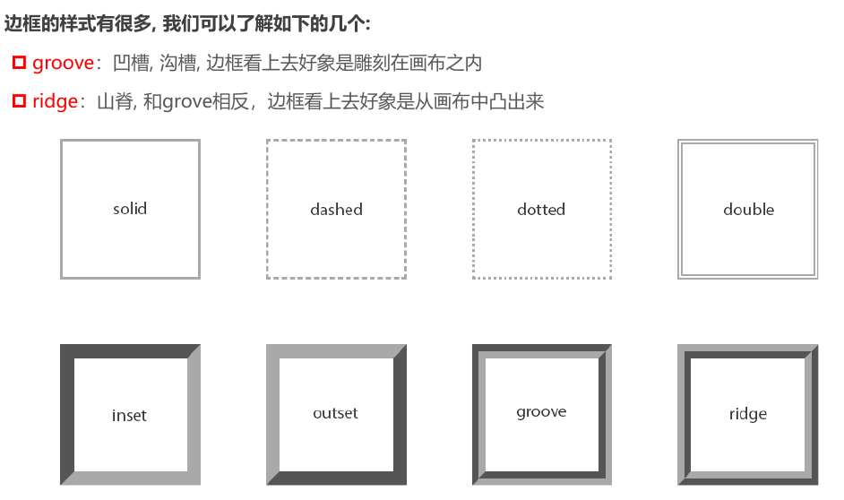

# 盒模型

## 盒子模型

CSS 将每个 HTML 元素视为一个矩形“盒子”，由四部分构成：

1. **内容（Content）** ：元素的实际内容区域，，由 `width` 和 `height` 定义。
2. **内边距（Padding）** ：内容与边框之间的空白区域，用于调整内容与边框的间距。
3. **边框（Border）** ：包围内边距和内容的边界线，起到装饰和分隔作用。
4. **外边距（Margin）** ：元素与其他元素之间的间距，用于控制布局的间隔。


由于盒子具有四个方向，`padding`、`border` 和 `margin` 都可以分别设置 `top`（上）、`right`（右）、`bottom`（下）、`left`（左)四个属性：


## 内容（Content） – 宽度与高度

- 设置内容 content 是通过 **宽度和高度** 设置的:
  - 宽度设置: `width`
  
  - 高度设置: `height`
  
    **注意**：对于**行内非替换元素**（如 `<span>`、`<a>`），`width` 和 `height` 属性无效，因为它们的大小由内容自适应决定。
  
- **范围限制**：

  - min-width：确保宽度不低于指定值（如 200px），即使内容不足。
  - max-width：限制宽度不超过指定值（如 800px），防止过宽影响布局。
  - 示例：在移动端适配中，max-width: 100%; 确保元素不超过屏幕宽度。

- 下面两个属性不常用:
  - `min-height` `max-height`

- 块元素独占一行 `width` 默认值是 `auto`

**示例**：在响应式设计中，限制图片宽度以适配移动端：

```css
img {
  max-width: 100%;
  height: auto;
  min-width: 50px;
}
```

这确保图片宽度不超过容器，同时保持最小尺寸以避免过小。

## 内边距（Padding）

内边距是内容与边框之间的空白区域，用于增加内部空间，提升视觉舒适度。

- **单方向设置**：`padding-top`、`padding-right`、`padding-bottom`、`padding-left`。
- **缩写形式**：`padding: top right bottom left;`（顺时针顺序）。
  - 示例：`padding: 10px 20px 15px 20px;` 表示上10px、右20px、下15px、左20px。
  - 简写规则：`padding: 10px 20px;` 表示上下10px、左右20px。
- **特性**：
  - **背景覆盖**：`background-color` 会填充内容区和内边距区域，但不会延伸至边框外。
  - **不支持负值**：内边距只能为正值或零。
  - **溢出处理**：若内容超出内边距范围，受 `overflow` 属性控制（如 `overflow: hidden`）。
  - **与行高无关**：`line-height` 只影响内容区，不涉及内边距。

> - 设置 `background-color` 属性的是盒模型的 **内容和内边距** 部分
>
> - 背景色有设置到 border 下面
>
> - 前景色会在 border 没有设置颜色的情况下，显示出来 color 颜色

## 边框（Border）

边框由宽度、样式和颜色三部分定义：

- **宽度**：`border-width` 或 `border-top-width` 等。
- **样式**：`border-style`（如 `solid`、`dashed`、`dotted`），决定边框外观。
- **颜色**：`border-color`，默认继承元素的 `color` 属性。
- **缩写**：`border: width style color;`（顺序任意，如 `border: 1px solid #000;`）。

### **特性**

- **透明边框**：`border: transparent;` 占据空间但不可见。
- **叠加效果**：相邻元素的边框会叠加，例如两个 `1px` 边框接触时总宽度为 `2px`。
- **单边设置**：如 `border-top: 2px dashed red;`。

**常见样式**：`solid`（实线）、`dashed`（虚线）、`dotted`（点线）等。 



- **边框的默认颜色** ：如果没有指定颜色，边框颜色会继承元素的 `color` 属性。

> 通过利用边框我们可以做出很多形状图形
>
> <https://css-tricks.com/the-shapes-of-css/#top-of-site>
>
> 

## 圆角（Border-Radius）

- **取值**：
  - 数值：如 `10px`（小圆角）。
  - 百分比：如 `50%`（圆形）。
  - 椭圆：`50px / 25px;`（水平/垂直半径）。

- `border-radius` 事实上是一个缩写属性：
  - **完整属性**：`border-radius: top-left top-right bottom-right bottom-left;`。
  - **单角设置**：如 `border-top-left-radius: 10px;`（较少单独使用）。
  - **简写示例**：`border-radius: 10px 20px;` 表示左上/右下10px，右上/左下20px。

**设置圆形**：如果一个元素是正方形, 设置 `border-radius` **大于或等于 50%** 时, 就会变成一个圆


## 外边距（Margin）

- `margin` 属性用于设置盒子的 **外边距**, 通常用于 **元素和元素之间的间距**（兄弟元素）
  - 设置 **父子元素** 之间的间距最好用 `padding`

- margin 包括四个方向, 所以有如下的取值:

  - `margin-top`: 上外边距
  - `margin-right`: 右外边距
  - `margin-bottom`: 下外边距
  - `margin-left`: 左外边距

- 缩写：`margin: top right bottom left;`（顺时针）。
- **左右 Margin 不传递** ：水平方向上的 `margin` 不会发生传递现象。


## 上下 Margin 的传递

- `margin-top` 传递*
	
 	- 如果块级元素的 **顶部线** 和 **父元素的顶部线** 重叠, 那么这个块级元素的 `margin-top` 值会 **传递给父元素**
	
- `margin-bottom` 传递（很少遇到）
	
 	- 如果块级元素的 **底部线** 和父元素的底部线 **重叠**, 并且父元素的 **高度是** `auto`, 那么这个块级元素的 `margin-bottom` 值会 **传递** 给父元素（高度由内容撑起来的情况）
	
	
	
- **防止出现传递问题**
	
	1. 给父元素设置 `padding-top\padding-bottom`，防止顶部线或底部线重叠
	
	2. 给父元素设置 `border`
	
	3. 触发 BFC: 设置 `overflow` 为 `auto`
	
	   - (block formating content) **块级格式化上下文**，相当于给当前的盒子建立一个独立的空间。简单理解就是给父元素设置一个结界，防止上下边距传递出去（最优解决方案）。
	
	     > 触发 BFC 有以下方式：
	     >
	     > - 添加浮动 float（float 的值不能是 none）；
	     >
	     > - 设置一个非 visible 的 `overflow` 属性（除了 visible，其他属性值都可以，像 hidden、auto、scroll 等）；
	     >
	     > - 设置定位 `position`（position 的值不能是 static 或 relative）；
	     >
	     > - 设置 display 的值为 inline-block、table-cell、flex、table-caption 或 inline-flex； 
	

建议：

- `margin` 一般是用来设置 **兄弟元素** 之间的 **间距**
- `padding` 一般是用来设置 **父子元素** 之间的间距

- **左右 margin 不传递**

- 外边距传递的目的是为了保持元素之间的一致间距，避免出现双倍的外边距

## 上下 margin 的折叠*

- 垂直方向上相邻的 2 个 `margin`(`margin-top`、`margin-bottom`)有可能会合并为 1 个 `margin`, 这种现象叫做 collapse(**折叠**)
- 水平方向上的 `margin`(`margin-left`、`margin-right`)永远不会 **折叠 collapse**

> 父子块级元素之间上下 margin 折叠的原因是子元素将上边距传递给了父元素 box，然后父元素 box 再与自己的上边距进行比较；

- 折叠后最终计算规则：两个值进行比较，取较大值；
- 如果想防止上下边距折叠，只设置其中一个即可；

## 上下 margin 折叠的情况

- **两个兄弟块级元素之间上下 margin 的折叠**


- **父子块级元素之间 margin 的折叠**（不常见）


## 外轮廓（Outline）

`outline` 是绘制在边框外的轮廓线，不占用空间，常用于高亮元素（如焦点状态）。

- `outline-width`：宽度。
- `outline-style`：样式（如 `solid`）。
- `outline-color`：颜色。
- **缩写**：`outline: width style color;`类似于 `border`。 
- **应用实例** ： 
  - 例如，去除 `<a>` 和 `<input>` 元素的 `:focus` 外轮廓效果：`a { outline: none; }`

## 盒子阴影（Box-Shadow）

```css
/* x 偏移量 | y 偏移量 | 阴影模糊半径 | 阴影扩散半径 | 阴影颜色 */
box-shadow: 2px 2px 2px 1px rgba(0, 0, 0, .2);
```

- `box-shadow` 属性可以设置一个或者多个 **阴影**
  
- 设置 **多个阴影** 时，使用逗号 `,` 将每个阴影的值隔开。前面的阴影会在后面阴影 **之上**，如果上层有透明度较低的部分，会与下层的颜色重叠，**合成** 新颜色。
  
  |       值        | 说明                                                         |
  | :-------------: | :----------------------------------------------------------- |
  |   *offset-x*    | 必需的。水平阴影的位置。允许负值                             |
  |   *offset-y*    | 必需的。垂直阴影的位置。允许负值                             |
  |  *blur*-radius  | 可选。**模糊距离**/模糊半径                                  |
  | *spread*-radius | 可选。**阴影的大小**/延伸半径                                |
  |     *color*     | 可选。阴影的颜色。如果没有设置，就跟随 color（前景色）属性的颜色 |
  |      inset      | 可选。外框阴影变成内框阴影                                   |

[通过该链接测试盒子的阴影](https://html-css-js.com/css/generator/box-shadow/)


## 行内非替换元素的注意事项*

行内元素 ==水平== 方向的 padding 和 margin 都是有效的

- 以下属性对行内级非替换元素不起作用

  - `width`、`height`、`margin-top`、`margin-bottom`

- 以下属性对行内级非替换元素的效果比较特殊

  - padding-top、padding-bottom、上下方向的 border
    - 对行内非替换元素设置 padding，行元素 ==上下被撑起来==，但是 ==不占据空间==
    - 上下的 `border` 也不占用空间

  > 思考：为什么不生效？
  >
  > 行元素通常是一段文本或者行内的文字，和其他文字排列在同一行，设置 margin 或者 padding 会影响一段文本的显示
  
  ```css
  /* 内容: width/height(压根不生效) */
  width: 300px;
  height: 300px;
  /* 内边距: padding */
  /* 特殊: 上下会被撑起来, 但是不占据空间 */
  /* padding: 50px; */
  
  /* 边框: border */
  /* 特殊: 上下会被撑起来, 但是不占据空间 */
  /* border: 50px solid orange; */
  
  /* 外边距: margin */
  /* 特殊: 上下的margin是不生效的 */
  margin: 50px;
  ```

## 盒子尺寸计算（Box-Sizing）

> 在 CSS 中，默认情况下，元素的 width 和 height 仅作用于**内容区**。如果元素设置了 padding（内边距）或 border（边框），最终在屏幕上渲染的盒子尺寸会将这些值叠加到 width 和 height 上。这意味着调整元素宽高时，需额外考虑内边距和边框的影响，操作起来不够直观。

`box-sizing` 属性为此提供了解决方案，用于调整盒子尺寸的计算方式：

- **`content-box`**（默认值）：  
  设置的 `width` 和 `height` 只定义内容区的尺寸，`padding` 和 `border` 的宽度会额外增加到元素的总宽高上。例如，若 `width: 100px`，加上 `padding` 和 `border` 后，总宽度可能超过 100px。

- **`border-box`**：  
  设置的 `width` 和 `height` 包含了 `padding` 和 `border`，内容区实际尺寸会自动调整为 `width - (border + padding)`。例如，`width: 100px` 表示整个盒子（含边框和内边距）的总宽度为 100px，这种方式更便于精确控制元素尺寸。

**注意：** `border-box` 不包含 `margin`（外边距），它仍会独立影响元素的外部空间。

### 总结

- **`content-box`**：`padding` 和 `border` 在 `width` 和 `height` 之外。  
- **`border-box`**：`padding` 和 `border` 在 `width` 和 `height` 之内。  
- `box-sizing` 定义了浏览器如何计算元素的总宽高，`border-box` 在布局设计中通常更实用。
- 大多数现代项目中，推荐全局设置 `box-sizing: border-box`（如通过 `* { box-sizing: border-box; }`），以减少尺寸计算的意外误差，提升开发效率。

| **特性**     | `content-box`                                 | `border-box`                                  |
| ------------ | --------------------------------------------- | --------------------------------------------- |
| **尺寸定义** | 仅内容                                        | 内容+padding+border                           |
| **宽度计算** | width = 内容                                  | width = 内容+2×padding+2×border               |
| **高度计算** | height = 内容                                 | height = 内容+2×padding+2×border              |
| **默认值**   | 默认                                          | 非默认，需设`box-sizing: border-box`          |
| **实际占用** | width + 2×padding + 2×border                  | width（固定）                                 |
| **优点**     | 内容尺寸精确                                  | 总尺寸直观，布局预测性强                      |
| **缺点**     | 外扩占用空间                                  | 内容尺寸需计算                                |
| **示例**     | width:100px, padding:10px, border:5px → 130px | width:100px, padding:10px, border:5px → 100px |

## 元素的水平居中

- **行内级（含 inline-block）**：
  - 父元素：`text-align: center;`
  - 示例：`<div style="text-align: center;"><span>居中</span></div>`
- **块级**：
  - `margin: 0 auto;`（需指定 `width`）。
  - 示例：`<div style="width: 200px; margin: 0 auto;">居中</div>`
  - `auto`：让浏览器 **自动分配** 左右边距
- **现代**：
  - Flex：`display: flex; justify-content: center;`
  - Grid：`display: grid; place-items: center;`


因为块级元素默认独占一行，所以可以利用浏览器的特性让元素居中

由原理可得，不能利用 `margin` 垂直居中

> 行元素包括:
>
> - 行内 **非替换** 元素 `<span>` `<a>`...
> - 行内 **替换** 元素 `` `<input>` `<iframe>` `<audio>`...
> - `inline-block`：display 的属性值
