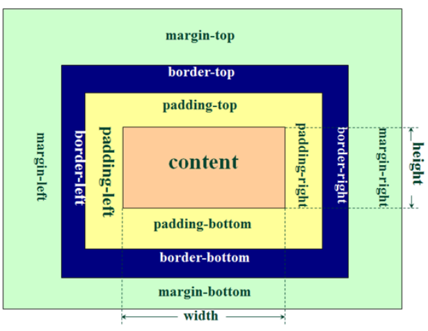
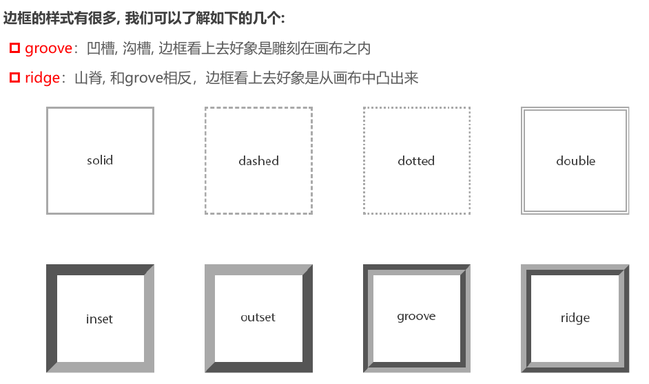
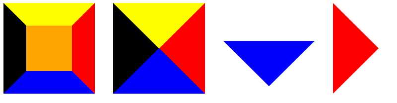
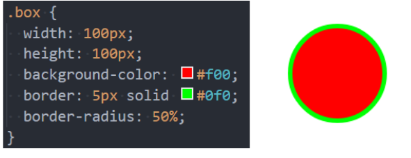
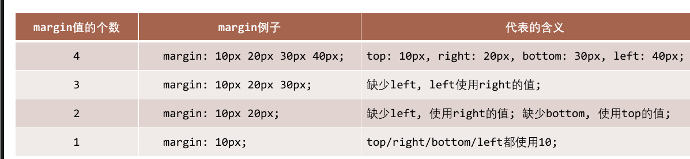
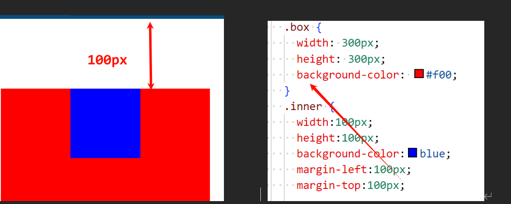
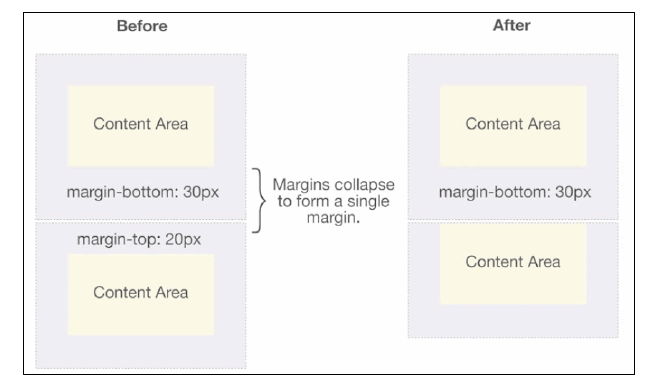
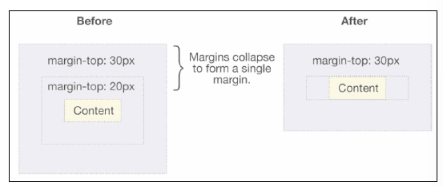

# 盒模型

## 盒子模型

CSS 将每个 HTML 元素视为一个矩形“盒子”，由四部分构成：

1. **内容（Content）** ：元素的实际内容区域，由 `width` 和 `height` 定义。
2. **内边距（Padding）** ：内容与边框之间的空白区域，用于调整内容与边框的间距。
3. **边框（Border）** ：包围内边距和内容的边界线，起到装饰和分隔作用。
4. **外边距（Margin）** ：元素与其他元素之间的间距，用于布局控制。


由于盒子具有四个方向，`padding`、`border` 和 `margin` 都可以分别设置 `top`（上）、`right`（右）、`bottom`（下）、`left`（左)四个属性：



## 内容（Content） – 宽度与高度

内容区域的大小由 `width` 和 `height` 属性控制：

- **注意**：行内非替换元素（如 `<span>`、`<a>`）无法通过 `width` 和 `height` 设置尺寸，其大小由内容自适应决定。
- **范围约束**：
  - `min-width` / `min-height`：设置最小宽度/高度（如 `min-width: 200px`）。
  - `max-width` / `max-height`：限制最大宽度/高度（如 `max-width: 800px`）。
- **块级元素特性**：默认 `width: auto`，独占一行，常用于布局基础。

**示例**：在响应式设计中，限制图片宽度以适配移动端：

```css
img {
  max-width: 100%;
  height: auto;
  min-width: 50px;
}
```

这确保图片宽度不超过容器，同时保持最小尺寸以避免过小。

## 内边距（Padding）

内边距是内容与边框之间的空白区域，用于增加内部空间，提升视觉舒适度。

- **单方向设置**：`padding-top`、`padding-right`、`padding-bottom`、`padding-left`。
- **缩写形式**：`padding: top right bottom left;`（顺时针顺序）。
  - 示例：`padding: 10px 20px 15px 20px;` 表示上10px、右20px、下15px、左20px。
  - 简写规则：`padding: 10px 20px;` 表示上下10px、左右20px。
- **特性**：
  - **背景覆盖**：`background-color` 会填充内容区和内边距区域，但不会延伸至边框外。
  - **不支持负值**：内边距只能为正值或零。
  - **溢出处理**：若内容超出内边距范围，受 `overflow` 属性控制（如 `overflow: hidden`）。
  - **与行高无关**：`line-height` 只影响内容区，不涉及内边距。

> - 设置 `background-color` 属性的是盒模型的 **内容和内边距** 部分
>- 背景色有设置到 border 下面

## 边框（Border）

边框由宽度、样式和颜色三部分定义：

- **宽度**：`border-width` 或 `border-top-width` 等。
- **样式**：`border-style`（如 `solid`、`dashed`、`dotted`），决定边框外观。
- **颜色**：`border-color`，默认继承元素的 `color` 属性。
- **缩写**：`border: width style color;`（顺序任意，如 `border: 1px solid #000;`）。

### **特性**

- **透明边框**：`border: transparent;` 占据空间但不可见。
- 若未显式设置 `border-color`，边框颜色默认继承元素的 `color` 属性值
- **叠加效果**：相邻元素的边框会叠加，例如两个 `1px` 边框接触时总宽度为 `2px`。
- **单边设置**：如 `border-top: 2px dashed red;`。

**常见样式**：`solid`（实线）、`dashed`（虚线）、`dotted`（点线）等。 



- **边框的默认颜色** ：如果没有指定颜色，边框颜色会继承元素的 `color` 属性。

> 通过利用边框我们可以做出很多形状图形
>
> <https://css-tricks.com/the-shapes-of-css/#top-of-site>
>
> 

## 圆角（Border-Radius）

`border-radius` 为盒子添加圆角效果，提升美观性：

- **取值**：
  - 数值：如 `10px`（小圆角）。
  - 百分比：如 `50%`（圆形）。
  - 椭圆：`50px / 25px;`（水平/垂直半径）。

- `border-radius` 事实上是一个缩写属性：
  - **完整属性**：`border-radius: top-left top-right bottom-right bottom-left;`。
  - **单角设置**：如 `border-top-left-radius: 10px;`（较少单独使用）。
  - **简写示例**：`border-radius: 10px 20px;` 表示左上/右下10px，右上/左下20px。

- **圆形效果**：正方形元素设置 `border-radius: 50%` 或更大值时变为圆形。



## 外边距（Margin）

- **设置方式**：
  - 单方向：`margin-top`、`margin-right`、`margin-bottom`、`margin-left`。
  - 缩写：`margin: top right bottom left;`（顺时针顺序）。
    - 示例：`margin: 10px 20px;` 表示上下 10px，左右 20px。
- **特性**：  
  - 水平方向（`margin-left` 和 `margin-right`）不会传递或折叠。  
  - 垂直方向（`margin-top` 和 `margin-bottom`）可能发生传递或折叠。



## 上下 Margin 的传递

在特定条件下，块级元素的垂直外边距会“传递”给父元素，影响布局：

- **`margin-top` 传递**：  
  当块级元素顶部与父元素顶部重合时，其 `margin-top` 值会转移至父元素。
- **`margin-bottom` 传递**（较少见）：  
  当块级元素底部与父元素底部重合，且父元素高度为 `auto` 时，其 `margin-bottom` 值会传递给父元素。



<span style="font-size:1.2em; font-weight:bold;">如何防止 Margin 传递</span>

1. **添加父元素内边距**：  
   设置 `padding-top` 或 `padding-bottom`，打破边界重合。例如：`padding-top: 1px;`。

2. **设置父元素边框**：  
   为父元素添加 `border`（如 `border: 1px solid transparent;`），隔离子元素的边距。

3. **触发 BFC（块级格式化上下文）**：  
   通过设置父元素的 `overflow: auto`（或其他非 `visible` 值），创建一个独立的布局上下文，阻断外边距传递。  
   - **优点**：这是最优雅的解决方案，相当于为父元素建立一个“防护结界”，隔离内外边距影响。  
   - **触发 BFC 的方式**：  
     - 设置浮动：`float`（值非 `none`）。  
     - 设置溢出：`overflow: hidden/auto/scroll`（非 `visible`）。  
     - 设置定位：`position: absolute/fixed`（非 `static/relative`）。  
     - 设置显示：`display: inline-block/table-cell/flex/inline-flex/table-caption`。

建议：

- `margin` 一般是用来设置 **兄弟元素** 之间的 **间距** （如列表项之间的距离）。  
- `padding` 一般是用来设置 **父子元素** 之间的间距 （如容器与内容的间隔）。 
- **左右 margin 不传递**
- 外边距传递的目的是为了保持元素之间的一致间距，避免出现双倍的外边距

## 上下 margin 的折叠

垂直方向上相邻的 2 个 `margin`(`margin-top`、`margin-bottom`)会合并为一个外边距，这种现象称为 **折叠（Collapsing）**

水平方向上的 `margin`(`margin-left`、`margin-right`)永远不会 **折叠 collapse**

- **兄弟元素**：两个相邻块级元素的 `margin-bottom` 和 `margin-top` 折叠，取较大值。  
- **父子元素**：若父元素无 `border`、`padding` 或内容分隔，子元素的 `margin-top` 会与父元素的 `margin-top` 折叠。

- 折叠后最终计算规则：两个值进行比较，取较大值；
- 如果想防止上下边距折叠，只设置其中一个即可；

#### **防止外边距折叠的方法**

1. **隔离父子元素**：为父元素添加 `border` 或 `padding`。  
2. **触发 BFC**：设置父元素 `overflow: auto` 或 `display: flow-root`（推荐，无副作用）。  

**发生场景**：

- **两个兄弟块级元素之间上下 margin 的折叠**



- **父子块级元素之间 margin 的折叠**（不常见）
  子元素的外边距传递至父元素后，与父元素的外边距折叠。  



## 外轮廓（Outline）

`outline` 是在边框外绘制的轮廓线，不占用布局空间，常用于高亮元素（如焦点状态）。

- **属性**：
  - `outline-width`：定义轮廓宽度。
  - `outline-style`：设置轮廓样式（如 `solid`、`dashed` 等）。
  - `outline-color`：指定轮廓颜色。
- **缩写**：`outline: width style color;`（类似于 `border` 的写法）。
- **应用**：
  - 移除焦点状态的外轮廓：  
    示例：`a:focus, input:focus { outline: none; }` 用于清除 `<a>` 或 `<input>` 的默认焦点轮廓。
  - 高亮交互元素：常用于提升用户体验（如按钮点击或键盘导航时）。

**特点**：与 `border` 不同，`outline` 不影响元素尺寸或布局，适合临时视觉提示。

## 盒子阴影（Box-Shadow）

`box-shadow` 为元素添加阴影效果，支持单层或多层阴影，可灵活调整位置、大小和模糊度。

```css
/* 语法：x偏移量 | y偏移量 | 模糊半径 | 扩散半径 | 颜色 */
box-shadow: 2px 2px 2px 1px rgba(0, 0, 0, 0.2);
```

- **多阴影支持**：  
  使用逗号 `,` 分隔多个阴影值，前面的阴影覆盖在后面的阴影之上。若上层阴影透明度较低，会与下层阴影颜色叠加，形成合成效果。

- **参数说明**：

  | 参数            | 说明                                                        |
  | --------------- | ----------------------------------------------------------- |
  | `offset-x`      | **必需**，水平偏移量（正值向右，负值向左）。                |
  | `offset-y`      | **必需**，垂直偏移量（正值向下，负值向上）。                |
  | `blur-radius`   | 可选，模糊半径（值越大，阴影越模糊；默认 `0` 为清晰边缘）。 |
  | `spread-radius` | 可选，扩散半径（控制阴影扩展大小，正值扩大，负值缩小）。    |
  | `color`         | 可选，阴影颜色（未指定时，默认继承 `color` 属性值）。       |
  | `inset`         | 可选，添加后阴影变为内阴影（默认外阴影）。                  |

- **应用实例**：  

  - 单阴影：`box-shadow: 2px 2px 4px rgba(0, 0, 0, 0.3);`（轻微浮起效果）。  
  - 多阴影：`box-shadow: 0 0 5px red, 0 0 10px blue;`（叠加红蓝光晕）。  
  - 内阴影：`box-shadow: inset 0 0 10px gray;`（凹陷效果）。

- **在线工具**：  
  可通过 [Box Shadow Generator](https://html-css-js.com/css/generator/box-shadow/) 实时预览和调试阴影效果。

**特点**：`box-shadow` 不仅增强视觉层次感，还能通过多层阴影实现复杂效果，广泛用于按钮、卡片等设计。

## 行内非替换元素的注意事项

行内元素的水平方向 `padding` 和 `margin` 均有效，但其他属性的表现有特殊性：

- **无效属性**：  
  对于行内非替换元素，以下属性不起作用：  

  - `width`、`height`、`margin-top`、`margin-bottom`  

- **特殊效果属性**：  

  - `padding-top`、`padding-bottom` 以及上下方向的 `border`：  
    - 设置后，行内元素会在垂直方向被撑开，但不会占用额外的布局空间。  
    - 上下 `border` 同样不会影响周围元素的布局。  

  **思考：为何表现如此？**  
  行内元素（如文本或行内标签）通常与同一行的其他内容共存，垂直方向的 `margin` 或 `padding` 调整仅影响自身显示，而不改变整体布局。这是行内元素的设计初衷：保持文本流的连续性。

## 盒子尺寸计算（Box-Sizing）

默认情况下，CSS 中元素的 `width` 和 `height` 仅定义**内容区**尺寸，`padding`（内边距）和 `border`（边框）会叠加其上，导致实际渲染尺寸超出预期。`box-sizing` 属性通过改变尺寸计算方式，解决了这一问题。

- **`content-box`**（默认值）：  
  `width` 和 `height` 仅代表内容区尺寸，`padding` 和 `border` 会额外增加到总宽高上。  
  示例：若 `width: 100px`，加上 `padding: 20px` 和 `border: 5px`（两侧），总宽度变为 `150px`。
- **`border-box`**：  
  - `width` 和 `height` 包含 `padding` 和 `border`，内容区自动缩减。  
  - 总尺寸固定为设定值，内容区 = `width - (2×padding + 2×border)`。  
  - 示例：`width: 100px; padding: 10px; border: 5px;` → 总宽度仍为 100px。


**注意：** `border-box` 不包含 `margin`（外边距），它仍会独立影响元素的外部空间。

### 总结

- **`content-box`**：`padding` 和 `border` 在 `width`/`height` 之外，总尺寸随附加值外扩。  
- **`border-box`**：`padding` 和 `border` 在 `width`/`height` 之内，总尺寸固定。  
- `box-sizing` 决定了浏览器如何计算元素宽高，`border-box` 在现代布局中更实用。  
- **推荐实践**：全局设置 `*{ box-sizing: border-box; }`，减少意外尺寸误差，提升开发效率。

| **特性**     | `content-box`                                 | `border-box`                                  |
| ------------ | --------------------------------------------- | --------------------------------------------- |
| **尺寸定义** | 仅内容                                        | 内容+padding+border                           |
| **宽度计算** | width = 内容                                  | width = 内容+2×padding+2×border               |
| **高度计算** | height = 内容                                 | height = 内容+2×padding+2×border              |
| **默认值**   | 默认                                          | 非默认，需设`box-sizing: border-box`          |
| **实际占用** | width + 2×padding + 2×border                  | width（固定）                                 |
| **优点**     | 内容尺寸精确                                  | 总尺寸直观，布局预测性强                      |
| **缺点**     | 外扩占用空间                                  | 内容尺寸需计算                                |
| **示例**     | width:100px, padding:10px, border:5px → 130px | width:100px, padding:10px, border:5px → 100px |

## 元素的水平居中

- **行内级元素（含 `inline-block`）**：  
  
  - 父元素设置：`text-align: center;`  
  - 示例：`<div style="text-align: center;"><span>居中</span></div>`  
  
- **块级元素**：  
  - 设置 `margin: 0 auto;`（需指定 `width`）：  
    - `auto`  让浏览器均分左右外边距实现居中。  
    - 示例：`<div style="width: 200px; margin: 0 auto;">居中</div>`  
  - **原理**：块级元素默认独占一行，浏览器可通过均分外边距实现居中。  
  - **限制**：`margin` 无法用于垂直居中，因垂直方向无类似自动分配机制。

- **现代方案**：  
  
  - **Flexbox**：  
  
    ```css
    .parent { display: flex; justify-content: center; }
    ```
  
  - **Grid**：  
  
    ```css
    .parent { display: grid; place-items: center; } /* 水平+垂直居中 */
    ```
  


> 行元素包括:
>
> - 行内 **非替换** 元素 `<span>` `<a>`...
> - 行内 **替换** 元素 `` `<input>` `<iframe>` `<audio>`...
> - `inline-block`：display 的属性值
