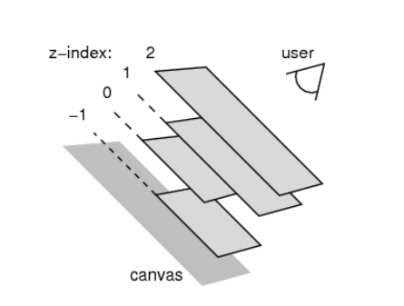

# css 元素的定位

## 标准流(Normal Flow)

- 默认布局方式 ：在标准流中，元素按照从上到下、从左到右的顺序排列。
  - 块级元素（如 `<div>`、`<p>`）会独占一行，并按顺序垂直堆叠。
  - 行内元素（如 `<span>`、`<a>`）则在同一行内水平排列，直到空间不足时换行。
- 特点 ：
  - 元素的位置由文档结构决定，且不会发生层叠。
  - 可以通过 `margin` 和 `padding` 调整元素之间的间距，其中 `margin` 支持负值。
- 局限性 ：
  - 修改一个元素的 `margin` 或 `padding` 可能会影响其他元素的布局。
  - 难以实现复杂的布局效果，例如元素层叠或重叠。

> 如果需要让某个元素跳出标准流并独立进行定位，可以使用 `position` 属性。 

## 定位（Positioning）

定位允许您将元素从正常的文档流中取出，并使其具有不同的行为。例如： 

- 将一个元素放置在另一个元素之上。
- 让元素始终保持在浏览器视窗内的固定位置。


### position 属性

`position` 属性用于定义元素的定位方式，其常用取值包括： 

- **`static`** （默认值）：元素按照标准流进行布局。
- **`relative`** （相对定位）：元素相对于自身原来的位置进行偏移。
- **`absolute`** （绝对定位）：元素脱离标准流，相对于最近的已定位祖先元素进行定位。
- **`fixed`** （固定定位）：元素脱离标准流，相对于视口进行定位。
- **`sticky`** （粘性定位）：结合了相对定位和固定定位的特点，在滚动到特定阈值时切换为固定定位。

> **定位元素（Positioned Element）**    
>
> - 指 `position` 值不为 `static` 的元素（即 `relative`、`absolute`、`fixed`、`sticky`）。  
> - 特点：
>   - 可以设置宽度和高度，默认由内容决定。
>   - 脱离标准流布局，不再严格遵循从上到下、从左到右的排布规则。
>   - 不再受“块级”和“行内级”布局规则的限制。
>   - 不对父元素汇报宽高数据。
>   - 定位元素内部默认仍然按照标准流布局。

## 静态定位（Static） 

- **默认值** ：`position: static` 是所有元素的默认定位方式。
- 特点 ：
  - 元素按照标准流进行布局。
  - `top`、`right`、`bottom`、`left` 属性无效。

## 相对定位（Relative） 

- **布局方式** ：元素仍然按照标准流进行布局，但可以通过 `top`、`right`、`bottom`、`left` 属性进行偏移。
- **参照对象** ：元素自身原来的位置。
- 应用场景 ：
  - 在不影响其他元素位置的前提下，对当前元素的位置进行微调。
  - 常用于调整元素的细微位置偏差。


## 固定定位（Fixed） 

- **布局方式** ：元素脱离标准流，成为脱标元素。
- **参照对象** ：视口（Viewport），即使页面滚动，元素仍固定在视口中的指定位置。
- 特点 ：
  - `top`、`right`、`bottom`、`left` 属性用于精确定位。
  - 适用于创建悬浮按钮、导航栏等需要固定显示的元素。

> **视口（Viewport）** ：浏览器可视区域，如下图红框所示。
> **画布（Canvas）** ：渲染文档的区域，文档内容超出视口时可以滚动查看，如下图黑框所示。
> 宽高对比：画布 >= 视口。 


## 绝对定位（Absolute） 

- **布局方式** ：元素脱离标准流，成为脱标元素。
- **参照对象** ：最近的已定位祖先元素（即 `position` 不为 `static` 的元素）。如果没有已定位的祖先元素，则参照对象为视口。
- 特点 ：
  - `top`、`right`、`bottom`、`left` 属性用于精确定位。
  - 常用于创建弹出框、工具提示等需要精确控制位置的元素。

### 子绝父相

- 在绝大数情况下, 子元素的绝对定位都是相对于父元素进行定位

- 如果不希望父元素脱离标准流，可以让父元素设置 `position: relative`，使其成为定位元素。

- 子元素设置 `position: absolute`，相对于父元素进行定位。

### 绝对定位元素的尺寸计算

- **宽度公式**：  

  ```plaintext
  定位参照对象的宽度 = left + right + margin-left + margin-right + 绝对定位元素的实际宽度
  ```

- **高度公式**：  

  ```plaintext
  定位参照对象的高度 = top + bottom + margin-top + margin-bottom + 绝对定位元素的实际高度
  ```

#### 特殊用法

1. **与参照对象一致**：  
   如果希望绝对定位元素的宽度和高度与参照对象一致，可以设置以下属性：  

   ```css
   left: 0; right: 0; top: 0; bottom: 0; margin: 0;
   ```

2. **居中显示**：  
   如果希望绝对定位元素在参照对象中居中显示，可以设置以下属性：  

   ```css
   left: 0; right: 0; top: 0; bottom: 0; margin: auto;
   ```

   同时需要指定具体的宽度和高度（宽高应小于参照对象的宽高）。

## 粘性定位（Sticky） 

- 布局方式 

  ：结合了相对定位和固定定位的特点。

  - 初始表现为相对定位，随着页面滚动达到某个阈值后，切换为固定定位。

- **参照对象** ：最近的滚动祖先容器（包含视口）。

- **应用场景** ：常用于实现吸顶导航栏、表格头部固定等功能。

## position 值对比

| **定位类型**          | **描述**                                                     | **脱离标准流** | **定位元素** | **绝对定位元素** | **定位参照对象**                           | **`top`/`left` 属性** |
| --------------------- | ------------------------------------------------------------ | -------------- | ------------ | ---------------- | ------------------------------------------ | --------------------- |
| `static` - 静态定位   | 默认值，元素按照标准流进行布局                               | 否             | 否           | 否               | 无                                         | 无作用                |
| `relative` - 相对定位 | 元素相对于其原始位置进行偏移                                 | 否             | 是           | 否               | 元素自身原来的位置                         | 有作用                |
| `absolute` - 绝对定位 | 元素脱离标准流，按指定位置定位                               | 是             | 是           | 是               | 最邻近的定位祖先元素（如果没有则参照视口） | 有作用                |
| `fixed` - 固定定位    | 元素脱离标准流，按指定位置定位，参照对象为视口               | 是             | 是           | 是               | 视口                                       | 有作用                |
| `sticky` - 粘性定位   | 元素在滚动到某个阈值时表现为相对定位，达到阈值后变为固定定位 | 部分           | 是           | 是               | 最近的滚动祖先容器（包含视口）             | 有作用                |

## auto 到底是什么?

`800 = 200 + ml0 + mr0 + 0 + 0`

- `auto` 的含义是：**交由浏览器自动处理** 。

- `width:auto;`

  1. 行内非替换元素 - > width: 包裹内容

  2. 块级元素 - > width: 包含块的宽度

  3. 绝对定位元素 - > width: 包裹内容

## `z-index` 

`z-index` 属性用于设置定位元素的层叠顺序（仅对已定位元素有效）。 

- **取值范围** ：正整数、负整数、0。
- 比较原则 ：
  1. 兄弟关系 ：
     - `z-index` 越大，层叠在越上面。
     - `z-index` 相等时，写在后面的元素层叠在上面。
  2. 非兄弟关系 ：
     - 分别从两个元素及其祖先元素中找出最临近的两个定位元素进行比较。
     - 这两个定位元素必须设置了具体的 `z-index` 数值。


