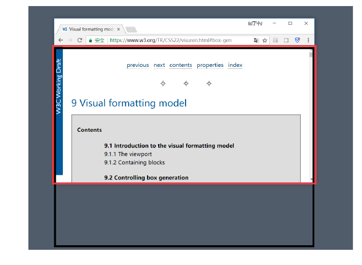

# CSS 元素的定位

## 标准流(Normal Flow)

- **定义**：标准流是 CSS 的默认布局模式，元素按照 HTML 文档顺序从上到下、从左到右排列。
  - **块级元素**（如 `<div>`、`<p>`、`<h1>`）：独占一行，垂直堆叠，宽度默认撑满父容器。
  - **行内元素**（如 `<span>`、`<a>`、``）：水平排列，空间不足时自动换行，宽度由内容决定。
- 特点 ：
  - 位置完全依赖 HTML 结构，无层叠效果，严格遵循文档流。  
  - 间距通过 `margin`（支持负值）和 `padding` 调整。  
    - 示例：`<div style="margin-top: -10px;">` 可使元素上移，与上方元素重叠。  
- 局限性 ：
  - 修改某元素的 `margin` 或 `padding` 可能引发连锁反应，影响相邻元素布局。  
    - 示例：`<div style="margin-left: 50px;">` 可能挤压右侧空间。  
  - 无法实现叠放、悬浮或固定等复杂布局效果。  

> **提示**：若需跳出标准流并独立定位，可使用 `position` 属性。

---

## 定位（Positioning）

定位通过 `position` 属性改变元素的布局行为，使其脱离标准流或以特定方式定位。常见场景包括：

- 将元素叠放在其他元素之上（如弹窗）。
- 固定元素在视口内（如回到顶部按钮）。


### position 属性取值

- **`static`**：默认值，遵循标准流。
- **`relative`**：相对定位，基于自身原始位置偏移。
- **`absolute`**：绝对定位，脱离标准流，相对最近定位祖先。
- **`fixed`**：固定定位，脱离标准流，相对视口。
- **`sticky`**：粘性定位，滚动至阈值时切换为固定。

> **定位元素定义**：  
>
> - **条件**：`position` 值不为 `static` 的元素（即 `relative`、`absolute`、`fixed`、`sticky`）。  
> - **特点**：  
>   - 使用 `top`、`right`、`bottom`、`left` 精确控制位置。  
>   - 默认宽高由内容决定，但可手动指定。  
>   - 脱离标准流后，不受块级/行内规则限制，不向父元素反馈尺寸。  
>   - 内部子元素仍按标准流排列。

---

## 静态定位（Static） 

- 定义：
  `position: static` 是所有元素的默认定位方式，严格遵循标准流布局。
- 特点 ：
  - `top`、`right`、`bottom`、`left` 属性无效。
  - 示例：`<div style="position: static; top: 10px;">` 中 `top` 无效果。

## 相对定位（Relative） 

- **定义**：  
  元素按标准流布局，但可通过 `top`、`right`、`bottom`、`left` 基于自身原始位置偏移。
- **特点**：  
  - **参照物**：自身在标准流中的原始位置。  
  - 偏移后仍占用原始空间，不影响其他元素布局。  
  - 示例：`<div style="position: relative; top: 10px; left: 20px;">` 下移 10px、右移 20px。  
- **应用场景**：  
  - 微调元素位置（如校正偏差）而不破坏整体布局。  
  - 常作为绝对定位元素的参照祖先。  


## 固定定位（Fixed） 

- **定义**：  
  元素脱离标准流，固定在视口中的指定位置，页面滚动时位置不变。  
- **特点**：  
  - **参照物**：视口（浏览器可视区域）。  
  - 使用 `top`、`right`、`bottom`、`left` 精确定位。  
  - 示例：`<div style="position: fixed; bottom: 10px; right: 10px;">` 固定在右下角。  

- **应用场景**：  
  - 悬浮按钮、固定导航栏等需始终可见的元素。  

> - **视口（Viewport）** ：浏览器可视区域，如下图红框所示。
> - **画布（Canvas）** ：渲染文档的区域，文档内容超出视口时可以滚动查看，如下图黑框所示。
> - **宽高对比**：画布 ≥ 视口



## 绝对定位（Absolute） 

- **定义**：  
  元素脱离标准流，相对于最近的定位祖先（`position` 非 `static`）定位，若无定位祖先则相对视口。  

- **特点**：  
  - **参照物**：最近的非 `static` 定位祖先，默认视口。  
  - 使用 `top`、`right`、`bottom`、`left` 精确定位，不占用原始空间。  
  - 示例：`<div style="position: absolute; top: 20px; left: 30px;">`。  

- **应用场景**：  
  - 弹出框、工具提示等需精确放置的元素。  

### “子绝父相”模式

- **常见用法**：  
  子元素设 `position: absolute`，父元素设 `position: relative`，实现相对于父元素的定位。  

  - **优点**：父元素保留标准流位置，子元素可灵活调整。  

  - 示例：  

    ```css
    .parent { position: relative; }
    .child { position: absolute; top: 10px; left: 10px; }
    ```

### 绝对定位元素的尺寸计算

- **宽度公式**：  

  ```plaintext
  定位参照对象的宽度 = left + right + margin-left + margin-right + 绝对定位元素的实际宽度
  ```

- **高度公式**：  

  ```plaintext
  定位参照对象的高度 = top + bottom + margin-top + margin-bottom + 绝对定位元素的实际高度
  ```

#### 特殊用法

1. **与参照对象一致**：  
   如果希望绝对定位元素的宽度和高度与参照对象一致，可以设置以下属性：  

   ```css
   position: absolute; left: 0; right: 0; top: 0; bottom: 0; margin: 0;
   ```

2. **居中显示**：  
   如果希望绝对定位元素在参照对象中居中显示，可以设置以下属性：  

   ```css
   position: absolute; left: 0; right: 0; top: 0; bottom: 0; margin: auto; width: 200px; height: 100px;
   ```

   同时需要指定具体的宽度和高度（宽高应小于参照对象的宽高）。

## 粘性定位 (Sticky)

- **定义**：  
  粘性定位融合了相对定位和固定定位的特点。元素在滚动未达到指定阈值时表现为相对定位，滚动至阈值后切换为固定定位。  

- **特点**：  

  - **参照对象**：最近的滚动容器（通常是视口或带有 `overflow` 的父元素）。  
  - **阈值设置**：通过 `top`、`right`、`bottom` 或 `left` 定义触发点（如 `top: 0` 表示顶部贴边时固定）。  
  - **应用场景**：吸顶导航栏、侧边栏固定等。  

- **示例**：  

  ```html
  <header style="position: sticky; top: 0; background: #f8f8f8; padding: 10px;">
    导航内容
  </header>
  <main style="height: 2000px;">页面内容...</main>
  ```

  *效果*：滚动时，`<header>` 在顶部固定，页面内容继续滑动。

## `position` 值对比

| **定位类型**        | **描述**                                     | **脱离标准流** | **定位元素** | **绝对定位元素** | **定位参照对象**         | **`top`/`left` 属性** |
| ------------------- | -------------------------------------------- | -------------- | ------------ | ---------------- | ------------------------ | --------------------- |
| `static` 静态定位   | 默认值，遵循标准流布局                       | 否             | 否           | 否               | 无                       | 无作用                |
| `relative` 相对定位 | 基于自身原始位置偏移，仍占标准流空间         | 否             | 是           | 否               | 自身原始位置             | 有作用                |
| `absolute` 绝对定位 | 脱离标准流，相对最近定位祖先或视口定位       | 是             | 是           | 是               | 最近定位祖先（无则视口） | 有作用                |
| `fixed` 固定定位    | 脱离标准流，固定于视口，不随滚动移动         | 是             | 是           | 是               | 视口                     | 有作用                |
| `sticky` 粘性定位   | 未达阈值时为相对定位，达阈值后固定于参照容器 | 部分           | 是           | 是               | 最近滚动容器（含视口）   | 有作用                |

## `auto` 的含义

- **定义**：  
  `auto` 表示“交由浏览器自动处理”，具体表现依元素类型和上下文而定。  

- **`width: auto` 的行为**：  
  1. **行内非替换元素**（如 `<span>`）：宽度包裹内容。  
  2. **块级元素**（如 `<div>`）：宽度撑满包含块（父容器宽度）。  
  3. **绝对定位元素**（如 `position: absolute`）：宽度包裹内容。  

- **示例解析**：  
  `800 = 200 + margin-left:0 + margin-right:0 + 0 + 0`  
  在绝对定位中，若 `left` 和 `right` 未定义，`width: auto` 会根据内容自适应。

## `z-index` 层叠顺序

- **定义**：  
  `z-index` 控制定位元素的层叠顺序，仅对 `position` 非 `static` 的元素生效。  

- **取值**：  
  正整数、负整数或 0（默认值）。值越大，元素越靠上层。  

- **比较规则**：  
  1. **兄弟元素**：  
     - `z-index` 越大，层叠越靠上。  
     - 值相同时，HTML 中后写的元素在上。  
  2. **非兄弟元素**：  
     - 追溯至最近的定位祖先进行比较，要求这些祖先明确设置了 `z-index`。  
     - 示例：子元素的 `z-index: 100` 若父元素 `z-index: 1`，仍可能被其他父元素 `z-index: 2` 的子元素覆盖。  


## 定位常见问题与技巧

- **溢出处理**：  
  - 定位元素超出父容器时，可用 `overflow: hidden` 隐藏溢出部分，或为父元素设 `position: relative` 调整参照。  

- **兼容性问题**：  
  - `sticky` 在 IE 中不支持，可用 JS 模拟或改用 `fixed` 替代。  

- **层叠上下文**：  
  - `z-index` 受父元素层叠上下文影响。`transform`、`opacity < 1` 等属性会创建新上下文，重置层叠顺序。  
  - 示例：父元素 `z-index: 1` 的子元素无法超越更高层级的独立上下文。  

- **与 Flex/Grid 结合**：  
  - `absolute` 元素脱离 Flex/Grid 布局，不影响容器排列。  
  - `relative` 可微调 Flex 子项位置，`absolute` 适合添加悬浮效果（如角标）。  

- **实用技巧**：  
  - **吸附边缘**：`position: sticky; top: 0;` 实现吸顶。  
  - **层级调试**：用 `z-index: 9999` 临时置顶元素，便于排查覆盖问题。
