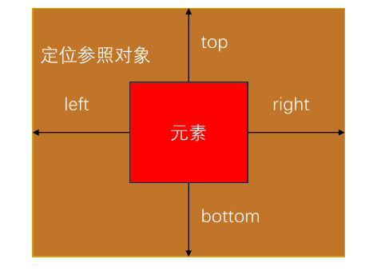
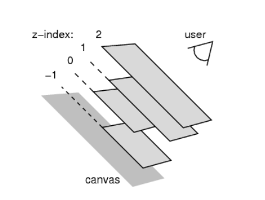

# CSS 元素的定位

CSS 定位通过 `position` 属性控制元素在页面中的排列与空间行为，默认遵循标准流，可实现灵活布局。

## 标准流(Normal Flow)

标准流是 CSS 的默认布局方式，元素按照 HTML 文档中的书写顺序从上到下、从左到右排列。

- **块级元素**: 独占一行，垂直堆叠，宽度默认撑满父容器的内容区（`width: auto`）
- **行内元素**: 水平排列，空间不足换行，宽度由内容决定。行内非替换元素不能设置宽高

- **特点**：
  - 元素位置完全由 HTML 结构决定
  - 元素不会重叠，始终按顺序排列。
  - 可用 `margin` 和 `padding` 调整间距，其中 `margin` 支持负值，可实现一定程度的重叠。
  - 块级元素可使用 `margin: 0 auto` 实现水平居中
- **局限性**：
  - 调整某元素的 `margin` 或 `padding` 会影响相邻元素布局。
  - 无法实现复杂的布局效果，如元素层叠、悬浮、固定位置或垂直居中。

> **提示**：当需要脱离标准流或实现精确定位时，可使用 `position` 属性。

---

## 定位（Position）

通过 `position` 属性，可以改变元素的布局行为，使其脱离标准流或以特定方式定位。

**常见场景**:

- **元素叠放**：如模态弹窗、图片遮罩。
- **固定位置**：如顶部导航栏、回到顶部按钮。
- **精确定位**：如角标、工具提示（tooltip）。


### `position` 属性取值

- **`static`**：默认值，遵循标准流。
- **`relative`**：相对定位，基于自身原始位置偏移，仍占据标准流空间。
- **`absolute`**：绝对定位，脱离标准流，相对最近定位祖先。
- **`fixed`**：固定定位，脱离标准流，相对于视口定位。

- **`sticky`**：粘性定位，根据滚动位置在相对定位和固定定位间切换。

---

## 静态定位（Static）

- **定义**：
  `position: static` 是元素的默认定位方式，完全遵循标准流规则。
- **特点**：
  - 元素位置由标准流决定，`top`、`right`、`bottom`、`left` 属性无效。
  - `z-index` 属性无效，无法控制层叠顺序。
  - 不能作为绝对定位（`absolute`）元素的定位祖先。

## 相对定位（Relative）

- **定义**：
  元素按标准流布局，但可通过 `top`、`right`、`bottom`、`left` 基于自身原始位置偏移。
  
- **特点**：
  - **参照物**：自身在标准流中的原始位置。
  
  - 偏移后仍占用原始空间，不影响其他元素的布局。
  
  - 可作为绝对定位元素的定位祖先。
  
  - 支持 `z-index` 属性，可控制层叠顺序。
  
  - 示例：
  
    ```html
    <div style="position: relative; top: 10px; left: 20px; background: lightblue;">
      相对定位元素
    </div>
    <div style="background: lightgray;">后续元素</div>
    ```
  
    结果：第一个 `<div>` 下移 10px、右移 20px，后续元素位置不变。
  
- **应用场景**：
  - 微调元素位置（如校正偏差）而不破坏整体布局。
  - 常作为绝对定位元素的参照祖先。



## 固定定位（Fixed）

- **定义**：
  元素脱离标准流，相对于视口（浏览器可视区域）定位，页面滚动时位置保持不变。
  
- **特点**：

  - **参照物**：视口（浏览器可视区域）。

  - 使用 `top`、`right`、`bottom`、`left` 精确定位。

  - 脱离标准流后，原始空间被后续元素占据。
    
    示例：
    
    ```css
    .btn { position: fixed; bottom: 20px; right: 20px; }
    ```
    
    按钮固定在视口右下角。

- **应用场景**：
  - 悬浮按钮、固定导航栏等需始终可见的元素。

> - **视口（Viewport）** ：浏览器可视区域，如下图红框所示。
> - **画布（Canvas）** ：渲染文档的区域，文档内容超出视口时可以滚动查看，如下图黑框所示。
> - **宽高对比**：画布 ≥ 视口

## 绝对定位（Absolute）

- **定义**：
  元素脱离标准流，相对于最近的非 `static` 定位祖先元素定位，若无则相对于视口。

- **特点**：

  - **参照物**：最近的定位祖先（`position` 非 `static`），若无则相对于初始包含块（通常为视口）。

  - 使用 `top`、`right`、`bottom`、`left` 设置精确位置，不占用原始空间。

  - 支持 `z-index`，控制层叠顺序。

  - **display 属性变化**：
    绝对定位元素默认变为块级元素，`display` 值会被计算为 `block`（原行内元素如 `<span>` 也可设置宽高）

    

  - 示例：

    ```html
    <div style="position: relative; width: 200px; height: 200px; background: #ddd;">
      <div style="position: absolute; top: 20px; left: 30px; background: #87ceeb;">
        绝对定位元素
      </div>
    </div>
    ```

    结果：子元素相对于父元素偏移，不影响外部布局。

> - 绝对定位元素的包含块是最近的定位祖先的 **padding 区域**（若祖先未设置 `position`，则相对于视口）
> - 若祖先元素应用了 `transform` 属性（CSS3），也会成为包含块（即使 `position: static`）

- **应用场景**：
  - 弹出框、工具提示、悬浮按钮等需精确定位且不干扰其他元素的场景。

### “子绝父相”模式

- **用法**：子元素设 `position: absolute`，父元素设 `position: relative`，实现相对于父元素的定位。
- **优点**：父元素保留标准流位置，子元素可灵活调整而不影响布局。  

- 示例：

  ```css
  .parent {
    position: relative;
  }
  .child {
    position: absolute;
    top: 10px;
    left: 10px;
  }
  ```

### 将`position`设置为`absolute`/`fixed`元素（绝对定位元素）的特点

绝对定位元素（Absolutely Positioned Element）是指 CSS 中 position 属性值为 absolute 或 fixed 的元素。具有以下特性：

- 使用 `top`、`right`、`bottom`、`left` 精确定位。
- 未设置宽高时，同时指定 `top` 和 `bottom` 会拉伸元素高度，同时指定 `left` 和 `right` 会拉伸元素宽度。  
- 已设置宽高时，同时指定 `top` 和 `bottom` 以 `top` 为准，`bottom` 无效；同时指定 `left` 和 `right` 以 `left` 为准，`right` 无效。
- **默认定位位置**：若未设置 `top/left`，元素会基于最近定位祖先的左上角定位（若无则视口左上角），但原始位置空间已脱离标准流
- 默认宽高由内容决定，但可手动设置（即使是行元素）。
- 脱离标准文档流，不受块级或行内元素规则限制。
- 不向父元素反馈尺寸信息。
- 内部子元素仍按标准流排列。

#### 尺寸计算公式

绝对定位元素的尺寸和位置与其定位参照物密切相关，具体公式如下：

- **宽度计算**（包含块宽度 = 元素宽度 + 左右定位值 + 左右 margin）：

  ```plaintext
  元素实际宽度 = 包含块宽度 - (left + right + margin-left + margin-right)
  ```

- **高度计算**（包含块高度 = 元素高度 + 上下定位值 + 上下 margin）：

  ```plaintext
  元素实际高度 = 包含块高度 - (top + bottom + margin-top + margin-bottom)
  ```

### 特殊用法

1. **与参照对象尺寸一致**：
   设置以下样式使绝对定位元素的宽度和高度与参照物一致

   ```css
   position: absolute;
   top: 0;
   right: 0;
   bottom: 0;
   left: 0;
   margin: 0;
   /*效果：元素将完全填充参照物的宽高，边距为零*/
   ```
   
2. **居中显示**：
   设置以下样式使绝对定位元素在参照物中水平和垂直居中：

   ```css
   position: absolute;
   top: 0;
   right: 0;
   bottom: 0;
   left: 0;
   margin: auto;
   width: 200px;  /* 必须指定具体宽度 */
   height: 100px; /* 必须指定具体高度 */
   ```
   
   必须显式指定元素的 width 和 height，且宽高值应小于参照物的对应尺寸。
   
   margin: auto 会自动计算并分配剩余空间，实现居中效果。 

> 绝对定位元素的默认宽高由内容决定，但可以通过 CSS 显式设置 width 和 height。
>
> 即使是行内元素（例如 <span>），一旦设置为绝对定位，也可以拥有宽高属性。

## 粘性定位 (Sticky)

`position: sticky` **本质上是 `relative` 和 `fixed` 的结合**

- **定义**：
  元素在滚动到指定阈值前表现为相对定位，超过阈值后切换为固定定位，相对于最近的滚动祖先。

- **特点**：

  - **参照物**：最近的滚动祖先（祖先的 `overflow` 为 `hidden`、`scroll` 或 `auto`），若无则相对于视口。
  - 使用 `top`、`right`、`bottom`、`left` 属性设置阈值。（如 `top: 0` 表示顶部贴边时固定）。
  - **应用场景**：吸顶导航栏、侧边栏固定等。
  - 必须至少设置一个阈值（如 `top: 0`），否则不会触发粘性行为。

- **示例**：

  ```html
  <header style="position: sticky; top: 0; background: #f8f8f8; padding: 10px;">
    导航内容
  </header>
  <main style="height: 2000px;">页面内容...</main>
  ```

  _效果_：滚动时，`<header>` 在顶部固定，页面内容继续滑动。

## `position` 值对比

| **定位类型**        | **描述**                                     | **脱离标准流**                       | **定位元素** | **绝对定位元素** | **定位参照对象**         | **`top`/`left` 属性** |
| ------------------- | -------------------------------------------- | ------------------------------------ | ------------ | ---------------- | ------------------------ | --------------------- |
| `static` 静态定位   | 默认值，遵循标准流布局                       | 否                                   | 否           | 否               | 无                       | 无作用                |
| `relative` 相对定位 | 基于自身原始位置偏移，仍占标准流空间         | 否                                   | 是           | 否               | 自身原始位置             | 有作用                |
| `absolute` 绝对定位 | 脱离标准流，相对最近定位祖先或视口定位       | 是                                   | 是           | 是               | 最近定位祖先（无则视口） | 有作用                |
| `fixed` 固定定位    | 脱离标准流，固定于视口，不随滚动移动         | 是                                   | 是           | 是               | 视口                     | 有作用                |
| `sticky` 粘性定位   | 未达阈值时为相对定位，达阈值后固定于参照容器 | 未达阈值时遵循标准流，达到阈值后脱离 | 是           | 是               | 最近滚动容器（含视口）   | 有作用                |

## `auto` 的含义

- **定义**：
  `auto` 表示“交由浏览器自动处理”，具体表现依元素类型和上下文而定。

- **`width: auto` 的行为**：

  1. **行内非替换元素**（如 `<span>`）：宽度包裹内容。
  2. **块级元素**（如 `<div>`）：宽度撑满包含块（父容器宽度）。
  3. **绝对定位元素**（如 `position: absolute`）：宽度包裹内容。

- **示例解析**：
  `800 = 200 + margin-left:0 + margin-right:0 + 0 + 0`
  在绝对定位中，若 `left` 和 `right` 未定义，`width: auto` 会根据内容自适应。

## `z-index` 层叠顺序

- **定义**：
  `z-index` 控制定位元素的层叠顺序，仅对 `position` 非 `static` 的元素生效。

- **取值**：
  正整数、负整数或 0（默认），值越大越靠上。

- **比较规则**：
  1. **兄弟元素**：
     - `z-index` 越大，层叠越靠上。
     - 值相同时，HTML 中后写的元素在上。
  2. **非兄弟元素**：
     - 追溯至最近的定位祖先进行比较，要求这些祖先明确设置了 `z-index`。
     - 示例：子元素的 `z-index: 100` 若父元素 `z-index: 1`，仍可能被其他父元素 `z-index: 2` 的子元素覆盖。



**层叠上下文创建条件**：
- `position: relative/absolute/fixed/sticky` + `z-index ≠ auto`
- `opacity < 1`
- `transform`、`filter`、`perspective` 等属性。

## 定位常见问题与技巧

- **溢出处理**：

  - 定位元素超出父容器时，可用 `overflow: hidden` 隐藏溢出部分，或为父元素设 `position: relative` 调整参照。

- **兼容性问题**：

  - `sticky` 在 IE 中不支持，可用 JS 模拟或改用 `fixed` 替代。

- **层叠上下文**：

  - `z-index` 受父元素层叠上下文影响。`transform`、`opacity < 1` 等属性会创建新上下文，重置层叠顺序。
  - 示例：父元素 `z-index: 1` 的子元素无法超越更高层级的独立上下文。

- **与 Flex/Grid 结合**：
  - `absolute` 元素脱离 Flex/Grid 布局，不影响容器排列。
  - `relative` 可微调 Flex 子项位置，`absolute` 适合添加悬浮效果（如角标）。
  
- **实用技巧**：
  - **吸顶导航**：`position: sticky; top: 0;`。
  - **全屏遮罩**：`position: fixed; top: 0; right: 0; bottom: 0; left: 0;`。
