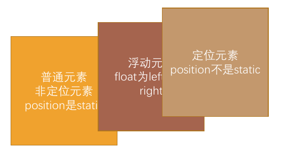

# 浮动

## 认识浮动

- **`float`属性**：使元素脱离标准文档流，向左或右移动，允许文本或其他内联元素环绕其周围。
- **设计初衷**：实现图文混排（如图片与文字环绕），而非复杂布局。
- **历史背景**：早期因布局方案有限，曾被用于多列布局，但非其设计初衷。

### 浮动与绝对定位对比

| 特性           | `float`                                                      | `position: absolute`                                         |
| -------------- | ------------------------------------------------------------ | ------------------------------------------------------------ |
| **文档流影响** | 脱离文档流，但同级元素会环绕它；父元素高度不包含浮动元素     | 完全脱离，不占据原有位置                                     |
| **内容交互**   | 允许文本和内联元素环绕浮动元素                               | 独立于文档流，与其他元素绝对层叠，不参与内容环绕             |
| **定位参考系** | 基于包含块（父容器）侧边移动，位置受浮动方向（left/right）约束 | 基于最近的已定位（position≠static）祖先元素，若无则参考初始包含块（浏览器视口） |
| **尺寸与布局** | 强制转换为块级元素，尺寸由内容决定                           | 强制转换为块级元素，尺寸可由定位属性（top/bottom等）直接控制 |
| **父元素影响** | 父容器需显式设置高度或清除浮动才能包含浮动元素               | 父容器若未设置定位，绝对定位元素将参考初始包含块；若父级已定位，则参考父级 |

> **提示**：浮动适合内容环绕场景，绝对定位适合独立元素的精准定位。

**常用取值**：

- `none`：不浮动（默认值）。
- `left`：向左浮动。
- `right`：向右浮动。

## 浮动规则

### 规则一：脱离标准流

 元素一旦浮动后，将脱离标准流。

- 它会朝着左或右方向移动，直到其边界紧贴包含块（通常是父元素）或其他浮动元素的边界。
- **层叠顺序**：
  - 浮动元素位于非定位元素之上，但低于定位元素
  - 后声明的浮动元素覆盖前者，若空间不足则换行。



### 规则二：边界限制

- **包含块约束**：
  - 左浮动元素左边界不能超出父容器左边界。
  - 右浮动元素右边界不能超出父容器右边界。
- **负外边距的特殊处理**：
  - 设置负外边距（如`margin-left: -20px`）可让元素向外偏移，但超出父容器的部分：
    - 若父容器`overflow: visible`，超出内容可见；
    - 若父容器`overflow: hidden/auto`，超出内容被截断。


### 规则三：浮动元素的排列

浮动元素按顺序排列，不能重叠：

- 左浮动元素紧贴前一个左浮动元素，右浮动元素紧贴前一个右浮动元素。
- 若水平空间不足，后续浮动元素会自动换行，寻找足够的空间。


### 规则四：**环绕特性 (与行内内容的交互)**

浮动元素不能与行内级内容层叠，行内级内容将会被浮动元素推出

- **行内内容**：被推出并环绕浮动元素，不与其重叠。
- 标准流中的**块级元素**本身会无视浮动元素（好像它不存在一样），但其**内部的行内内容**仍然会为浮动元素让出空间。
- **特例**：如果一个标准流块级元素创建了新的**块级格式化上下文 (BFC)**（例如设置 `overflow: hidden` 或 `display: flow-root`），那么该块级元素将**不会**与浮动元素重叠，而是会在旁边排列。
- **示例**：左浮动的图片会使右侧文字环绕，形成经典的图文混排效果。


### 规则五：浮动后的对齐方式

浮动元素顶部与**当前行的顶部**对齐：

- 行内元素浮动后转为块级特性，顶部与所在行对齐。
- 块级元素浮动后，顶部默认贴近父容器顶部（除非受其他浮动元素影响）。


## 浮动问题：高度塌陷（Height Collapse）

- **原因** ：当一个容器元素的所有子元素都设置为浮动时，由于浮动元素脱离了标准流，父容器无法自动计算它们的高度，导致父容器的高度变为 0（或者只包含未浮动内容的高度），看起来就像“塌陷”了。

- **示例**：

```html
<div class="parent">
  
  <p>文本内容</p>
</div>
```

- **后果**：影响后续元素的布局，可能导致背景、边框等样式显示不正确。
- **解决**：解决高度塌陷的过程称为**清除浮动 (Clearing Floats)**。目标是让父容器能够“感知”并包裹住其内部浮动子元素的高度。

## 清除浮动 (`clear` 属性)

`clear` 属性用于指定一个元素的顶部边界必须位于**前面**出现的浮动元素下方。它应用于**标准流**中的元素，用来控制该元素与**前面**浮动元素的关系。

`clear` 的常用取值：

- `left`：元素的顶部必须低于所有**前面**的左浮动元素的底部。
- `right`：元素的顶部必须低于所有**前面**的右浮动元素的底部。
- `both`：元素的顶部必须低于所有**前面**的左、右浮动元素的底部（**最常用**）。
- `none`：允许元素两侧都有浮动元素（默认值）。

## 清除浮动的方法

浮动元素脱离标准流后，父容器无法感知其高度，导致高度塌陷。清除浮动的核心是**强制父容器包含浮动子元素的高度**，通常通过触发 **BFC（块级格式化上下文）** 或直接清除浮动元素的影响。

### 1. 父容器设置 `overflow: hidden`

```css
.parent {
  overflow: hidden; /* 或 auto/scroll */
}
```

- **原理**：触发 BFC（块级格式化上下文），强制父容器包裹浮动子元素。
- **注意**：可能裁剪子元素的溢出内容（如超出边界的下拉菜单）。

### 2. 在父元素末尾添加空块级元素（旧方案）

- **原理**：在所有浮动元素之后添加一个空的块级元素，并设置 `clear: both`。
- **缺点**：增加了无意义的 HTML 结构，违反了内容与表现分离的原则。**应避免使用**。

### 3. 伪元素 `::after` 清除法（经典方案）

在父元素的末尾添加一个隐藏的块级伪元素，并对其应用 `clear: both`，强制父容器的“底部”位于所有浮动子元素之下，从而将其包裹。

- **优点**：兼容性好，不需添加额外 HTML 标签，符合结构与样式分离。
- **缺点**：相比 `flow-root` 代码稍多。

```css
.clearfix::after {
  content: "";     /* 必须，生成伪元素 */
  display: block;  /* 使伪元素成为块级，能应用 clear */
  clear: both;     /* 清除前面左右浮动的影响 */
  height: 0;       /* 可选，防止产生额外高度 */
  visibility: hidden; /* 可选，确保伪元素不可见 */
}

/* 为了兼容旧版 IE (IE6/7)，有时会添加 zoom: 1 触发 hasLayout */
/* .clearfix { *zoom: 1; }  <-- 现代开发中基本不再需要 */
```

- `display: table` 触发 BFC，`clear: both` 确保父容器包裹浮动元素。
- `*zoom: 1` 是 IE6/7 的私有属性，通过 `hasLayout` 触发 BFC。

### **4. `display: flow-root`（首选）**

```css
.parent {
  display: flow-root; /* 触发 BFC 且无副作用 */
}
```

- **原理**：
  - `flow-root` 强制父容器生成 BFC，同时作为匿名块容器包含浮动子元素。
- **优点**：
  - **无副作用**：不裁剪内容，避免 `overflow` 的潜在问题。
  - **语义明确**：专为浮动布局设计
  - 无需伪元素或额外标签，渲染更轻量。

## 浮动元素特性变化

- **转为块级元素**：浮动后的元素自动获得`display: block`特性（即使原为行内元素）
- **宽度自适应**：未设置宽度时，浮动元素宽度由内容撑开（类似`inline-block`）

## 将多个行内级元素中间的空格（间隙）去除的方法

虽然不是 `float` 的主要用途，但浮动确实可以消除行内块元素（如 `display: inline-block` 的 `` 或 `<li>`）之间因 HTML 源码中的换行符或空格产生的间隙。

```html
<ul>
  <li style="float: left;">Item 1</li>
  <li style="float: left;">Item 2</li>
  <li style="float: left;">Item 3</li>
</ul>
<div style="clear: both;"></div> <!-- 或者父元素使用 clearfix / flow-root -->
```

- **原理**：浮动元素脱离标准流，不再像行内元素那样受空白符影响。
- **注意**：这种方法会带来高度塌陷问题，需要额外清除浮动。
- **更好的方法**：现代布局中，解决行内元素间隙通常使用 **Flexbox (`display: flex` 在父元素上)**，或者通过设置父元素 `font-size: 0` 再在子元素上重置 `font-size`，或直接移除 HTML 源码中的空格/换行。
