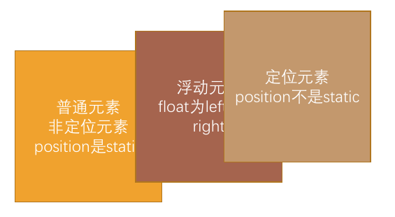
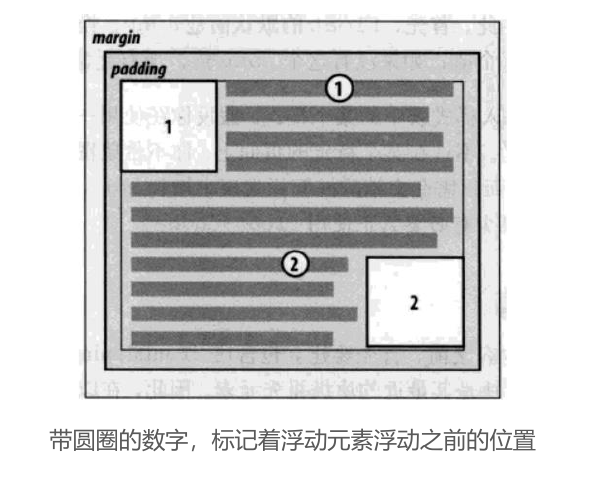
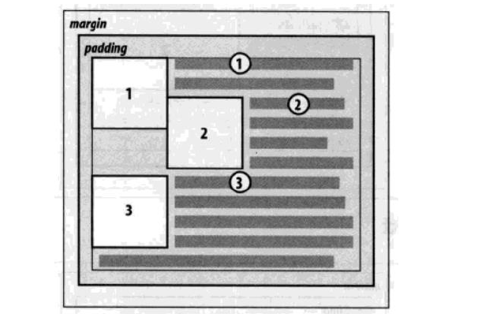
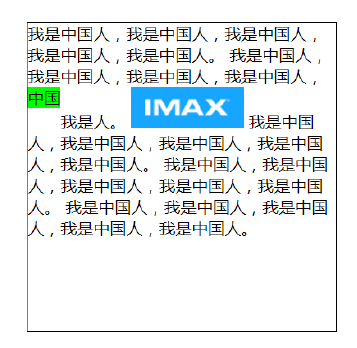
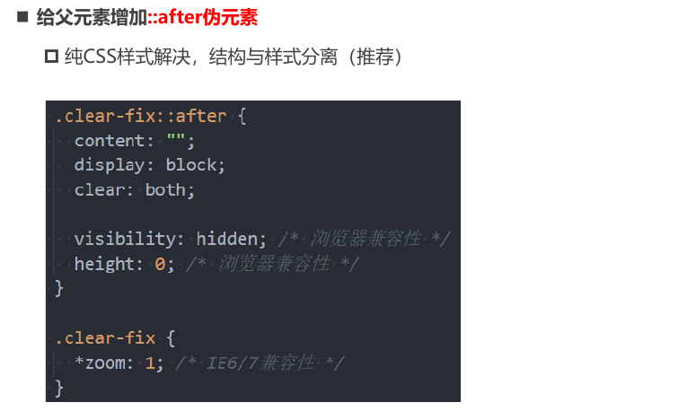

# 浮动

## 认识浮动

`float` 属性用于指定一个元素在其容器的左侧或右侧放置，从而允许文本和内联元素环绕它。 

- `float` 属性最初是为了在文本中实现图像的浮动效果，使文字能够环绕图像。
- 由于早期 CSS 标准缺乏良好的左右布局方案，`float` 在一段时间内成为网页多列布局的主要工具。

> 注意：绝对定位和浮动都会使元素脱离标准流，以实现灵活的布局效果。

可以通过 float 属性让元素产生浮动效果, float 的常用取值:

- `none`: 不浮动，默认值。

- `left`: 向左浮动。
- `right`: 向右浮动。

## 浮动规则

### 规则一：元素脱离标准流

 元素一旦浮动后，将脱离标准流。 

- 它会朝着左或右方向移动，直到其边界紧贴包含块（通常是父元素）或其他浮动元素的边界。
- 定位元素会层叠在浮动元素之上。

### 规则二：浮动元素的边界限制

如果元素向左（或右）浮动，浮动元素的左（或右）边界不能超出包含块的左（或右）边界。

### 规则三：浮动元素的排列

浮动元素之间不能层叠。 

- 如果一个元素浮动，而另一个浮动元素已经占据了该位置，后浮动的元素将紧贴前一个浮动元素（左浮找左浮，右浮找右浮）。
- 如果水平方向剩余的空间不足以显示浮动元素，后浮动元素将向下移动，直到有足够的空间为止。

### 规则四：浮动元素与行内元素的交互

浮动元素不能与行内级内容层叠，行内级内容将被浮动元素推出。 

- 例如，行内级元素、`inline-block` 元素、块级元素的文字内容。

### 规则五：行内元素浮动后的对齐方式

行内级元素和 `inline-block` 元素浮动后，其顶部将与所在行的顶部对齐。

## 浮动问题 - 高度塌陷

- 由于浮动元素脱离了标准流, 变成了脱标元素, 所以不再向父元素汇报高度
  - 父元素计算总高度时, 就不会计算浮动子元素的高度, 导致了高度坍塌的问题
- 解决父元素高度坍塌问题的过程, 一般叫做清浮动(清理浮动、清除浮动)
- 清浮动的目的是
  - 让父元素计算总高度的时候, 把浮动子元素的高度算进去

## clear 属性

 `clear` 属性用于指定一个元素是否必须移动（清除浮动后）到在它之前的浮动元素下面。

`clear` 的常用取值： 

- `left`: 要求元素的顶部低于之前生成的所有左浮动元素的底部。
- `right`: 要求元素的顶部低于之前生成的所有右浮动元素的底部。
- `both`: 要求元素的顶部低于之前生成的所有浮动元素的底部。
- `none`: 默认值，无特殊要求。

## 清楚浮动的方法

### 1. 给父元素设置固定高度 

- 扩展性差（不推荐）。

### 2. 在父元素最后增加一个空的块级子元素，并设置 `clear: both` 

- 会增加许多无意义的空标签，维护麻烦。
- 违反了结构与样式分离的原则（不推荐）。

### 3. 给父元素添加一个伪元素 

- 通过给父元素添加一个伪元素（`::after`）并应用 `clear: both` 来清除浮动。该方法不改变HTML结构，简洁高效，是最推荐的做法。

这种方法不会在 DOM 中添加额外元素，保持了 HTML 的干净结构，且具有较好的扩展性。

## 布局方案总结

| 布局方案                        | 应用场景                               |
| :------------------------------ | :------------------------------------- |
| `normal flow` 标准流            | 垂直布局，元素按顺序堆叠               |
| `absolute positioning` 绝对定位 | 层叠布局，元素脱离标准流并自由定位     |
| `float` 浮动                    | 水平布局，主要用于文本环绕、并排布局等 |
