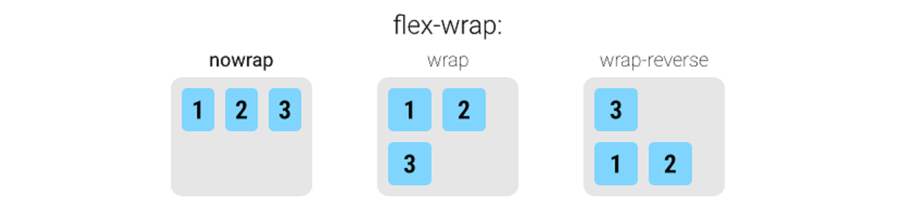
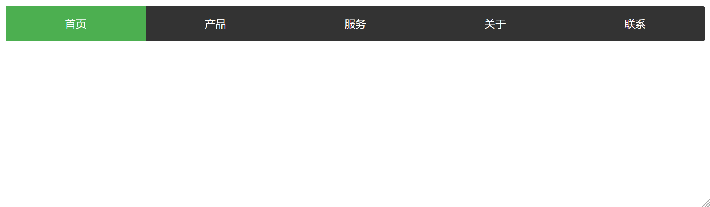

# Flex 布局

## Flexbox 基础

### 什么是 Flexbox？

**Flexbox**（弹性盒子布局）是一种现代 CSS 一维布局模型，旨在更高效地在容器内排列、对齐和分配项目空间，即使项目尺寸未知或动态变化。

- **核心特性**：
  - **弹性**：子项能根据可用空间自动 **伸展 (grow)** 以填充，或 **收缩 (shrink)** 以适应，实现响应式和自适应布局。
  - **一维布局**: 主要沿**单条轴线**（主轴）布局，可以是水平行或垂直列。这与侧重二维网格的 **Grid 布局**形成互补。
  - **方向无关**: 相较于基于块级/行内方向的传统布局，Flexbox 更易于改变布局方向（如从水平切换到垂直）。

> **注意**：虽然 Flexbox 本质是一维模型，但通过 `flex-wrap: wrap` 属性，项目可以在容器空间不足时换行（或换列），形成多行（或多列）的布局效果。

### 为什么需要 Flex 布局？

在 Flexbox 诞生之前，Web 开发者主要依赖以下技术进行布局，但它们各有局限：

- **浮动 (float)**：
  - 设计初衷是实现文本环绕图片效果，并非通用布局系统。
  - **痛点**：需要手动清除浮动（`clear`）防止父容器高度塌陷；多列等高布局困难；容易产生复杂的布局问题。

- **定位 (positioning)**：
  - `relative`, `absolute`, `fixed` 主要用于元素精确放置或脱离文档流。
  - **痛点**：对于需要自适应内容和容器尺寸的流式布局，维护成本高，难以实现灵活的空间分配和对齐。
- **表格布局 (table layout)**：
  - 使用 `<table>` 元素或 CSS `display: table/table-cell` 进行布局。
  - **痛点**：结构冗余，语义不符（表格应用作数据展示）；渲染性能相对较低；不够灵活。

#### **传统布局的痛点**

1. **垂直居中**：需复杂计算或借助表格布局。  
2. **等分空间**：子元素需手动设置百分比，难适应内容变化。  
3. **多列对齐**：浮动布局中列高不齐，需额外处理。  
4. **动态适配**：容器或内容变化时调整困难，常需 hack。

## 基础概念


### Flexbox 核心术语


- **Flex Container（弹性容器）**：通过 `display: flex` 或 `inline-flex` 定义的父元素，负责管理子元素的排列和对齐。
- **Flex Item (弹性子项)**

  - 弹性容器的**直接**子元素。
  - 自动成为 Flex 项目，其布局受容器属性和自身属性共同控制。

  - **特性**：
    - **布局集中管理**：大部分布局控制在容器层面完成。
    - **块级化行为**：即使是行内元素（如 `<span>`），一旦成为 Flex Item，也会表现得类似块级元素，可以设置 `width` 和 `height`。
    - **包裹内容尺寸**：默认情况下，Flex Item 的尺寸由其内容决定，但可以通过 `width`, `height`, `flex-basis` 等属性设定。
    - `float`, `clear`, `vertical-align` 属性失效。

- **轴线 (Axes)**：Flexbox 布局基于两条轴线。

  - **主轴 (Main Axis)**：Flex Item 排列的主要方向。由 `flex-direction` 属性定义（默认为水平方向）。
  - **交叉轴 (Cross Axis)**：垂直于主轴的方向。

  - **起止点**：
    - 主轴：`main-start`（主轴起点） -> `main-end`（主轴终点）
    - 交叉轴：`cross-start`（交叉轴起点） -> `cross-end`（交叉轴终点）
  - **尺寸术语**：
    - `main size`：Item 在主轴方向上的尺寸（宽度或高度）。
    - `cross size`：Item 在交叉轴方向上的尺寸（高度或宽度）。

### 如何创建 Flex Container？

通过 CSS 的 `display` 属性将一个元素定义为 Flex 容器：

- `display: flex;`：创建块级 Flex 容器（占据整行）。
- `display: inline-flex;`：创建行内级 Flex 容器（像行内元素一样流动）。

## Flex 属性概述

Flexbox 的属性分为两类：作用于 **Flex Container** 的属性（控制整体布局）和作用于 **Flex Item** 的属性（控制单个子项）。

### 应用于 Flex Container 的属性

- **`flex-direction`**：定义主轴方向（如 `row`、`column`）。
- **`flex-wrap`**： 控制项目是否换行（如 `nowrap`、`wrap`）
- **`flex-flow`**：`flex-direction` 和 `flex-wrap` 的简写。
- **`justify-content`**：定义项目在 **主轴** 上的对齐和空间分配
- **`align-items`**：定义项目在 **交叉轴** 上单行的对齐方式
- **`align-content`**：定义 **多行** 项目在交叉轴上的对齐和空间分配（需 `wrap`）
- **`gap`, `row-gap`, `column-gap`**: 定义项目之间的间距。

### 应用于 Flex Item 的属性

- **`flex-grow`**：指定剩余空间的分配比例。
- **`flex-shrink`**：指定空间不足时的收缩比例。
- **`flex-basis`**: 定义项目在主轴上的初始（基准）尺寸。
- **`flex`**：`flex-grow`, `flex-shrink`, `flex-basis` 的简写
- **`order`**: 控制项目的排列顺序（数值越小越靠前）。
- **`align-self`**：单独调整子项在交叉轴上的对齐方式，覆盖 `align-items`

## Flex Container 属性详解

### `flex-direction`

- **作用**：定义主轴方向，决定 flex 项目（flex item）在容器内的排列顺序。
- **取值**：
  - `row`（默认）：水平从左到右，适用于横向布局。
  - `row-reverse`：水平从右到左，反向排列。
  - `column`：垂直从上到下，常用于垂直堆叠布局。
  - `column-reverse`：垂直从下到上，适用于倒序列表。

- **影响**：改变主轴方向会同时改变交叉轴方向，并影响 `justify-content`（沿新主轴对齐）和 `align-items`（沿新交叉轴对齐）的行为。


### `flex-wrap`

- **作用**：控制当 Flex Items 在单行（或单列）放不下时，是否换行以及如何换行。
- **取值**：
  - `nowrap`（默认）：强制单行，子项可能溢出或压缩。
  - `wrap`: 换行。新行（或列）沿着交叉轴的正方向堆叠（默认从上往下）。
  - `wrap-reverse`: 反向换行。新行（或列）沿着交叉轴的负方向堆叠（默认从下往上）。



### `flex-flow`

- **作用**：`flex-direction` 和 `flex-wrap` 的简写。
- **语法**：`flex-flow: <direction> <wrap>;`（顺序随意，可省略任一值）。
- **默认值**：`row nowrap`。
- **示例**：`flex-flow: column wrap;` 表示主轴垂直从上到下，且允许项目换列。

### `justify-content`

- **作用**： 定义项目在**主轴**上的对齐和空间分配。
- **取值**：
  - `flex-start`（默认）：项目靠近主轴起点排列（如左对齐）。
  - `flex-end`：靠主轴终点对齐（如右对齐）。
  - `center`: 项目在主轴上居中对齐。
  - `space-between`：两端对齐，项目之间的间隔相等（首尾项目紧贴容器边缘）
  - `space-around`：每项两侧间距相等（首尾间距为中间一半）。
  - `space-evenly`：所有间隔完全相等（包括容器边缘与首尾项目之间）


### `align-items`

- **作用**：控制交叉轴上单行 Flex Item 的对齐方式。
- **取值**：
  - `stretch`（默认）：拉伸填满交叉轴（前提是未设定固定高度）。
  - `flex-start`：项目靠近交叉轴起点排列。
  - `flex-end`：项目靠近交叉轴终点排列。
  - `center`: 居中对齐。
  - `baseline`: 按项目内容的第一行文字基线对齐。


### `align-content`

- **作用**：定义**多行**项目在**交叉轴**上的对齐和间距（需启用 `flex-wrap: wrap`）。
- **取值**：（与 `justify-content` 类似，但作用于交叉轴上的多行）
  - `stretch` (默认): 各行拉伸以填满交叉轴的剩余空间（如果行内项目允许）。
  - `flex-start`：靠交叉轴起点对齐。
  - `flex-end`：靠交叉轴终点对齐。
  - `center`：居中对齐。
  - `space-between`：首行在起点，末行在终点，中间各行均匀分布。
  - `space-around`：每行上下两侧的间隔相等。
  - `space-evenly`: 所有行之间的间隔，以及首行与起点、末行与终点之间的间隔都完全相等。
- *注意*: 只有一行项目时此属性无效。


### `gap` / `row-gap` / `column-gap`

- **作用**：控制项目之间的间距（无需依赖 `margin`）。

- **语法**：

  - **`gap: <row-gap> <column-gap>;`**  
    双值简写，分别设置行间距（交叉轴方向）和列间距（主轴方向）。
  - **`gap: <gap>;`**  
    单值简写，同时设置行和列间距为相同值。
  - 也可单独使用 `row-gap` 或 `column-gap` 设置单轴间距。

- **取值**：长度值（如 `10px`、`1em`）或百分比（相对于容器尺寸）。

- **特性**：

  - 间距 **只在项目之间** 产生，不会在容器边缘添加。
  - 与 `flex-wrap: wrap` 完美配合，自动处理换行后的行间距。
  - 替代传统 `margin` 方案，避免了处理首尾元素外边距的问题。

- **示例**：

  ```css
  .container {
    display: flex;
    flex-wrap: wrap;
    gap: 16px 8px; /* 行间距 16px, 列间距 8px */
  }
  ```

  

## Flex Item 属性详解

这些属性设置在 Flex 项目（子元素）上，控制单个项目的行为。

### `order`

- **作用**：定义项目的排列顺序。默认值 `0`。数值越小越靠前。可为负数。
- **示例**：`order: 1;` 将元素移至后面。


### `flex-grow`

- **作用**：定义剩余空间分配比例，默认值为 `0`（不分配）。
- **取值**：非负数值（正整数、正小数或 0）。
- **计算方式**：剩余空间按各子项的 `flex-grow` 值比例分配。
  - 实际分配比例 = (flex-grow 值 / 所有项目的 flex-grow 总和) × **剩余空间**
  - 示例：容器剩余 300px，子项 A 设置 `flex-grow: 2`，子项 B 设置 `flex-grow: 1`，总和为 3，则 A 分配 200px（2/3），B 分配 100px（1/3）。
- **注意**：若所有子项的 `flex-grow` 均为 `0`，则剩余空间不分配。
- Flex items 扩展后的最终 size 不能超过 `max-width\max-height`


### `flex-shrink`

- **作用：**  定义了 flex 元素如何在空间不足时收缩
  
- **作用**：定义当 Flex 容器在主轴方向上 **空间不足**（即所有 Items 的 `flex-basis` 或内容尺寸之和大于容器尺寸）时，当前 Flex Item 应 **承担的收缩比例**。
  
- **默认值**：`1`（表示默认允许收缩）。
  
- **取值**：非负数值。`0` 表示该项目 **不允许收缩**。
- **生效条件**：仅当所有子项总尺寸超过容器主轴尺寸时触发。
- **收缩计算公式**：
  - 溢出量 × 该子项的 `flex-shrink` 值 ÷ 所有子项 `flex-shrink` 值之和。
  - 示例：容器溢出 100px，子项 A 设置 `flex-shrink: 2`，子项 B 设置 `flex-shrink: 1`，总和为 3，则 A 收缩 66.67px（2/3），B 收缩 33.33px（1/3）。
- **约束**：收缩后尺寸不会小于子项的 `min-width` 或 `min-height`。
- **注意**：`flex-shrink: 0` 表示禁止收缩。


> **Flex 布局中 flex-grow 与 flex-shrink 的作用规则总结：**
>
> 1. **允许换行（`flex-wrap` 为 `wrap` 或 `wrap-reverse`）：**
>    - **子项总宽度小于父容器**：所有子项根据 `flex-grow` 的值按比例分配剩余空间，若 `flex-grow` 为 0，则不放大。
>    - **子项总宽度超出父容器宽度**：
>      - 自动换行，每行独立处理剩余空间。
>      - 若某行子项总宽度小于该行可用空间，且 `flex-grow` 存在非零值，则按比例分配该行剩余空间。
>      - 若某行子项总宽度超出，换行解决，不触发 `flex-shrink`。
>
> 2. **禁止换行（`nowrap`）：**
>    - **子项总宽度不足**：`flex-grow` 生效，按比例放大（值为 0 不放大）。
>    - **子项总宽度超出**：`flex-shrink` 生效，按比例缩小（值为 0 不缩小）。若所有子项 `flex-shrink` 为 0，则横向溢出。
>
> **核心规则：**
>
> - **规律**：在任意情况下，`flex-grow` 和 `flex-shrink` 只有一个会生效：
>   - **空间充足（子项总宽度 < 父容器宽度）**：`flex-grow` 控制子项放大。
>   - **空间不足（子项总宽度 > 父容器宽度）**：`flex-shrink` 控制子项缩小。
> - 换行布局（`wrap`）通过分行避免横向溢出，每行剩余空间由 `flex-grow` 分配，`flex-shrink` 不参与。
> - 不换行（`nowrap`）时，空间不足直接触发 `flex-shrink`，空间富余则触发 `flex-grow`。
>
> **结论：** Flex 布局通过 `flex-wrap` 控制换行策略，从而影响空间分配逻辑：
>
> - 换行时，每行独立计算，仅 `flex-grow` 分配剩余空间。
> - 不换行时，`flex-grow` 和 `flex-shrink` 分别响应空间富余与不足的情况。

### `flex-basis`

- **作用**：指定 Flex Item 在主轴上的 **初始尺寸 (main size)**。这是在应用 `flex-grow` 或 `flex-shrink` 进行空间调整之前的 **基准尺寸**。
- **取值**：
  - **`auto`**（默认）：根据子项的 `width`/`height` 或内容固有尺寸确定。
  - 具体值（如 `100px`、`20%`）：显式设置初始尺寸。
- **优先级**（从高到低）：
  1. `max-width` / `max-height` 或 `min-width` / `min-height`（约束边界）。
  2. `flex-basis`（显式基准值）。
  3. `width` / `height`（传统尺寸属性）。
  4. 内容固有尺寸（无显式设置时的默认值）。
- **作用**  
  - 在分配剩余空间或计算收缩前，`flex-basis` 作为元素的初始大小参考。

> 当同时存在 `width`/`height` 与 `lex-basis` 时，`flex-basis`（如果不为 `auto`）通常会覆盖传统的 `width`/`height`

### `flex`（简写属性）

- **`flex` 是 `flex-grow`、`flex-shrink` 和 `flex-basis` 的简写**  
  - 可指定 1 个、2 个或 3 个值，语法灵活但有严格规则。  

- **单值语法**  
  - `<number>`（无单位数，如 `2`）：视为 `flex-grow`，`flex-shrink` 默认为 1，`flex-basis` 默认为 0。  
  - 有效宽度值（如 `100px`）：视为 `flex-basis`，`flex-grow` 和 `flex-shrink` 默认为 1。  
  - 关键字：  
    - `none`：等同于 `0 0 auto`（不伸缩）；  
    - `auto`：等同于 `1 1 auto`（可伸缩，基于内容）；  
    - `initial`：等同于 `0 1 auto`（默认值）。  

- **双值语法**  
  - 第一个值：`<number>`（如 `2`），视为 `flex-grow`。  
  - 第二个值：  
    - `<number>`（如 `3`）：视为 `flex-shrink`，`flex-basis` 默认为 0；  
    - 有效宽度值（如 `50%`）：视为 `flex-basis`，`flex-shrink` 默认为 1。  

- **三值语法**  
  - 第一个值：`<number>`（如 `1`），视为 `flex-grow`。  
  - 第二个值：`<number>`（如 `2`），视为 `flex-shrink`。  
  - 第三个值：有效宽度值（如 `200px`），视为 `flex-basis`。  

- **示例**  
  - `flex: 1` → `flex: 1 1 0`  
  - `flex: 2 50px` → `flex: 2 1 50px`  
  - `flex: 0 0 100px` → 固定尺寸，不伸缩。

### `align-self`

- **作用**：覆盖单个子项在交叉轴上的对齐方式，优先级高于 `align-items`。
- **取值**：与 `align-items` 一致，另加 `auto`（默认，继承容器 `align-items`）。
- **示例**：即使容器设置了 `align-items: center`，某个项目设置 `align-self: flex-start;` 也会使其在交叉轴顶部对齐。


## Flex 布局的典型案例

### 1. 水平垂直居中（经典居中布局）

```html
<div class="center-container">
  <div class="centered-item">完美居中</div>
</div>
<style>
.center-container {
  display: flex;
  justify-content: center; /* 主轴（水平）居中 */
  align-items: center;    /* 交叉轴（垂直）居中 */
  min-height: 200px;      /* 容器需要高度才能垂直居中 */
  background-color: #f0f0f0; border: 1px solid #ccc;
}
.centered-item { /* ...样式... */ }
</style>
```

**效果**：子元素在容器中完美水平和垂直居中，无需计算尺寸或使用定位。


---

### 2. 等分导航栏（自适应空间分配）

```html
<nav class="flex-nav">
  <a>首页</a> <a>产品</a> <a>服务</a> <a>关于</a> <a>联系</a>
</nav>
<style>
.flex-nav { display: flex; background: #333; border-radius: 4px; }
.flex-nav a {
  flex: 1; /* 关键：每个链接项等分容器宽度 */
  padding: 1rem; color: white; text-align: center; text-decoration: none; /* ...其他样式... */
}
</style>
```

**效果**：导航项自动等分空间，间距均匀分布，适配不同屏幕宽度。



---

### 3. 圣杯布局（经典三栏布局）

```html
<!-- HTML 结构 -->
<body class="HolyGrail">
  <header>Header</header>
  <div class="HolyGrail-body">
    <main class="HolyGrail-content">Main Content (should grow)</main>
    <nav class="HolyGrail-nav">Navigation (fixed width)</nav>
    <aside class="HolyGrail-ads">Ads (fixed width)</aside>
  </div>
  <footer>Footer</footer>
</body>

<!-- CSS -->
<style>
.HolyGrail { display: flex; flex-direction: column; min-height: 100vh; }
header, footer { background: #ccc; padding: 10px; }
.HolyGrail-body {
  display: flex;
  flex: 1; /* 让 body 部分占据剩余垂直空间 */
}
.HolyGrail-content {
  flex: 1; /* 主要内容区域自动填充剩余空间 */
  background: #eee; padding: 20px; order: 2; /* 内容区在中间 */
}
.HolyGrail-nav {
  width: 200px; /* 固定宽度侧边栏 */
  background: #ddd; padding: 20px; order: 1; /* 导航在左边 */
}
.HolyGrail-ads {
  width: 150px; /* 固定宽度侧边栏 */
  background: #ddd; padding: 20px; order: 3; /* 广告在右边 */
}
/* 响应式调整：小屏幕下单列布局 */
@media (max-width: 768px) {
  .HolyGrail-body { flex-direction: column; }
  .HolyGrail-nav, .HolyGrail-ads, .HolyGrail-content { width: auto; order: 0; /* 恢复默认顺序或按需调整 */ }
  .HolyGrail-nav { order: 1; }
  .HolyGrail-content { order: 2; }
  .HolyGrail-ads { order: 3; }
}
</style>
```

**效果**：自适应高度，主内容自动填充中间区域，侧边栏固定宽度，无需浮动或定位。


---

### 4. 瀑布流布局（多列动态排列）

```html
<div class="card-gallery">
  <div class="card">Item 1</div>
  <div class="card item-tall">Item 2 (内容较多)</div>
  <div class="card">Item 3</div>
  <!-- 更多 card... -->
</div>
<style>
.card-gallery {
  display: flex;
  flex-wrap: wrap; /* 允许换行 */
  gap: 15px; /* 项目间距 */
}
.card {
  flex: 1 1 200px; /* 基础宽度 200px，允许放大缩小 */
  /* flex-basis: 200px; flex-grow: 1; flex-shrink: 1; */
  background: #a5d6a7; padding: 15px; box-sizing: border-box;
}
.item-tall { min-height: 150px; /* 模拟内容不同高度 */}
</style>
```

**效果**：项目会根据容器宽度自动排列成多列，每列宽度大致相等（基于 `flex-basis` 和伸缩），并自动换行。注意这并非真正的瀑布流（项目高度不同且下方紧随），而是响应式的等宽列布局。

---

### 5. 表单元素对齐（标签与输入框）

```html
<form class="aligned-form">
  <div class="form-group">
    <label for="username">用户名:</label>
    <input type="text" id="username">
  </div>
  <div class="form-group">
    <label for="password">密 码:</label>
    <input type="password" id="password">
  </div>
</form>
<style>
.aligned-form { max-width: 400px; }
.form-group {
  display: flex;
  align-items: center; /* 标签和输入框垂直居中对齐 */
  margin-bottom: 10px;
  gap: 10px; /* 标签与输入框间距 */
}
label {
  flex: 0 0 80px; /* 固定标签宽度，不允许伸缩 */
  text-align: right;
}
input {
  flex: 1 1 auto; /* 输入框占据剩余空间，允许伸缩 */
  padding: 8px;
}
</style>
```

**效果**：标签右对齐且宽度固定，输入框自动填充剩余宽度，两者垂直居中，整体整齐美观。

---

### 6. 响应式导航（移动端适配）

```html
<nav class="responsive-nav">
  <div class="logo">LOGO</div>
  <div class="menu">
    <a href="#">首页</a>
    <a href="#">产品</a>
    <a href="#">服务</a>
    <a href="#">关于</a>
  </div>
  <div class="hamburger">☰</div>
</nav>

<style>
.responsive-nav {
  display: flex;
  justify-content: space-between;
  align-items: center;
  padding: 10px;
  background: #333;
  color: white;
}
.menu {
  display: flex;
  gap: 20px;
}
.hamburger { display: none; }

/* 移动端适配 */
@media (max-width: 768px) {
  .menu {
    display: none; /* 隐藏常规菜单 */
  }
  .hamburger {
    display: block; /* 显示汉堡菜单 */
  }
}
</style>
```

**效果**：PC 端显示水平导航，移动端隐藏菜单显示汉堡图标，轻松实现响应式。

---

### 7. 卡片等高布局（自动匹配高度）

```html
<div class="card-deck">
  <div class="card">卡片1<br>内容较少...</div>
  <div class="card">卡片2<br>内容非常非常多，导致这张卡片本身会很高...</div>
  <div class="card">卡片3<br>中等内容...</div>
</div>
<style>
.card-deck {
  display: flex; /* 默认 align-items: stretch */
  gap: 20px; padding: 20px;
}
.card {
  flex: 1; /* 等分宽度 */
  background: white; padding: 20px; border-radius: 8px;
  box-shadow: 0 2px 4px rgba(0,0,0,0.1);
  /* 不需要设置高度，Flexbox 会自动拉伸 */
}
</style>
```

**效果**：得益于 `align-items: stretch`（默认值），即使卡片内容高度不同，所有卡片在视觉上也会自动拉伸到同样的高度，保持底部对齐，非常适合展示卡片式内容。

---

### 关键技巧总结

1. **居中布局**：组合使用 `justify-content` 和 `align-items`
2. **空间分配**：
   - `flex: 1` (或 `flex: auto`) 是让元素填充剩余空间的最快方式。
   - 组合 `flex-grow`, `flex-shrink`, `flex-basis` (或 `flex` 简写) 进行精细的伸缩控制。
3. **响应式适配**：
   - `flex-wrap: wrap` 实现内容自动换行适应不同宽度。
   - 结合媒体查询 (`@media`) 动态改变 `flex-direction` (如 `row` -> `column`)、`order` 或 `flex` 值。
4. **顺序控制**：`order` 属性调整视觉顺序
5. **等高布局**: Flexbox 的默认 `align-items: stretch` 特性天然支持等高列/卡片布局。若要内容撑开，确保项目未设置固定交叉轴高度。
6. **间距控制**: 优先使用 `gap`, `row-gap`, `column-gap` 来设置项目间距，代码更简洁且行为更可预测。

> 问题：`justify-content: space-between` 最后一行项目间距过大
>
> **描述**：当使用 `display: flex; flex-wrap: wrap; justify-content: space-between;` 时，如果最后一行项目数量不足以填满整行，这些项目会被强制两端对齐，导致它们之间的间距异常增大，破坏视觉效果。
>
> 
>
> **原因**：`space-between` 的定义就是将剩余空间均匀分配到项目 *之间*。当最后一行项目少时，它们之间的“空间”被不成比例地放大了。
>
> **解决方案**  
>
> **方案 1：添加隐藏占位元素（推荐）**  
>
> - **方法**：在 Flex 容器中添加若干占位元素（如 `<span>` 或 `<i>`），数量为 `(列数 - 1)`。  
> - **设置**：为占位元素设置固定宽度（`width`），但不设置高度（`height`），并确保其不可见（例如通过 `visibility: hidden` 或 `opacity: 0`）。  
> - **效果**：占位元素填充最后一行不足的空间，使间距分布恢复正常，保持视觉一致性。  
>
> **方案 2：使用 Grid 布局**  
>
> - **方法**：将 Flex 布局替换为 CSS Grid 布局，使用 `grid-template-columns` 定义固定列宽。  
> - **优点**：Grid 布局天然支持多行多列的对齐，且不会因最后一行元素不足而导致间距异常。  

