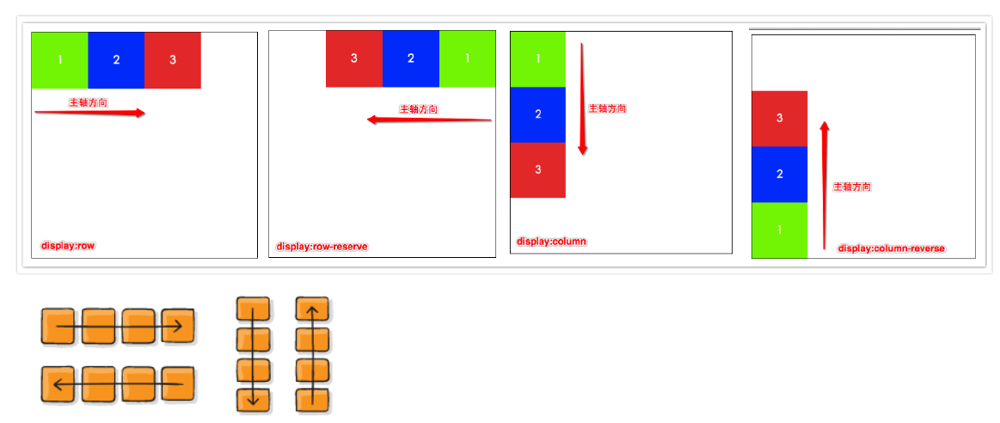
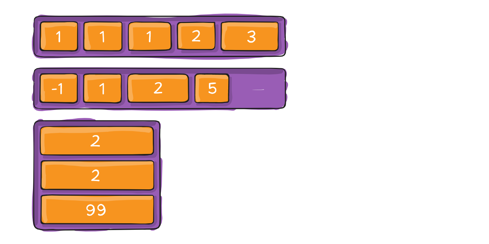
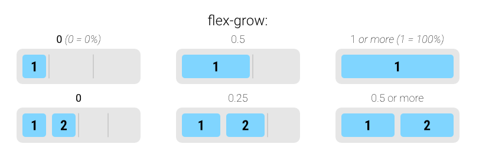
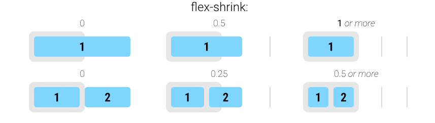

# Flex 布局

## Flexbox 基础

### 什么是 Flexbox？

**Flexbox**（弹性盒子布局）是一种现代 CSS 一维布局模型，旨在更高效地在容器内排列、对齐和分配项目空间，即使项目尺寸未知或动态变化。

- **核心特性**：
  - **弹性**：子项能根据可用空间自动**伸展 (grow)** 以填充，或**收缩 (shrink)** 以适应，实现响应式布局。
  - **一维布局**: 主要沿**单条轴线**（主轴）布局，可以是水平行或垂直列。这与侧重二维网格的 **Grid 布局**形成互补。
  - **方向无关**: 相较于基于块级/行内方向的传统布局，Flexbox 更易于改变布局方向（如从水平切换到垂直）。

> **注意**：虽然 Flexbox 本质是一维模型，但通过 `flex-wrap: wrap` 属性，项目可以在容器空间不足时换行（或换列），形成多行（或多列）的布局效果。

### 为什么需要 Flex 布局？

在 Flexbox 出现之前，Web 布局主要依赖 `float`、`position` 和 `table` 布局，这些方法存在明显局限：

- **浮动 (`float`)**：主要用于图文环绕，用于复杂布局时易产生父容器高度塌陷、需要清除浮动、难以实现列等高等问题。
- **定位 (`position`)**：主要用于元素精确放置或脱离文档流，对于流式、自适应内容的布局维护复杂，空间分配和对齐不灵活。
- **表格布局 (`table`)**：结构冗余、语义不符（应用于非表格数据）、性能相对较低且不够灵活。

**传统布局痛点：**

1. **垂直居中**：需复杂计算或借助表格布局。  
2. **等分空间**：子元素需手动设置百分比，难适应内容变化。  
3. **多列对齐**：浮动布局中列高不齐，需额外处理。  
4. **动态适配**：容器或内容变化时调整困难，常需 hack。

## 基础概念


### Flexbox 核心术语


- **Flex Container（弹性容器）**：通过 `display: flex` 或 `inline-flex` 定义的父元素，负责管理子元素的排列和对齐。
- **Flex Item (弹性子项)**
  - Flex 容器的**直接**子元素。
  - 自动成为 Flex 项目，其布局受容器属性和自身属性共同控制。
  
  - **特性**：
    - 布局主要由容器控制。
    - 即使是行内元素（如 `<span>`），也会表现得类似块级元素（可设置宽高）。
    - 默认尺寸由内容决定，可通过 `width`, `height`, `flex-basis` 指定。
    - `float`, `clear`, `vertical-align` 属性对其**无效**。
  
- **轴线 (Axes)**：Flexbox 布局基于两条相互垂直的轴线。
  - **主轴 (Main Axis)**：Flex 项目排列的主要方向。由 `flex-direction` 属性定义（默认水平从左到右）
  - **交叉轴 (Cross Axis)**：垂直于主轴的方向。
  
  - **起止点**：
    - 主轴：`main-start`（起点） -> `main-end`（终点）
    - 交叉轴：`cross-start`（起点） -> `cross-end`（终点）
  - **尺寸术语**：
    - `main size`：Item 在主轴方向上的尺寸（宽度或高度）。
    - `cross size`：Item 在交叉轴方向上的尺寸（高度或宽度）。

### 如何创建 Flex Container？

通过 CSS `display` 属性设置：

- `display: flex;`：创建块级 Flex 容器（占据整行）。
- `display: inline-flex;`：创建**行内级** Flex 容器（像行内元素一样，可在文本流中排列）。

## Flex 属性概览

Flexbox 的属性分为两类：作用于 **Flex Container** 的属性（控制整体布局）和作用于 **Flex Item** 的属性（控制单个子项）。

### 应用于 Flex Container 的属性

- `flex-direction`：定义主轴方向。
- `flex-wrap`：控制项目是否换行。
- `flex-flow`：`flex-direction` 和 `flex-wrap` 的简写。
- `justify-content`：定义项目在**主轴**上的对齐和空间分配。
- `align-items`：定义项目在**交叉轴**上（单行）的对齐方式。
- `align-content`：定义**多行**项目在**交叉轴**上的对齐和空间分配（需 `wrap`）
- `gap`, `row-gap`, `column-gap`：定义项目之间的间距。

### 应用于 Flex Item 的属性

- `order`：控制项目的排列顺序。
- `flex-grow`：定义项目的放大比例（分配剩余空间）。
- `flex-shrink`：定义项目的缩小比例（处理空间不足）。
- `flex-basis`：定义项目在主轴上的初始（基准）尺寸。
- `flex`：`flex-grow`, `flex-shrink`, `flex-basis` 的简写。
- `align-self`：允许单个项目覆盖容器的 `align-items` 设置。

## Flex Container 属性详解

### `flex-direction`

- **作用**：设置主轴的方向，决定 Flex 项目的排列流向。
- **取值**：
  - `row`（默认）：水平从左到右，适用于横向布局。
  - `row-reverse`：水平从右到左，反向排列。
  - `column`：垂直从上到下，常用于垂直堆叠布局。
  - `column-reverse`：垂直从下到上，适用于倒序列表。

- **影响**：改变主轴会同时改变交叉轴的方向，并影响 `justify-content` (沿新主轴) 和 `align-items` (沿新交叉轴) 的行为。



### `flex-wrap`

- **作用**：控制当 Flex 项目在主轴上空间不足时是否换行。
- **取值**：
  - `nowrap` (默认)：不换行，项目可能溢出容器或被压缩。
  - `wrap`：换行，新行沿交叉轴正方向堆叠（通常是向下）。
  - `wrap-reverse`：换行，新行沿交叉轴负方向堆叠（通常是向上）。


### `flex-flow`

- **作用**：`flex-direction` 和 `flex-wrap` 的简写。
- **语法**：`flex-flow: <direction> <wrap>;`（顺序随意，可省略任一值）。
- **默认值**：`row nowrap`。
- **示例**：`flex-flow: column wrap;` (主轴垂直向下，允许换列)。

### `justify-content`

- **作用**：定义 Flex 项目在**主轴**上的对齐方式和剩余空间的分配方式。
- **取值**：
  - `flex-start` (默认)：项目靠主轴起点对齐。
  - `flex-end`：项目靠主轴终点对齐。
  - `center`: 项目在主轴上居中对齐。
  - `space-between`：两端对齐，项目之间的间隔相等（首尾项目紧贴容器边缘）
  - `space-around`：每项两侧间距相等（首尾间距为中间一半）。
  - `space-evenly`：所有间隔完全相等（包括容器边缘与首尾项目之间）


### `align-items`

- **作用**：定义 Flex 项目在**交叉轴**上（单行内）的对齐方式。
- **取值**：
  - `stretch`（默认）：拉伸填满交叉轴（前提是未设定固定高度）。
  - `flex-start`：靠交叉轴起点对齐。
  - `flex-end`：靠交叉轴终点对齐。
  - `center`：在交叉轴上居中。
  - `baseline`: 按项目内容的第一行文字基线对齐。


### `align-content`

- **作用**：定义**多行** Flex 项目在**交叉轴**上的对齐和间距（需启用 `flex-wrap: wrap`）。
- **取值**：（与 `justify-content` 类似，但作用于交叉轴上的多行）
  - `stretch` (默认): 各行拉伸以填满交叉轴的剩余空间（如果行内项目允许）。
  - `flex-start`：靠交叉轴起点对齐。
  - `flex-end`：靠交叉轴终点对齐。
  - `center`：居中对齐。
  - `space-between`：首行在起点，末行在终点，中间各行均匀分布。
  - `space-around`：每行上下两侧的间隔相等。
  - `space-evenly`: 所有行之间的间隔，以及首行与起点、末行与终点之间的间隔都完全相等。
- *注意*: 只有一行项目时此属性无效。


### `gap` / `row-gap` / `column-gap`

- **作用**：设置 Flex 项目之间的间距，替代使用 `margin`。

- **语法**：

  - `gap: <row-gap> <column-gap>;` (设置行间距和列间距)
  - `gap: <gap-value>;` (行间距和列间距设为相同值)
  - `row-gap: <value>;` (仅设置行间距 - 交叉轴方向)
  - `column-gap: <value>;` (仅设置列间距 - 主轴方向)
  
- **值**：长度值 (`px`, `em`, `rem`) 或百分比（相对于容器尺寸）。

- **特性**：

  - 间距 **只在项目之间** 产生，不会在容器边缘添加。
  - 与 `flex-wrap: wrap` 结合使用时，自动处理换行后的行间距。
  - 替代传统 `margin` 方案，避免了处理首尾元素外边距的问题。

- **示例**：

  ```css
  .container {
    display: flex;
    flex-wrap: wrap;
    gap: 16px 8px; /* 行间距 16px, 列间距 8px */
  }
  ```

  

## Flex Item 属性详解

这些属性设置在 Flex 项目（子元素）上，控制单个项目的行为。

### `order`

- **作用**：定义项目的排列顺序。默认值 `0`。数值越小越靠前。可为负数。
- **示例**：`order: -1;` 会将项目移到所有默认 `order: 0` 的项目之前。



### `flex-grow`

- **作用**：定义当容器主轴存在**剩余空间**时，项目应**放大**的比例。
- **默认值**：`0` (不放大)。
- **计算**：剩余空间按各项目 `flex-grow` 值的比例进行分配。
  - 项目获得的额外空间 = (该项目的 `flex-grow` 值 / 所有项目 `flex-grow` 值之和) × 容器剩余空间。
  - 示例：容器剩余 300px，项目A `flex-grow: 2`，项目B `flex-grow: 1`。总比例为 3。A 获得 (2/3) *300px = 200px，B 获得 (1/3)* 300px = 100px。
- **注意**：若所有子项的 `flex-grow` 均为 `0`，则剩余空间不分配。
- Flex items 扩展后的最终 size 不能超过 `max-width\max-height`



### `flex-shrink`

- **作用**：定义当容器主轴**空间不足**（项目总基准尺寸超出容器）时，项目应**缩小**的比例。
- **默认值**：`1` (允许缩小)。
- **取值**：非负数值。`0` 表示该项目 **不允许收缩**。
- **生效条件**：仅当 Flex 项目的总 `flex-basis` (或内容尺寸) 之和大于容器在主轴上的尺寸时触发。
- **收缩计算公式**：
  - 溢出量 × 该子项的 `flex-shrink` 值 ÷ 所有子项 `flex-shrink` 值之和。
  - 示例：容器溢出 100px，子项 A 设置 `flex-shrink: 2`，子项 B 设置 `flex-shrink: 1`，总和为 3，则 A 收缩 66.67px（2/3），B 收缩 33.33px（1/3）。
- **约束**：收缩后尺寸不会小于子项的 `min-width` 或 `min-height`。



> **`flex-grow` 与 `flex-shrink` 核心规则：**
>
> 1. **互斥性**：在任何给定时刻，对于同一 Flex 容器内的项目，要么 `flex-grow` 生效（空间有富余时），要么 `flex-shrink` 生效（空间不足时），两者不会同时作用。
> 2. **`flex-wrap` 的影响**：
>     - **`flex-wrap: wrap` 或 `wrap-reverse` (允许换行)**：
>         - 布局引擎会尝试将项目放入当前行。如果放不下，则换行。
>         - **每行独立计算空间**。如果某行有剩余空间，该行内的项目根据 `flex-grow` 放大。
>         - 由于换行避免了单行内的溢出，`flex-shrink` 通常**不**在这种模式下因容器整体空间不足而被触发（除非单行内某个项目本身过宽且不允许收缩导致该行溢出）。
>
> - **`flex-wrap: nowrap` (禁止换行)**：
>   - 所有项目强制排在单行。
>   - **空间不足**：触发 `flex-shrink`，项目按比例缩小（`flex-shrink: 0` 的项目除外）。如果所有项目都不能收缩，则内容会溢出容器。
>   - **空间富余**：触发 `flex-grow`，项目按比例放大（`flex-grow: 0` 的项目除外）。
>
> **总结：** `flex-wrap` 决定了空间不足时是**换行**还是**压缩**。换行布局下，`flex-grow` 负责分配每行的剩余空间；不换行布局下，`flex-grow` 和 `flex-shrink` 分别处理空间富余和不足的情况。

### `flex-basis`

- **作用**：指定 Flex 项目在主轴上的**初始（基准）尺寸**。这是在应用 `flex-grow` (放大) 或 `flex-shrink` (缩小) 进行空间调整之前的尺寸参考。
- **取值**：
  - **`auto`**（默认）：根据子项的 `width`/`height` 或内容固有尺寸确定。
  - 具体值（如 `100px`、`20%`）：显式设置初始尺寸。百分比相对于 **Flex 容器的主轴尺寸**。
- **优先级**（从高到低）：
  1. `max-width` / `max-height` 或 `min-width` / `min-height`（约束边界）。
  2. `flex-basis`（显式基准值）。
  3. `width` / `height`（传统尺寸属性）。
  4. 内容固有尺寸（无显式设置时的默认值）。
- **作用**  
  - 在分配剩余空间或计算收缩前，`flex-basis` 作为元素的初始大小参考。

> 当同时存在 `width`/`height` 与 `lex-basis` 时，`flex-basis`（如果不为 `auto`）通常会覆盖传统的 `width`/`height`

### `flex`（简写属性）

- **作用**：`flex-grow`, `flex-shrink`, 和 `flex-basis` 三个属性的简写。
- **语法**：（非常灵活，但需注意解析规则）
  - **单值语法**：
    - `<number>` (无单位数字，如 `1`): 解析为 `flex: <number> 1 0%` (即 `flex-grow: <number>`, `flex-shrink: 1`, `flex-basis: 0%`)。 **常用 `flex: 1;` 表示允许放大、允许缩小、基准为0 (尽可能占满剩余空间)。**
    - `<length>` 或 `<percentage>` (如 `100px`, `30%`): 解析为 `flex: 1 1 <value>` (即 `flex-grow: 1`, `flex-shrink: 1`, `flex-basis: <value>`)。
    - `none`: 解析为 `flex: 0 0 auto` (不允许放大，不允许缩小，基准尺寸基于 `width`/`height` 或内容)。**常用于固定尺寸项目。**
    - `auto`: 解析为 `flex: 1 1 auto` (允许放大，允许缩小，基准尺寸基于 `width`/`height` 或内容)。
    - `initial` (默认值): 解析为 `flex: 0 1 auto` (不允许放大，允许缩小，基准尺寸基于 `width`/`height` 或内容)。
  - **双值语法**：
    - 第一个值 `<number>` (grow)，第二个值 `<number>` (shrink): 解析为 `flex: <grow> <shrink> 0%`。
    - 第一个值 `<number>` (grow)，第二个值 `<length>` 或 `<percentage>` (basis): 解析为 `flex: <grow> 1 <basis>`。
  - **三值语法**：
    - `flex: <grow> <shrink> <basis>` (按顺序指定)。

- **推荐用法**：
  - `flex: 1;` 或 `flex: auto;` 让项目填充可用空间。
  - `flex: none;` 让项目保持原始尺寸，不伸缩。
  - `flex: 0 0 <basis>;` 创建固定尺寸且不伸缩的项目。
  - 显式设置三个值以获得最精确的控制。

### `align-self`

- **作用**：允许单个 Flex 项目覆盖其父容器 `align-items` 属性定义的交叉轴对齐方式。
- **默认值**：`auto` (继承父容器的 `align-items` 值)。
- **值**：与 `align-items` 的值相同 (`stretch`, `flex-start`, `flex-end`, `center`, `baseline`)，外加 `auto`。
- **示例**：容器设置 `align-items: center;`，但某个项目设置 `align-self: flex-start;`，则该项目会贴靠交叉轴起点对齐。


---

### 关键技巧总结

1. **居中布局**：组合使用 `justify-content` 和 `align-items`
2. **空间分配**：
   - 使用 `flex: 1;` (或 `flex-grow: 1;`) 让一个或多个项目填充剩余空间。
   - 组合 `flex-grow`, `flex-shrink`, `flex-basis` (或 `flex` 简写) 进行精细的弹性控制。
3. **响应式设计**：
   - 使用 `flex-wrap: wrap;` 实现内容自动换行，适应不同屏幕宽度。
   - 结合媒体查询 (`@media`) 动态改变 `flex-direction` (如小屏 `column`，大屏 `row`)、`order` 或 `flex` 值。
4. **顺序控制**：`order` 属性调整视觉顺序
5. **等高布局**：Flexbox 默认的 `align-items: stretch` 特性天然支持创建等高的列或卡片布局。确保项目没有设置固定的交叉轴高度（如 `height`）。
6. **项目间距**：优先使用 `gap`, `row-gap`, `column-gap` 设置间距，代码更简洁、健壮，避免了传统 `margin` 带来的边缘间距问题。

> 问题：`justify-content: space-between` 最后一行项目间距过大
>
> **描述**：当使用 `display: flex; flex-wrap: wrap; justify-content: space-between;` 时，如果最后一行项目数量不足以填满整行，这些项目会被强制两端对齐，导致它们之间的间距异常增大，破坏视觉效果。
>
> 
>
> **原因**：`space-between` 的机制是将所有剩余空间平均分配到项目 *之间*。最后一行项目少，它们之间的“空隙”数量也少，每个空隙分到的空间就变大了。
>
> **解决方案**  
>
> **方案 1：添加隐藏占位元素（推荐）**  
>
> - **方法**：在 Flex 容器中添加若干占位元素（如 `<span>` 或 `<i>`），数量为 `(列数 - 1)`。  
> - **设置**：为占位元素设置固定宽度（`width`），但不设置高度（`height`），并确保其不可见（例如通过 `visibility: hidden` 或 `opacity: 0`）。  
> - **效果**：占位元素填充最后一行不足的空间，使间距分布恢复正常，保持视觉一致性。  
>
> **方案 2：使用 Grid 布局**  
>
> - **方法**：将 Flex 布局替换为 CSS Grid 布局，使用 `grid-template-columns` 定义固定列宽。  
> - **优点**：Grid 布局天然支持多行多列的对齐，且不会因最后一行元素不足而导致间距异常。  
