# Flex 布局

## Flexbox 基础

### 什么是 Flexbox？

**Flexbox**（弹性盒子布局）是 CSS3 的一种一维布局模型，专为解决现代 Web 应用的布局需求而设计。

- **核心特性**：
  - **动态调整**：子元素可根据容器可用空间自动 **膨胀**（填充多余空间）或 **收缩**（适应有限空间），实现自适应效果。
  - **一维布局**：专注于行或列的单向排列，与二维的 Grid 布局互补。
  - **术语：** 常简称为 **Flex 布局** 或 **弹性布局**。
- **普及性**：
  - **移动端**：已成为事实标准，几乎所有现代移动页面依赖 Flexbox。
  - **PC 端**：占据主流，仅少数老旧网站仍依赖传统浮动（`float`）或定位（`positioning`）。

> 虽然 Flexbox 是单向布局，但通过 `flex-wrap` 可以实现多行或多列的排列，与 Grid 的二维布局互补。

### 为什么需要 Flex 布局？

在 Flexbox 出现之前，Web 开发者主要依赖 **浮动 (float)**、**定位 (positioning)** 和 **表格布局 (table layout)** 进行页面布局，但这些方法存在显著缺陷：

- **浮动 (float)**  

  - 设计初衷为文字环绕图片，而非布局。  
  - 问题：需清除浮动或用伪元素实现复杂布局，易出错，多列高度难以对齐。

- **定位 (positioning)**  

  - 通过绝对或相对定位实现灵活布局。  
  - 不足：难以适配动态屏幕尺寸，响应式维护成本高。

  - 例子：绝对定位元素无法随容器大小自动调整位置。

- **表格布局 (table layout)**  
  使用 HTML 表格元素进行布局，结构复杂，语义化差，且渲染性能较低。

#### **传统布局的痛点**

1. **垂直居中**：需复杂计算或借助表格布局。  
2. **等分空间**：子元素需手动设置百分比，难适应内容变化。  
3. **多列对齐**：浮动布局中列高不齐，需额外处理。  
4. **动态适配**：容器或内容变化时调整困难，常需 hack。

## 基础概念

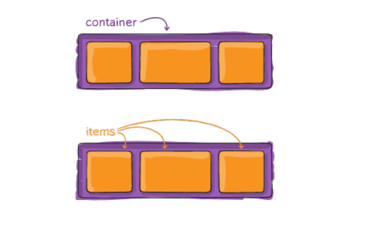

### Flexbox 核心术语

- **两个角色**：
  - **Flex Container（弹性容器）**：通过 `display: flex` 或 `inline-flex` 定义的父元素，负责管理子元素的布局。
  - **Flex Item（弹性子项）**：容器内的 **直接** 子元素，自动成为 Flex 项目，其排列、对齐和尺寸受容器属性控制。
- **Flex Item 特性**：
  - Flex 项目的布局由容器属性集中管理，无需为每个子项单独设置样式。
  - Flex item 不再严格区分块级元素和行内级元素；
  - Flex 项目默认表现为块级元素（如 `div` 作为容器时），但行内元素（如 `span`）作为 Flex 项目时允许设置宽度和高度
  - 默认情况下，Flex Item 会根据内容自动调整尺寸（即 **包裹内容**），但是可以设置宽度和高度；
- **轴线系统**：Flexbox 基于两个轴线进行布局
  - **主轴（Main Axis）**：由 `flex-direction` 定义的排列方向，默认为水平（从左到右）。
  - **交叉轴（Cross Axis）**：垂直于主轴的方向，默认垂直（从上到下）
  - **起止点**：
    - 主轴：`main-start`（主轴起点） -> `main-end`（主轴终点）
    - 交叉轴：`cross-start`（交叉轴起点） -> `cross-end`（交叉轴终点）
  - **尺寸术语**：
    - `main size`：子项在主轴上的占用空间（如宽度或高度）。
    - `cross size`：子项在交叉轴上的占用空间。
- **特性**：
  - 子项的 `float`、`clear` 和 `vertical-align` 属性在 Flex 布局中失效。

### 如何创建 Flex Container？

通过 CSS 的 `display` 属性启用：

- **`display: flex;`**：创建块级 Flex 容器。该容器会占据一行，类似于块级元素。
- **`display: inline-flex;`**：创建行内 Flex 容器。该容器可以与其他行内元素并排显示，类似于行内元素。


## Flex 布局模型

Flex 布局基于 **主轴（Main Axis）** 和 **交叉轴（Cross Axis）** 的二维坐标系：

- **主轴**：由 `flex-direction` 定义，默认排列方向（如水平或垂直）。
- **交叉轴**：垂直于主轴，受 `align-items` 和 `align-content` 控制对齐方式。
- **起止点**：
  - 主轴：`main-start` → `main-end`。
  - 交叉轴：`cross-start` → `cross-end`。
- 单个项目占据的主轴空间叫做 `main size`，占据的交叉轴空间叫做 `cross size`。


## Flex 属性概述

Flexbox 属性分为两类：作用于 **Flex 容器** 的属性和作用于 **Flex 项目** 的属性。

### 应用于 Flex Container 的属性

- **`flex-direction`**：定义主轴方向（如 `row`、`column`）。
- **`flex-wrap`**：控制子项是否换行（如 `nowrap`、`wrap`）
- **`flex-flow`**：`flex-direction` 和 `flex-wrap` 的简写。
- **`justify-content`**：定义主轴上的对齐方式和间距分配。
- **`align-items`**：定义交叉轴上单行子项的对齐方式。
- **`align-content`**：调整交叉轴上多行子项的对齐与间距（需启用 `flex-wrap`）。

### 应用于 Flex Item 的属性

- **`flex-grow`**：指定剩余空间的分配比例。
- **`flex-shrink`**：指定空间不足时的收缩比例。
- **`flex-basis`**：设定主轴方向上的初始尺寸，作为伸缩计算基准。
- **`flex`**：上述三者的简写。
- **`order`**：控制子项在容器中的排列顺序。
- **`align-self`**：单独调整子项在交叉轴上的对齐方式，覆盖 `align-items`

## Flex Container 属性详解

### `flex-direction`

- **作用**：定义主轴方向，决定 flex 项目（flex item）在容器内的排列顺序。
- **取值**：
  - `row`（默认）：水平从左到右，适用于横向布局。
  - `row-reverse`：水平从右到左，反向排列。
  - `column`：垂直从上到下，常用于垂直堆叠布局。
  - `column-reverse`：垂直从下到上，适用于倒序列表。

> 当主轴方向发生变化时，其他与方向有关的对齐属性（如 `justify-content` 和 `align-items`）的效果也会随之调整。

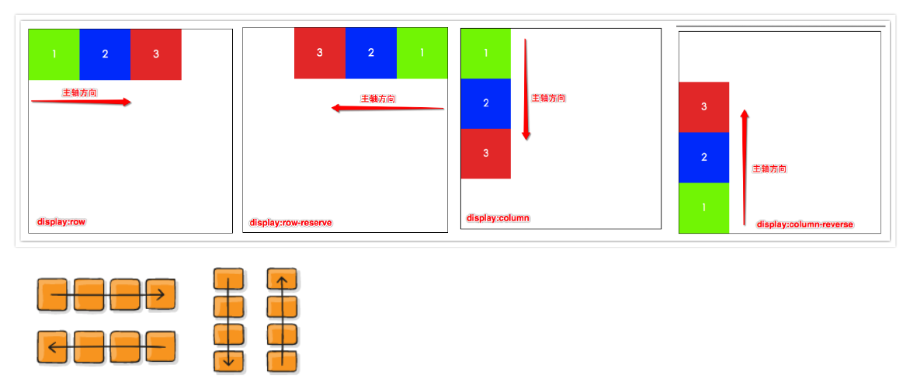

### `flex-wrap`

- **作用**：控制 Flex 项目是否换行，以及如何换行。解决在 Flex 容器空间不足时，Flex 项目的布局问题。
- **取值**：
  - `nowrap`（默认）：强制单行，子项可能溢出或压缩。
  - `wrap`：允许换行，新行沿交叉轴正方向排列（默认从上到下）
  - `wrap-reverse`：允许换行，新行沿交叉轴负方向排列（换行，第一行在下方）

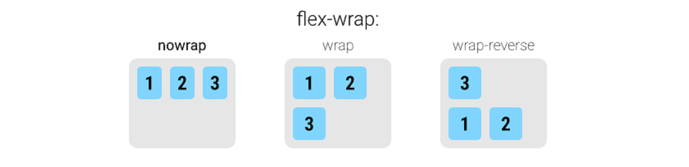

### `flex-flow`

- **作用**：`flex-direction` 和 `flex-wrap` 的简写。
- **语法**：`flex-flow: <direction> <wrap>;`（顺序随意，可省略任一值）。
- **默认值**：`row nowrap`。
- **示例：** `flex-flow: row wrap;` 设定主轴方向为水平，并允许子项换行。

### `justify-content`

- **作用**：控制主轴上 Flex Item 的对齐与间距分配。
- **取值**：
  - `flex-start`（默认）：项目靠近主轴起点排列（如左对齐）。
  - `flex-end`：靠主轴终点对齐（如右对齐）。
  - `center`：居中对齐。
  - `space-between`：两端对齐，项目间距均分。
  - `space-around`：每项两侧间距相等（首尾间距为中间一半）。
  - `space-evenly`：所有间隔完全相等（包括容器边缘与首尾项目之间）

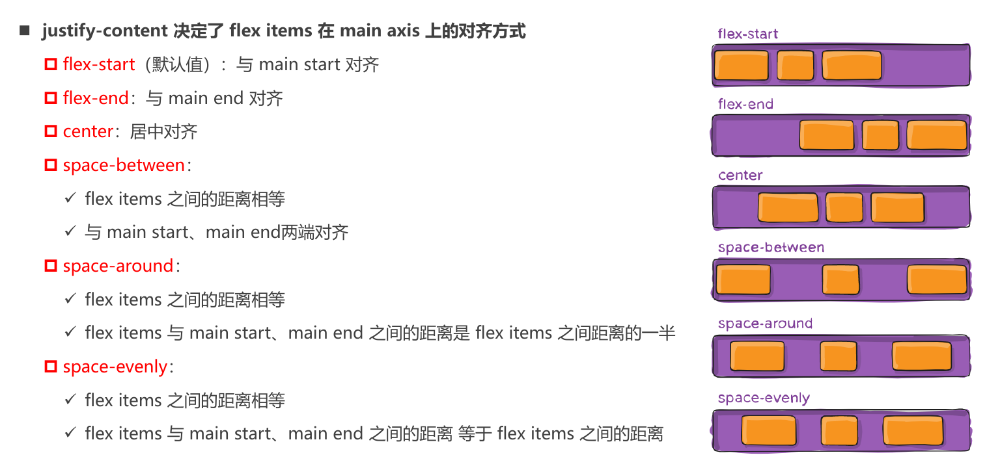

### `align-items`

- **作用**：控制交叉轴上单行 Flex Item 的对齐方式。
- **取值**：
  - `stretch`（默认）：拉伸填满交叉轴（前提是未设定固定高度）。
  - `flex-start`：项目靠近交叉轴起点排列。
  - `flex-end`：项目靠近交叉轴终点排列。
  - `center`：居中对齐。
  - `baseline`：按所有项目的首行文字基线对齐，即使项目高度不同也能保持文字对齐
- **示例**：`align-items: center;` 实现单行子项垂直居中。

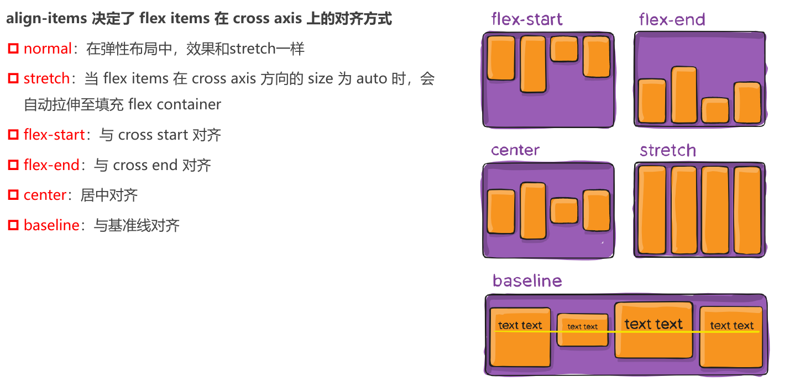

### `align-content`

- **作用**：控制交叉轴上多行 Flex Item 的对齐与间距（需启用 `flex-wrap: wrap`）。
- **取值**：
  - `stretch`（默认）：拉伸填满交叉轴。
  - `flex-start`：靠交叉轴起点对齐。
  - `flex-end`：靠交叉轴终点对齐。
  - `center`：居中对齐。
  - `space-between`：首尾贴边，中间均分。
  - `space-around`：每行周围间距相等。
- **示例**：`align-content: space-between; // 首尾行贴边，中间均匀分布`
- **注意**：若只有一行，该属性无效。


## Flex Item 属性详解

### `order`

- **作用**：定义 Flex Item 的排列顺序，默认值为 `0`，值越小越靠前。
- **示例**：`order: 1;` 将元素移至后面。

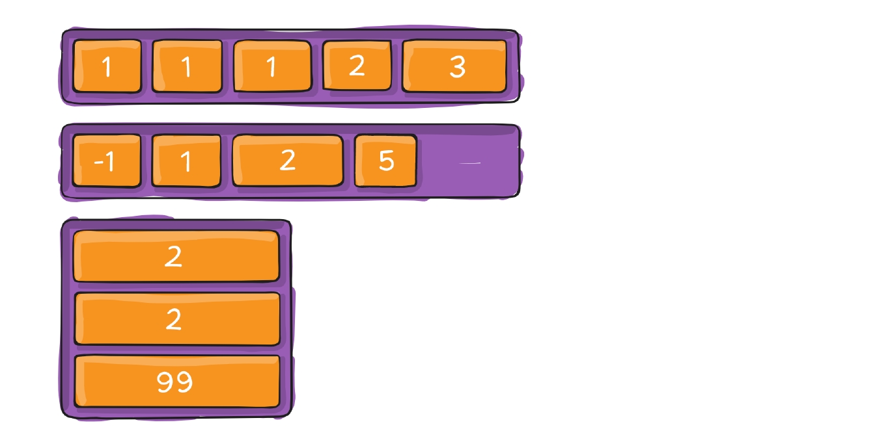

### `flex-grow`

- **作用**：定义剩余空间分配比例，默认值为 `0`（不分配）。
- **取值**：非负数值（正整数、正小数或 0）。
- **计算方式**：剩余空间按各子项的 `flex-grow` 值比例分配。
  - 实际分配比例 = (flex-grow 值 / 所有项目的 flex-grow 总和) × **剩余空间**
  - 示例：容器剩余 300px，子项 A 设置 `flex-grow: 2`，子项 B 设置 `flex-grow: 1`，总和为 3，则 A 分配 200px（2/3），B 分配 100px（1/3）。
- **注意**：若所有子项的 `flex-grow` 均为 `0`，则剩余空间不分配。
- Flex items 扩展后的最终 size 不能超过 `max-width\max-height`

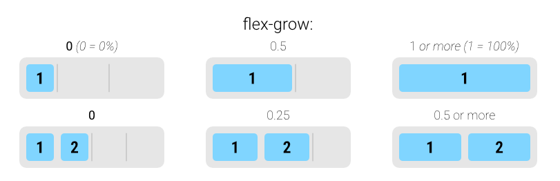

### `flex-shrink`

- **作用：**  定义了 flex 元素如何在空间不足时收缩
  
- **作用**：定义 Flex 子项在主轴空间不足时的收缩比例，默认值为 `1`（允许收缩）。
  
- **取值**：非负数值（正整数、正小数或 0）。
- **生效条件**：仅当所有子项总尺寸超过容器主轴尺寸时触发。
- **收缩计算公式**：
  - 溢出量 × 该子项的 `flex-shrink` 值 ÷ 所有子项 `flex-shrink` 值之和。
  - 示例：容器溢出 100px，子项 A 设置 `flex-shrink: 2`，子项 B 设置 `flex-shrink: 1`，总和为 3，则 A 收缩 66.67px（2/3），B 收缩 33.33px（1/3）。
- **约束**：收缩后尺寸不会小于子项的 `min-width` 或 `min-height`。
- **注意**：`flex-shrink: 0` 表示禁止收缩。

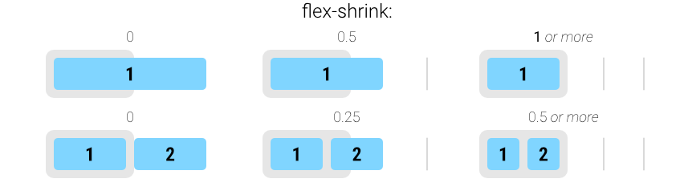

> **Flex 布局中 flex-grow 与 flex-shrink 的作用规则总结：**
>
> 1. **允许换行（`flex-wrap` 为 `wrap` 或 `wrap-reverse`）：**
>    - **子项总宽度小于父容器**：所有子项根据 `flex-grow` 的值按比例分配剩余空间，若 `flex-grow` 为 0，则不放大。
>    - **子项总宽度超出父容器宽度**：
>      - 自动换行，每行独立处理剩余空间。
>      - 若某行子项总宽度小于该行可用空间，且 `flex-grow` 存在非零值，则按比例分配该行剩余空间。
>      - 若某行子项总宽度超出，换行解决，不触发 `flex-shrink`。
>
> 2. **禁止换行（`nowrap`）：**
>    - **子项总宽度不足**：`flex-grow` 生效，按比例放大（值为 0 不放大）。
>    - **子项总宽度超出**：`flex-shrink` 生效，按比例缩小（值为 0 不缩小）。若所有子项 `flex-shrink` 为 0，则横向溢出。
>
> **核心规则：**
>
> - **规律**：在任意情况下，`flex-grow` 和 `flex-shrink` 只有一个会生效：
>   - **空间充足（子项总宽度 < 父容器宽度）**：`flex-grow` 控制子项放大。
>   - **空间不足（子项总宽度 > 父容器宽度）**：`flex-shrink` 控制子项缩小。
> - 换行布局（`wrap`）通过分行避免横向溢出，每行剩余空间由 `flex-grow` 分配，`flex-shrink` 不参与。
> - 不换行（`nowrap`）时，空间不足直接触发 `flex-shrink`，空间富余则触发 `flex-grow`。
>
> **结论：** Flex 布局通过 `flex-wrap` 控制换行策略，从而影响空间分配逻辑：
>
> - 换行时，每行独立计算，仅 `flex-grow` 分配剩余空间。
> - 不换行时，`flex-grow` 和 `flex-shrink` 分别响应空间富余与不足的情况。

### `flex-basis`

- **作用**：指定 Flex 子项在主轴上的初始尺寸，作为伸缩计算的基准。
  
- **取值**：
  - **`auto`**（默认）：根据子项的 `width`/`height` 或内容固有尺寸确定。
  - 具体值（如 `100px`、`20%`）：显式设置初始尺寸。
- **优先级**（从高到低）：
  1. `max-width` / `max-height` 或 `min-width` / `min-height`（约束边界）。
  2. `flex-basis`（显式基准值）。
  3. `width` / `height`（传统尺寸属性）。
  4. 内容固有尺寸（无显式设置时的默认值）。
- **作用**  
  - 在分配剩余空间或计算收缩前，`flex-basis` 作为元素的初始大小参考。

> 当同时存在 `width`/`height` 与 `lex-basis` 时，`flex-basis`（如果不为 `auto`）通常会覆盖传统的 `width`/`height`

### `flex`（简写属性）

- **`flex` 是 `flex-grow`、`flex-shrink` 和 `flex-basis` 的简写**  
  - 可指定 1 个、2 个或 3 个值，语法灵活但有严格规则。  

- **单值语法**  
  - `<number>`（无单位数，如 `2`）：视为 `flex-grow`，`flex-shrink` 默认为 1，`flex-basis` 默认为 0。  
  - 有效宽度值（如 `100px`）：视为 `flex-basis`，`flex-grow` 和 `flex-shrink` 默认为 1。  
  - 关键字：  
    - `none`：等同于 `0 0 auto`（不伸缩）；  
    - `auto`：等同于 `1 1 auto`（可伸缩，基于内容）；  
    - `initial`：等同于 `0 1 auto`（默认值）。  

- **双值语法**  
  - 第一个值：`<number>`（如 `2`），视为 `flex-grow`。  
  - 第二个值：  
    - `<number>`（如 `3`）：视为 `flex-shrink`，`flex-basis` 默认为 0；  
    - 有效宽度值（如 `50%`）：视为 `flex-basis`，`flex-shrink` 默认为 1。  

- **三值语法**  
  - 第一个值：`<number>`（如 `1`），视为 `flex-grow`。  
  - 第二个值：`<number>`（如 `2`），视为 `flex-shrink`。  
  - 第三个值：有效宽度值（如 `200px`），视为 `flex-basis`。  

- **示例**  
  - `flex: 1` → `flex: 1 1 0`  
  - `flex: 2 50px` → `flex: 2 1 50px`  
  - `flex: 0 0 100px` → 固定尺寸，不伸缩。

### `align-self`

- **作用**：覆盖单个子项在交叉轴上的对齐方式，优先级高于 `align-items`。

- **取值**：与 `align-items` 一致，另加 `auto`（默认，继承容器 `align-items`）。

- **示例**：

  ```css
  .item {
    align-self: flex-end; /* 靠交叉轴底端对齐 */
  }
  ```

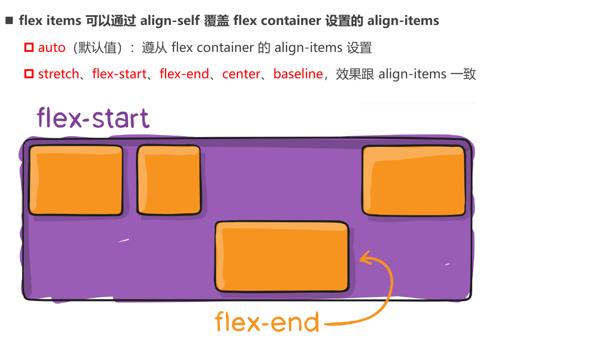

## Flex 布局的典型案例

### 1. 水平垂直居中（经典居中布局）

```html
<div class="center-container">
  <div class="centered-item">居中对齐</div>
</div>

<style>
.center-container {
  display: flex;
  justify-content: center; /* 主轴居中 */
  align-items: center;    /* 交叉轴居中 */
  height: 100vh;          /* 视口高度 */
  background: #f5f5f5;
}
.centered-item {
  padding: 2rem 3rem;
  background: #4285f4;
  color: white;
  border-radius: 8px;
}
</style>
```

**效果**：子元素在容器中完美水平和垂直居中，无需计算尺寸或使用定位。


---

### 2. 等分导航栏（自适应空间分配）

```html
<nav class="flex-nav">
  <a class="nav-item active">首页</a>
  <a class="nav-item">产品</a>
  <a class="nav-item">服务</a>
  <a class="nav-item">关于</a>
  <a class="nav-item">联系</a>
</nav>

<style>
.flex-nav {
  display: flex;
  background: #333;
  border-radius: 4px;
}
.nav-item {
  flex: 1;                /* 等分空间 */
  padding: 1rem;
  color: white;
  text-align: center;
  text-decoration: none;
  transition: background 0.3s;
}
.nav-item:hover {
  background: #555;
}
.nav-item.active {
  background: #4CAF50;
}
</style>
```

**效果**：导航项自动等分空间，间距均匀分布，适配不同屏幕宽度。

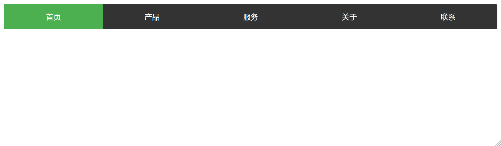

---

### 3. 圣杯布局（经典三栏布局）

```html
<body class="HolyGrail">
  <header>...</header>
  <div class="HolyGrail-body">
    <main class="HolyGrail-content">...</main>
    <nav class="HolyGrail-nav">...</nav>
    <aside class="HolyGrail-ads">...</aside>
  </div>
  <footer>...</footer>
</body>
```

**效果**：自适应高度，主内容自动填充中间区域，侧边栏固定宽度，无需浮动或定位。

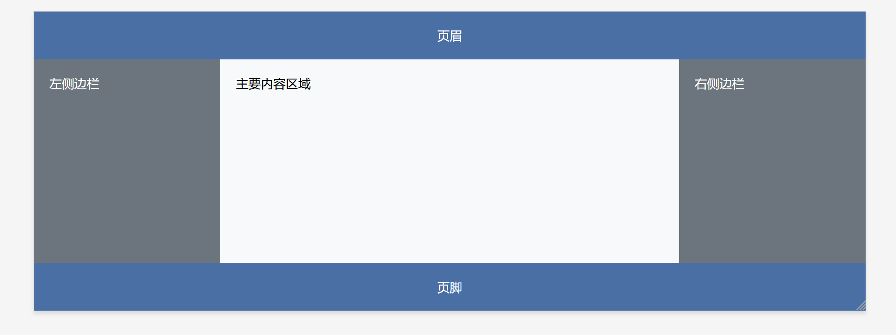

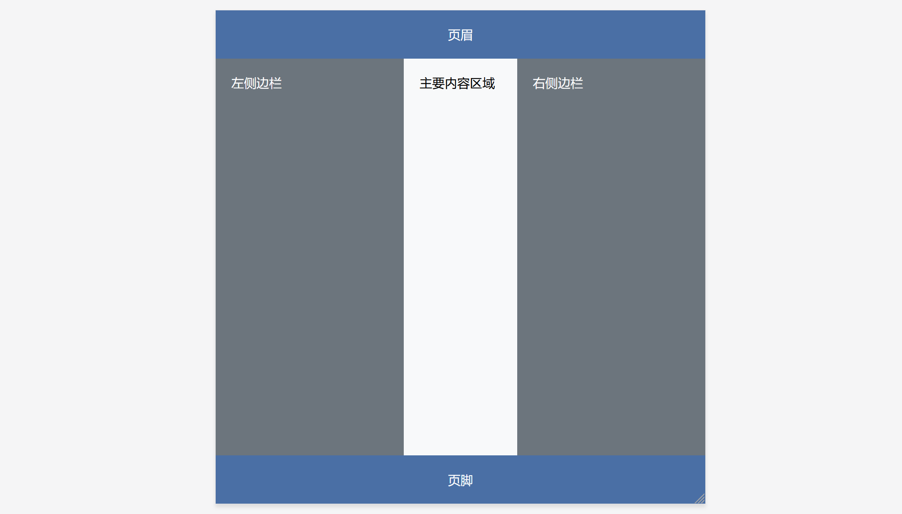

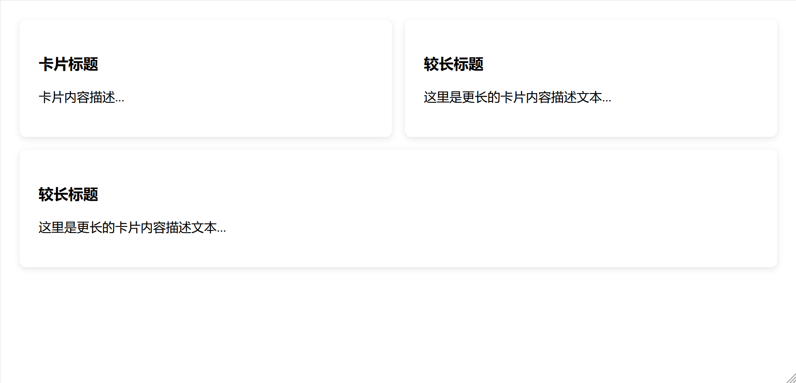

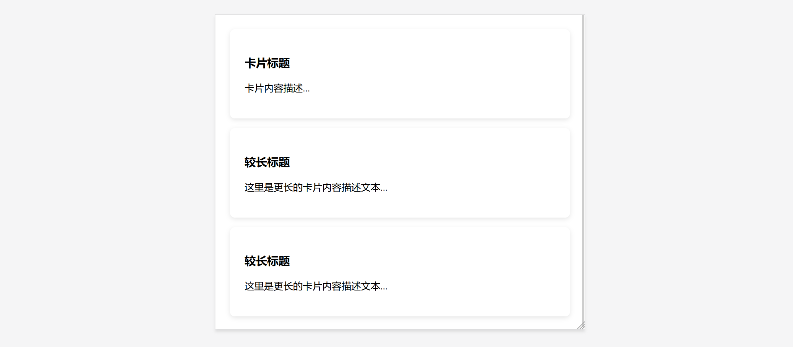

---

### 4. 瀑布流布局（多列动态排列）

```html
<div class="masonry">
  <div class="item">Item 1</div>
  <div class="item">Item 2（较长内容）</div>
  <div class="item">Item 3</div>
  <!-- 更多项目... -->
</div>

<style>
.masonry {
  display: flex;
  flex-wrap: wrap;
  gap: 10px; /* 项目间距 */
}
.item {
  flex: 1 1 250px; /* 最小宽度250px，自动换行 */
  background: #f48fb1;
  padding: 15px;
  box-sizing: border-box;
}
</style>
```

**效果**：项目自动换行并等宽排列，根据容器宽度动态调整列数，类似瀑布流效果。

---

### 5. 表单元素对齐（标签与输入框）

```html
<form class="form">
  <div class="form-group">
    <label>用户名：</label>
    <input type="text">
  </div>
  <div class="form-group">
    <label>密码：</label>
    <input type="password">
  </div>
</form>

<style>
.form {
  display: flex;
  flex-direction: column;
  gap: 15px;
  max-width: 400px;
}
.form-group {
  display: flex;
  align-items: center; /* 垂直居中 */
  gap: 10px;
}
label {
  flex: 0 0 80px; /* 固定标签宽度 */
  text-align: right;
}
input {
  flex: 1;        /* 输入框占据剩余空间 */
  padding: 8px;
}
</style>
```

**效果**：标签与输入框完美对齐，输入框自适应容器宽度，垂直间距一致。

---

### 6. 响应式导航（移动端适配）

```html
<nav class="responsive-nav">
  <div class="logo">LOGO</div>
  <div class="menu">
    <a href="#">首页</a>
    <a href="#">产品</a>
    <a href="#">服务</a>
    <a href="#">关于</a>
  </div>
  <div class="hamburger">☰</div>
</nav>

<style>
.responsive-nav {
  display: flex;
  justify-content: space-between;
  align-items: center;
  padding: 10px;
  background: #333;
  color: white;
}
.menu {
  display: flex;
  gap: 20px;
}
.hamburger { display: none; }

/* 移动端适配 */
@media (max-width: 768px) {
  .menu {
    display: none; /* 隐藏常规菜单 */
  }
  .hamburger {
    display: block; /* 显示汉堡菜单 */
  }
}
</style>
```

**效果**：PC 端显示水平导航，移动端隐藏菜单显示汉堡图标，轻松实现响应式。

---

### 7. 卡片等高布局（自动匹配高度）

```html
<div class="card-container">
  <div class="card">卡片1<br>内容...</div>
  <div class="card">卡片2<br>更长的内容...</div>
  <div class="card">卡片3</div>
</div>

<style>
.card-container {
  display: flex;
  gap: 20px;
  padding: 20px;
}
.card {
  flex: 1;          /* 等分宽度 */
  background: white;
  padding: 20px;
  border-radius: 8px;
  box-shadow: 0 2px 4px rgba(0,0,0,0.1);
}
</style>
```

**效果**：所有卡片自动等高，宽度均分，内容差异不影响布局整齐度。

---

### 关键技巧总结

1. **居中布局**：组合使用 `justify-content` 和 `align-items`
2. **空间分配**：
   - `flex: 1` 快速分配剩余空间
   - `flex-grow`/`flex-shrink` 精细控制伸缩比例
3. **响应式适配**：
   - `flex-wrap: wrap` 实现自动换行
   - 媒体查询调整 `flex-direction`（如手机端改为 `column`）
4. **顺序控制**：`order` 属性调整视觉顺序
5. **等高效果**：默认拉伸特性自动实现等高列
6. **间隙控制**：现代浏览器推荐使用 `gap` 属性替代外边距
