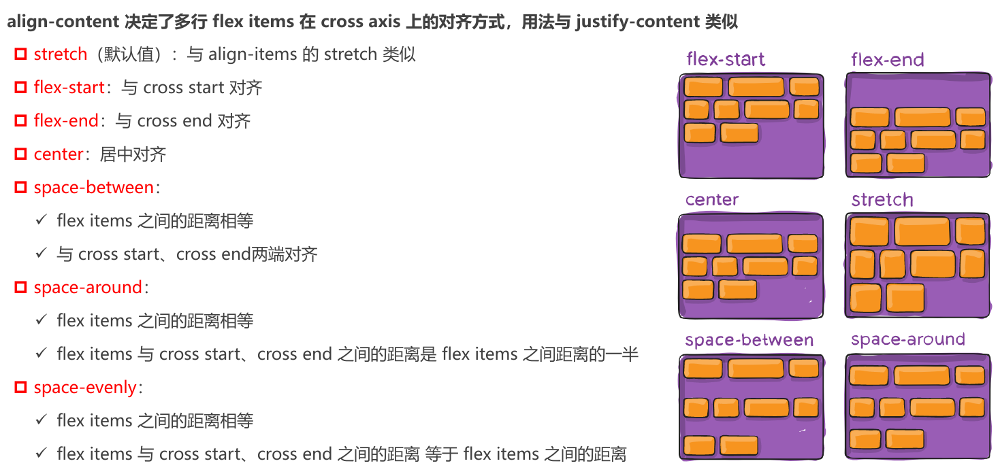

# 	Flex 布局

## 什么是 Flexbox？

**Flexbox**，全称 **Flexible Box Layout**（弹性盒子布局），是 CSS3 引入的一种强大的一维布局模型，旨在解决传统布局方法的局限性。它通过按行或按列排列元素，提供了一种灵活、高效的布局方式。

- **核心特性**：
  - 元素能够根据可用空间动态调整大小：**膨胀**以填充多余空间，或**收缩**以适应较小空间。
  - 适用于单维布局（行或列），与二维的 Grid 布局形成互补。
  - 在 Web 开发中，基于 Flexbox 的方案通常被称为 **Flex 布局**。
- **普及性**：
  - **移动端**：Flex 布局已成为事实上的标准，几乎所有现代移动端页面都依赖它。
  - **PC 端**：占据主导地位，仅少数老旧网站仍使用传统的浮动（`float`）或定位（`positioning`）布局。

## 为什么需要 Flex 布局？

### 传统布局的局限性

在 Flexbox 出现之前，CSS 仅依赖 **浮动（`float`）** 和 **定位（`positioning`）** 作为主要布局工具，但这些方法存在显著缺陷：

- **浮动（`float`）**：
  - 最初设计用于文字环绕图片，而非布局。
  - 用于布局时，需配合清除浮动（`clear`）或伪元素（如 `::after`），实现复杂且脆弱。
  - 多列布局中难以控制高度一致性。

- **定位（`positioning`）**：
  - 提供绝对定位（`absolute`）和相对定位（`relative`），灵活性强，但难以实现动态适配。
  - 对复杂布局（如响应式设计）支持不足，维护成本高。

### 传统布局的痛点

以下常见需求在传统布局中实现困难，甚至需要大量 hack：

1. **垂直居中**：
   - 需要计算偏移量（如 `top: 50%; margin-top: -高度/2`）或使用表格布局（`display: table`）。
2. **等分空间**：
   - 子元素平分容器宽度或高度，传统方法需手动设置百分比，且难以动态适配。
3. **多列高度一致**：
   - 浮动布局中，各列高度取决于内容，无法自动对齐。
4. **动态调整**：
   - 传统布局难以应对容器尺寸变化或内容动态加载的场景。

**结论**：传统布局工具在现代 Web 开发中效率低下，无法满足响应式设计和复杂界面的需求。

### Flex 布局的重要概念

#### 核心概念
- **两个关键角色**：  
  - **Flex Container（弹性容器）**：开启了 flex 布局的元素。  
  - **Flex Item（弹性子项）**：flex container 的直接子元素。  

#### Flex Item 的特性
- 当子元素成为 flex item 后，它们的布局行为会发生变化：  
  - **受父容器控制**：
    - 排列方式、大小调整等由 Flex Container 的属性（如 `justify-content`、`align-items`）决定。
  - **模糊块级与行内界限**：
    - Flex Item 不再严格遵循传统块级（`block`）或行内（`inline`）行为，表现更灵活。
  - **默认自适应**：
    - 默认根据内容调整大小，但可通过 `width`、`height` 或 `flex` 属性手动设置。

#### 如何创建 Flex Container？
通过设置 CSS 的 `display` 属性即可启用 flex 布局：  

- **`display: flex;`**：
  - 以块级形式存在，独占一行，类似于 `display: block`。
- **`display: inline-flex;`**：
  - 以行内级形式存在，可与其他内容并排，类似于 `display: inline-block`。

## Flex布局的模型

Flex 布局基于**主轴（Main Axis）**和**交叉轴（Cross Axis）**的二维坐标系：

- **主轴**：Flex Item 默认排列的方向，由 `flex-direction` 定义。
- **交叉轴**：垂直于主轴的方向，受 `align-items` 和 `align-content` 控制。
- **起止点**：
  - 主轴：`main-start` 到 `main-end`。
  - 交叉轴：`cross-start` 到 `cross-end`。

## flex相关的属性

 应用在 flex container 上的 CSS 属性
 flex-flow
 flex-direction
 flex-wrap
 flex-flow
 justify-content
 align-items
 align-content
◼ 应用在 flex items 上的 CSS 属性
 flex-grow
 flex-basis
 flex-shrink
 order
 align-self
 flex

## flex-direction

 flex items 默认都是沿着 main axis(主轴)从 main start 开始往 main end 方向排布
 flex-direction 决定了 main axis 的方向,有 4 个取值
 row(默认值)、row-reverse、column、column-reverse

##  flex-wrap

 flex-wrap 决定了 flex container 是单行还是多行
 nowrap(默认):单行
 wrap:多行
 wrap-reverse:多行(对比 wrap,cross start 与 cross end 相反)

##  flex-flow

 flex-flow 属性是 flex-direction 和 flex-wrap 的简写。
 顺序任何, 并且都可以省略;

##  justify-content

## align-item

## align-content

## flex-item属性 - order

## flex-item属性 - flex items

## flex-item属性 - flex-grow

## flex-item 属性 - `flex-shrink`

- **`flex-shrink` 定义了 flex 元素如何在空间不足时收缩**  
  - 接受任意非负数值（正整数、正小数或 0），默认值为 `1`。  
  - 仅当 flex 元素在主轴（main axis）方向的总尺寸超出 flex 容器大小时生效。  

- **收缩计算公式**  
  - 若所有 flex 元素的 `flex-shrink` 值之和大于 1，则每个元素的收缩尺寸为：  
    **超出容器尺寸 × 该元素的收缩比例 ÷ 所有元素的收缩比例之和**。  
  - 例如：容器溢出 100px，元素 A 的 `flex-shrink` 为 2，元素 B 为 1，总和为 3，则 A 收缩 66.67px，B 收缩 33.33px。  

- **约束条件**  
  - 收缩后的最终尺寸不会小于元素的 `min-width` 或 `min-height`。

---

## flex-item 属性 - `flex-basis`

- **`flex-basis` 指定 flex 元素在主轴方向上的基准尺寸**  
  - 可取值包括：  
    - `auto`（默认值，随内容或 `width`/`height` 确定）；  
    - 具体宽度值（如 `100px`、`20%`）。  

- **最终基准尺寸的优先级**（从高到低）：  
  1. `max-width` / `max-height` 或 `min-width` / `min-height`（约束边界）；  
  2. `flex-basis`（显式设置的基准值）；  
  3. `width` / `height`（传统尺寸属性）；  
  4. 内容本身的固有尺寸（无显式设置时）。  

- **作用**  
  - 在分配剩余空间或计算收缩前，`flex-basis` 作为元素的初始大小参考。

---

## flex-item 属性 - `flex`（简写）

- **`flex` 是 `flex-grow`、`flex-shrink` 和 `flex-basis` 的简写**  
  - 可指定 1 个、2 个或 3 个值，语法灵活但有严格规则。  

- **单值语法**  
  - `<number>`（无单位数，如 `2`）：视为 `flex-grow`，`flex-shrink` 默认为 1，`flex-basis` 默认为 0。  
  - 有效宽度值（如 `100px`）：视为 `flex-basis`，`flex-grow` 和 `flex-shrink` 默认为 1。  
  - 关键字：  
    - `none`：等同于 `0 0 auto`（不伸缩）；  
    - `auto`：等同于 `1 1 auto`（默认伸缩）；  
    - `initial`：等同于 `1 0 0`（初始值）。  

- **双值语法**  
  - 第一个值：`<number>`（如 `2`），视为 `flex-grow`。  
  - 第二个值：  
    - `<number>`（如 `3`）：视为 `flex-shrink`，`flex-basis` 默认为 0；  
    - 有效宽度值（如 `50%`）：视为 `flex-basis`，`flex-shrink` 默认为 1。  

- **三值语法**  
  - 第一个值：`<number>`（如 `1`），视为 `flex-grow`。  
  - 第二个值：`<number>`（如 `2`），视为 `flex-shrink`。  
  - 第三个值：有效宽度值（如 `200px`），视为 `flex-basis`。  

- **示例**  
  - `flex: 1` → `flex: 1 1 0`  
  - `flex: 2 50px` → `flex: 2 1 50px`  
  - `flex: 0 0 100px` → 固定尺寸，不伸缩。
