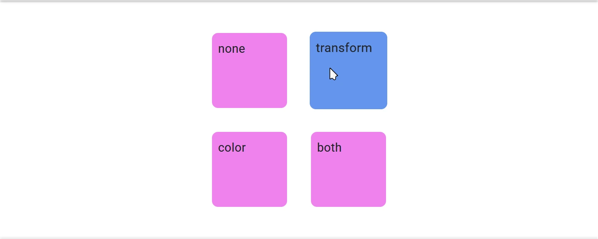
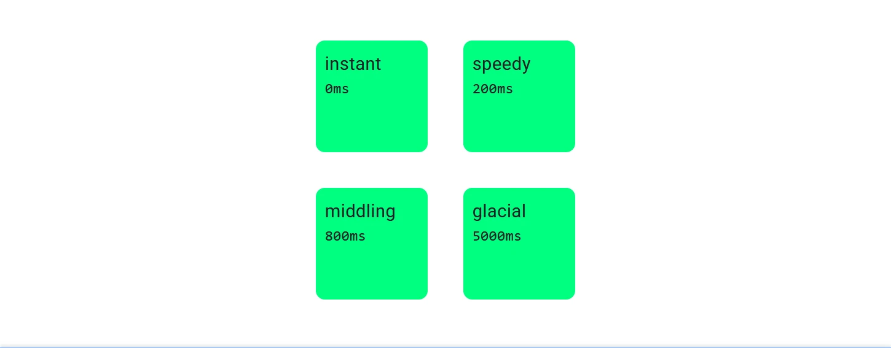
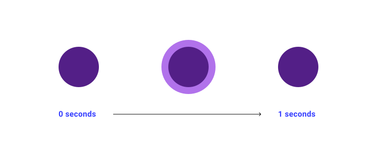

# 变换、过渡与动画

## 一、变换（Transform）

### 核心概念

CSS `transform` 属性允许您在不影响文档流（即不引起页面重排）的情况下，对元素进行 2D 或 3D 空间的视觉操作，如**平移 (translate)**、**旋转 (rotate)**、**缩放 (scale)** 和**倾斜 (skew)**。

**主要优势**：

* **性能**：变换通常由 GPU 加速处理（尤其 3D 变换），运行在独立的合成层上，避免了昂贵的重排 (Reflow) 和重绘 (Repaint)，非常适合实现流畅的动画效果。
* **布局独立**：变换仅影响元素的视觉呈现，不改变其在布局中的位置和大小。

### **常用变换函数**

* **平移**：`translate(x, y)` - 沿 X 轴和 Y 轴移动元素。
* **缩放**：`scale(x, y)` - 按比例放大或缩小元素。
* **旋转**：`rotate(angle)` - 按指定角度旋转元素。
* **倾斜**：`skew(x-angle, y-angle)` - 沿 X 轴或 Y 轴倾斜元素。

多个变换函数可组合使用，例如：

```css
transform: translate(50px, 100px) rotate(45deg) scale(1.2);
```

> **注意**：多个变换函数按从右到左顺序执行（即最后一个函数先执行）。例如 `translate(50px) rotate(45deg)` 会先旋转再平移。

---

### 平移 - `translate`

移动元素位置，但不影响周围元素布局。

`translate(x, y)` 函数将元素沿 X 轴和 Y 轴平移指定距离，用于调整位置而不影响文档流。

**参数**：

* **单值**：仅移动 X 轴，Y 轴默认为 `0`。
  * `translate(50px)` 等同于 `translate(50px, 0)`。
* **双值**：分别指定 X 轴和 Y 轴位移。  
  * `translate(50px, 100px)` 表示向右移动 50px，向下移动 100px。
* **百分比**：相对于自身尺寸。
  * `translate(50%, 100%)` 表示右移自身宽度的 50%，下移自身高度的 100%。

> `translate`的百分比可以完成一个元素的水平和垂直居中
>
> ```css
> .box3 {
> position: relative;
> top:50%;
> transform: translate(0,-50%);
> width: 100px;
> height: 100px;
> background-color:#f00;
> ```
>
> translate函数相对于flex布局的兼容性会好一点点
> 不过目前flex布局已经非常普及,直接使用flex布局即可;

---

### 缩放 - `scale`

`scale(x, y)` 函数按比例放大或缩小元素，基于其原始尺寸进行调整。

**参数**：

* **单值**：同时设置 X 轴和 Y 轴缩放比例。  
  * 示例：`scale(2)` 表示宽高均放大 2 倍。
* **双值**：分别设置 X 轴和 Y 轴缩放比例。  
  * 示例：`scale(1.5, 0.5)` 表示宽度放大 1.5 倍，高度缩小为一半。
* **值类型**：  
  * `1`：保持原尺寸。  
  * `>1`：放大（例如 `2` 为 2 倍）。  
  * `<1`：缩小（例如 `0.5` 为一半）。  
  * 负数：翻转元素（例如 `scale(-1)` 沿 X 轴翻转）。  
  * **注意**：不支持百分比值。

```css
.box { transform: scale(1.2, 0.8); }
```

元素宽度放大 1.2 倍，高度缩小至 0.8 倍。

> **注意**：缩放仅影响视觉渲染，不改变元素在文档流中的原始位置和尺寸，不会触发布局重排。

### 旋转 - `rotate`

`rotate(angle)` 函数使元素围绕变换原点旋转指定角度。

**参数**：

* **单值**：旋转角度。  
  * 示例：`rotate(90deg)` 表示顺时针旋转 90 度。
* **角度单位**：  
  * `deg`（度）、`rad`（弧度）、`turn`（圈）。  
  * 正数：顺时针旋转。  
  * 负数：逆时针旋转。

* **注意**：旋转的原点受 `transform-origin` 影响。

```css
.box {
  transform: rotate(-45deg);
  transform-origin: center;
}
```

**效果**：元素围绕中心逆时针旋转 45 度。

---

### 倾斜 - `skew`

`skew(x-angle, y-angle)` 函数沿 X 轴和/或 Y 轴倾斜元素，产生斜切效果。

**参数**：

* **单值**：仅设置 X 轴倾斜角度，Y 轴默认为 `0deg`。  
  * 示例：`skew(30deg)` 表示沿 X 轴倾斜 30 度。
* **双值**：分别设置 X 轴和 Y 轴倾斜角度。  
  * 示例：`skew(20deg, 10deg)` 表示 X 轴倾斜 20 度，Y 轴倾斜 10 度。
* **角度单位**：  
  * 正数：顺时针倾斜。  
  * 负数：逆时针倾斜。

* **注意**：倾斜的原点受 `transform-origin` 影响。

```css
.box { transform: skew(15deg, -10deg); }
```

**效果**：元素沿 X 轴顺时针倾斜 15 度，沿 Y 轴逆时针倾斜 10 度（元素顶部向右，左侧向上）。

---

### 变换原点 - `transform-origin`

`transform-origin` 定义变换的基准点，默认值为默认值为 `50% 50%`，即元素自身的中心点，影响旋转、缩放和倾斜的原点位置。

**参数**：

* **单值**：仅设置 X 轴位置，Y 轴默认为 `50%`。  
  * 示例：`transform-origin: left;`（左侧中心）。
* **双值**：分别设置 X 轴和 Y 轴位置。  
  * 示例：`transform-origin: 0 0;`（左上角）。
* **关键字**：  
  * X 轴：`left`、`center`、`right`。  
  * Y 轴：`top`、`center`、`bottom`。  
* **百分比**：  
  * 示例：`transform-origin: 25% 75%;`（宽度 25%，高度 75%）。

**示例**：

```css
.box {
  transform: rotate(45deg);
  transform-origin: top left;
}
```

**效果**：元素围绕左上角顺时针旋转 45 度。

---

## 二、过渡（Transition）

`transition` 属性使 CSS 属性在值变化时平滑过渡，而非瞬间切换。常用于悬停、点击等状态变化的视觉反馈。


### `transition` 简写属性

`transition` 是一个 CSS 简写属性，用于同时设置 `transition-property`、`transition-duration`、`transition-timing-function` 和 `transition-delay`，以定义元素属性值在发生变化时的过渡效果。它可以让属性的变化平滑过渡，而不是瞬间切换，常用于交互效果（如鼠标悬停）。

**语法**：

```css
transition: <property> <duration> <timing-function> <delay>;
```

* 允许多个过渡，用逗号分隔，如 `transition: width 0.5s ease, opacity 0.3s linear`。

### **子属性**

* **`transition-property`**  
  指定应用过渡效果的 CSS 属性名称。  
  * 可选值：
    * 具体属性名，如 `width`、`opacity`、`color`。
    * `all`：对所有可动画属性应用过渡（默认）
  
  
* **`transition-duration`**  
  指定过渡动画的持续时间。  
  
  * **单位**：秒（`s`）或毫秒（`ms`）。  默认值 `0s`，表示无过渡效果。
  
  
* **`transition-timing-function`**  
  定义动画的变化速度曲线（加速度曲线）。  
  * 常见值：`ease`（慢-快-慢）、`linear`（匀速）、`ease-in`（慢-快）、`ease-out`（快-慢）、`ease-in-out`（慢-快-慢）。  
  * 高级值：`cubic-bezier(n,n,n,n)` (贝塞尔曲线), `steps(n, start|end)` (步进函数)。
  
  
  
  

* **`transition-delay`**  
  指定过渡动画开始前的等待时间。  
  * **单位**：秒（`s`）或毫秒（`ms`）。  
  * 示例：`1s`（延迟 1 秒）、`300ms`。

  

```css
.box {
  width: 100px;
/* 过渡宽度，持续 0.5s，延迟 0.2s */
  transition: width 0.5s ease-in-out 0.2s;
}
.box:hover {
  width: 200px;
}
```

**效果**：悬停时，`.box` 宽度从 100px 平滑过渡到 200px，持续 0.5 秒，使用 `ease-in-out` 曲线，延迟 0.2 秒开始。

---

## 三、动画（Animation）

CSS 动画通过预定义关键帧（keyframes）实现复杂的多阶段动画效果，比过渡能提供更细致的控制，如循环、反向播放和暂停等。

### 与 `transition` 的对比

* **控制粒度**: `transition` 只能定义开始和结束状态间的平滑过渡；`animation` 可以通过 `@keyframes` 定义多个中间状态。
* **触发方式**: `transition` 通常需要属性值发生变化（如 `:hover`）；`animation` 可以自动播放，无需显式触发。
* **循环与方向**: `animation` 支持设置播放次数（包括无限循环）和播放方向。

### 使用步骤

CSS `animation` 的实现分为两步：

1. **定义动画序列**：使用 `@keyframes` 指定每一帧的样式。
2. **配置动画属性**：设置动画名称、持续时间、速度曲线、延迟、播放次数和方向等。

### 关键帧 (`@keyframes`)

帧是一副静止画面，连续播放多帧形成动画。CSS 中通过 `@keyframes` 定义关键帧，指定动画在不同时间点的状态。

在动画中，关键帧是将特定状态绑定到时间轴的机制。例如，一个闪烁圆点的动画，持续 1 秒，包含两个状态：



每个状态都有明确的起点和终点，可通过关键帧映射到时间轴：


**示例**：

```css
@keyframes my-animation {
  from { transform: translateY(20px); }
  to { transform: translateY(0px); }
}
```

* `from`（0%）和 `to`（100%）定义动画起止状态。
* 可用百分比定义多个关键帧：

```css
@keyframes pulse {
  0% { opacity: 0; }
  50% { transform: scale(1.4); opacity: 0.4; }
  100% { transform: scale(1); opacity: 1; }
}
```

CSS 会自动通过插值（interpolation）生成关键帧间的平滑过渡。

### `animation` 简写属性

`animation` 是以下八个子属性的简写：

* `animation: <name> <duration> <timing-function> <delay> <iteration-count> <direction> <fill-mode> <play-state>;`

### **子属性**

* **`animation-name`**  
  指定要执行的关键帧动画名称（通过 `@keyframes` 定义）。  
  * 示例：`animation-name: slide`（需搭配 `@keyframes slide` 使用）。

* **`animation-duration`**  
  设置单次动画持续时间，默认 `0s`（瞬间完成）：
  * **单位**：秒（`s`）或毫秒（`ms`）。  
  * 示例：`2s`、`500ms`。

* **`animation-timing-function`**  
  定义动画的速度曲线，与 `transition-timing-function` 用法相同。  
  * 示例：`linear`、`ease-out`、`cubic-bezier(0.1, 0.7, 1, 0.1)`。

* **`animation-delay`**  
  指定动画开始前的等待时间。  
  * **单位**：秒（`s`）或毫秒（`ms`）。  
  * 示例：`1s`（延迟 1 秒）。

* **`animation-iteration-count`**  
  指定动画的播放次数。  
  * 可选值：
    * 具体数字，如 `3`（播放 3 次）。
    * `infinite`：无限循环。
  * 示例：`animation-iteration-count: 2`。

* **`animation-direction`**  
  指定动画的播放方向。  
  * 常见值：
    * `normal`：正向播放（默认）。
    * `reverse`：反向播放。
    * `alternate`：正向和反向交替。
  * 示例：`animation-direction: reverse`。

* **`animation-fill-mode`**  
  定义动画执行前后元素的状态。  
  * 可选值：
    * `none`：动画前后恢复到初始状态（默认）。
    * `forwards`：停留在动画最后一帧。
    * `backwards`：动画前保持第一帧状态。
    * `both`：结合 `forwards` 和 `backwards`。
  * 示例：`animation-fill-mode: forwards`。

* **`animation-play-state`**  
  控制动画的运行或暂停状态，常与 JavaScript 结合使用。  
  * 可选值：
    * `running`：运行（默认）。
    * `paused`：暂停。
  * 示例：`animation-play-state: paused`。

**语法**：

```css
animation: <name> <duration> <timing-function> <delay> <iteration-count> <direction> <fill-mode> <play-state>;
```

**注意**：各子属性需按固定顺序书写，仅 `duration` 和 `delay` 必须按先后顺序。

**示例**：

```css
.box {
  animation: slide 3s ease-in-out 1s infinite alternate forwards;
}

@keyframes slide {
  0% { transform: translateX(0); }
  100% { transform: translateX(100px); }
}
```

上述代码使 `.box` 元素：

1. 执行名为 `slide` 的动画；
2. 持续 3 秒，使用 `ease-in-out` 曲线；
3. 延迟 1 秒开始，无限循环，正反交替播放；
4. 结束后停留在最后一帧（向右移动 100px）。

**搭配 JavaScript 暂停动画**：

```javascript
document.querySelector('.box').style.animationPlayState = 'paused';
```

---

## 综合比较

| 属性         | `transition`                      | `animation`                         |
| ------------ | --------------------------------- | ----------------------------------- |
| **用途**     | 属性值变化的平滑过渡              | 基于关键帧的复杂动画                |
| **触发方式** | 通常由状态变化（如 `:hover`）触发 | 自动执行或通过 JS 控制              |
| **控制粒度** | 单一属性过渡                      | 多阶段、多属性动画                  |
| **循环支持** | 不支持                            | 支持（`animation-iteration-count`） |

## 参考资料

<https://web.dev/learn/css/welcome?hl=zh-cn>
