# 表单

一、表单的用途
-------

HTML 表单是 Web 开发中用于**收集用户输入信息**并通过 HTTP 请求发送到服务器的关键工具。它提供了一个交互区域，包含多种控件（如文本框、按钮等），以接收用户数据并将其传递至后端处理。

**表单的三个基本组成部分：**

1. **表单标签** ：定义表单的范围，并通过 `action` 属性指定数据提交的目标 URL，通过 `method` 属性决定数据的发送方式（如 `GET` 或 `POST`）
2. **表单控件** ：包括文本框、密码框、隐藏域、复选框、单选框、下拉选择框、文件上传框等交互控件。
3. **表单按钮** ：包括提交按钮（`submit`）、重置按钮（`reset`）和普通按钮（`button`），用于将数据传送至服务器，重置数据或控制其他处理脚本。

二、常见的表单元素
---------

- **`<form>`** ：表单标签，其他表单相关元素一般都是其子元素。
- **`<input>`** ：单行文本输入框、单选框、复选框、按钮等多种表单控件。
- **`<textarea>`** ：多行文本框。
- **`<select>、<option>`** ：下拉选择框及其选项
- **`<button>`** ：定义一个按钮。
- **`<label>`** ：表单元素的标题或提示。

三、表单的基本语法
---------

使用 **`<form>`** 标签来创建表单:

```html
<form action="表单提交地址" method="提交方法">
    <!-- 表单控件：文本框、按钮等 -->
</form>
```

### `<form>` 的核心属性

- **`action`**：指定表单数据提交的目标 URL，例如 `/api/submit`。
- **`method`**：定义数据发送方式，常用值：
  - `GET`：将数据附加在 URL 查询字符串中。
  - `POST`：将数据封装在 HTTP 请求体中。

### `GET` 与 `POST` 的对比

1. **请求方式不同**    
   - **GET** ：**从指定的资源请求数据** 。  
   - **POST** ：**向指定的资源提交要处理的数据** 。

2. **请求规则不同**    
   - GET ：
     - 请求可以被缓存。
     - 请求保留在浏览器的历史记录中。
     - 请求可以被收藏为书签。
     - 不应在处理敏感数据时使用。
     - **请求有长度限制** （URL 的最大长度为 2048 个字符）。
     - 请求应该用于获取数据。
   
   - POST ：
     - 请求不会被缓存
     - 请求不会保留在浏览器历史记录中
     - 请求不能被收藏为书签
     - **请求对数据长度没有限制** 

3. **数据传输方式不同**    

   - **GET** ：发送的数据附加在 URL 后面，**数据是公开的，安全性较差** ，因为数据直接暴露在 URL 中。URL 的最大长度为 2048 个字符，因此传输数据的长度受限。  

   - **POST** ：数据被放置在请求体中，**更加安全** ，因为数据不会显示在 URL 中，也不会出现在浏览器的历史记录或 Web 服务器日志中。POST 请求没有长度限制，适合传输大量数据。


4. **可见性和支持的数据类型**    

   - **GET** ：请求的参数和数据会显示在 URL 中，且仅支持 ASCII 字符。

   - **POST** ：请求的参数不会显示在 URL 中，支持更多数据格式，如文件上传等。


总之：

- **GET 提交** ：用户输入的信息显示在地址栏中，不安全，长度有限，请求速度较快。适用于搜索等场景。
  
- **POST 提交** ：用户输入的信息不会显示在地址栏中，更加安全，数据长度无限制。适用于用户注册、登录等场景。

    > 注意：使用 GET 提交时，表单中的 `name` 属性值及其对应的信息会显示在 URL 中。


```html
  <form action="#" method="get">
        <input type="text" name="username"><br>
        <input type="password" name="pwd"><br>
        <input type="submit">
    </form>
```

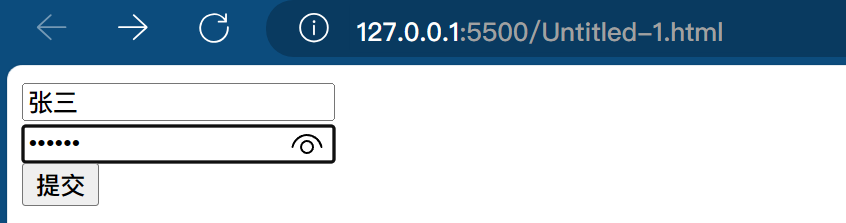

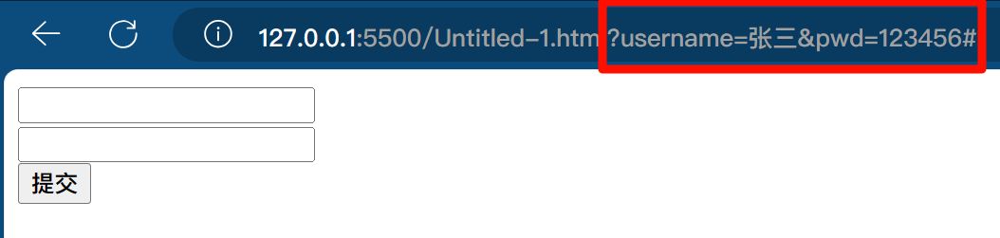


## 四、布尔类型

布尔属性是 HTML 中无需显式赋值的属性，存在即生效。常见的布尔属性包括：

- **`disabled`**：禁用控件。
- **`checked`**：默认选中（适用于单选框、复选框）。
- **`readonly`**：只读。
- **`multiple`**：允许多选（如文件上传、下拉框）。
- **`autofocus`**：页面加载时自动聚焦。
- **`selected`**：下拉框选项默认选中。

**语法规则**：

- 只写属性名即启用，例如 `<input type="checkbox" checked>`。
- 若赋值，值必须与属性名相同，例如 `<input type="checkbox" checked="checked">`。

### 5.1、表单输入控件

`<input>` 标签用于创建多种类型的输入控件。根据 `type` 属性的不同，可以生成不同的表单控件。

| **类型** | **`type` 值** | **描述**                                | **典型用途**   |
   | -------- | ------------- | --------------------------------------- | -------------- |
   | 文本框   | `text`        | 单行文本输入，默认宽度 20 字符          | 用户名、搜索词 |
   | 密码框   | `password`    | 输入内容以密文显示                      | 密码输入       |
   | 单选按钮 | `radio`       | 单选选项，同 `name` 值为一组            | 性别选择       |
   | 复选框   | `checkbox`    | 多选选项                                | 兴趣爱好选择   |
   | 提交按钮 | `submit`      | 触发表单提交                            | 表单提交       |
   | 重置按钮 | `reset`       | 重置表单为默认值                        | 重置表单       |
   | 图片按钮 | `image`       | 使用图片作为提交按钮                    | 自定义提交按钮 |
   | 普通按钮 | `button`      | 无默认行为，通常绑定脚本                | 触发 JS 事件   |
   | 隐藏域   | `hidden`      | 不可见，但随表单提交                    | 传递后台数据   |
   | 文件上传 | `file`        | 文件选择，支持 `accept` 限制类型        | 文件上传       |
   | 数字输入 | `number`      | 限制输入数字，支持 `min`、`max`、`step` | 年龄、数量     |
   | 日期选择 | `date`        | 日期选择器                              | 生日选择       |
   | 电话号码 | `tel`         | 优化移动端数字键盘                      | 手机号输入     |
   | 邮箱输入 | `email`       | 带邮箱格式验证                          | 邮箱注册       |
   | 搜索框   | `search`      | 带搜索优化（如清除按钮）                | 站内搜索       |

`accept` 属性的值可以限制文件类型，例如： 

- `image/*`：接受所有图像文件。
- `image/png`：仅接受 PNG 格式的图片。
- `audio/*`：接受所有音频文件。
- `video/*`：接受所有视频文件。
- `multiple`：允许一次选择多个文件。


```html
 <form action="" method="get">
        <!-- name可以为表单控件起名，其名称在提交表单时会传输给服务器 -->
        <!-- value可以为文本框赋默认值 -->
        <!-- readonly表示只读 -->
        <!-- required表示该信息必填 和表单域结合可以呈现验证内容 -->
        <!-- disabled表示禁用 在页面中呈现灰色 -->
        <!-- placeholder可以指定文本框输入前的信息提示 -->
     
        <label for="text">*普通文本框： </label><input type="text" name="text" id="text"><br>
     
        <!-- type="password" 表示密码文本框，其输入的内容以密文的形式出现 -->
        *密码文本框： <input type="password" name="password"><br>
     
        <!-- type="number" 表示数字数据库，只允许用户输入数字，小数或者负数 -->
        *数字输入框： <input type="number" name="number"><br>
     
        日期输入框： <input type="date" name="date"><br>
     
        <!-- type="tel" 在移动端会调起数字键盘 -->
        <!-- maxlength="11"表示输入最大的字符数 -->
        电话号码输入框：<input type="tel" name="tel" maxlength="11"><br>
     
        <!-- type="email" 在移动端会显示@ -->
        邮箱输入框： <input type="email" name="email"><br>
     
        <!-- type="radio" 使用name属性可以让单选按钮进行分组 name相同时一次只能选择一个 -->
        <!-- checked表示默认选中 -->
        *单选框：<label><input type="radio" name="sex" value="男" checked>男</label>
        <label><input type="radio" name="sex" value="女">女</label><br>
        *复选框：<input type="checkbox" name="hobby" value="足球">足球
        <input type="checkbox" name="hobby" value="排球">排球
        <input type="checkbox" name="hobby" value="乒乓球">兵乓球<br>
     
        搜索框：<input type="search" name=""><br>
     
        <!-- type="button"在value属性中可以显示按钮的内容 -->
        *普通按钮：<input type="button" value="普通按钮"><br>
     
        <!-- type="submit" 结合(form)表单域实现提交效果
		在表单中 submit 点击之后会自从触发提交行为，会向action指定的地址提交，请求方式为method指定的方式通常表单提交为post
		-->
        *提交按钮：<input type="submit" value="提交按钮"><br>
     
         <!-- 图片会被当作一个按钮 -->
        <input type="image" src="../02Day/image/华仔.png" height="50">
     
        <!-- reset表示重置按钮，会让表单回到默认值-->
        重置按钮：<input type="reset" value="重置按钮"><br>
     
        <!-- accept属性可以过滤文件 -->
        文件上传框：<input type="file" name="file" accept="img/*"><br>
     
        <!-- 隐藏域在页面不可见，但是可以随着表单一起提交给服务端-->
        隐藏域：<input type="hidden"><br>
     
        <!-- cols相当于width rows相当于heigh -->
        <textarea name="" id="" cols="30" rows="10"></textarea><br>
     
        <!-- selected指定默认选中 -->
        <!-- optgroup可以进行分组 label="理科"属性命名分组的标题 -->
        请选择课程:
        <select name="recouse">
            <optgroup label="理科"></optgroup>
            <option value="高等数学">高等数学</option>
            <option value="离散数学" selected>离散数学</option>
            <option value="线性代数">线性代数</option>
            <option value="概率论">概率论</option>
        </select>
    </form>
```

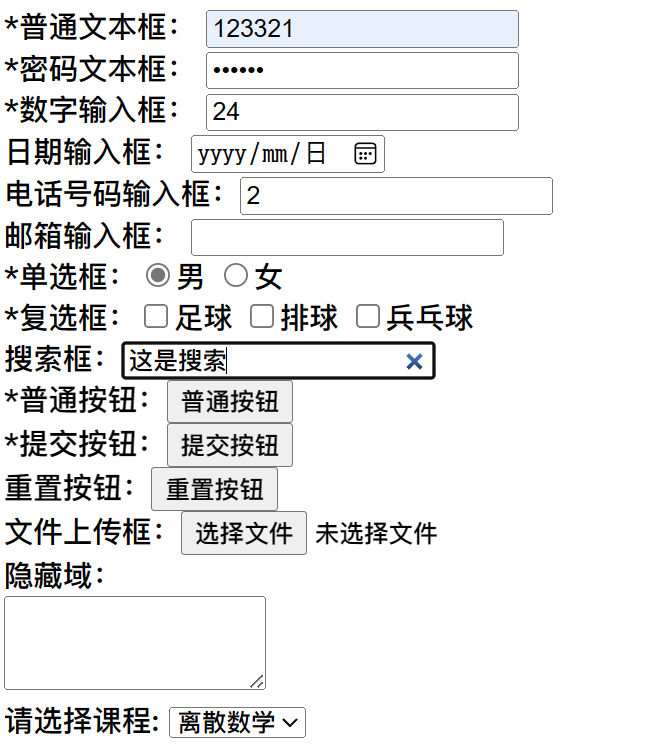

### 5.2、其他表单控件

#### 5.2.1、`<textarea>`

定义 **文本域**（一个多行的输入控件），用于输入大量文本。文本区域中可容纳无限数量的文本，且其默认字体通常是 **等宽字体**（例如 Courier）。

可以通过 cols 和 rows 属性来规定 textarea 的尺寸大小，不过更好的办法是使用 CSS 的 height 和 width 属性。

缩放设置：

- 禁止缩放：`resize: none;`
- 水平缩放：`resize: horizontal;`
- 垂直缩放：`resize: vertical;`
- 水平和垂直缩放：`resize: both;`

```html
<!-- cols相当于width, rows相当于height -->
文本域：<textarea name="text" id="text" cols="30" rows="10"></textarea><br>
```

#### 5.2.2、`<label>`

定义了 `<input>` 元素的 **标签**，一般为 **输入标题**

label 元素不会向用户呈现任何特殊效果。不过，它为鼠标用户改进了可用性。如果您在 label 元素内 **点击文本**，就会 **触发此控件**。就是说，当用户选择该标签时，浏览器就会自动将焦点转到和标签相关的表单控件上。

1. 方式一：
    - 使用 `for` 属性将 `<label>` 与对应的 `<input>` 元素建立关联，尤其适用于 **单选框** 或 **复选框**。
    - 将 `<label>` 放置在单选框或复选框后，并将 `for` 属性的值设置为 `input` 元素的 `id` 值。
2. 方式二：
    - 将 `<input>` 元素包含在 `<label>` 标签内。
    - 如果 `<input>` 被包裹在 `<label>` 标签内，则 `for` 属性可以省略。

> 注：和单选、复选结合使用，提高用户体验。

```html
<label for="phone">手机号码</label>
<input type="tel" name="phone" id="phone">
<br>
爱好：
<label><input type="checkbox" name="hobby" value="足球">足球</label>
<label><input type="checkbox" name="hobby" value="篮球">篮球</label>
<label><input type="checkbox" name="hobby" value="羽毛球">羽毛球</label>
<label><input type="checkbox" name="hobby" value="乒乓球">乒乓球</label>
```

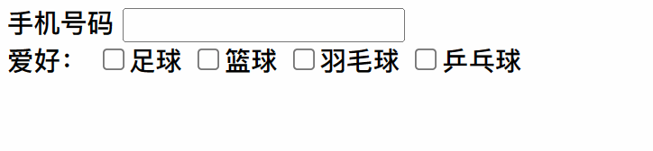

#### 5.2.3、`<fieldset>`、`<legend>` (了解)

`<fieldset>` 元素将表单中的相关元素进行分组，并为该组元素添加边框。`<legend>` 元素则为 `fieldset` 提供标题，帮助区分不同的表单组。

```html
<fieldset>
    <legend>用户信息</legend>
    <p>
        <label for="username">用户名：</label><input type="text" name="username" id="username">
    </p>
    <p>
        密码：<input type="password" name="password" placeholder="请输入密码">
    </p>
</fieldset>
```

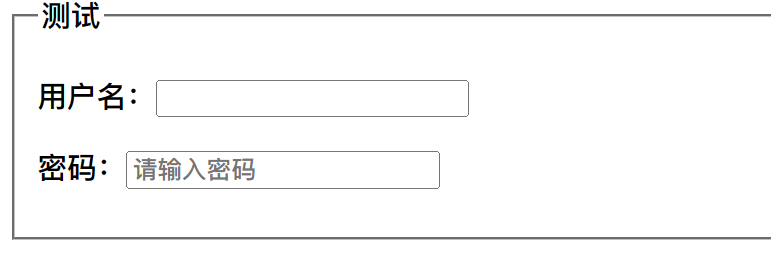

#### 5.2.4、`<select>`、`<option>`

`<select>` 定义了 **下拉选项列表**

`<option>` 定义下拉列表中的选项（一个条目）。

`size` 属性控制显示的条目数，`multiple` 属性允许多选，`selected` 属性指定默认选中项。

```html
<form action="" method="get">
    <p>请选择课程:
        <select name="course">
            <option value="高等数学" selected>高等数学</option>
            <option value="离散数学">离散数学</option>
            <option value="线性代数">线性代数</option>
            <option value="概率论">概率论</option>
        </select>
    </p>
</form>
```

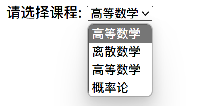

`<optgroup>`: 定义选项组

对列表项进行分组并命名, 必须使用该标签的 label 属性才可以命名;

1、把对应的 option 标签放在 optgroup 里面

2、给 optgroup 添加 label 属性, 用以列表组命名

```html
<form action="" method="get">
    请选择课程：
    <select name="course">
        <optgroup label="理科">
            <option value="高等数学">高等数学</option>
            <option value="离散数学" selected>离散数学</option>
        </optgroup>
        <optgroup label="文科">
            <option value="语文">语文</option>
            <option value="历史">历史</option>
        </optgroup>
    </select>
</form>
```

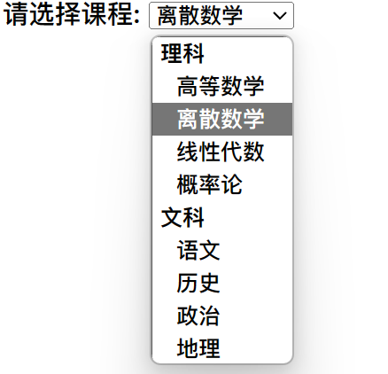

#### 5.2.5、`<button>`: 定义一个点击按钮

在 `<button>` 元素内部，您可以放置内容，比如文本或图像。这是该元素与使用 `<input>` 元素创建的按钮之间的不同之处。

提示：请始终为 `<button>` 元素规定 type 属性。不同的浏览器对 `<button>` 元素的 type 属性使用不同的默认值。

type 属性: 可以设置三个值 submit/reset/button 与 input 元素设置的按钮含义一致

```html
<form action="" method="get">
    <button type="button">按钮</button>
    <button type="submit">提交</button>
    <button type="reset">重置</button>
</form>
```

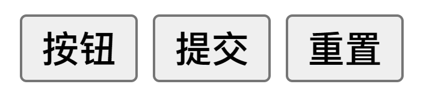

### 5.3、表单元素的属性

| 属性 | 值 | 描述 |
| --- | --- | --- |
| \*type | 上述值 | 指定 `<input>` 元素的类型。 |
| \*value | text | 指定 `<input>` 元素 value 的值。 |
| src | URL | 规定作为提交按钮图像的 URL（仅用于 `type="image"`）。 |
| size | number | 设置 `<input>` 元素的可见宽度，以字符数为单位 |
| \*readonly | readonly | 设置输入字段为只读，用户不能编辑其内容。 |
| \*name | text | 为 `<input>` 元素设置名称，用于数据提交时作为字段的键。 |
| \*maxlength | number | 限制 `<input>` 元素输入的最大字符数。 |
| \*disabled | disabled | 禁用 `<input>` 元素，无法被选中或编辑。 |
| \*checked | checked | 设置默认选中项（适用于 `checkbox` 或 `radio` 类型）。 |
| accept | audio/\* video/\* image/\* MIME\_type | 限制文件上传的文件类型（仅用于 `type="file"`）。 |
| \*selected | selected | 设置 `<select>` 下拉列表中的默认选项。 |

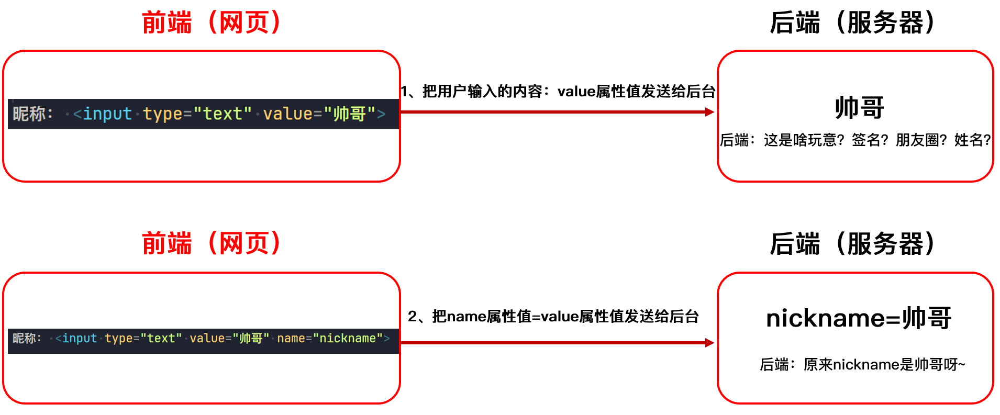

```html
    <form action="" method="get">

        <!-- value属性的值在普通文本框里为默认输入的值 -->
        *普通文本框：<input type="text" name="text" value="12345"> <br>

        <!-- readonly为只读，选中时没有光标，不能修改内容 -->
        *普通文本框：<input type="text" name="text" value="12345" readonly> <br>

        <!-- disabled表示禁用 文本框会变灰 无法选中 -->
        *普通文本框：<input type="text" name="text" value="12345" disabled> <br>

        <!-- maxlength="6"表示允许输入的最大字符数是6个 -->
        *普通文本框：<input type="text" name="text" maxlength="6"> <br>

        <!-- checked在单选框和复选框中表示默认选中 -->
        性别：<label><input type="radio" name="sex" value="男" checked>男</label>
        <label><input type="radio" name="sex" value="女">女</label> <br>
        爱好：
        <label><input type="checkbox" name="hobby" value="足球">足球</label>
        <label><input type="checkbox" name="hobby" value="篮球">篮球</label>
        <label><input type="checkbox" name="hobby" value="羽毛球">羽毛球</label>
        <label><input type="checkbox" name="hobby" value="乒乓球" checked>乒乓球</label> <br>

        <!-- selected在下拉框中表示默认选中 -->
        请选择课程:
        <select name="recourse">
            <option value="高等数学">高等数学</option>
            <option value="离散数学">离散数学</option>
            <option value="线性代数" selected>线性代数</option>
            <option value="概率论">概率论</option>
        </select>
    </form>

```

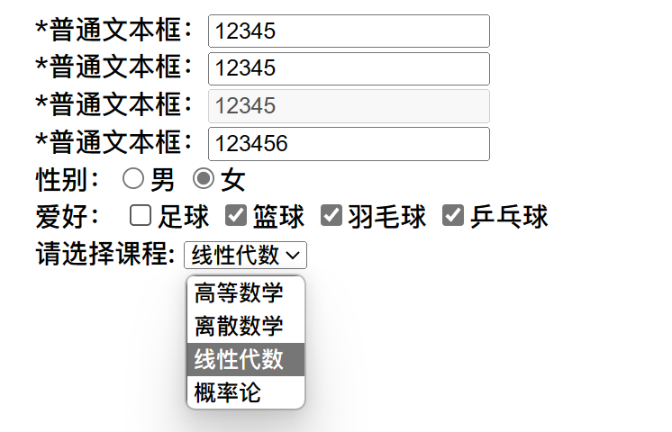

### 5.4 重点、要点

- 表单数据通过 **`key=value`** 的形式提交给服务器，其中 `key` 为表单控件的 `name` 属性值，`value` 为用户输入的内容或选择的选项。
- **单选框和复选框的 `name` 属性必须一致**，以确保数据正确提交。
- **单选框和复选框必须指定 `value` 属性**，用来作为提交的值。
- 文本框和密码框的内容作为 `value` 提交。
- 文件上传框可以通过 `accept` 属性限定文件类型，通过 `multiple` 属性实现多选。
- 使用 `select` 标签定义下拉框，并通过 `option` 设置选项。`size` 控制显示项数，`multiple` 属性允许多选。
- 下拉框项的默认选中通过 `selected` 属性指定。

六、HTML5 新表单元素
------------

### 6.1、新的 input 类型

HTML5 引入了多个新的 `input` 类型，提供了更丰富的表单功能和验证支持。
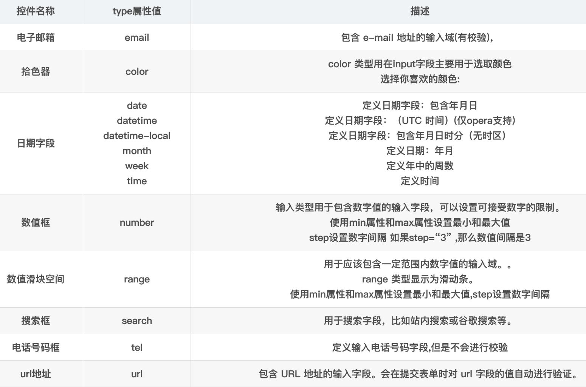


注意: 并不是所有的主流浏览器都支持新的 input 类型，不过您已经可以在所有主流的浏览器中使用它们了。即使不被支持，仍然可以显示为常规的文本域。

```html
<!--  
				我们通过input标签的type属性，可以实现各种控件效果，H5之前type属性的值：
					text、password、radio、checkbox、file、hidden、submit、reset、button
				新的 input 类型（type的值）:
					email：定义电子邮箱，有简单的校验
					color：拾色器
					日期相关：
						date	定义年月日选择器
						datetime-local	定义年月日时分选择器
						month	定义年月
						week	定义年中的周数
						time	定义时分
					number	定义数值框,有检验
					range	数值滑块
						无论是数值框还是数值滑块，都具有如下三个属性：
							max 最大值
							min 最小值
							step 步长
					search	搜索框
					tel	电话号码框，没有校验
					url	url地址输入框，有简单的校验
			-->
	<body>
    <form action="">
        <p>电子邮箱: <input type="email" name="email"></p>
        <p>拾色器: <input type="color" name="color"></p>
        <p>日期选择: <input type="date" name="date"></p>
        <p>日期时间选择: <input type="datetime-local" name="datetime-local"></p>
        <p>月份选择: <input type="month" name="month"></p>
        <p>周选择: <input type="week" name="week"></p>
        <p>时间选择: <input type="time" name="time"></p>
        <p>数值输入: <input type="number" name="number"></p>
        <p>滑块输入: <input type="range" min="1" max="100" step="10"></p>
        <p>搜索框: <input type="search" name="search"></p>
        <p>电话号码: <input type="tel" name="tel"></p>
        <p>URL 输入: <input type="url" name="url"></p>
        <button type="submit">提交</button>
    </form>
</body>
```

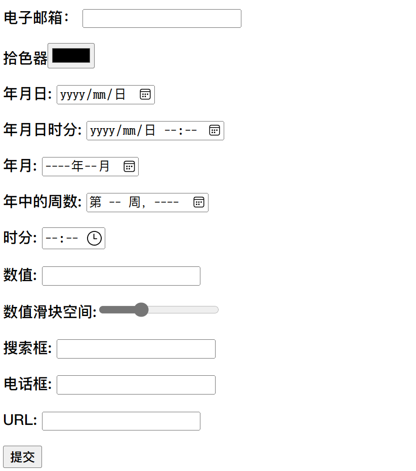

### 6.2、新的表单属性

#### 6.2.1、\*form / input autocomplete 属性

`autocomplete` 属性规定 form 或 input 域应该拥有自动完成功能。

当用户在自动完成域中开始输入时，浏览器应该在该域中显示填写的选项。

**提示** ：`autocomplete` 属性可以在 `<form>` 元素中启用，而在某些 `<input>` 元素中禁用。 

**注意** ：`autocomplete` 属性适用于 `<form>` 元素以及以下类型的 `<input>` 元素：`text`、`search`、`url`、`tel`、`email`、`password`、`date`、`range` 和 `color`。 

HTML form 中开启 autocomplete (一个 input 字段关闭 autocomplete )：

```html
        <!--  
			在整个表单中，我们在输入框中提交的历史数据，都会自动提示
			
			autocomplete 属性规定 form 或 input 域应该拥有自动完成功能。
			关于自动补全，一定是分场景的：
				如果是注册，我们肯定不需要自动补全功能
				如果是登录，用户名可以开启自动补全
				
				如果autocomplete="off"添加给form表单，那么表单里面的所有元素都关闭自动补全
		-->
    <!-- <form action="" autocomplete="off"> -->
        <form action="">
            用户名: <input type="text" name="username" autocomplete="off"> <br>
            密&emsp;码: <input type="password" name="password"><br>
            姓&emsp;名: <input type="text" name="name"><br>
            <button type="submit">提交</button>
        </form>
```


#### 6.2.2、\*form novalidate 属性

`novalidate` 是一个布尔属性，指示浏览器在提交表单时不进行任何验证。这意味着即使输入的数据不符合规定格式，表单依然可以被提交。

```html
    <!-- novalidate提交信息时不会再进行校验 -->
    <form action="#" method="get"  novalidate autocomplete="off">
        邮箱：<input type="email" name="email"><br>
        URL：<input type="url" name="url"><br>
        <button type="submit">提交</button>
    </form>
```

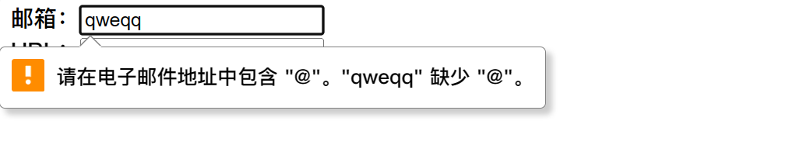

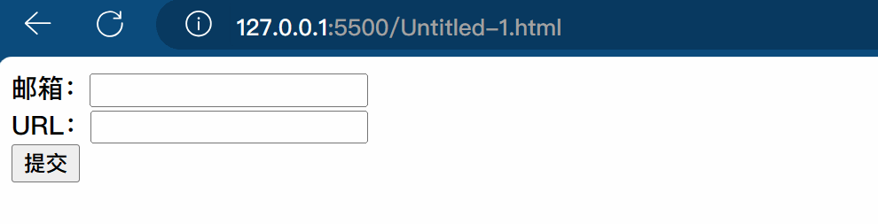

#### 6.2.3、\*input placeholder 属性

placeholder 属性提供一种提示（hint），描述输入域所期待的值。

简短的提示在用户输入值前会显示在输入域上。

**适用类型：**  `text`、`search`、`url`、`tel`、`email` 和 `password` 类型的 `<input>` 元素。

#### 6.2.4、\*input required 属性

`required` 属性要求用户在提交表单之前填写输入字段，即该字段不能为空。 

**适用类型：**  `text`、`search`、`url`、`tel`、`email`、`password`、`date`、`number`、`checkbox`、`radio` 和 `file` 类型的 `<input>` 元素。 

#### 6.2.5、input step 属性

`step` 属性指定输入字段合法的数字间隔。例如，`step="3"` 表示合法输入值为 `0, 3, 6, 9...` 等。 

**提示** ：`step` 可以与 `min` 和 `max` 属性结合使用，定义一个数字范围。 

**适用类型：**  `number`、`range`、`date`、`datetime`、`datetime-local`、`month`、`time` 和 `week` 类型的 `<input>` 元素。 

#### 6.2.6、input autofocus 属性

`autofocus` 属性规定在页面加载时，域自动地获得焦点。

```html
    <!--  
			placeholder 属性提供一种提示（hint），描述输入域所期待的值。
			required 属性规定必须在提交之前填写输入域（不能为空）。
				如果我们使用正则校验，required其实可以不使用。
				这个属性也是重要的，原因是很多框架中还在用这个属性
			step 属性为输入域规定合法的数字间隔。
			autofocus 属性规定在页面加载时，域自动地获得焦点。
		-->

    <form action="">
        用户名: <input type="text" name="username" autocomplete="off" placeholder="请输入用户名"> <br>
        密&emsp;码: <input type="password" name="password" placeholder="请输入密码" autofocus required><br>
        姓&emsp;名: <input type="text" name="name" placeholder="请输入姓名"><br>
        <button type="submit">提交</button>
    </form>
```

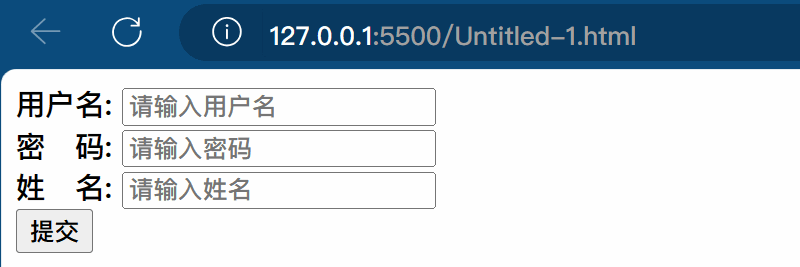

#### 6.2.7、input form 属性

form 属性规定输入域所属的一个或多个表单。

\*\*提示:\*\*如需引用一个以上的表单，请使用空格分隔的列表。

位于 form 表单外的 input 字段引用了 HTML form (该 input 表单仍然属于 form 表单的一部分):

```html
<form action="#" id="form1">
    First name: <input type="text" name="fname"><br>
    <input type="submit" value="提交">
</form>

Last name: <input type="text" name="lname" form="form1">
```


#### 6.2.8、input formaction 属性

`formaction` 属性指定表单提交的 URL 地址。它覆盖 `<form>` 元素的 `action` 属性，仅适用于 `type="submit"` 和 `type="image"` 类型的按钮。

以下 HTMLform 表单包含了两个不同地址的提交按钮：

```html
<form action="demo-form.php">
    First name: <input type="text" name="fname"><br>
    Last name: <input type="text" name="lname"><br>
    <input type="submit" value="提交"><br>
    <input type="submit" formaction="demo-admin.php"
           value="提交">
</form>
```

#### 6.2.9、input formenctype 属性

formenctype 属性描述了表单提交到服务器的数据编码 (只对 form 表单中 method =“post” 表单)

formenctype 属性覆盖 form 元素的 enctype 属性。

注意: 该属性与 type =“submit” 和 type =“image” 配合使用。

第一个提交按钮已默认编码发送表单数据，第二个提交按钮以 “multipart/form-data” 编码格式发送表单数据:

```html
<form action="demo-post_enctype.php" method="post">
    First name: <input type="text" name="fname"><br>
    <input type="submit" value="提交">
    <input type="submit" formenctype="multipart/form-data"
           value="以 Multipart/form-data 提交">
</form>
```

#### 6.2.10、input formmethod 属性

formmethod 属性定义了表单提交的方式。

formmethod 属性覆盖了 `<form>` 元素的 method 属性。

注意: 该属性可以与 type =“submit” 和 type =“image” 配合使用。

重新定义表单提交方式实例:

```html
<form action="demo-form.php" method="get">
    First name: <input type="text" name="fname"><br>
    Last name: <input type="text" name="lname"><br>
    <input type="submit" value="提交">
    <input type="submit" formmethod="post" formaction="demo-post.php"
           value="使用 POST 提交">
</form>
```

#### 6.2.11、input formnovalidate 属性

novalidate 属性是一个 boolean 属性.

novalidate 属性描述了 `<input>` 元素在表单提交时无需被验证。

formnovalidate 属性会覆盖 `<form>` 元素的 novalidate 属性.

**注意:** formnovalidate 属性与 **type =“submit”** 一起使用

两个提交按钮的表单(使用与不适用验证 ):

```html
<form action="demo-form.php">
    E-mail: <input type="email" name="userid"><br>
    <input type="submit" value="提交"><br>
    <input type="submit" formnovalidate value="不验证提交">
</form>
```

#### 6.2.12、\*input height 和 width 属性

height 和 width 属性规定用于 image 类型的 `<input>` 标签的图像高度和宽度。

注意: height 和 width 属性只适用于 image 类型的 `<input>` 标签。

提示: 图像通常会同时指定高度和宽度属性。如果图像设置高度和宽度，图像所需的空间 在加载页时会被保留。如果没有这些属性， 浏览器不知道图像的大小，并不能预留 适当的空间。图片在加载过程中会使页面布局效果改变 （尽管图片已加载）。

定义了一个图像提交按钮, 使用了 height 和 width 属性:

```html
    <!-- input height 和 width 属性
    注意: height 和 width 属性只适用于 image 类型的<input>标签。 -->
    <form action="#">
        <input type="image" src="../images/login.png" width="100" height="50">
    </form>
```

#### 6.2.13、\*input list 属性

list 属性规定输入域的 datalist。datalist 是输入域的选项列表。

```html
    <!-- 
			datalist：规定输入域的选项列表。必须和input输入框结合使用
				input标签的list属性值 和 datalist的id属性值保持一致
				列表项是由option来定义的
				当我们在input输入框输入内容的时候，它会匹配数据列表中的列表项。由option的value来进行匹配。
		-->

    <input type=“text” name=”data” list=”dlist”>
    <datalist id=”dlist”>
        <option value="CAD">CAD制图是一款制图软件，设计人员利用计算机及其图形设备进行设计工作</option>
        <option value="HTML5">HTML5是构建Web内容的一种语言描述方式。</option>
        <option value="JAVASCRIPT">JavaScript（简称“JS”）是一种具有函数优先的轻量级，解释型或即时编译型的编程语言。</option>
        <option value=".NET">.NET是一种用于构建多种应用的免费开源开发平台，</option>
        <option value="JAVA">Java 是一个通用术语，用于表示 Java 软件及其组件</option>
    </datalist>


```

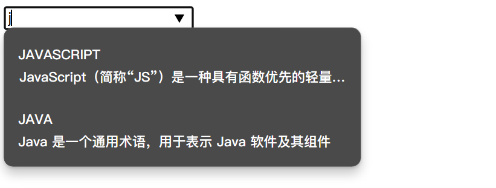

#### 6.2.14、input multiple 属性

multiple 属性规定 `<input>` 元素中可选择多个值。

注意: multiple 属性适用于以下类型的 `<input>` 标签： file

```html
    <form action="#">
       <input type="file" name="file" multiple><br>
        <input type="submit">
    </form>
```

#### 6.2.15、\*input pattern 属性

pattern 属性描述了一个正则表达式用于验证 `<input>` 元素的值。

注意: pattern 属性适用于以下类型的 `<input>` 标签: text, search, url, tel, email, 和 password.

提示： 是用来全局 title 属性描述了模式.

提示： 在我们的 JavaScript 教程中学习到有关正则表达式的内容

```html
    <!-- input pattern 属性
    pattern 属性描述了一个正则表达式用于验证 <input>元素的值。 -->
    <form action="#">
        <input type="tel" name="phone" pattern="^(1[3456789])\d{9}$" title="请输入正确的手机号"><br>
         <input type="submit">
     </form>
```

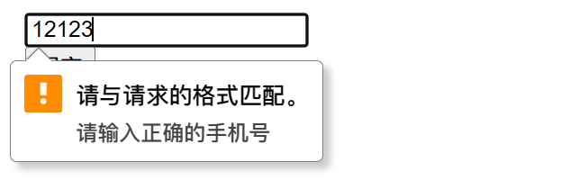

#### 6.2.16、\*input min 和 max 属性

min、max 和 step 属性用于为包含数字或日期的 input 类型规定限定（约束）。

**注意:** min、max 和 step 属性适用于以下类型的 `<input>` 标签：date pickers、number 以及 range。

`<input>` 元素最小值与最大值设置:

```html
    <!-- input min 和 max 属性
    min、max 和 step 属性用于为包含数字或日期的 input 类型规定限定（约束）。 -->
    <form action="#">
        <input type="date" min="1940-10-01">
         <input type="submit">
     </form>
```

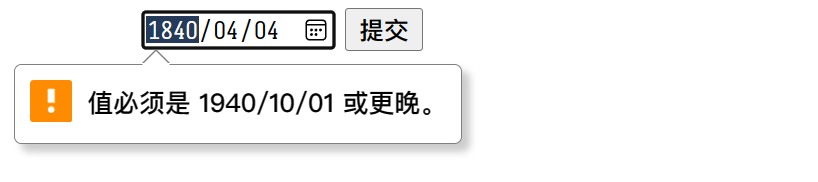

