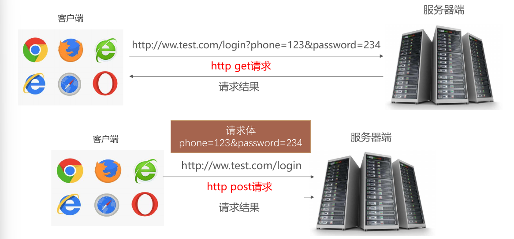

# 表单

一、表单的用途
-------

HTML 表单是 Web 开发中用于收集用户输入并通过 HTTP 请求发送至服务器的核心工具。它通过交互控件（如文本框、按钮等），实现数据的接收与后端处理。

**表单三大基本构成：**

1. **表单标签**：通过 `<form>` 定义范围，`action` 属性指定数据提交的 URL，`method` 属性确定发送方式（`GET` 或 `POST`）。
2. **表单控件**：包括文本框、密码框、复选框、单选框、下拉框、文件上传等交互元素。
3. **表单按钮**：如提交按钮（`submit`）、重置按钮（`reset`）和普通按钮（`button`），用于触发数据提交、重置或执行脚本。

二、常见的表单元素
---------

- **`<form>`**：表单根标签，包裹其他表单元素。
- **`<input>`**：多功能控件，支持文本、单选、复选、按钮等类型。
- **`<textarea>`**：多行文本输入框。
- **`<select>`、`<option>`**：下拉菜单及其选项。
- **`<button>`**：自定义按钮。
- **`<label>`**：为控件提供描述或提示。

三、表单的基本语法
---------

使用 **`<form>`** 标签创建表单:

```html
<form action="表单提交地址" method="提交方法">
    <!-- 表单控件：文本框、按钮等 -->
</form>
```

### `<form>` 的核心属性

- **`action`**  
  指定表单数据提交的目标 URL，例如 `/api/submit`。若为空，则默认提交至当前页面。
- **`method`**  
  定义数据发送的 HTTP 方法，常见取值包括：
  - `GET`：将数据附加在 URL 的查询字符串中。
  - `POST`：将数据封装在 HTTP 请求体中。

### `GET` 与 `POST` 的对比

1. **请求方式不同**    
   - **GET** ：**从指定的资源请求数据** 。  
   - **POST** ：**向指定的资源提交要处理的数据** 。

2. **请求规则不同**    
   - GET ：
     - 请求可以被缓存。
     - 请求保留在浏览器的历史记录中。
     - 请求可以被收藏为书签。
     - 不应在处理敏感数据时使用。
     - **请求有长度限制** （URL 的最大长度为 2048 个字符）。
     - 请求应该用于获取数据。
   
   - POST ：
     - 请求不会被缓存
     - 请求不会保留在浏览器历史记录中
     - 请求不能被收藏为书签
     - **请求对数据长度没有限制** 

3. **数据传输方式不同**    

   - **GET** ：发送的数据附加在 URL 后面，**数据是公开的，安全性较差** ，因为数据直接暴露在 URL 中。URL 的最大长度为 2048 个字符，因此传输数据的长度受限。  

   - **POST** ：数据被放置在请求体中，**更加安全** ，因为数据不会显示在 URL 中，也不会出现在浏览器的历史记录或 Web 服务器日志中。POST 请求没有长度限制，适合传输大量数据。


4. **可见性和支持的数据类型**    

   - **GET** ：请求的参数和数据会显示在 URL 中，且仅支持 ASCII 字符。

   - **POST** ：请求的参数不会显示在 URL 中，支持更多数据格式，如文件上传等。


总之：

- **GET 提交** ：用户输入的信息显示在地址栏中，不安全，长度有限，请求速度较快。适用于搜索等场景。
  
- **POST 提交** ：用户输入的信息不会显示在地址栏中，更加安全，数据长度无限制。适用于用户注册、登录等场景。

    > **注意**：`GET` 提交时，控件的 `name` 属性及其值会附加在 URL 中，例如 `?username=abc&pwd=123`。


```html
  <form action="#" method="get">
        <input type="text" name="username"><br>
        <input type="password" name="pwd"><br>
        <input type="submit">
    </form>
```




## 四、布尔类型

布尔属性是 HTML 中无需显式赋值的属性，存在即生效。常见的布尔属性包括：

- **`disabled`**：禁用控件。
- **`checked`**：默认选中（适用于单选框、复选框）。
- **`readonly`**：只读。
- **`multiple`**：允许多选（如文件上传、下拉框）。
- **`autofocus`**：页面加载时自动聚焦。
- **`selected`**：下拉框选项默认选中。

**语法规则**：

- 只写属性名即启用，例如 `<input type="checkbox" checked>`。
- 若赋值，值必须与属性名相同，例如 `<input type="checkbox" checked="checked">`。

### 5.1、表单输入控件

`<input>` 标签通过 `type` 属性定义多种输入控件，是表单的核心元素，用于收集用户数据并提交至服务器。

| **类型** | **`type` 值** | **描述**                         | **典型用途**       |
| -------- | ------------- | -------------------------------- | ------------------ |
| 文本框   | `text`        | 单行文本输入，默认宽度约 20 字符 | 用户名、搜索关键词 |
| 密码框   | `password`    | 输入内容以掩码显示               | 登录密码           |
| 单选按钮 | `radio`       | 单选选项，需同 `name` 分组       | 性别、投票选项     |
| 复选框   | `checkbox`    | 多选选项                         | 兴趣爱好、权限选择 |
| 提交按钮 | `submit`      | 触发表单提交                     | 表单确认提交       |
| 重置按钮 | `reset`       | 重置表单至初始值                 | 表单内容清空       |
| 图片按钮 | `image`       | 以图片形式提交表单               | 个性化提交按钮     |
| 普通按钮 | `button`      | 无默认行为，需绑定脚本           | 触发自定义事件     |
| 隐藏域   | `hidden`      | 不可见，随表单提交数据           | 传递用户 ID、Token |
| 文件上传 | `file`        | 文件选择，支持类型限制           | 头像上传、附件提交 |
| 数字输入 | `number`      | 限制输入数字，可设范围和步长     | 年龄、商品数量     |
| 日期选择 | `date`        | 日期选择器                       | 出生日期、预约日期 |
| 电话号码 | `tel`         | 优化移动端数字键盘               | 手机号输入         |
| 邮箱输入 | `email`       | 自带邮箱格式验证                 | 注册邮箱           |
| 搜索框   | `search`      | 优化搜索体验（如带清除按钮）     | 站内搜索           |

`accept` 属性的值可以限制文件类型，例如： 

- `image/*`：接受所有图像文件。
- `image/png`：仅接受 PNG 格式的图片。
- `audio/*`：接受所有音频文件。
- `video/*`：接受所有视频文件。
- `multiple`：允许一次选择多个文件。


```html
 <form action="" method="get">
        <!-- name可以为表单控件起名，其名称在提交表单时会传输给服务器 -->
        <!-- value可以为文本框赋默认值 -->
        <!-- readonly表示只读 -->
        <!-- required表示该信息必填 和表单域结合可以呈现验证内容 -->
        <!-- disabled表示禁用 在页面中呈现灰色 -->
        <!-- placeholder可以指定文本框输入前的信息提示 -->
     
        <label for="text">*普通文本框： </label><input type="text" name="text" id="text"><br>
     
        <!-- type="password" 表示密码文本框，其输入的内容以密文的形式出现 -->
        *密码文本框： <input type="password" name="password"><br>
     
        <!-- type="number" 表示数字数据库，只允许用户输入数字，小数或者负数 -->
        *数字输入框： <input type="number" name="number"><br>
     
        日期输入框： <input type="date" name="date"><br>
     
        <!-- type="tel" 在移动端会调起数字键盘 -->
        <!-- maxlength="11"表示输入最大的字符数 -->
        电话号码输入框：<input type="tel" name="tel" maxlength="11"><br>
     
        <!-- type="email" 在移动端会显示@ -->
        邮箱输入框： <input type="email" name="email"><br>
     
        <!-- type="radio" 使用name属性可以让单选按钮进行分组 name相同时一次只能选择一个 -->
        <!-- checked表示默认选中 -->
        *单选框：<label><input type="radio" name="sex" value="男" checked>男</label>
        <label><input type="radio" name="sex" value="女">女</label><br>
        *复选框：<input type="checkbox" name="hobby" value="足球">足球
        <input type="checkbox" name="hobby" value="排球">排球
        <input type="checkbox" name="hobby" value="乒乓球">兵乓球<br>
     
        搜索框：<input type="search" name=""><br>
     
        <!-- type="button"在value属性中可以显示按钮的内容 -->
        *普通按钮：<input type="button" value="普通按钮"><br>
     
        <!-- type="submit" 结合(form)表单域实现提交效果
		在表单中 submit 点击之后会自从触发提交行为，会向action指定的地址提交，请求方式为method指定的方式通常表单提交为post
		-->
        *提交按钮：<input type="submit" value="提交按钮"><br>
     
         <!-- 图片会被当作一个按钮 -->
        <input type="image" src="../02Day/image/华仔.png" height="50">
     
        <!-- reset表示重置按钮，会让表单回到默认值-->
        重置按钮：<input type="reset" value="重置按钮"><br>
     
        <!-- accept属性可以过滤文件 -->
        文件上传框：<input type="file" name="file" accept="img/*"><br>
     
        <!-- 隐藏域在页面不可见，但是可以随着表单一起提交给服务端-->
        隐藏域：<input type="hidden"><br>
     
        <!-- cols相当于width rows相当于heigh -->
        <textarea name="" id="" cols="30" rows="10"></textarea><br>
     
        <!-- selected指定默认选中 -->
        <!-- optgroup可以进行分组 label="理科"属性命名分组的标题 -->
        请选择课程:
        <select name="recouse">
            <optgroup label="理科"></optgroup>
            <option value="高等数学">高等数学</option>
            <option value="离散数学" selected>离散数学</option>
            <option value="线性代数">线性代数</option>
            <option value="概率论">概率论</option>
        </select>
    </form>
```


### 5.2、其他表单控件

#### 5.2.1、`<textarea>` - 多行文本输入

用于输入大段文本，默认显示等宽字体。尺寸可通过 `cols` 和 `rows` 或 CSS 的 `width` 和 `height` 设置。

- **缩放控制（CSS）**：
  - `resize: none;` - 禁止缩放
  - `resize: horizontal;` - 仅水平缩放
  - `resize: vertical;` - 仅垂直缩放
  - `resize: both;` - 双向缩放

```html
<!-- cols相当于width, rows相当于height -->
<textarea name="bio" cols="30" rows="5" placeholder="请输入个人简介"></textarea>
```

#### 5.2.2、 `<label>` - 控件标签

增强表单可访问性，点击标签可聚焦关联控件。

**使用方式**：

- 通过 `for` 属性关联 `<input>` 的 `id`。
- 直接包裹 `<input>`，无需 `for`。

> 注：和单选、复选结合使用，提高用户体验。

```html
<label for="email">邮箱：</label>
<input type="email" id="email" name="email"><br>

<label><input type="checkbox" name="agree" value="yes"> 同意条款</label>
```

#### 5.2.3、`<fieldset>`、`<legend>` - 表单分组

`<fieldset>` 元素将表单中的相关元素进行分组，并为该组元素添加边框。`<legend>` 元素则为 `fieldset` 提供标题，帮助区分不同的表单组。

```html
<fieldset>
    <legend>账户信息</legend>
    <label>用户名：<input type="text" name="username"></label><br>
    <label>密码：<input type="password" name="password"></label>
</fieldset>
```


#### 5.2.4、`<select>`、`<option>` - 下拉菜单

定义下拉选择框，`<option>` 指定选项，`<optgroup>` 可分组。

**属性**：

- `size`：显示的条目数。
- `multiple`：允许多选。
- `selected`：默认选中。

```html
<select name="course">
    <optgroup label="理科">
        <option value="math">数学</option>
        <option value="physics" selected>物理</option>
    </optgroup>
    <optgroup label="文科">
        <option value="literature">文学</option>
    </optgroup>
</select>
```


```html
<form action="" method="get">
    请选择课程：
    <select name="course">
        <optgroup label="理科">
            <option value="高等数学">高等数学</option>
            <option value="离散数学" selected>离散数学</option>
        </optgroup>
        <optgroup label="文科">
            <option value="语文">语文</option>
            <option value="历史">历史</option>
        </optgroup>
    </select>
</form>
```


#### 5.2.5、`<button>` - 自定义按钮

支持内部嵌套内容（如文本、图片），`type` 属性定义行为。

**类型**：

- `submit`：提交表单（默认）。
- `reset`：重置表单。
- `button`：无默认行为，需脚本绑定。

```html
<button type="submit">提交</button>
<button type="button" onclick="alert('点击了！')">点击我</button>
```


### 5.3、表单元素的属性

| **属性**      | **值**       | **描述**                   |
| ------------- | ------------ | -------------------------- |
| `type`        | 见上表       | 定义 `<input>` 类型        |
| `value`       | 文本         | 设置默认值或提交值         |
| `name`        | 文本         | 数据提交时的键名           |
| `readonly`    | `readonly`   | 只读，不可编辑             |
| `disabled`    | `disabled`   | 禁用控件，显示为灰色       |
| `required`    | `required`   | 必填字段，未填时阻止提交   |
| `maxlength`   | 数字         | 限制最大输入字符数         |
| `accept`      | `image/*` 等 | 限制文件上传类型           |
| `checked`     | `checked`    | 默认选中（单选框、复选框） |
| `selected`    | `selected`   | 默认选中（下拉选项）       |
| `placeholder` | 文本         | 输入提示文本               |

HTML5 新增输入类型

| **类型**         | **描述**                  | **示例用途** |
| ---------------- | ------------------------- | ------------ |
| `color`          | 颜色选择器                | 主题颜色选择 |
| `datetime-local` | 本地日期时间选择          | 活动时间安排 |
| `month`          | 月份选择器                | 信用卡有效期 |
| `week`           | 周选择器                  | 项目周期规划 |
| `time`           | 时间选择器                | 预约时间     |
| `range`          | 滑动条（带 `min`、`max`） | 音量调节     |
| `url`            | URL 输入，带格式验证      | 网站链接提交 |


### 5.4 重点、要点

- 表单数据以 **`key=value`** 形式提交至服务器，其中 `key` 为控件 `name` 属性值，`value` 为用户输入或选择的选项。
- 单选框和复选框需保持 **`name` 属性一致**，以确保数据分组正确提交。
- 单选框和复选框必须设置 **`value` 属性**，作为提交时的具体值。
- 文本框和密码框的内容直接作为 `value` 提交。
- 文件上传框可通过 **`accept` 属性**限制文件类型，借助 **`multiple` 属性**支持多选。

六、HTML5 新表单元素
------------

### 6.1、新的 input 类型

HTML5 引入了多个新的 `input` 类型，提供了更丰富的表单功能和验证支持。


注意: 并不是所有的主流浏览器都支持新的 input 类型，不过您已经可以在所有主流的浏览器中使用它们了。即使不被支持，仍然可以显示为常规的文本域。

```html
<body>
    <form action="" method="">
        <p>电子邮箱: <input type="email" name="email"></p>
        <p>拾色器: <input type="color" name="color"></p>
        <p>日期选择: <input type="date" name="date"></p>
        <p>日期时间选择: <input type="datetime-local" name="datetime-local"></p>
        <p>月份选择: <input type="month" name="month"></p>
        <p>周选择: <input type="week" name="week"></p>
        <p>时间选择: <input type="time" name="time"></p>
        <p>数值输入: <input type="number" name="number"></p>
        <p>滑块输入: <input type="range" min="1" max="100" step="10"></p>
        <p>搜索框: <input type="search" name="search"></p>
        <p>电话号码: <input type="tel" name="tel"></p>
        <p>URL 输入: <input type="url" name="url"></p>
        <button type="submit">提交</button>
    </form>
</body>
```


### 6.2、新增表单属性

#### 6.2.1、\*form / input autocomplete 属性

`autocomplete` 属性用于指定` <form>` 或 `<input> `元素是否启用自动完成功能。当启用时，用户在输入时，浏览器会根据历史输入记录显示建议选项。

**提示**：  

- 可在 `<form>` 元素上全局启用 `autocomplete`，同时在特定 `<input>` 元素上禁用。  
- 适用场景因需求而异：注册表单通常无需自动补全，而登录表单 的用户名字段则适合启用。

**适用类型**：  
适用于 `<form>` 及以下 `<input>` 类型：`text`、`search`、`url`、`tel`、`email`、`password`、`date`、`range` 和 `color`。

**示例**：在表单中启用自动补全，但针对某个输入框禁用：

```html
<!--  
在整个表单中，我们在输入框中提交的历史数据，都会自动提示
autocomplete 属性规定 form 或 input 域应该拥有自动完成功能。
关于自动补全，一定是分场景的：
如果是注册，我们肯定不需要自动补全功能
如果是登录，用户名可以开启自动补全
如果autocomplete="off"添加给form表单，那么表单里面的所有元素都关闭自动补全
-->
<!-- <form action="" autocomplete="off"> -->
<form action="">
    用户名: <input type="text" name="username" autocomplete="off"> <br>
    密&emsp;码: <input type="password" name="password"><br>
    姓&emsp;名: <input type="text" name="name"><br>
    <button type="submit">提交</button>
</form>
```

#### 6.2.2、\*form novalidate 属性

`novalidate` 是一个布尔属性，指示浏览器在提交表单时跳过数据验证。即使输入内容不符合格式要求，表单仍可提交。

```html
    <!-- novalidate提交信息时不会再进行校验 -->
    <form action="#" method="get"  novalidate autocomplete="off">
        邮箱：<input type="email" name="email"><br>
        URL：<input type="url" name="url"><br>
        <button type="submit">提交</button>
    </form>
```


#### 6.2.3、`placeholder` 属性

`placeholder` 属性为输入框提供提示信息，描述用户预期输入的内容。在用户输入前，提示文字会以灰色显示于输入框内。

**适用类型**：  
适用于 `text`、`search`、`url`、`tel`、`email` 和 `password` 类型的 `<input>` 元素。

#### 6.2.4、`required` 属性

`required` 属性强制要求用户在提交表单前填写输入字段，字段内容不得为空。

**适用类型**：  
适用于 `text`、`search`、`url`、`tel`、`email`、`password`、`date`、`number`、`checkbox`、`radio` 和 `file` 类型的 `<input>` 元素。

#### 6.2.5、`step` 属性

`step` 属性定义输入字段的合法数字间隔。例如，`step="3"` 表示允许输入 `0, 3, 6, 9...` 等值。

**提示**：  
可与 `min` 和 `max` 属性配合使用，限定数字范围。

**适用类型**：  
适用于 `number`、`range`、`date`、`datetime`、`datetime-local`、`month`、`time` 和 `week` 类型的 `<input>` 元素。

#### 6.2.6、input autofocus 属性

`autofocus` 属性规定在页面加载时，域自动地获得焦点。

```html
<!--  
placeholder 属性提供一种提示（hint），描述输入域所期待的值。
required 属性规定必须在提交之前填写输入域（不能为空）。
如果我们使用正则校验，required其实可以不使用。
这个属性也是重要的，原因是很多框架中还在用这个属性
step 属性为输入域规定合法的数字间隔。
autofocus 属性规定在页面加载时，域自动地获得焦点。
-->
<form action="">
    用户名: <input type="text" name="username" autocomplete="off" placeholder="请输入用户名"> <br>
    密&emsp;码: <input type="password" name="password" placeholder="请输入密码" autofocus required><br>
    姓&emsp;名: <input type="text" name="name" placeholder="请输入姓名"><br>
    <button type="submit">提交</button>
</form>
```


#### 6.2.7、input form 属性

`form` 属性指定输入字段所属的一个或多个表单，通过表单的 `id` 进行关联。

**提示**：  
如需关联多个表单，可用空格分隔多个 `id`。

示例: 位于 form 表单外的 input 字段引用了 HTML form (该 input 表单仍然属于 form 表单的一部分):

```html
<form action="#" id="form1">
    名: <input type="text" name="fname"><br>
    <input type="submit" value="提交">
</form>
姓: <input type="text" name="lname" form="form1">
```

**效果**：位于表单外的输入框仍属于 `form1` 的一部分。

#### 6.2.8、input formaction 属性

`formaction` 属性指定表单提交的目标 URL，覆盖 `<form>` 的 `action` 属性，仅适用于 `type="submit"` 或 `type="image"` 的按钮。

以下 HTMLform 表单包含了两个不同地址的提交按钮：

```html
<form action="demo-form.php">
    名: <input type="text" name="fname"><br>
    姓: <input type="text" name="lname"><br>
    <input type="submit" value="提交"><br>
    <input type="submit" formaction="demo-admin.php" value="提交到管理端">
</form>
```

#### 6.2.9、input formenctype 属性

`formenctype` 属性定义表单提交至服务器时的数据编码方式，覆盖 `<form>` 的 `enctype` 属性，仅适用于 `method="post"` 的表单以及 `type="submit"` 或 `type="image"` 的按钮。

第一个提交按钮已默认编码发送表单数据，第二个提交按钮以 “multipart/form-data” 编码格式发送表单数据:

```html
<form action="demo-post_enctype.php" method="post">
    First name: <input type="text" name="fname"><br>
    <input type="submit" value="提交">
    <input type="submit" formenctype="multipart/form-data"
           value="以 Multipart/form-data 提交">
</form>
```

#### 6.2.10、input formmethod 属性

`formmethod` 属性定义表单提交的 HTTP 方法，覆盖 `<form>` 的 `method` 属性，仅适用于 `type="submit"` 或 `type="image"` 的按钮。

重新定义表单提交方式实例:

```html
<form action="demo-form.php" method="get">
    名: <input type="text" name="fname"><br>
    姓: <input type="text" name="lname"><br>
    <input type="submit" value="提交">
    <input type="submit" formmethod="post" formaction="demo-post.php" value="使用 POST 提交">
</form>
```

#### 6.2.11、input formnovalidate 属性

`formnovalidate` 是一个布尔属性，指示特定提交按钮在提交时无需验证数据，覆盖 `<form>` 的 `novalidate` 属性，仅适用于 `type="submit"`。

两个提交按钮的表单(使用与不适用验证 ):

```html
<form action="demo-form.php">
    邮箱: <input type="email" name="userid"><br>
    <input type="submit" value="提交"><br>
    <input type="submit" formnovalidate value="不验证提交">
</form>
```

#### 6.2.12、\*input height 和 width 属性

height 和 width 属性规定用于 image 类型的 `<input>` 标签的图像高度和宽度。

注意: height 和 width 属性只适用于 image 类型的 `<input>` 标签。

提示: 图像通常会同时指定高度和宽度属性。如果图像设置高度和宽度，图像所需的空间 在加载页时会被保留。如果没有这些属性， 浏览器不知道图像的大小，并不能预留 适当的空间。图片在加载过程中会使页面布局效果改变 （尽管图片已加载）。

定义了一个图像提交按钮, 使用了 height 和 width 属性:

```html
    <!-- input height 和 width 属性
    注意: height 和 width 属性只适用于 image 类型的<input>标签。 -->
    <form action="#">
        <input type="image" src="../images/login.png" width="100" height="50">
    </form>
```

#### 6.2.13、\*input list 属性

`list` 属性为输入框关联一个 `<datalist>` 元素，提供选项列表供用户选择。需确保 `list` 属性值与 `<datalist>` 的 `id` 一致。

```html
<!-- 
datalist：规定输入域的选项列表。必须和input输入框结合使用
input标签的list属性值 和 datalist的id属性值保持一致
列表项是由option来定义的
当我们在input输入框输入内容的时候，它会匹配数据列表中的列表项。由option的value来进行匹配。
-->

<input type=“text” name=”data” list=”dlist”>
<datalist id=”dlist”>
    <option value="CAD">CAD制图是一款制图软件，设计人员利用计算机及其图形设备进行设计工作</option>
    <option value="HTML5">HTML5是构建Web内容的一种语言描述方式。</option>
    <option value="JAVASCRIPT">JavaScript（简称“JS”）是一种具有函数优先的轻量级，解释型或即时编译型的编程语言。</option>
    <option value=".NET">.NET是一种用于构建多种应用的免费开源开发平台，</option>
    <option value="JAVA">Java 是一个通用术语，用于表示 Java 软件及其组件</option>
</datalist>


```


#### 6.2.14、input multiple 属性

`multiple` 属性允许用户在 `<input>` 中选择多个值，仅适用于 `type="file"`。

**示例**：

```html
    <form action="#">
       <input type="file" name="file" multiple><br>
        <input type="submit">
    </form>
```

#### 6.2.15、\*input pattern 属性

`pattern` 属性使用正则表达式验证 `<input>` 的值，适用于 `text`、`search`、`url`、`tel`、`email` 和 `password` 类型。

```html
    <!-- input pattern 属性
    pattern 属性描述了一个正则表达式用于验证 <input>元素的值。 -->
    <form action="#">
        <input type="tel" name="phone" pattern="^(1[3456789])\d{9}$" title="请输入正确的手机号"><br>
         <input type="submit">
     </form>
```


#### 6.2.16、\*input min 和 max 属性

`min` 和 `max` 属性为数字或日期类型的 `<input>` 设置最小值和最大值约束，常与 `step` 配合使用。

**适用类型**：  
`date`、`number`、`range` 等。

**示例**：

```html
    <!-- input min 和 max 属性
    min、max 和 step 属性用于为包含数字或日期的 input 类型规定限定（约束）。 -->
    <form action="#">
        <input type="date" min="1940-10-01">
         <input type="submit">
     </form>
```


